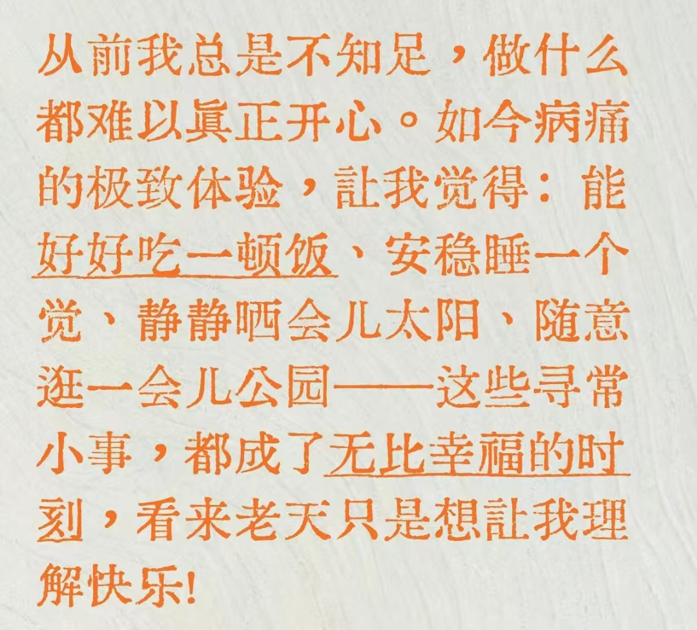

突然想要整理下自己从有主观意识与记忆以来，到目前保研结束经历的所有事情。

## 童年

我出生在中国湖北省仙桃市，我的父母是普通人，甚至是社会底层几乎收入接近最低的人，当然不算贫困家庭。我住在叫做建行宿舍的地方，这里曾经是会议室，后来被丢弃，留给人住。那个小巷子的名字叫做城乡渠，那个巷子又小又狭窄，从主路上转过弯来，我住在左侧二楼，那个房间便是我12年的人生。

我在幼儿园时天天迟到，啥都学不会，在一些活动中常“痴呆”般地站在人群里。有一种所有小孩里面智商最低的感觉。那个时候我的爷爷奶奶在带我，我晚上想看电视不愿意睡觉，爷爷会把电闸拉掉告诉我“停电了”。早上我不愿意起床，爷爷用绳子把我的双脚捆起来，直到我愿意起床去上学，上幼儿园学前班那会儿我从来没有准时到过学校。我大致还记得那个时候我完全看不懂大于号和小于号是什么意思，以至于每次都要去抄同桌的作业，若是抄到了便成功混过了一次，若是没有抄到就一题都不会做。

在我五岁左右时，我的母亲为了不让我的人生就这样被毁，和爷爷吵架，夺过抚养权，亲自来带我。母亲和爷爷吵架的场景我记得是在某个医院里面，我那天好像得什么病，后来带我去家里附近的人民医院去挂点滴。挂点滴的时候还给我买我指着想要的玩具，后来那个玩具大概是被我弄坏了，之后的事情我不记得了。但是我十分确信我的母亲改变了我后来的人生轨迹。

我的性格，大概是去美国读书会成为被霸凌对象的那种。小学一到四年级，经常被欺负。印象最深刻的一次，大概是摔倒在地上，很多男生火车式从我脸上跳过去，踩过去，我被踩的满脸满身脚印，应该是流鼻血了，两个女生把我扶着去老师办公室，后来发生什么我忘了，现在想起来只是觉得那两个女生很温柔善良，不过我也忘记她们是谁了。可能那一刻或者我不知道的某一刻，“女性/温柔”成为了我潜意识里“救赎”信号，以至于在长大后岁月里我会在潜意识里追求这种信号。

五年级六年级经历了大换班，我交到了一些朋友，没有被欺负，总体愉快。

我的母亲只有初中学历，她本可以读高中，她来自农村家庭，那个时候重男轻女的思想还是很严重的，我母亲的命运很早就已注定，家里的钱给男生读书了，也没人告诉她读书的重要性，她便没有读下去，十几岁出来到县城里打工。听说成绩还是不错的，尤其是语文很好，可惜她的才华。**我想我部分优良的基因可能来自我的母亲**。我的母亲常说自己做这样一个梦，梦见自己想要说话，但是发不出声音。不知道她是怎么想的，我现在把这视为一种命运的隐喻。

小学时母亲对我严格并且管教很多，不是优秀的教育者，但是后来我自律性还不错，以及数学英语还不错，都多亏了她。因为她在周一至周五禁止我看电视，逼着我写奥数题，给我报我哭着都不想去上的英语补习班，现在看来这些我童年时讨厌的东西却很大程度上成就了以后的我。不过我小学时期没有读课外书也没有学书法，所以初高中语文一直是软肋。我的母亲控制欲很强。她晚上去上班后便把我关在房子里，我忍受着长期的孤独，无聊。所以我初高中身体不好甚至有时注意力涣散，和这段不合理的管教有点关系，但是我也不怪罪我的母亲，能在那个时候让我不对任何玩乐上瘾是她做的最成功的事情。在食物方面，我的母亲没有亏待我，我小时候体质偏瘦食欲不佳，大二时她找了一个中医让我吃了一年中药，自那以后我就逐渐变得啥都能吃了，甚至刚上大学有点偏胖，后来又追求减肥了。

我母亲对我教育的信条就是管教严格就能成器，我的一些小学同学和我母亲交流几次有时会说我的母亲好凶，我也记得我刚和母亲一起生活时在墙上写一些“我爱妈妈，我爱爸爸”这样的话语，后来更多是爱与畏惧同时存在，经常会求情今天如果作业没写好不要敲我的脑袋。这种严格的管教确实在早期阶段纠正了我的一些行为，但是这种控制在进入初高中等往后阶段后便开始呈现负作用。好在后来大学基本和母亲和解了，现在我的事情基本全是自己做主。

我的父亲也来自农村家庭。我的爷爷是以前他们村里一所学校的校长，写得一手好字，还会背化学元素周期表。我的父亲有大学学历。但是不说我有时都会忘记，因为他的形象确实比较糟糕，工作也很难看出有什么专业知识，大概就是跑腿说话谈生意的公务员。在我成长的过程中，他除了资金上的支持，很难找出他发挥过什么其他作用。我的父亲在外工作，一年回家4次，每次回来的不久。母亲对他有很多的不满意，比如懒惰，不擅长做菜，爱偷偷打麻将，抽烟成瘾，嘴大爱炫耀，也不勤俭持家等，我也不喜欢他表现出来的这些行为。我母亲对父亲意见很大，所以家庭氛围经常并不好，小学初高中父母闹过大矛盾，那些事情也在我心里留下阴影。但是母亲并没有迁怒于我（父亲有一次迁怒于我，不过也是知错就改了）。他们为了支持我的学习与生活辛苦工作，大多数时候家庭氛围是平和的。出于资金上的支持我也感恩我的父亲，长年一个人在外也不容易。我母亲说多亏他长年出差，不然可能早离婚了。

我的童年并没有如田园诗歌的美好，在狭小小镇天地间过着日复一日的生活。也有一些美好的事情值得回忆，不过过于的零碎，不便一一陈列。回望童年的价值可能在于，我会更加感恩我的平凡的母亲，她没有抱怨过自己的命运，总是勤俭持家，制作过口罩，进过电子厂也当过扫地工服务员，做着各种辛苦的体力活。青春期时我曾和她争吵，再后来因为阶级鸿沟，认知断层以及地理隔绝我将离她越来越远，仿佛我不断往前走，她却留在了原地。

我要继承不抱怨的品质，好好学习工作生活。

> **早发白帝城** 李白〔唐代〕  
> 朝辞白帝彩云间，千里江陵一日还。  
> 两岸猿声啼不住，轻舟已过万重山。  

## 初中

初中我就读于仙桃市第二中学，选择这中学只是因为它单纯离家近。对于仙桃市的相对拔尖的初中学生而言，升学大抵有4个选择：

1. 报考西安交通大学少年班
2. 报考华中师范大学第一附属中学
3. 报考仙桃中学（这个小县城最强的高中）的提前招生班（一共招收120个人，一般会有十几个人鸽掉仙中去华师，所以最后一般招收100人左右）
4. 通过中考进入仙桃中学的好班

当时一个年级大概有接近20个班，每个班级的人数大抵有六十甚至七八十多个人，一个小教室可以非常的拥挤。那种拥挤，无聊，混乱的氛围，我是绝对不会想要回到那个时候。当时进入初中还有一场选拔考试，但是那场选拔考试基本没有意义，因为可以进入好班的人都是走后门。明面上没说，班级其实被划分为 A B C三个档次，A班一共两个，初一初二时是5班和7班。B班有很多个，我记不清了，大概有9班 15班等等，其余的就是C班。

初中的班级第一名和年级第一名，其实从一开始就基本固定好了。小镇的初高中教育也是一个封闭的体系，家境最好的人也一般是教师子女（教师子女往往受照顾，教师教育自己的小孩应试也有经验）或者中产家庭子女（也有极少数的富二代），老师多为本地资深骨干流动性小，学习虽然辛苦但是学校离家近通勤短。有的人虽然家境较差但是天赋基因不错，有的人来自优质中产家庭给了他很好的教育，有的人一开始浑浑噩噩过了很久才慢慢开窍，有些人父母一直在外可能一直在被托管或者由爷爷奶奶带着。初中是形形色色的人鱼龙混杂，上初中意味着初次面对同龄人压力与竞争，至少对我而言仿佛从毫无目的混沌中，第一次诞生了竞争的危机感或者明确的目标，在初高中教育阶段，争分数争排名是唯一引导着我的指标。

我初一就读于九班，第一次月考，我的语文只考了70多分，数学英语也没考好，在B班排名25名，位列年级200多名，想要考提招班起码得全校前三十名，那个时候我从来没想过我会考上提招班，甚至觉得那些考上提招班的人都是什么天之骄子，而我就是一个普通人。

不知道什么时候，我的心中有一股原始的冲动开始涌现。我开始进入 **“有志于学”** 阶段。往后我的成绩开始不断往上升，最好一次年级23。初二走了后门转A班，最好一次年级前十。尽管那个时候的我经常做假努力做无用功，维持着一种外在自律实际上效率很低的状态，但是至少我没有挥霍玩乐或者误入歧途。我十分清晰地记得我学习牛顿三大定律的早上，那是我听课最认真学习的最开心的一个早上。学习物理确实是青少年打开认知的窗口，往后我对宇宙与黑洞话题产生兴趣，可是没有任何人引导我，什么都没有学到后，我唯一能做的只有应试。

初三时，仙桃二中成立了新校区。我们那一届成为了第一批转到遥远偏僻新校区的受害者，我们家庭尝试合租过小房子，也尝试中午把我托管给老师，晚上晚自习结束走很远的路回家，总之去新校区不是一件愉快的事情。我节奏混乱考的很差。后来反思，结论就是不要把自己逼的太紧，学习是一场马拉松而不是冲刺跑。这句话如今看来依然适用。初三一次印象深刻的事情大概是期末考试考完，下大雪回家，我和我母亲走路走了好久好久，有时看到路边的车辆来来往往，或许是我第一次想，为什么我的家庭不能拥有一辆小汽车，这么冷的冬天能坐小汽车回家一定很暖和舒服吧。

那个时候我很自卑。班级里那些优秀的同学，都一起去参加西安交通大学的少年班的考核，去参加华师一附中的考试。我没有，家里没有wifi，上网仅靠很少的流量和万能wifi钥匙，我都忘了当时是怎么报名的，总之报的乱糟糟的，最后也没去成。但好在后来我心态调整的不错，我获得参加仙桃中学的提招考试的资格，记得提招考试的那天中午我没有午睡，就坐在商场的顶楼复习数学物理化学的错题，母亲陪伴在我对面，现在想起来依然印象深刻。后来顺利通过提前招生考试，不需要中考提前开始了高中生活，不过通过提招考试我觉得还是有点运气在里面，我觉得我大概是在录取线的倒数几名被录取的，不过那场考试并没有公布排名。

我还有一个印象深刻的片段，大概是提招考试结束那天我坐HL同学的顺风车回家 ——— HL同学父母都较优秀，他本身也很努力，HL同学后来去了华师一附中A班高考去了清华大学 ——— 他们的父母对我担心能不能通过提招考试这件事情很惊讶，在他们眼里通过提招考试就是天经地义理所当然的事情，去华一A班才是最基本目标，但对我家庭而言通过提招考试是值得庆祝的大事，在我成绩突飞猛进之前我的父母从不奢望我能进仙桃中学，更别提通过提招考试。成为像HL那样优秀的人仿佛是一种奢望，我或者说我的家庭负担不起的奢望，人与人之间出生的差异，是一件一想到就令人胸闷的事。

临近中考时我回仙桃二中拍纪念照，我记得那天刚下完雨地面很滑，拍照时有同学险些从高台摔倒。拍摄结束后，一个人喊：“来，你们帮仙桃二中最后一个忙。”搬点东西，搬完大家便各自走了。后来有些同学依然和初中的要好的朋友圈子保持联系，我是后来和99%初中同学都完全断联了，有些是名义上的QQ好友反正不联系，有些看见就心烦，在某天把他们好友删了。

## 高中

提招班也叫“名校冲刺班”，一共一百来人，两个班分别50个人，如果学习跟不上会被赶出去，规矩是只能出不能进，当然高考复读的人若是有钱有关系，这规矩也是可以被打破的。第一次考试，我是提招班全班倒数第五名。我又开始走一开始排名很差，之后成绩排名往上升的老剧本。虽然是老剧本，每一次的剧情都不一样。我刚来提招班时确实浮躁，后来才在一次次课程与考试中有了自己的节奏，慢慢找准自己的定位。大一时最好也就考到班级30名左右。后来大二排名均值提升到20左右，但是方差特别大。心情大概就是没考好不开心，考好了开心一会儿又担心下次考不出这个水平。

高中班主任为了防止我们谈恋爱，进行了男女隔离（就是男女不能同桌，有时怀疑谁和谁有关系还会拉到办公室谈话确认没关系，有时随便说几句话都容易被误会）。所以高中没什么故事，班主任的选择从提高班级高考平均分的角度来看是不错的，但是真正步入大学后这个制度导致的负作用也是十分明显的。对于一些来自精致中产家庭的人依然能很好的把握好社交，对于我而言确实让我严重失去异性正常交流能力。我记得我初中时常和女生同桌时都能和女生正常沟通聊天，就是高中三年后确实和异性交流心态受严重影响，我自己都花了好久才意识到这一点，不过意识到这一点就很大程度修正了这一点。

高中还有一段难忘的时间就是疫情，我家里没有wifi也没有电脑，我就整天拿着两台屏幕小小的手机靠万能wifi钥匙蹭速度很慢的wifi完成网课学习，我真不知道那个时候的我怎么熬过来了，现在的我绝对受不了那个条件了。我大概记得疫情结束后返校，我的排名均值上升了好多，但终究没有像某些人完成一个疫情从很差的成绩到稳定全校前几名的大彻大悟。

因为班主任组织班级唱歌活动的契机，我开始更多接触音乐，甚至还拿了班级唱歌比赛最后评分的第一名，说明我这方面有点小小的天赋，不过其实也没天赋，不过是一屋小镇做题家矮子里挑将军，和稍微正规点的选手比较就相形见绌了。但这点兴趣也导致了我后来大学的一次不幸遭遇，最后大概是被迫卷入竞争，没时间培养这方面的兴趣。更确切的说这种兴趣想要成体系的培养，从小学时就得请好老师来教，我的家庭经济绝对没能力为我做这个。**我注定没有培养兴趣爱好的权利**，应试后面是应试，更多的应试，然后咬紧了牙关，应试更多的应试。

在高三的考试中，我的表现比高二又好很多。我甚至状态好的时候连续考了几次班级前十。如果正常发挥，我可以去华科武大进入中等专业，去华武的CS专业需要我发挥的最好的那几次。不过2022年碰到了新高考一卷数学最难的一年，我在高考考了整个高三以来最差的成绩。高考没考好和数学突然逆天难度的相关性很大，因为我当时语文确实考的规规矩矩，数学结束后紧跟着的物理英语都没有考好。查成绩那天确实不开心，但是现在回忆那个时候倒没有太难过，当时大家计划着毕业旅行，查成绩那天晚上在准备旅行的群里互相发拼手气红包，红包上面写着“青春无悔”等话语，那种心情让我难以忘怀，初高中虽然只有无意义应试，可那也终究是我仅有一次的无价的青春。

在填报高考志愿的时候，我很明确地认为专业比学校重要。与其去华科武大的冷门专业，我最后选择西安交通大学大类专业。那个时候我心中完全没有地域好不好的概念，选择西安交大，第一看中了它C9的名号，第二是想起了我初中时曾羡慕那些去西安交通大学参加少年班考核的同学。后来毕业旅行的计划因为疫情取消了，有和同学说大学毕业了再一起旅行。现在看来大概很难了。

回望高考失利，我现在觉得是“塞翁失马，焉知非福”。因为我来到了西安交通大学人机所。

## 本科

> 在现实世界中，存在着一颗北极星，那是小熊星座中最明亮的恒星。而在思想的世界里，却存在无数个类似的导航指引。每一种新的追求，每一个新的痴迷，都悬挂在黑暗的地平线上，闪烁着耀眼的光芒，向不懈追寻的人们招手致意。这就是为什么我最大的快乐在于知道旅程永远不会结束，我也永远不会停歇。总会有新的事物等着我去追逐探索。对科学家而言，想象力就如同布满北极星的璀璨天空。 --《我看见的世界》李飞飞

大一开学那会儿，疫情还没有完全放开。军训被延后了，我认真准备了开学选拔考试，数学英语物理笔试做的特别好，几百个人里选一两个人，我通过了选拔。

我选择了“人工智能”专业，一方面觉得这个专业看起来好玩，一方面回想起来自己高中时听过校友的讲座，那个人是做人工智能，他的讲座很悲观地说现在做的最好的机器人就只能倒一杯果汁，开个门都只能在真机上训练好久，我完全不知道人工智能是什么，但是我觉得这挺有趣的。

后来大一下学期初 *ChatGPT3.5* 出现，人类启动了一辆注定无法停止的轰鸣的列车，又往后人工智能迎来了不可逆转的“全球变暖”，人工智能专业的bar相比我那个时候又提高了好多。而且华科的人工智能不如西交，如果我去了华科我很可能学个其他专业并满足于华科，研究生毕业后找个工作安稳度过一辈子。巧合与命运的力量把我推向了AI浪潮的前沿，把我推到了一个我不够满意的地方让我为了心中的目标去奋进，这安排是多么的巧妙又刻意。

“信息差”是大学竞争的一个很重要的因素，所谓选择大于努力，我早期没意识到这点，生活学习处处碰壁。因为我喜欢音乐艺术，在大一下学期我偶然间爱上了音乐剧。当时又偏偏看上了《音乐剧实践体验》这门课，那半年我的大学生活就像一场噩梦。我遭受了如下打击：

1. 父母一开始控制欲极强，常与我争吵，且经济吃紧。（后来和解了，现在关系较融洽）
2. 《音乐剧实践体验》的老师压榨我的大量学习时间，去排练对保研没有任何意义的音乐剧，那门课结束以后我再也不喜欢音乐剧了。
3. 心里还在想高考没考好的事情，心理痛苦。
4. 舍友经常晚上打游戏开麦，我晚上睡不着觉，申请换宿舍得不到学校回应。
5. 很多细节上没能很好的管理好自己的生活以及习惯，一地鸡毛。
6. 心理浮躁，忍不住发一些没必要的朋友圈，发了又删，删了又发。
7. 学习习惯还在用高中那一套效率极低的方法，没有向高效的计算机方面转型。
8. 完全不知道如何学习思政课，背思政心理抗拒（后来大二下学期才摆正思政学习态度和方法）。
9. 大一的暑假原本应该好好学习，却被家里人要求学驾照，浪费大量原本应该用来学习的时间。

现在回想起来，大一那段日子的兵荒马乱，或许是成长的必修课。我放下了对音乐剧的执念，也原谅了那个不够完美的自己。我开始明白，生活给我的剧本里，或许本就没有太多风花雪月的闲情，但这并不妨碍我把平淡的日子过得丰盈。买不起乐器，我就听歌哼唱；没人教球技，我就去跑步健身。我在日复一日的奔跑中，学会了与孤独相处，也学会了不再去比较彼此的起跑线。每个人都有自己的时区，而我，只要在我的时区里，把自己照顾好，把书读好，便是对生命最大的敬意。

大一暑假末，我在逛QQ空间时偶然间看到了 *RoboCon* 社团的招新，以此为契机，开启了我漫长的 **“龙场悟道”** 的过程。后来竞赛，考试，科研，保研的事情很杂乱了。每一个竞赛可以得到保研加分都赢的很惊险，科研可以说是中途遇到贵人帮助，保研也多亏时代提供的机遇，我通过了ZGCA的考核，最后也得到了沈老师的重视，进入ZJU_CV实验室。

我写下这些内容的时间点是大四，我在浙大做课题组的工作。杭州的秋冬多是晴天。我独居在一个只有卧室和厕所的小隔间里，每个月要交1230元的房租（还好沈老师每个月给我发高额工资），每天往返于食堂，田径场与实验室。每天早晨我都能经过波光粼粼的启真湖畔，路旁的树木的树冠枝繁叶茂，在阳光的照射下黄一片绿一片层次分明，勾勒出纯粹斑驳的阴影仿佛画框，天空经常湛蓝清澈。虽然来到这里后我绝大多少时间都在实验室里度过，很少有机会闲暇下来体验点什么，但我的生命确实抵达了一段从容和煦的时空，我也很喜欢杭州这个城市。为了能在ZGCA进入好项目组，我大四一定要以leader的身份完成一个项目。
## 致未来

我相信所有发生都不是偶然，而是生命精心安排的修行课业，尽管我在过去的生活中犯下很多错误，我希望自己发自内心地真诚地努力学习工作生活，毫不妥协，无怨无悔地活出自己的激情与活力。

### 补记
今天2026年1月22日下午我看到了32岁程序员高广辉猝死的新闻，也想起了自己一直以来关注的一个副教授小红书博主“90后青椒，用生命值改写命运，结果失败了！往后的余生与癌症同行，只为记录生活美好与精彩瞬间 -- 向死而生”。还有现在体检完后开始注意身体健康的许华哲老师，还有开始减肥的穆尧老师。我心里常会开玩笑地想“飞升前往了浪漫美丽的充满创新点与Insight的顶刊星球”，究竟是应该人生难得糊涂更幸福，还是应该义无反顾地去用生命值改写命运更值得敬佩，我也想不明白了。我现在的体悟是坚持每天工作但是底线是不牺牲健康，但是如果到了多个论文项目ddl压在头上我真的有勇气不牺牲健康吗，那些发了很多paper的PhD会把牺牲健康的“熬过去了”视作一种荣誉，然后在ddl结束后刻意恢复健康。就像跑马拉松比简单健身对身体伤害更大，但是人们依然会把跑完马拉松视作一种荣誉，尽管跑马拉松对身体有害。于此可以类比的还有攀登珠穆朗玛峰，极限挑战运动等等。最后我想生活工作的节奏以及个人的选择本质上是一种taste，每个人独特的taste形成了独特的生活体验和独特的故事，这也是我之所以为我独特性的一部分，每一个独特的taste都在不可能复现的独特经历中形成并且未来会不可预测地在实践中调整，小马过河说不定还有一个小马被淹死的版本呢，人本来就是于天地如蜉蝣。这种问题想多了最后都指向一个答案 -- 活在当下。

