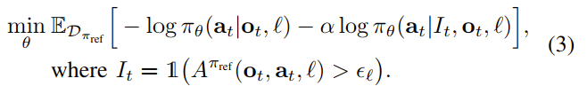
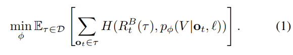
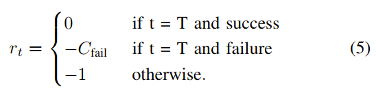
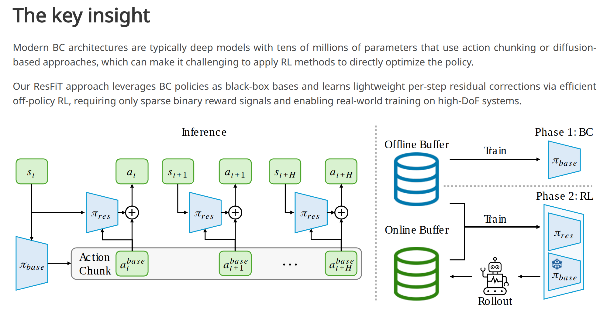
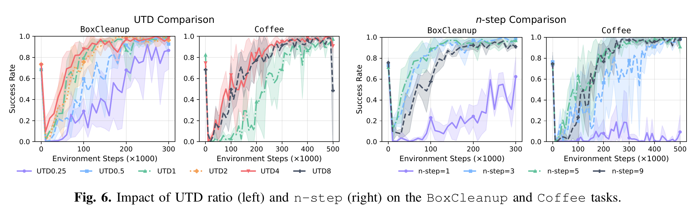
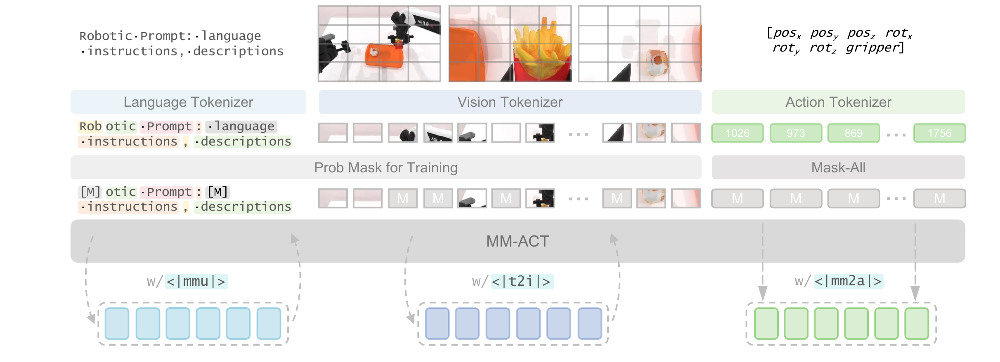
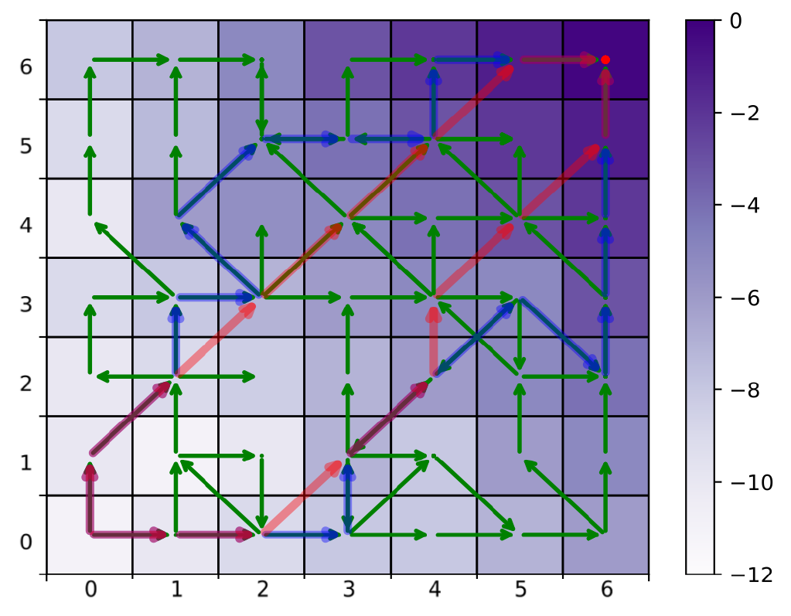
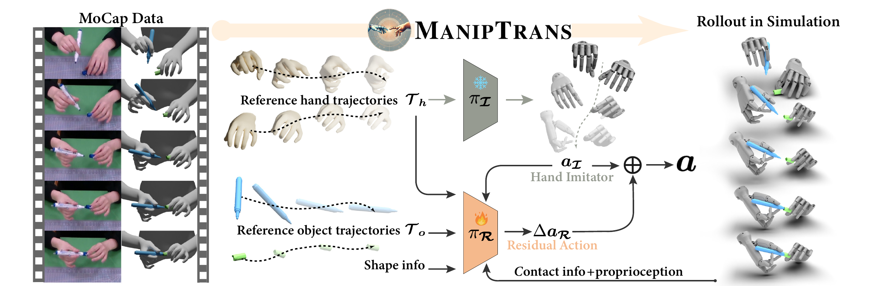

⭐ 看了一次不会再想看二次的论文

⭐⭐ 不错的论文，看完学习上有所收获

⭐⭐⭐  很好的论文，看完研究上有所启发

⭐⭐⭐⭐ 震撼的论文，可以是一段时间的 talking 话题

⭐⭐⭐⭐⭐ 无与伦比空前绝后的论文，可以写进教科书

## $\pi^\star_{0.6}$

我的评价：可以看到各种已有工作的影子，比如Self Improving EFM（reward设计），InternVLA-M1，RL100，单任务微调。但是策略训练和推理时的$I_t$和 $\beta$的比较有意思。

### 关键信息

主要结果：

- **吞吐量 (Throughput)** ：在 Box Assembly 任务中，经过两轮迭代，吞吐量从 SFT 的水平提升了近 **2倍** 。
- **成功率 (Success Rate)** ：在 Box Assembly 的所有子阶段（折叠、贴标、堆叠），$\pi_{0.6}^*$ (Ours) 都保持了 90% 以上的成功率 。
- **消融研究**：对比了 RECAP 与 AWR (Advantage Weighted Regression) 和 PPO。结果显示 RECAP 远超这两个经典 RL 基线，证明了在大参数 VLA 上，<u>Conditioning 比 Gradient update 更有效</u> 。

- **验证了“The Bitter Lesson”在具身智能的适用性**：通过扩大计算规模（RL 训练）和数据规模（自主经验），通用模型可以击败精心设计的特定策略。
- **确立了 Post-Training RL 的范式**：Value Function + Advantage Conditioning。

### Method

**预训练阶段**：在数据集上，训练价值函数 $\rightarrow$ 训练策略 $\rightarrow$ 训练价值函数 $\rightarrow$ ...

**自主收集数据迭代**：收集数据 $\rightarrow$ 训练价值函数 $\rightarrow$ 训练策略 $\rightarrow$ 收集数据  $\rightarrow$ ...

$I_t = \text{True}$ 表示当前动作优于平均水平（即 Advantage $A > \epsilon_l$）；否则为 False。作为 $\pi(.|.)$ 的条件时 可以理解为

- $I=\text{True} \rightarrow$ **高手**的动作分布
- $I=\text{False} \rightarrow$ **菜鸟**的动作分布。

策略训练 **“双目标”** ：

1. 拟合特定所有数据的平均行为和特定优势水平下的行为。
2. Loss是离散似然与 Flow Matching 目标的组合。

- ​**特殊的** **$I_t$** **处理**：

  - ​**自主数据**：根据价值函数计算出的 $A$ 是否大于阈值 $\epsilon_l$ 来决定 $I_t$ 是 True 还是 False。
  - ​**人类干预数据 (Human Corrections)** ​：​**强制设为** **$I_t = \text{True}$**。假设前提是人类专家的干预总是优质的。
- ​**混合输出模态**：由于 VLA 模型同时输出离散 token 和连续动作（通过 Flow Matching），Loss 实际上是离散似然与 Flow Matching 目标的组合。

**价值函数设计**：

- 预测收益分布而不是预测值
- 并非理论最优-- 相比 Off-policy Q-learning（如 TD-learning）--但是更加的稳定
- 基于整个分布的交叉熵损失

High Level依然是$\pi_{0.5}$，对Action Expert使用 "Knowledge Insulation"，即训练时 Action Expert 的梯度**不会**回传给 Backbone，防止动作生成的噪声破坏 VLM 的通用语义能力。

​**RL 改造 (**​**$\pi_{0.6}^*$**​ **)** :

- ​**接入点**​: 优势指示符（Advantage Indicator）被作为**文本 Token** 插入序列中。
- ​**插入位置**: 在生成的 Sub-task $\hat{l}$ ​**之后**，但在动作 $a$ ​**之前**。
- **Insight**:  RL 信号主要调节**动作执行层面**（Action Expert），而不干扰高层的任务规划（Sub-task prediction）。

为了学习更好的基线，训练时$I_t$会被随机Dropout，Inference时 最终动作 = 普通模式 + $\beta \times$ (高手模式- 普通模式)，其中$\beta > 1$高手动作会被放大。

Value Function 实际上预测的是  **“距离成功的剩余步数的负值”** 。使用与 Policy 相同的架构，但 Backbone 更小（**Gemma 3 670M**）。 预测值被归一化到 $(-1, 0)$ 区间，便于跨任务统一处理。**Co-training**: 训练 Value Function 时混入 Web 数据防止过拟合。(还是InternVLA-M1的思路)

最后总结整理流程是 **Pretraining --> SFT --> Iterative Improvement (RL Phase)** ，令我失望的是Iterative Improvement还是在做RL100所做的事情，还是一个针对单任务不断删除失败模式去提升成功率的范式。

我的评分：⭐⭐⭐⭐

‍

## [NORA-1.5](https://github.com/declare-lab/nora-1.5)

代码仍在开源过程中。该模型利用 KV Cache 注入技术增强架构；其 Critic 模块基于 V-JEPA2-AC World Model 和奖励函数构建，并配合 DPO 算法进行偏好对训练。

我的评分：⭐⭐⭐

## HIL-SERL & ConRFT compare reading

ConRFT是基于HIL-SERL的增量实现，具体增量如下：

1. Actor: Octo(Transformer) Critic:Resnet(with dropout & LN)。
2. Action head由MLP(x)替换为MLP(x,t)生成式模型。
3. 图像&Language Task混合式训练
4. 训练循环重构: offline finetuning --> online finetuning with unified training objective(BC + Q-Learning 通过权重调整)

## **[ResFiT](https://residual-offpolicy-rl.github.io/)**

石冠亚老师，PLD前作，代码开源。是VLA+单任务RFT，强化学习算法属于 Online RL with Offline Data，强烈推荐先读Sergey Levine的论文：[RLPD](https://arxiv.org/pdf/2302.02948)。实验**DexMimicGen** (BoxCleanup, CanSort, Coffee - 高难度双臂灵巧手任务)。

**泛化局限**：将一个OOD的base model通过少量特定数据训练“修补”到能完成任务的状态，无法发现基座模型之外的“根本性不同策略”。

**亮点：**

1. **极高样本效率：** Online RL with Offline Data这个方法本身的优势。
2. **高维控制：** 29DoF 双臂+五指灵巧手，相比**IBRL/RLPD**，ResFiT在高维灵巧操作任务中，引入“Res”结构比单纯用Demo Data辅助RL更稳定、收敛更快。
3. **ACT完全冻结**，黑盒基座无关性且显著显存需求和训练不稳定。
4. **No Reward Engineering**只用简单的二分类0/1奖励，得益于n-steps returns 和 UTD 设定。

UTD=4左右收益饱和，n-step ($n=3$ 或 $n=5$)，相当于让奖励信号“跳跃式”回传，极大加速了早期的学习效率。

$$
\text{ResFiT} = \underbrace{\text{TD3}}_{\text{策略更新 (Deterministic)}} + \underbrace{\text{REDQ}}_{\text{Critic架构 (Ensemble)}} + \underbrace{\text{n-step}}_{\text{回报计算}} + \underbrace{\text{Residual}}_{\text{动作参数化}}
$$

我的评分：⭐⭐⭐

## **[ViTaL](https://github.com/Exiam6/ViTaL)**

真机实验做的很厉害，但是有触觉流且基座模型是各种模型拼接，暂时用不上。

## [Implicit Behavioral Cloning](https://proceedings.mlr.press/v164/florence22a)

IBC虽然提出了极具开创性的“隐式能量函数”概念，但在现在Benchmark里的baseline基本看不到它，主要原因有三点：

- ​**既生瑜，何生亮（被 Diffusion 取代）** ：

  - IBC 和 Diffusion Policy (DP) 的核心动机是一样的：解决**多模态分布（Multimodal Distribution）** 问题（例如：面对障碍物，可以从左绕也可以从右绕，但不能走中间）。
  - ​**结果**：DP 在建模多模态分布的能力上比 IBC 更强、更稳定。实验表明，IBC 容易出现“模态坍缩”（Mode Collapse），即虽然理论上能学多模态，但实际上往往只收敛到其中一个解，或者训练极不稳定（InfoNCE Loss 难调）。
- ​**推理速度的尴尬**：

  - IBC 需要在推理时进行“迭代优化”（Derivative-free optimization 或 Langevin Dynamics），这使得它的推理速度很慢（几十毫秒甚至更久）。
  - 虽然 DP 原生推理也慢，但 DP 生成的动作质量更高，且有 Ddim、Consistency Policy 等大量加速算法。相比之下，IBC 的性价比（速度/性能比）就显得低了。
- ​**训练的“娇气”** ：

  - IBC 对超参数（如负样本采样的数量、范围）非常敏感，很难在不同任务上“开箱即用”。

## [SRPO](https://github.com/Tencent-Hunyuan/SRPO)

SRPO的奖励方式：VLA Rollout一些轨迹，取一个Batch，分为成功集$S$和失败集合$F$,把所有数据的observation通过V-JEPA2转化为潜在表征$h_i$，依据潜在表征在成功集$S$上进行基于$L_2$距离进行DBSCAN聚类，得到Success Center作为距离计算锚定点，然后奖励计算如下：

$$
g_i = \begin{cases} 1.0 & \text{如果是成功轨迹} \\ \phi(\frac{d_i - \bar{d}}{\sigma_d}) & \text{如果是失败轨迹 (基于距离)} \end{cases}
$$

然后计算优势函数，用GRPO进行更新，加KL散度不让策略跑偏。

上图是奖励函数随任务完成进度变化的曲线。

- **Pixel Level** 输在**没有语义**，对像素变化太敏感，无法捕捉 Task Progress。且在训练初期是一种“伪Dense奖励信号”，初期像素差异很大reward基本为0。
- **ImageBind** （通用视觉嵌入，**不是为连续的机器人动作设计的**）输在**不懂物理动态**，对视觉扰动太敏感，信号太噪。
- **SRPO** 赢在利用了 **World Model** 的 Latent Space，它既压缩了像素（去噪），又包含了时序预测能力（懂动态），从而生成了**平滑、单调、符合物理直觉**的完美奖励曲线。

**真机实验**：X-ARM 7 机械臂。任务包括：**叠毛巾（软体操作，难度较高）** 、擦白板、选扑克牌（语义理解） 。

我的评分：⭐⭐⭐

‍

## MiMo-Embodied

MiMo-Embodied 定位为**基础模型 (Foundation Model)** 。它的核心能力是“理解物理世界的逻辑和空间关系”。不涉及Manipulation Policy。

AD加了不如不加，小米试图占坑。

Stage 1: 具身监督微调 --> Stage 2: 自动驾驶监督微调 --> Stage 3: 思维链推理微调 --> Stage 4: 强化学习微调(GRPO)

证明了 **Multi-Stage (多阶段)**  策略优于简单的混合训练 (Embodied+AD)。混合训练会导致自动驾驶性能轻微下降，而多阶段训练实现了双赢。

**CoT (Stage 3)**  告诉模型： **“无论是在开车还是在做家务，解决问题的逻辑步骤是通用的。”**  —— 这是**智力**的迁移。

有关Stage 4 RL:

1. Reward Engineering:  视觉推理 (Visual Reasoning) -\> Exact Match,空间定位 (Spatial Grounding) -\> IoU / Point-in-Mask,指令跟随 (Instruction Following) -\> Format Compliance。
2. 数据策略Hard Mining：“The training specifically addresses **corner cases and failure modes identified in previous stages**”基于 Stage 1-3 的 SFT 模型表现不好的数据（Failure Cases）构建的数据，Targeted Optimization。

我的评分：⭐⭐⭐

## MM-ACT

中间的核心架构是一个双向注意力Transformer，以便并行解码输出，输入文本，图像和动作，映射到共享的token空间中（没有cross attention 也没有late fusion，对双向注意力Transformer的输入所有token一起输入，所以叫共享token空间，由于就三模态统一输入这一次）对应的tokenizer分别是LLaDA,VQ-VAE和Bin-Tokenizer。Transformer要负责输出action，生成任务规划，预测未来图像这三个任务，后两个任务为辅助任务通过共享梯度共享增强动作生成的鲁棒性。

$$
C_{modal} = <modal> + sharedinput
$$

**$<modal>$**  **(模态指示符):**  这是一个特殊的 Token，告诉模型接下来的任务是什么。sharedinput是共享上下文。

训练过程是两阶段的：

$$
\mathcal{L}(\theta) = -\mathbb{E}_{t, x_0, x_t} \left[ \sum_{modal \in \mathcal{M}} \frac{\lambda_{modal}}{t} \sum_{i \in \mathcal{I}_{modal}} \mathbf{1}\{x_t^i = \text{M}\} \times \log p_\theta(x_0^i | C_{modal}, x_t) \right]
$$

**Stage 1: 基础能力建立 (Text & Image Only) 设置:**  $\lambda_{mm2a} = 0$（动作权重为0），

**Stage 2: 动作特化训练 (Action Focusing) 权重调整:**  $\lambda_{mmu}$ (Text) 和 $\lambda_{t2i}$ (Image) 被调低至 **0.05 - 0.1**，防止“灾难性遗忘”。

训练方式和BERT详细预测被mask的内容，针对text和img采用“remask”并行解码策略，即：

> - **Step 0 (初始化):**  拿到一个全是 `[MASK]` 的序列（比如 256 个空）。
> - **Step 1 (初次预测):**  模型看一眼上下文，一次性并行预测所有 256 个位置的概率分布。
> - **Step 2 (筛选与重掩码):**
>
>   - **看置信度 (Confidence):**  模型会检查每个位置预测出的 Token 的概率（置信度）。
>   - **保留 (Keep):**  比如，保留置信度最高的 20% 的 Token（认为这些填对了）。
>   - **重掩码 (Re-mask):**  剩下的 80% 即使刚才预测了，也把它们重新盖住，变回 `[MASK]`。
> - **Step 3 (再次预测):**  把“填好的 20% + 剩下的 80% MASK”再次喂给模型。模型利用已知的 20% 信息，去推断剩下的空。

action one step 并行解码，40Hz。

我的评分：⭐⭐⭐

## [POR](https://github.com/ryanxhr/POR)

Offline RL算法可分为以下两类：

- RL-Based: CQL,TD3+BC(都包含Q-Learning的更新公式，这类算法可以做到state-stitching，state-stitching被视为真正的泛化来源，但是OOD防止Q值高估的机制阻碍了state-stitching)
- BC-Based: IQL,One-Step RL（本质上做加权BC，被作者称为Action-Stitching,限制Agent只能沿着数据集中轨迹片段走）

Guide Policy像一个预测sub goal的VLM，预测next state类似IQL训练（分位数思想），换任务需少量高质量数据微调，Execute Policy是一个逆运动学模型，利用conditioned BC在大量低质量数据上训练，可以直接zero shot。

颜色越深value越高，绿色是数据集，红色是state stitching,蓝色是action stitching。我是认为在具身任务中state stitching的优势在长时程任务中才可能比较明显。

我的评分：⭐⭐

## [Coil-Manip](https://coil-manip.github.io/)

面向对应关系的模仿学习（COIL）

**输入阶段**

- **$x_t$**  **(Observed Point Cloud)**
- **$u_t$**  **(Tracked Keypoints)** : 当前时刻跟踪到的操作物体上关键点3D坐标（由Tracker提供）。
- **$c$**  **(Task Representation)** : 任务规定的未来目标轨迹（3D坐标张量）。（Training时由Hindsight Relabeling提供，inference由User-specified inputs，VLM，人类演示录像，高层规划器提供）

**特征编码 (Encoders)**

- 这三者都通过共享权重的MLP编码器映射到同一特征空间 。
- 对任务 $c$ 使用**归一化位置编码 (Normalized PE)** ，注入时间进度信息 。

**核心融合模块 (Spatio-Temporal Transformer)**

- ​**Step 1: Temporal Self-Attention**: 在时间轴上推理（例如：这个点接下来要去哪里？）。
- ​**Step 2: Spatial Self-Attention**: 在空间轴上推理（例如：物体各个部分如何协同运动？）。
- ​**Step 3: Cross-Attention**: 将上述推测的运动与当前的视觉观测 $x_t$ 进行对齐（Grounding）。
- *循环叠加* *$N$* *层，逐步细化理解。*

**动作生成 (Action Generation)**

- **Flow-Matching Head：** 输出未来的动作序列 $a_{t:t+T}$。

$$
\text{Training Data} = \text{Simulated Rollout} + \text{Hindsight Labeling} + \text{Aggressive Augmentation}
$$

在仿真环境中rollout出预定义的运动基元（Motion Primitives），跟踪场景中一组关键点的3D轨迹（即利用仿真环境的上帝视角label），最后利用时空下采样和噪声注入（sim2real关键）进行数据增强。

在pick and place任务中涌现出避障行为，在fold任务中没有盲目跟随关键点而是真正有空间理解能力（比如叠衣服，有某个中间点被标注要向右带，coil并不会去直接抓中间而是抓住衣服边缘在叠衣服的过程中把中间的点向右带）。

我的评分：⭐⭐⭐
‍

## [Maniptrans](https://maniptrans.github.io/)

MANIPTRANS 首先预训练一个通用的轨迹模仿器（trajectory imitator）来模仿手部动作，然后在交互约束下微调特定的残差模块（residual module），从而实现复杂双手任务的高效学习和精确执行 。涉及 Isaac Gym 环境搭建、MoCap 数据处理、RL 训练管线。（<u>代码写的很好</u>）

- **状态扩展**：加入了物体形状（BPS特征）、手物距离、**接触力（Contact Force）**  。
- **课程学习 (Curriculum Learning)** ：训练初期将重力设为0，摩擦力设大，让物体“吸”在手上，然后逐渐恢复真实物理参数。这对于学习灵巧操作至关重要 。

我的评分：⭐⭐⭐