## [GR00T N1.6](https://research.nvidia.com/labs/gear/gr00t-n1_6/)

Experiment Setup: 大规模预训练(300K steps 全局Batch Size 16384) + 小规模后训练(10-30K steps Batch Size 1000或更小)。Base VLM （**NVIDIA Cosmos-2B** VLM 的内部变体，支持**灵活分辨率**，能够以原生纵横比编码图像，无需padding，支持**灵活分辨率**，能够以原生纵横比编码图像，无需填充）DiT规模扩大两倍从16层扩大到32层。

finetune setting 调整：

- **移除了** N1.5 中使用的 VLM 后置 4 层 Transformer 适配器（adapter）。
- 改为在预训练期间**解冻（unfreeze）**  VLM 的顶层 4 层。

模型预测的是**相对状态的动作块 (state-relative action chunks)（** 更平滑、准确，尽管会有 Error Accumulation 新问题 **）** ，而不再是 N1.5 中的绝对关节角度或末端执行器（EEF）位置。数据多样性增强（embodiment方面）

归一化统计量选择：

- **场景 1：任务分布与预训练数据相似** $\rightarrow$ 使用 **预训练统计量 (Pretrained statistics)** 。
- **场景 2：任务分布差异大 (Distribution shift)**  $\rightarrow$ 使用 **后训练统计量 (Post-training statistics)** 。

N1.6 Convergence更快也会带来过拟合的问题，解决方案如下：

- ​**更强的状态正则化 (Stronger state regularization)** 。
- ​**额外的数据增强 (Additional data augmentations)** 。
- **Co-training:**  在微调时，混入部分预训练数据一起练，防止模型“忘本”。

- **Iterative DAgger:**

  - 如果模型在真机上表现不好，推荐使用 **DAgger (Dataset Aggregation)**  算法。让模型跑，人工修正错误的动作，把修正后的数据加回去继续练。
- 在训练和测试时都引入 **RTC （Real-Time Control）** 机制：

  - *效果：*  在异步执行（asynchronous rollouts）时，显著提升动作的平滑性和鲁棒性。（主要用于 Unitree G1 和双臂 YAM）。

‍

Open Challenge： Language Following， OOD Generalization

我的评分：⭐⭐⭐

## [SHARSA](https://github.com/seohongpark/horizon-reduction)

NeurIPS2025 spotlight Sergey Levine课题组工作，Long-Horizon Scaling RL

> 为什么在NLP和CV领域屡试不爽的"Scaling Law"（更多数据+更大模型\=更好性能），在处理**长视界（Long-horizon）**  复杂控制任务的Offline RL中失效了？即scaling宽度（任务数目）成功（如Google的Q-Transformer, Generalist Agent等），但是scaling深度（Long-Horizon）任务失败，算法存在根本bottleneck。

**Flow BC，IQL，CRL**（在第四个任务中表现的略好，因为它不基于TD Learning）

> TD learning objective has a fundamental limitation: at any gradient step, the prediction target that the algorithm chases is biased, and these biases accumulate over the horizon. Such biases do not exist (or at least they do not accumulate) in many scalable supervised and unsupervised learning objectives, such as next-token prediction.

**SAC+BC**等算法面对Long-Horizon任务均失效,scale up network capacity也失效，对应四个任务也很有意思：

|**任务名称 (Task Name)**|**任务类型 (Type)**|**任务描述 (Description)**|**核心难点与挑战 (Core Difficulty)**|
| --| ---------------------------------| --------------------------------------------------------------------------------------------------------| ---------------------------------------------------------------------------------------------------------------------------------------------|
|**cube-octuple**|Robotic Manipulation|机械臂需要连续完成**8个**立方体（Cube）的抓取与放置（Pick-and-Place），将它们移动到指定的目标位置。 |**极长视界与容错率低**：相比常规的单物体或双物体任务，操作8个物体意味着极长的动作序列，中间任何一步抓取或放置失败都会导致任务终结，主要测试多阶段长程操作能力。 |
|**puzzle-4x5**|Combinatorial Puzzle|机械臂面对一个**4x5**的按钮网格，需要通过按压特定顺序的按钮来解决类似“点灯游戏”（Lights Out）的组合谜题。 |**高层逻辑规划**：这是一个离散且高度组合的任务，智能体不仅要学会控制机械臂动作，还要学会解谜的逻辑算法。状态空间巨大，需要复杂的推理。 |
|**puzzle-4x6**|Combinatorial Puzzle|任务机制与 puzzle-4x5 相同，但按钮网格扩大为**4x6** 。 |**指数级状态爆炸**：虽然只多了一列，但状态空间的复杂度和解谜所需的步骤呈指数级增长，是对算法在超长序列下推理能力的极限测试。 |
|**humanoidmaze-giant**|Whole-body Control & Navigation|控制一个**人形机器人（Humanoid）** 在一个巨大的迷宫（Giant Maze）中从起点导航至终点。 |**双重控制难题**：智能体需要同时解决两个层面的问题——底层的全身平衡控制（防止摔倒）和顶层的长距离路径规划（防止迷路或走进死胡同）。 |

**The Curse of Horizon:**

1. Value Horizon: 揭示了TD Learning中的误差累积（Bias Accumulation）随视界长度呈指数级或显著增长，导致Q值估计失效。证明了单纯增大模型规模无法解决此偏差 。
2. Policy Horizon: 证明了从状态到最优动作的映射在长视界下过于复杂，策略网络难以拟合 。

为了堆叠巨大的数据量scale up，这个工作的环境采用低维（State-Based）输入。

作者设计了一个很有趣的实验，$H=512$ 个状态的组合锁（combination-lock）任务，steam之前有一个火了一段时间的小游戏8号出口，每个一房间状态随机找不同决定向前或者向后，连续正确决策8次成功，中途有一次失败回到原点，这个任务就是512号出口。标准的 DQN 或 IQL 在这种链式结构上，极其容易出现 **Overestimation**（高估）或 **Underestimation**（低估）。如果算法不能精确地将终点的 $Q=0$ 一步步无损地传回起点，智能体就永远学不会走出第一步。下图Horizon Length就是该任务的H，对比1-step DQN 和 64-step DQN 的性能，展示TD Error作为Loss Function具有误导性，1-step DQN以为自己拟合好了实际上误差很大。

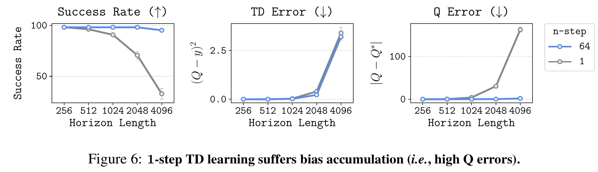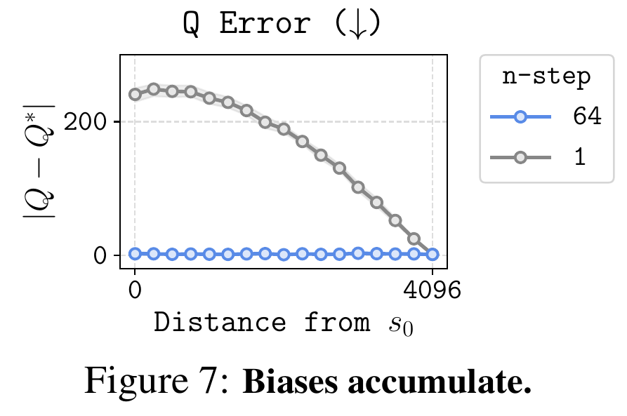

主要原因是传递过程中Q误差累积，传递次数少误差累积就小。

**SHARSA (State-High-level-Action-Reward-State-Action)**

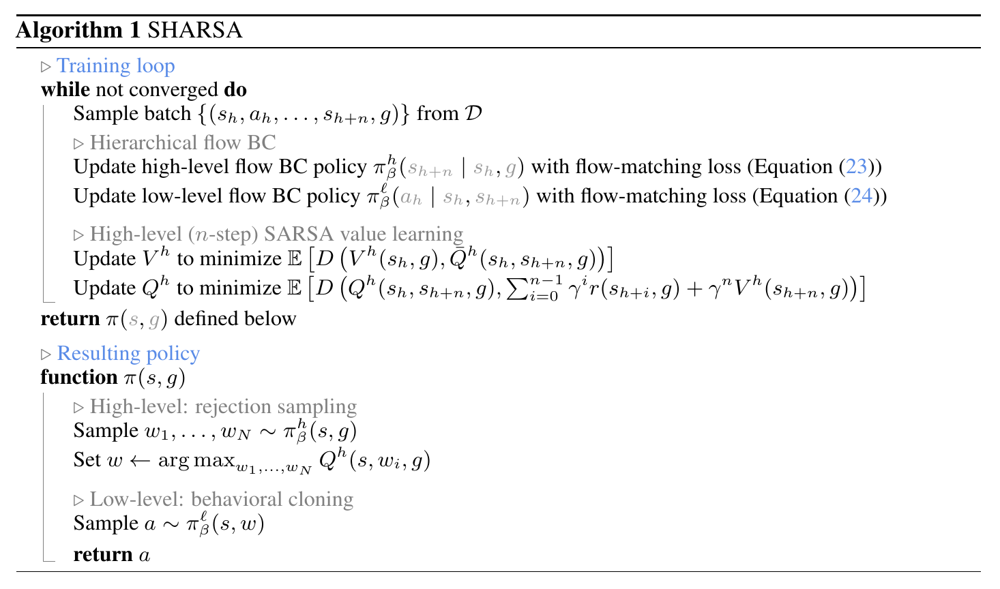

底层策略直接采用行为克隆，高层策略会涉及价值函数的训练，体现SARSA和n-step return，inference时高层决策会进行拒绝采样 (Rejection Sampling)，给出N个候选价值函数打分然后执行分数最高的子目标，底层策略直接执行。

我的评分：⭐⭐⭐⭐

## [Q-chunking](https://github.com/ColinQiyangLi/qc)

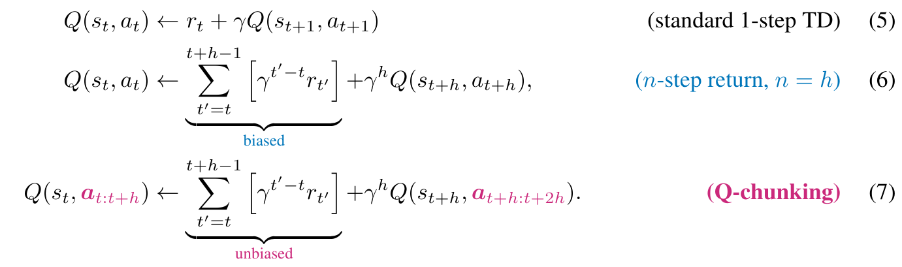

‍

每一个action都只对应自己那一个时间步的reward所以是unbiased的。

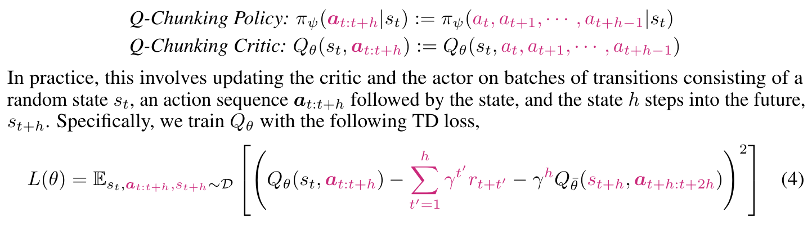

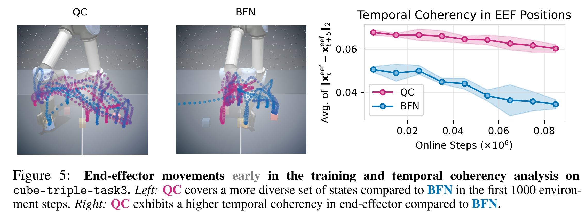

Long-Horizon 稀疏奖励任务能力提升，可以套用在任何AC算法上，如SAC TD3 IQL。也有人吐槽这个工作就是Sergey Levine在展现讲故事的能力，最后只中了poster。

### 为什么ResFit不使用Q-Chunking技巧

如果真的直接“迷信”了Sergey Levine 在这里讲的故事，认为Q-Chunking技巧可以无脑优化各个AC强化学习算法，那你一定会get stuck了。在ResFiT 这个工作的强化学习后训练违背了action chunking机制去做单步推理加残差动作，其实加chunking会有"Temporally Coherent Exploration"（时间连贯的探索）的优势，不加chunking有即时收到环境反馈的优势，但是抖动会更明显，具体怎么用得自己coding然后跑代码去验证。所以这里chunking的侧重点是增强了RL的探索强度。

我的评分：⭐⭐

‍

‍

## [RoboTwin2.0](https://robotwin-platform.github.io/)

一种由**代码生成Agent**和**VLM观察Agent**组成的闭环系统。VLM不仅判断任务成败，还能定位代码中的逻辑错误（如抓取位置偏移），反馈给代码Agent进行迭代修正，实现了复杂双臂任务代码的自动化生成 。(但是大多数人很少会用benchmark主动生成新任务？一般都侧重于赶快评估自己的策略)

5个轴向进行随机化：**场景干扰物（Clutter）、光照、背景纹理、桌面高度、语言指令**。即主要关注视觉纹理gap 。

具身感知的抓取自适应机制 (Embodiment-Aware Grasp Adaptation)通过标注物体Affordance（功能点、抓取轴）并结合运动规划，自动生成适合特定机械臂的抓取姿态，提升了低自由度机械臂的数据生成成功率 。

开源资产： 731个高质量物体、10万+条专家轨迹的数据集，以及覆盖5种不同机械臂本体的50个双臂协作任务Benchmark。（<u>大规模工程化思路，学术insight不多</u>）不过影响力不错证明高度工程化本身是一件有意义的事情。

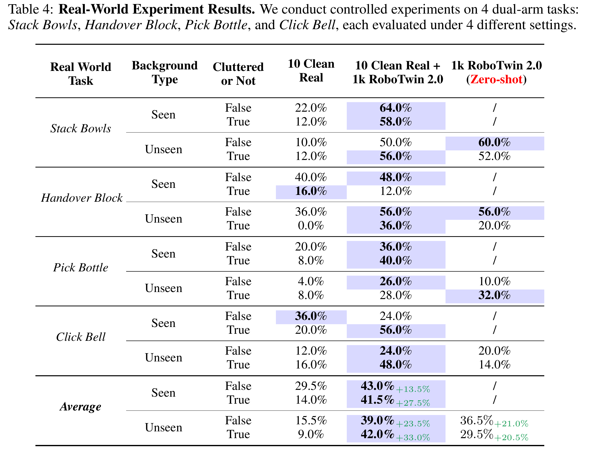

我的评分：⭐⭐⭐

## [Gemanip](https://genmanip.com/publications/genmanip-cvpr2025/)

机器人操作具有挑战性特别是在鲁棒的泛化方面，**GENMANIP**，这是一个专为策略泛化研究定制的逼真桌面仿真平台。其特点是通过 **LLM驱动的任务导向场景图（ToSG）(Task-Oriented Scene Graph作为中间表征)**  的自动化流程，利用1万个带注释的3D物体资产来合成大规模、多样化的任务。**GENMANIP-BENCH**，包含200个场景的基准测试，并通过人机回环（human-in-the-loop）进行了修正（可行性验证，消除歧义优化布局，平衡任务分布）。覆盖了四个关键维度：**长程规划 (Long-horizon)、空间推理 (Spatial)、常识推理 (Common-sense)、外观推理 (Appearance)**  。这为评估“空间智能”提供了细粒度的标尺。两个广泛采用的指标：**成功率 (SR)**  和 **路径长度加权成功率 (SPL)** 。

1. Modular Methods(泛化)：代表模型 CoPA(GPT 4.5), MOKA（实际采用的方法时CoPA和MOKA的融合，CtoF SoM --> AnyGrasp(掩码过滤提议) --> Motion Planner --> Trajectory-action Chainer --> Trajectory-action Chainer || Close Loop）。有 **“零样本泛化 (Zero-shot Generalization)”**  和  **“语义理解”** 的能力，但面对Long-Horizon任务的挑战，而且先让大模型选一个格子或点，再调用运动规划库（如 MPlib）去走，**路径效率（SPL）** 低，而且大模型尚未理解**物理空间的连续性**，缺乏真正的“**空间智能**”，导致其规划路径并非物理最优解。这也印证了这个文章的观点，基础模型需要被增强。

**模块化系统 (Modular System)** :

- ​**输入**: RGB-D 图像 + 文本指令。
- ​**Affordance Generator**​: 使用 **SAM2** + **Set-of-Mark (SoM)**  提示 GPT-4V 选择目标物体掩码。
- **Planner**: 对比了 **Grid-based** (把图像网格化让GPT选格子) 和 **Point-to-Point** (直接回归点)。
- ​**Execution**​: 调用 AnyGrasp 生成抓取姿态 -\> MPlib 规划路径。

2. **End-to-End Policies(单任务)：**  使用自动化脚本（基于上帝视角信息+AnyGrasp+MPlib的RRT算法等）在生成场景中收集大规模演示数据。代表模型GR-1 (GPT-style transformer), ACT(Action Chunking Transformer).，性能随任务数量线性提升（100 episode 成功率 **33%**  1000 episodes 成功率 **95%** ）。模型直接输出动作，避开模块间信息损失，执行路径更短更丝滑。但是UnSeen指令对象成功率直接0%。

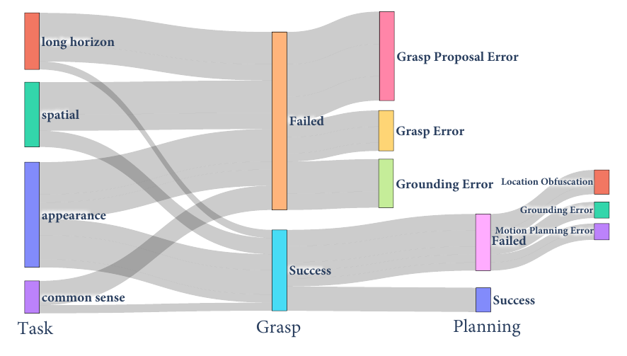

这里的错误模式分析存在一定的“幸存者偏差”,因为这个论文的模块方法底层直接调用planning模块，但是如 NoTVLA, Gemini Robotics 1.5，GAE等工作 有在尝试VLM输出中间显式guidance之后，底层由Detokenizer/ACT/3DP负责，和这篇文章讨论的模块化方法又更advanced一点。但这篇论文的错误模式分析对优化VLM foundation model比较有启发意义。

我的评分：⭐⭐⭐⭐

## [InternData-A1](https://www.alphaxiv.org/abs/2511.16651)

[huggingface数据](https://internrobotics.github.io/interndata-a1.github.io/)已开源，[pipeline code is coming soon](https://github.com/InternRobotics/InternManip/tree/master?tab=readme-ov-file)。

打破`sim-to-real Gap`无法用于预训练的质疑，利用仿真合成数据达到和pi Dataset真实数据一样好的预训练效果。对比三个主流的数据生成方案：

1. <u>RL</u>采集： 理论上自动化程度高，但受限于Dense Reward难，即使有VLM辅助，尝试<u>scale up任务类型</u>时会导致数据几乎不可用。
2. <u>Hard Code</u>： 依赖大量人力手写脚本，Scalibiliy差，“取决于实习生数量”。
3. General Skill: 依据预定义计算Key Point减少<u>Hard Code</u>（但仍依赖部分Hard Code），实现泛化性与工程量的平衡。（Long-Horizon Task指数开销,UMI 这类真机采集方案，熟练的操作员几乎零失误，采集长序列数据反而比仿真更具优势）

<u>Planning(CPU Dense)与Rendering(GPU Dense) Fully Decoupled</u>，高度自动化完全解耦可组合的仿真流程。在sim2real gap中，<u>纹理gap>物理gap</u>,于是用photorealistic成功跨越这一鸿沟，sim2real zero transfer。支持Skill Composition,灵活assembly,异构embodiments和极少人工微调，开源生成流程以及数据。降低具身智能研究中可扩展数据创建门槛。

$$
f_{\text{skill}}(\text{State}_{\text{obj}}, \text{State}_{\text{robot}}, \text{Constraint}) \rightarrow \{W_1, W_2, \dots, W_n\}
$$

Waypoint随后被送入CuRobo进行逆向运动学计算，ManiSkill 最初版或部分 RLBench 任务任务脚本与底层的控制器（Joint Control）或者特定机器人的运动学绑定，Waypoint实现了解绑。

> **任务多样性(“多样性”暂时被认为是预训练数据的“第一性原理”)**   **>**  **数量**: 去掉 **长视程任务 (Long-horizon)**  或 **关节体操作 (Articulation)**  对性能的损害，比去掉大规模但简单的 Pick-and-Place 任务更严重。这证明了**轨迹多样性 (Trajectory Diversity)**  是预训练有效的核心驱动力 。

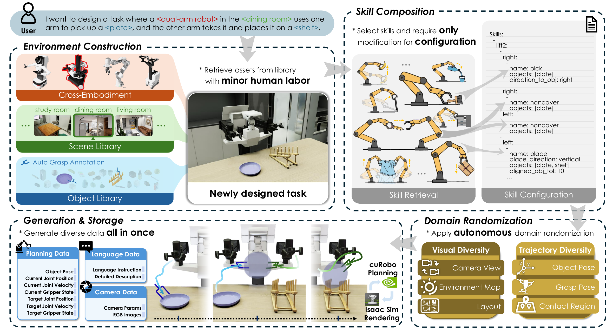

我的评分：⭐⭐⭐⭐

‍

## **[InternVLA-M1](https://github.com/InternRobotics/InternVLA-M1)**

关键概念：空间引导，Co-training, Bridge

**空间引导**作为连接**Instruction**与**机器人动作**的关键纽带。

- **Stage 1 (Pre-training)** ：只训练 VLM，使用 3M+ 的多模态数据（包含 Box, Point, Trajectory QA），强行注入“空间智能”。
- **Stage 2 (Post-training)** ：VLM 和 Action Expert **联合训练 (Co-training)** 。在训练动作的同时，继续用空间数据监督 VLM。这解决了 VLA 微调时容易遗忘通用语义/空间知识的问题（Catastrophic Forgetting）。
- 构建了一个基于 Isaac Sim 和 <u>GenManip</u> 的仿真数据管线，生成了 244K 高质量、带标注的 Pick-and-Place 数据（InternData-M1）。不仅生成动作轨迹，还自动生成对应的空间推理问答对（QA Pair），实现了物理仿真与视觉渲染的解耦，大幅降低了数据获取成本。

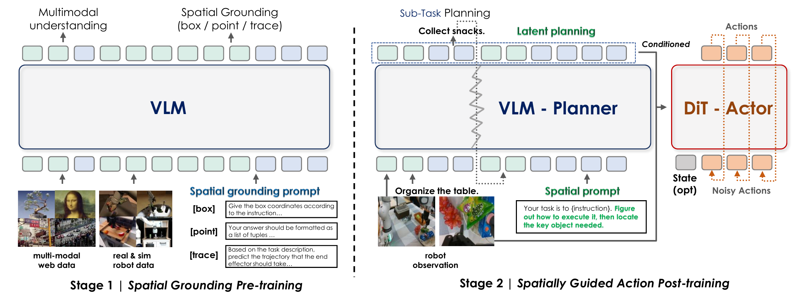

- VLM（Qwen2.5-VL-3B-Instruct）：

  - **空间提示 (Spatial Prompting)** ：在文本指令后追加提示（如“找出关键物体的位置”），激活 VLM 的空间注意力 。
- Bridge:

  - **Querying Transformer**：将 VLM 不定长的 Token 压缩为固定数量的 Query Token 。
  - **梯度衰减 (Gradient Decay)** ：为了防止 Action Loss 破坏 VLM 的语义能力，反向传播时对流向 VLM 的梯度进行衰减 。
- DiT Actor

  - 接收 VLM 的 Query Token 作为条件 (Conditioning)。
  - 结合当前的本体状态 (State)，通过扩散过程生成动作序列 (Action Chunk)。

我的评分：⭐⭐⭐⭐

‍

## [扩展时代走向研究时代](https://www.youtube.com/watch?v=aR20FWCCjAs)

> 2012年，家住多伦多的Krizhevsky夫妇在支付电费的时候，发现费用比前几个月多了不到10加元。彼时，他们还未意识到这10加元最终将会撬动人工智能的一个时代 -- 他们的儿子Alex为了逃避depth oral(博士资格考)，没日没夜地在卧室用两张Nvidia GTX580显卡训练着模型，因为他的导师Hinton许诺，每在ImageNet上提高1%的正确率，就可以把考试推迟一周，最终，Alex推迟了很多很多周。

[人工智能的阶梯式发展](https://zhuanlan.zhihu.com/p/1972408336440864907)

scaling law可能并不是log linear的，而是一个sigmoid曲线，sigmoid上限就在那里。但是我觉得下一个阶梯应该不是完全抛弃 scaling law ，就是只scaling 到 那条sigmoid曲线的80%左右的上限的地方，找到下一个突破口 可能是一个 样本效率极高 可泛化 在部署中持续学习的方法。

> 以下文字99%AI生成，但是值的阅读。

- 有关AI发展现状与感知：

  - AI技术及湾区相关发展真实发生，类似科幻场景。
  - AI发展缓慢感 -- 1%GDP投入AI未显重大，因人类适应快且AI影响抽象。
  - 一方认为奇点时仍无差异，一方认为AI将渗透经济，影响会显现：

    - 以新晋诺贝尔经济学奖得主 Philippe Aghion 的 “鲍莫尔成本病” 理论为核心：经济增长的极限不取决于 AI 的 “认知能力”（如计算速度、创新效率），而取决于**物理世界的不可突破环节**—— 即使 AI 能实现 99% 任务的自动化（如研发、设计），剩余 1% 依赖物理条件的任务（如能源生产、资源开采、商品制造、实体运输）仍受限于热力学定律、资源储量、基建效率等 “硬约束”。这些环节的生产率提升缓慢，会拖累整体经济增速，导致 “奇点” 阶段的经济表现与当前无本质差异。**例如：** AI 可快速设计新型电池，但矿产开采速度、工厂生产产能仍需遵循物理流程；AI 能优化物流路径，但货车行驶速度、港口装卸效率无法突破现实条件，最终经济增长仍受限于这些 “慢环节”。
    - OpenAI 山姆・奥特曼、麦肯锡等机构）认为，“奇点” 阶段 AI 对经济的渗透是 “系统性、颠覆性” 的，影响会通过生产要素重构、产业形态变革、增长动力切换全面显现。传统经济依赖 “劳动力数量、资本投入” 的线性增长，而 AI 通过 “数据燃料 + 算法引擎” 构建动态闭环 —— 例如，智慧城市 “大脑” 实时处理百亿条交通数据，使主干道通行效率提升 30% 以上；制造业通过 “基础模型 + 数字孪生” 实现生产流程自主优化，资源错配率下降 50%。这些变化并非 “局部效率提升”，而是生产要素（数据）与 AI 深度融合，催生 “指数级增长动能”，与当前 “人力主导” 的经济模式形成显著差异。山姆・奥特曼在 **《温柔的奇点》** 中提出核心判断：奇点阶段 AI 将具备 “递归式自我改进能力”——AI 不仅辅助人类创新，还能自主推动技术迭代（如设计更高效的 AI 芯片、探索新型材料、优化自身算法），同时 “具身 AI 机器人” 实现 “用机器人制造机器人”，形成 “技术 - 经济” 正向反馈循环（内生式增长）。
- AI模型表现与困惑

  - 模型在评估中表现好，但经济影响滞后。Agent能完成复杂任务，却会犯低级错误（如修复bug引入新问题）。
  - 可能原因解释：

    - 强化学习（RL）训练使模型目标单一、视野狭窄。
    - RL训练数据选择复杂，企业团队新增RL环境，易受评估启发，且模型泛化能力不足。
- AI训练

  - Pre-train

    - 特点：数据量大，无需精心选择数据，数据包含人类思想等，类似人类世界文本投影。
    - 问题：难解释模型对预训练数据的依赖，无人类类比。
    - 与人类学习类比争议：非15年成长或30亿年进化，人类少量数据却理解更深。
  - RL

    - 现状：企业投入更多算力，rollout长、学习效率低。
    - 改进方向：价值函数（Value Function）可提升效率，缩短学习反馈周期。情感是进化赋予人类的高效、简洁的价值信号，帮助人类做决策，而这一机制并未有效体现在当前AI价值系统中。
  - AI vs Human

    - 样本效率：人类大胜。
    - 教学交流难度：人类大胜。
    - 进化影响：人类在视觉、运动方面有强先验。
- AI发展阶段与 scaling

  - 发展阶段划分（人工智能的阶梯式发展）

    - 2012-2020：研究时代，侧重尝试不同方法。
    - 2020-2025（预估）：扩展时代，聚焦预训练扩展，企业易投入资源。
    - 未来：重回研究时代，因预训练数据有限，需新方法。
  - scaling

    - 过去：聚焦预训练数据、参数、算力扩展，有明确幂律关系。
    - 现在：转向RL扩展，但效率低，需寻找更高效资源利用方式。
    - 疑问：未来新“配方”（recipe）形态?
- SSI

  - 商业模式：当前聚焦研究，未来商业模式待显现。
  - 差异化优势：技术路线不同，聚焦理解泛化能力，追求安全的超级智能。
- Superintelligence

  - 非已掌握所有技能，可融合不同实例学习成果，在部署中持续学习。
  - 潜在风险与担忧：权力巨大，难想象其影响，存在失控等风险 --- 强AI应该逐步部署让社会适应和完善安全性，而不是直接一次性推出“超级智能”。
  - 安全与对齐（Alignment）：

    - 未来均衡：或每人拥有AI助手，或人类与AI融合（如Neuralink++）。
    - 挑战：难编码高级欲望，AI泛化能力不可靠导致对齐困难。
  - 发展预测：5-20年内可能出现人类级学习能力的AI，进而发展为超级智能。
- AI多样性与创新

  - LLM相似性高，因预训练数据趋同。
  - RL及后训练阶段差异化，引入竞争（如自博弈、对抗性设置）。
  - 自博弈（Self-play）：可无数据仅用算力生成模型，适合特定技能，现有类似形式（辩论、证明者-验证者）。

    - 和传统棋类 AI（如 AlphaGo）的自博弈有明显区别 —— 它更强调**无标注数据依赖、纯算力驱动的技能生成**，且衍生出了辩论、证明者 - 验证者等新型对抗形式。
    - 无需外部标注数据，自我迭代闭环，适合特定技能打磨。
- Research Taste

  - 受人类机制正确启发，追求**美、简洁、优雅**，结合多视角，追求与大脑正确类比的研究方法。
  - **自上而下**的信念：先锚定核心假设，再推导研究方向。

    - ​**举自博弈的例子**​：研究人员的核心信念可能是 “​**通过自我对抗的闭环，无需标注数据也能训练出高精度的认知技能（如数学证明、逻辑推理）** ”。基于这个信念，研究方向就被锚定了 —— 不需要去纠结 “如何收集更多标注数据”，而是聚焦于 “如何设计更高效的自博弈对抗形式（证明者 - 验证者、辩论式）”“如何优化对抗中的反馈机制”“如何降低自博弈的算力成本”。
    - **举 Scaling 的例子**：核心信念如果是 “**未来模型扩展不是堆参数，而是 “高效扩容 + 精准精简” 的协同**”，那么研究方向就不会是盲目做大模型，而是围绕 “超克隆技术”“模块级精简”“工具增强小模型” 这些具体路径展开。、
  - 人工神经元、分布式表征、从经验学习等想法均符合该品味。

|维度|一般自博弈（如 AlphaGo）|新型自博弈（辩论 / 证明者 - 验证者）|
| ----------| ----------------------------------------| ---------------------------------------------------------------|
|对抗目标|击败对手（零和博弈，一方赢则另一方输）|共同逼近 “最优解”（协作式对抗，不是为了击败，而是为了完善）|
|反馈机制|明确的胜负结果（赢棋 / 输棋）|相对模糊的 “合理性反馈”（论点是否自洽、证明是否严谨）|
|技能类型|策略型技能（棋类、游戏）|认知型技能（逻辑推理、数学证明、文本纠错）|

### 有关Research Taste from 许华哲

科研和音乐、文学一样，功底是一方面，巧思是一方面。做出好的工作，良哈的品位最重要。就像钢琴家首先要有一个能听出好坏的耳朵，才可能演奏出好的作品。

前MSRA的童欣的《研究之味》我一直很喜欢，名字常让我想起电影《秋刀鱼之味》，<u>他的心路历程是从被审稿人/顶会认可过渡到对百思而得解的顿悟的追求</u>，而“品味”就是研究中的“盐”，“少许、适量”的用量，<u>玄之又玄总是让人难以琢磨</u>。 -- [科学匠人丨童欣：研究之味](https://tech.sina.com.cn/csj/2020-01-14/doc-iihnzahk4020709.shtml)

> 无迹可寻的创新过程与高度程式化的研究方法其实是一个硬币的两面。严谨的研究方法和思维习惯，恰恰是让人能够从实践和学习中发现异常的蛛丝马迹，从而最后做出创新的一个必要基础。如果缺乏好的研究方法和实现能力，即使偶尔有了一个好的想法，也会由于没有能力做出实现和好的评估分析而失败，变成“小姐的身子丫鬟的命”。如果大家观察身边成功的研究人员，不一定每一个都具有天马行空、快如闪电的思维，但是无一不具有优秀的研究习惯和严谨的逻辑思维。

阅读、讨论、闲谈是童谈到的三种打磨品味的手段。<u>其中以闲谈最为重要，因为阅读虽然扩展了知识，但如果无人讨论思路却仍然难以被打磨。</u>而讨论往往比较正式，大家说的话也比较“圆”，你很少听到在国际会议或研讨会中出现尖锐批评的声音。

所以，<u>尖锐的批评，深刻的洞见，直抒胸臆的赞扬，往往来自几位等量齐观的研究者在酒后或者下班前的闲谈中</u>。“这个工作理论有重大纰漏，也太垃圾了”，“这样的工作，什么都没讲清楚，也能中？” 这样的话语，你只能和最亲密的研究伙伴私下说说，但是潜移默化的让你知道了别人的“品味”是什么。而了解其他人的品味，是培养自己品味的必要条件。

在本篇，我想给大家一个正面例子，就是斯坦福的UMI。 我曾经看到一个xhs帖子批评UMI，认为这个工作完全是"learning"的人重新造轮子，技术上既没有难度也没有创新。一定程度上，UMI的技术很简单，但简单的不正是最易于规模化、使用的吗？同时，“数据短缺”是具身智能的核心问题之一，而UMI的目标是非常宏伟的。

另一个反例，就是“装饰性数学”，在相当多的论文中，理论部分和实验部分脱节，成为了装饰性的内容。不仅误导读者，同时将简单问题复杂化。尽管如此，品味没有对错，每个人总可以坚持自己的味道。只是，要先吃过百味后，还能坚持的味道才可能是好的味道。

我的评分：⭐⭐⭐⭐⭐

‍

## [GraspNet](https://graspnet.net/) && [AnyGrasp](https://github.com/graspnet/anygrasp_sdk)

​<kbd>Machine Vision and Intelligence Group</kbd>

> "Net" 指的是“语义网络（Semantic Network）”。鼻祖：WordNet (1985) —— 真的是一张“网”，每一个节点是一个单词（或者概念/Synset），而词与词之间通过“上下位关系（Hypernym/Hyponym）”、“同义关系”连接。后来ImageNet继承WordNet单枪匹马开启了深度学习时代，ImageNet 沿用了 Net 这个后缀，是为了致敬 WordNet，并强调其数据的<u>结构化（Hierarchy）</u>特征，而不仅仅是一堆杂乱的图片。因为ImageNet太成功了，到了 GraspNet（以及 ShapeNet，MusicNet 等）出现的年代，`Net`​ 这个后缀的含义已经发生了演变，变成了一种**事实上的命名标准（De facto standard）** 。此时的 `Net`​ 更多暗示： **“我是这个领域规模最大、结构最全的基础设施”** 。

AnyGrasp 是一个**抓取检测 SDK**,它是基于 GraspNet 数据集训练出来的，通常集成了该团队在 GraspNet 挑战赛中表现最好的算法（如 HG-Net, Graspness 等技术的集大成者）。

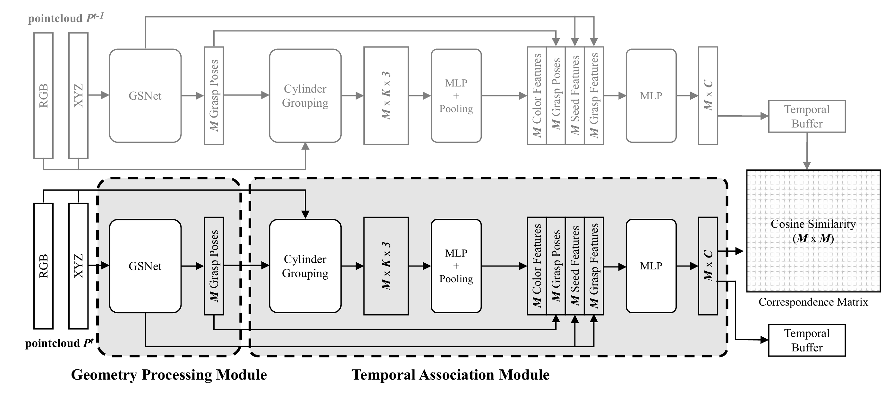

Dense Supervision 是泛化的关键，Scene Diversity减少模型无法收敛。

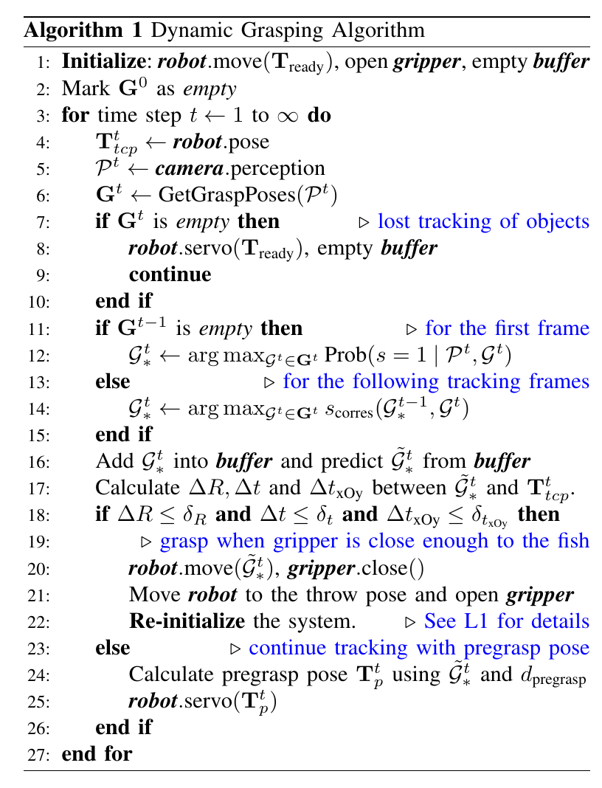

Algorithm 1 的精髓在于它**不需要显式地去计算物体的 6D 位姿**（这在形变物体或遮挡下很难），而是直接**在 7-DoF 抓取空间中做跟踪（Tracking in Grasp Space）** 。它利用相似度矩阵解决了“我是谁（Identity）”的问题，利用 Buffer 解决了“我去哪（Prediction）”的问题。

我的评分：⭐⭐⭐⭐⭐

‍

## [$\chi_0$](https://mmlab.hk/research/kai0)

该研究的详细报告预计将于 **2026年1月下旬** 发布。从零开始构建一个能够处理复杂任务（如叠衣、挂衣）的机器人系统。

> **Veni, vidi, vici.(我来,我见,我征服)** 		-- *Julius Caesar*
>
> 正如尤利乌斯·恺撒在泽拉战役中的速胜定义了“战略效率”一样，我们也致力于征服机器人领域的“珠穆朗玛峰”：在真实世界的衣物操纵中实现 100% 的可靠性。在这项任务中，“Veni”（数据采集）、“Vidi”（模型训练）和“Vici”（真机推理）构成了一个渐进的、环环相扣的链条，其中每一个环节都至关重要。虽然像 Pi0（Physical Intelligence 的模型）和 GO-1 这样的基础模型依赖“蛮力”规模来达到这些高度，但我们提出了一种具有资源意识的替代方案。我们展示了如何以标准成本的一小部分（具体来说，仅需 20 小时的人类演示和 8 张 A100 GPU，而不是通常所需的数万小时和数百张 GPU），将系统从 0% 提升到 100% 的可靠性。

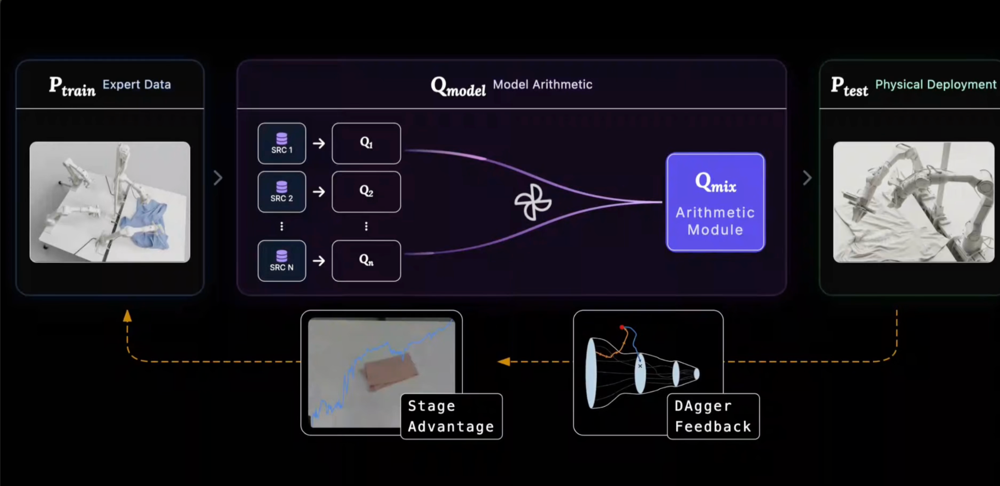

> **Dagger:**  Injecting on-policy recovery trajectories to expand Ptrain towards underrepresented failure modes in Preal.
>
> **Inference Optimization:**  Minimizing execution jitter to ensure smooth translation from Qmodel to Ptest.

动图里的公式推导特别有意思，$P_{train}=Expertdemo(Q_{human})  \space \space P_{test} = Inference(Q_{model})$其中$P_{real}$和$P_{test}$之间的gap,便可以理解为failure mode，有时这个failure mode是Distribution Shift。可以减少这个gap即failure mode的方法有**Dagger**（比如人在回路的数据增强）和**Inference Optimization**的方法（比如RTC）

1. **Mode Consistency:**

- **$P_{train}$**  **(训练数据分布)** ：通常是静态的人类演示。
- **$Q_{model}$**  **(模型知识分布)** ：模型实际学到的策略分布。
- **$P_{test}$**  **(测试环境分布)** ：真机运行时遇到的状态分布（包含了累积误差）。

盲目堆砌数据是低效的，因为有些数据对机器人学会技能毫无帮助，甚至有害。为了获取那些真正“有价值”的数据，我们必须强制<u>对齐</u>“训练”、“模型”和“测试”这三个分布。**所谓的“对齐（Aligning）”就是指：** 类似 **DAgger** 或  **~~RFT (Reward-weighted FineTuning)~~**   的机制，让 $P_{train}$ 不再仅仅是死的人类数据，而是包含了 $P_{test}$ 中可能出现的错误状态的恢复演示（Recovery Data）。

2. **Model Arithmetic：**

不存在一个single perfect的checkpoint，在不同的数据流形上训练出多个checkpoints，然后在权重空间进行运算（加权平均），形成一个adaptive policy。是MoE的思想但是比MoE更加接近本质，结构上更加的接近简单与美，同样能capturing diverse knowledge。

3. **Stage Advantage：**

基于语意的阶段划分，机器人学习需要优势信号进行自我引导。

‍

> 1. Not all robot data is equally valuable. The quality and characteristics of training data significantly impact policy performance.
> 2. <u>The capability of the base policy is crucial</u>, but knowing <u>how to rapidly evaluate and select a capable base policy is even more important</u>. A fast research iteration cycle is essential for developing intuition and understanding of base policy behavior.
> 3. Model arithmetic can surprisingly turn lead into gold. Simple arithmetic operations on model weights can transform mediocre policies into high-performing ones.
> 4. Stage-conditioned advantage estimation still has room for improvement. <u>Revisiting fundamental concepts from reinforcement learning may unlock further gains.</u>

期待正式工作发布开源。

我的评分：⭐⭐⭐⭐⭐

‍
