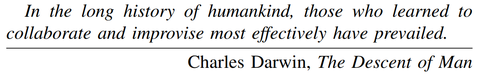
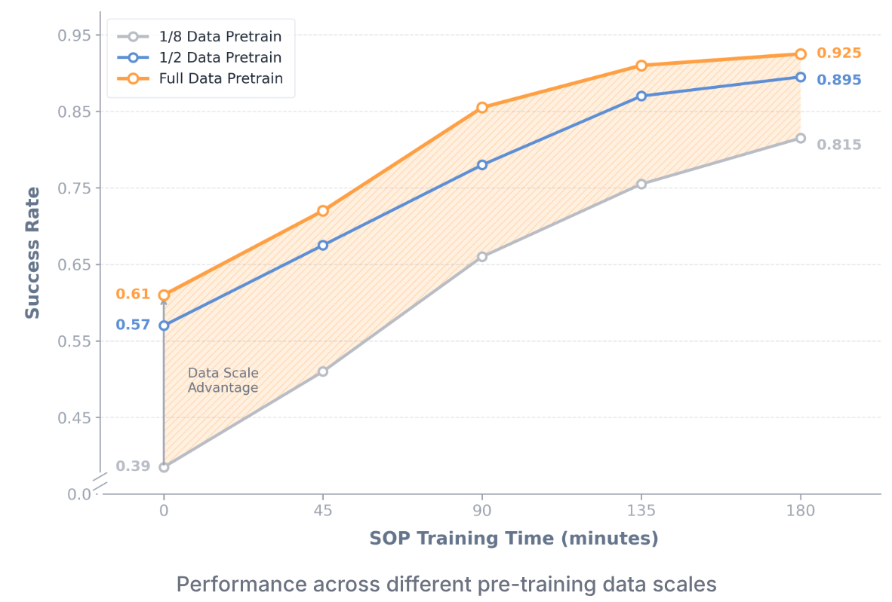
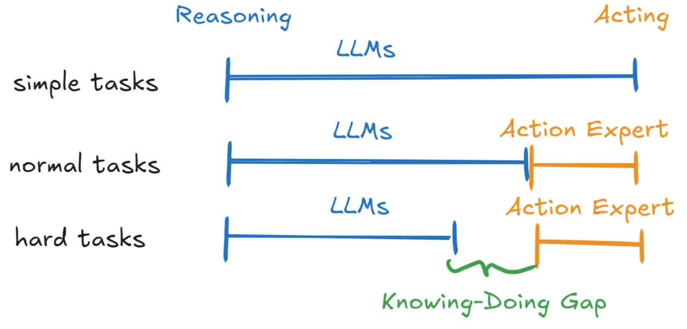
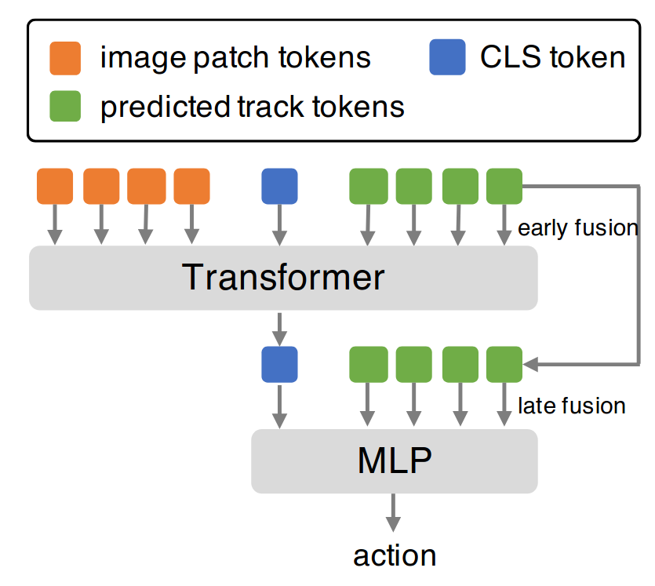
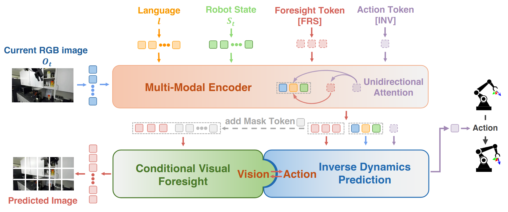
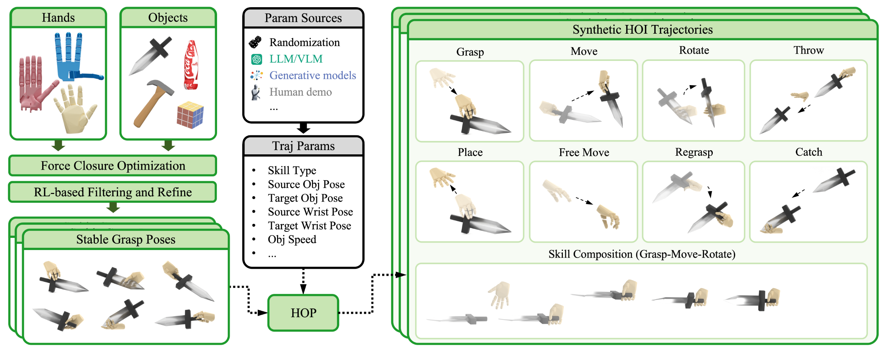

## [AVTD](https://arxiv.org/abs/2304.10466)

针对高UTD强化学习,依然是Online Learning with (others') Offline Data的设定。文章的结论是强化学习的正则化还没有迎来它的"大一统定律"，但是却认为它找到了大一统的病：<u>Validation TD Error 越高，那么性能崩溃越明显</u>。最后一处一个基于Validation TD Error同时训练多个Agent，然后贪心地基于当前的Validation TD Error选择最好的Agent。尽管这篇论文引起了争议，但是还是被接受了。

作者把监督学习的逻辑强行套在 RL 上，忽略了 RL 这种“非独立同分布（Non-i.i.d）”且“标签动态变化”的本质困难。

在实际的 Online RL 训练过程中，我们**无法计算 Approximation Error**。因为要算这个，需要知道真实的 $Q^{\pi}(s,a)$，这需要在这个状态下把策略跑到底（Monte Carlo），这在训练中太昂贵甚至不可能实现。

虽然 Validation TD Error 不是真理，但在特定的高 UTD 场景下，它与性能崩溃呈现出**强相关性**。但是一个更好的可以接受的降低Validation TD Error的方法并没有被提出，同时跑多个Agent在真实场景下过于昂贵不可接受。

以下文字由AI生成：

> 在 2023 年之后，RL 社区并没有继续沿着“如何更好地监测 Validation TD Error”这条路死磕，而是​**转换了视角**​：大家意识到 Validation TD Error 高（过拟合）的本质，往往伴随着​**神经网络的可塑性丧失（Loss of Plasticity）或者特征秩崩塌（Rank Collapse）** 。
>
> ReDo (ICLR 2024 Spotlight)  
> CrossQ (ICLR 2024 Spotlight)  
>   
>
> - ​**想省事且稳**​：在 Critic 中使用 ​**LayerNorm**​，在 Actor 和 Critic 中都使用 ​**AdamW (Weight Decay)** 。这是目前 VLA/Transformer-based RL 的基线。
> - ​**想解决高 UTD 崩塌 (Plasticity)** ​：加入 **ReDo (Recycling Dormant Neurons)**  机制。这比 Validation TD Error 监测更本质，因为它直接修复了导致误差升高的“死神经元”。
> - ​**想探索新架构**​：尝试 ​**CrossQ**。它通过移除 Target Network 并引入 Batch Norm，从根本上改变了 Q 值的更新动力学，天然适合高 UTD。

‍

我的评分：⭐⭐

‍

## [A-LIX](https://arxiv.org/abs/2207.00986)

[Code](https://github.com/Aladoro/Stabilizing-Off-Policy-RL) `ICML2022 Spotlight`

> 许多试图改进 DrQ-v2 或提出新数据增强策略的论文，会引用 A-LIX 来证明：如果不使用数据增强，纯粹靠网络架构设计能达到的上限在哪里。A-LIX 证明了通过正确的正则化，端到端学习可以不依赖数据增强这一“外挂”。

视觉致命三体（Visual Deadly Triad）:

1. 仅依赖TD-loss
2. 无正则化的卷积编码器端到端学习
3. 稀疏或低幅度的奖励

这种组合导致 Critic 网络迅速拟合自己产生的噪声目标值（而非真实的奖励信号），即**灾难性自过拟合** 。

**提出“归一化不连续性分数” (Normalized Discontinuity Score, ND Score)：** 为了量化过拟合和特征图的“平滑度”，作者设计了 ND Score。研究发现，性能差的 Agent 其特征图和梯度的 ND Score 很高（即特征在空间上剧烈变化、不连续），这可以作为训练稳定性的监控指标 。A-LIX (Adaptive Local Signal MiXing)通过在特征图上混合局部信号来显式地**平滑梯度**。

> **输入 (Pixels)**  $\rightarrow$ **卷积编码器 (CNN)**  $\rightarrow$ **A-LIX Layer (核心组件)**  $\rightarrow$ **Critic/Actor 网络 (MLP)**  $\rightarrow$ **输出 (Q值/动作)**

比较麻烦的是需要根据任务的情况调 ND_Target这个参数，并且只适用CNN，如果Encoder是Resnet或者ViT,使用规则会彻底改变（应该是基本不能用，因为设计上是基于CNN特征图较大的情况，至少得30*30）。具体参数看文章，在DeepMind Control Suite和Atari做了实验，个人感觉这两个环境还是太简单了，所以我决定在一些具身benchmark上尝试一下融入A-LIX看看效果。

> 尝试结束后...

A-LIX调参确实费劲，但是A-LIX的引入让我在RoboTwin上跑的残差强化学习算法成功率以及训练稳定性迎来了质的飞跃，而且A-LIX的调参是针对环境粒度，只要环境的光滑性先验不变，那么参数调完一次就不需要再调了。A-LIX本质上是Encoder  TD Sparse Reward RL情境下更好的正则化，当然也有观点任务数据足够多本身也是一种正则化，如果数据相当多的话，A-LIX正则化还是必须的吗？有待验证。

我的评分：⭐⭐⭐

‍

‍

## [Cross-Q](https://aditya.bhatts.org/CrossQ/)

这个算法连同 RLPD 和 被 RLinf 所支持 -- `ICLR 2024 Spotlight`

在 CrossQ 之前，SOTA 算法如 **REDQ (ICLR 2021)**  和 **DroQ (ICLR 2022)**  认为，要让 RL 像人类一样快地学习（比如几十万步学会走路），必须使用 **Ensemble Critics**（多头评论家）加上极高的 **UTD ratio**（环境走1步，网络更新20步）。

我跑代码的经验也告诉我，UTD ratio的提升会让训练变的非常慢，调试UTD ratio很高的RL算法等待过程很煎熬。这个论文保持 **UTD=1**，通过让网络架构变得更“强”（引入 BN）来提升学习速度，而不是靠暴力堆叠更新次数。

> 1. **成功将 BN 引入 Off-policy RL（并解决了分布偏移问题）** ： 在此之前，大家认为 BN 不能用于 Off-policy RL，因为 Replay Buffer 中的历史数据与当前 Policy 产生的数据分布不一致，会导致 BN 统计量抖动甚至训练崩溃。“联合前向传播（Joint Forward Pass）”的机制解决了这个问题。
> 2. **No** **Target Networks**： 自 DQN 以来，Target Network 被视为稳定训练的“圣杯”。证明了：只要使用了正确的归一化（BN），Target Network 不仅是多余的，反而会人为地减慢价值函数的传播速度。
> 3.  在达到同等甚至更高样本效率（Sample Efficiency）的前提下，CrossQ 的计算速度比 REDQ 快 **4倍**，梯度更新次数减少了 **20倍**。

1. ​**数据准备**：

    - 从 Replay Buffer 采样历史数据：Batch B \= $(s_t, a_t)$.
    - 用当前 Policy 生成下一步数据：Batch B' \= $(s_{t+1}, \pi(s_{t+1}))$.
2. ​**拼接 (Concatenation)** ：

    - 将 B 和 B' 拼接成一个大 Batch：Input \= Concat([$s_t, s_{t+1}$], [$a_t, \pi(s_{t+1})$]).
3. ​**联合前向传播 (Joint Forward Pass)** ：

    - 将 Input 喂给带 **Batch Normalization** 的 Q 网络。
    - **Insight**：BN 层会同时看到“历史分布”和“当前策略分布”，计算出的均值和方差是两者的混合。这解决了 Distribution Shift 问题。
4. ​**拆分与计算 Loss**：

    - 输出 Output 拆分为 $Q(s_t, a_t)$ 和 $Q(s_{t+1}, \pi(s_{t+1}))$.
    - 直接用 $Q(s_{t+1}, \dots)$ 计算目标值（不使用 Target Network，只 detach gradient）。
    - $L = (Q(s_t, a_t) - (r + \gamma \cdot \text{stop\_gradient}(Q(s_{t+1}, \dots))))^2$.

**一句话总结**：**CrossQ**  **=**  **SAC + Critic BN - Target Network + Joint Forward Pass + Wider Net.**

‍

Paper还是做的一些简单benchmark的实验，需要更复杂的具身任务去试一试效果,可以利用RLinf试一试CrossQ算法的效果。

我的评分：⭐⭐

## [ReDo](https://github.com/timoklein/redo?tab=readme-ov-file)

The Dormant Neuron Phenomenon in Deep Reinforcement Learning.本质上应该还是正则化只是换了角度去看问题，但是好像有点麻烦了。

‍

‍

## [RLinf](https://rlinf.readthedocs.io/en/latest/)

很好的Infra，支持，不用担心RL_Baseline跑不快，不知道有没有后训练增量开发价值，之后试一试。

我的评分：⭐⭐⭐⭐

‍

‍

## [SOP](https://www.agibot.com/research/sop)

Luo JianLan && Agibot(稚晖君) Scale Online Post-Training

Luo老师一直坚持真机online RL路线。

比较有意思的是大家开始喜欢在Introduction里面写“题记”了，初中生写叙事文也爱用这个。

不过虽然这种套路看多有点生厌，好像写了这个就可以冲oral一样，但是大多说的都是有道理的。

我导师说真机强化学习不是不好，主要是坑太多了，我也暂时同意这个观点，毕竟现在大部分课题组条件也不支持一堆真机在那里RL还有人坐在那里实时纠正，所以我最后得出的结论是这个工作是一个很超前的工作。

- offline no -- online yes
- one robot no -- 分布式 yes
- one task no -- 多任务 yes

云端Learner异步更新策略，Robots Fleet异步接收更新后的策略，需要Env&&人类干预信号，后训练算法目前尝试了HG-DAgger和RECAP[$\pi_{0.6}^*$]都能用，跨任务单一共享策略，是具身真机版的RLHF。

具身智能还连GPT时刻都没有到来却已经有RLHF了，但这个工作会是未来具身大规模工业化载体。提出了关于机器人数量的Scaling Law，机器人数量的提升，训练需要等待的真实物理时间即“墙钟时间”（Wall-clock time）线性地被压缩。

我之前一直觉得RLPD和ResFit这两个算法很奇怪，要么把Offline Buffer全部去掉，要么就在训练的过程中一直保持50% Online Buffer和50% Offline Buffer，我总觉得这样是不对的，最后这个文章给出的给出的解决思路也简单且正确，基于online loss和offline loss来动态的调整权重，下面我直接展示原文：

> 假设训练数据被划分为 $M$ 个任务，索引为 $m \in \{1, 2, \dots, M\}$。
>
> - ​**在任务间 (Inter-task) 层面**：我们强制使用统一的任务权重 $\omega^m = 1/M$，以确保每个任务都有相等的贡献。（注：即不让某个数据量大的任务主导训练）。
> - ​**在任务内 (Intra-task) 层面**：对于任务 $m$，我们根据​**近期的训练损失 (training losses)** ​，动态调整该任务的**在线缓冲区** ($B_{on}^m$) 和 **离线缓冲区** ($B_{off}^m$) 之间的采样比例。
>
> 对于每个任务，我们维护在线损失 $\bar{l}_{on}^m$ 和离线损失 $\bar{l}_{off}^m$ 的​**滑动窗口估计**，窗口大小 $W=200$：
>
> $$
> \bar{l}_{on}^m = \frac{1}{W}\sum_{i=j-W}^{j-1} l_{on}^{m,i} \quad \text{以及} \quad \bar{l}_{off}^m = \frac{1}{W}\sum_{i=j-W}^{j-1} l_{off}^{m,i}
> $$
>
> **在线采样比例** $\omega_{on}^m$ 通过以下公式计算：
>
> $$
> \omega_{on}^{m} = \frac{\exp(\alpha \cdot \bar{l}_{on}^{m})}{\exp(\alpha \cdot \bar{l}_{on}^{m}) + \exp(\bar{l}_{off}^{m})} \quad (3)
> $$
>
> 其中 $\alpha > 1$ 是一个​**增强因子 (boost factor)** ​，用于​**优先考虑在线数据**，以加速模型在分布偏移下的适应。
>
> 为了避免极端的分配情况，我们将 $\omega_{on}^m$ 截断在区间 $[0.2, 0.8]$ 内。

可惜论文的附录并没有给出 $\alpha$ 具体设为多少比较好，只能我自己通过实验来验证了。

这篇文章的核心参考文献是：HG-DAgger, Fleet-DAgger, InstructGPT, SERL,pi0&0.6*。

我的评分：⭐⭐⭐⭐⭐

‍

## [NoTVLA](https://arxiv.org/abs/2510.03895) && [GAE](https://arxiv.org/abs/2510.03896)

NoTVLA和GAE是我的课题组的工作，它们背后都有同一个信念:"双系统解耦VLA是合理的，一个最好的规划模型应该是一个最好的视觉语言模型。"

NoTVLA通过预测稀疏点+样条插值的方式，极大地保留了视觉语言模型原本的能力，但是缺点也很明显就是精细操作做不了，也是我们课题组下一步工作正在攻克的点。

GAE的直觉和LocoFormer相似，接受视觉语言模型上游的轨迹引导输入+非常稀疏的环境点云（for efficient），有一个无论场景如何变换都只需要能在一定程度内修正轨迹误差从而很好地完成任务的Action Expert(并且那个Expert运行频率较高),目前arxiv上挂的这一版比较丑陋，new_version is coming soon。

GAE的卖点在于Action Pretraining阶段，Action Expert不是在学习具体的任务而是在学习“局部运动基元”（Local Motion Primitives）,150K 条轨迹（RoboTwin,CALVIN,LIBERO,RLBench,DROID,BridgeV2...）二阶段预训练（第一阶段只有Sparse EE Pose + Proprioception 150K batch_size 327678 第二节阶段加上local pcd 50K batch_size 256 训练收敛所需step是第一阶段的128倍 没有第一阶段会欠拟合）可以做到直接zero-shot ManiSkill。目前主架构是U-Net，条件注入依靠 FilM/Cross-Attention。

> 1. **Text-based:**  Because text is the *lingua franca* of zero-shot generalization, enabling adaptive training.
> 2. **Sparse:**  For the sake of efficiency. Five well-chosen keypoints are plenty to define a smooth trajectory.
> 3. **3D:**  Because, well, today’s VLMs are just that good.

我的评分：⭐⭐

‍

## [ATM(Any-point Trajectory Modeling)](https://xingyu-lin.github.io/atm/)

RSS2024

之前的工作RobotAP基于示教或检索，必须要有参考视频，实时运行两个Tracker跟踪两路视频流，是伺服（本质上是一个负反馈控制系统）。

CV界：TAPVid,TAPIR定义CV中Tracking Any Point的任务。

CoTracker 第一阶段Pratrain的数据由它提供。

ATM训练参考MAE（Masked AutoEncoders are scalable vision learners）,ATM给定任意当前观测，不需要参考视频，Transformer推理生成轨迹，后需只需简单的Policy跟随。

动态信息表征是十分有价值的，尤其是对便解耦的双系统VLA而言。

每一个 Track Token（绿色方块）都对应图像中一个特定“点”（Point）的完整轨迹信息的向量表示。比如我要为底层action expert模块设计一个极其轻量的输入但又希望保留更丰富的信息，Predicted Track Token会是很好的State表征选择（至少对于桌面具身操作任务而言，可是如果是移动操作，自动驾驶任务呢？目前的Predicted Track Token很明显只能用来做桌面操作）。

我的评分：⭐⭐⭐

‍

## [Decoupled Q-chunking](https://github.com/ColinQiyangLi/dqc?tab=readme-ov-file)

- **Critic** 使用长 chunk（如 $h=25$）来加速价值传播，减少偏差。
- **Policy** 使用短 chunk（甚至单步，$h_a=1$）来保持灵活性和易学习性。

**Distilled Critic**：为了连接这两者，作者引入了一个 "Distilled Critic"（蒸馏判别器），通过 optimistically backing up 原始的长 chunk critic，来评估短 chunk 的价值。

在极具挑战性的 **OGBench** (Offline Goal-conditioned RL Benchmark) 的长视界任务（如 `cube-quadruple`​, `puzzle-4x6`）上，DQC 击败了之前的 SOTA 方法（如 SHARSA）。这证明了该方法在处理稀疏奖励和长视界问题上的有效性。

看来我之前给SHARSA给分给高了，不过最后只中了ICRA Poster，我觉得应该给个Spotlight?

我的评分：⭐⭐⭐

‍

## [Gen-0](https://generalistai.com/blog/nov-04-2025-GEN-0)

Gen-0突破了三个瓶颈：

1. 利用真实数据工厂数据瓶颈27w hour

    1. 为 Class 1（15% 专家演示数据，保证动作规范性）、Class 2（35% 半结构化任务数据，平衡规范性与多样性）、Class 3（50% 开放式探索数据，捕捉 “非理想场景” 如湿滑物体抓取、光照突变），使模型学习的不是 “完美动作”，而是 “鲁棒性适应策略”—— 例如抓取湿滑玻璃杯时，模型能自动调整指尖压力分布，成功率比依赖仿真数据的模型高出 42%
2. 实时性瓶颈：谐波推理（Harmonic Reasoning）

    1. no 感知 --> 思考 --> 行动 no 2 Systems
    2. 感知 token 流的新信息（如 “物体开始滑动”）会实时反馈至行动 token 流，下一个行动指令立即调整，无需重新启动推理流程。例如在 “组装相机套件” 这一长周期任务（包含 7 个子步骤）中，模型无需显式子任务划分，仅通过单一谐波推理流即可完成，且操作失误率比传统串行模型降低 65%
3. 首次验证机器人领域的 “可预测缩放定律”

这些结论将重构具身智能的 “发展逻辑”：

1. 否定 “小模型泛化” 幻想，确立 “大模型 + 大数据” 的核心路径。
2. 推动 “预训练科学” 成为新研究方向，**数据质量与多样性比单纯数量更重要**

    1. 低预测误差（MSE）+ 低反向 KL 散度的模型，更适合监督微调（SFT）
    2. 高预测误差 + 低反向 KL 散度的模型，具有 “分布多峰性”，更适合强化学习（RL），可应对开放式探索任务
    3. 调整数据混合物，可定制化开发 “工业场景专用模型”“家庭服务专用模型”，大幅降低下游适配成本
3. 倒逼仿真技术转型：从 “数据生成” 到 “补充验证”

    1. 仿真人所畅想的‘算力生产数据’已被数据工厂甩在身后，短期内差距只会拉大
    2. 但这并不意味着仿真技术失去价值 —— 例如作者团队开发的 InternData A1 合成数据集，可与 Pi 系列的真实数据集性能相当，未来仿真技术的定位可能从 “主要数据来源” 转向 “补充验证工具”（如验证模型在极端场景下的鲁棒性、快速迭代算法原型），形成 “真实数据预训练 + 仿真数据微调” 的协同模式。
    3. 不过灵巧手的仿真依然有意义

‍

没有企业工业级算力的课题组针对二指夹爪桌面操作机器人还能做什么呢？

1. 零样本泛化能力缺失 --> 研究zero-shot的方法，以及test-time adaptation
2. Long-Horizon任务的误差累积，攻克Long Horizon任务SR下降问题
3. 评估体系--> 从单一SR指标到多维角度如 “鲁棒性（如应对设备故障）、安全性（如避免碰撞人体）、效率（如操作耗时）
4. 研究专用模块，如力控模块、碰撞检测模块等，作为基座模型的下游专用适配模块。

‍

GEN-0 并非 “完美模型”，但其最大价值在于 “用实证结果为行业指明了可行路径”。

我的评分：⭐⭐⭐⭐

‍

## [VLA-RAIL(无code)](https://arxiv.org/pdf/2512.24673v1)

这篇论文学术创新低，工程实用性高，提供了 **"异步推理 + 样条平滑"** 的提升真机demo的万金油解决方案，但是代码没开源，所以工程实用性也没有了，感兴趣可以有空机器人控制 Loop 里。

我的评分：⭐

‍

## [Seer](https://seervideodiffusion.github.io/)

> ICLR 2024 Poster(from Xianfan Gu Chuan.W)

省显存预测视频，感觉比较水。

- ​**Inflated 3D U-Net (视觉骨架)** ：

  - ​**做法**：拿来Stable Diffusion v1.5的权重。把2D卷积核 $(3 \times 3)$ 复制堆叠成伪3D卷积核 $(1 \times 3 \times 3)$。
  - ​**训练策略**​：**冻结**大部分预训练的空间层（Spatial Layers），只训练新加入的时序层（Temporal Layers）。这是省显存的关键。
- ​**FSText Decomposer (语言大脑)** ：

  - ​**输入**：CLIP Text Encoder输出的全局Embedding。
  - ​**核心操作**：

    1. ​**初始化**：强制初始化为Identity（恒等映射），保证初始状态下子指令等于全局指令（这不仅是Trick，更是为了训练稳定）。
    2. ​**分解**：通过Cross-Attention和Temporal Attention，将全局语义“拆解”并投影到时间轴上。
  - ​**输出**：$N$个Token，分别对应视频的$N$帧。
- ​**SAWT-Attn (时序连接)** ：

  - 在时序维度上做Attention，但加了Mask（因果遮罩，只看过去）和Window（局部窗口），大大减少了显存占用。

我的评分：⭐

‍

## [Seer](https://nimolty.github.io/Seer/)

> ICLR 2025 Oral(from Tian.Y)

端到端的方法，把现有方法视为“以动作为中心（Action-Centric，如 OpenVLA/Octo）”和“以视觉为中心（Vision-Centric，如 R3M/UniPi）”方法，让同一个Transformer不仅学会Action，也学会Visual Foresight。

- ​**视觉**: 当前时刻 RGB 图像 $o_t$（通过 ViT + Perceiver Resampler 压缩 token 数）。
- ​**语言**: 任务指令 $l$（通过 CLIP 编码）。
- ​**本体**: 机器人状态 $s_t$（通过 MLP 编码）。

​**核心机制 - 单向注意力**:

- ​`[FRS]` 关注历史信息（图像、语言、状态）。
- ​`[INV]`​ **同时关注** 历史信息 **和** `[FRS]`。这意味着动作生成是 condition 在“预测的未来隐变量”之上的。

- ​**视觉预测流**​: `[FRS]` $\rightarrow$ 图像解码器 (Image Decoder) $\rightarrow$ 预测未来图像 $\hat{o}_{t+n}$ (计算 $\mathcal{L}_{fore}$ 损失)。
- **动作预测流**: `[INV]` $\rightarrow$ 动作解码器 (Action MLP) $\rightarrow$ 预测中间动作序列 $\hat{a}_{t:t+n}$ (计算 $\mathcal{L}_{inv}$ 损失)。

**训练目标**: $\mathcal{L} = \alpha \mathcal{L}_{fore} + \mathcal{L}_{inv}$ (联合优化)。

真机上可以做到抗干扰，成功率依然保持在 60%-80% 左右。

挑战了纯粹增加数据量的 BC，表明引入物理约束（通过预测未来）可以以更小的参数量获得更好的性能。

我的评分：⭐⭐⭐⭐

‍

## [VLA Sota LeaderBoard](https://sota.evomind-tech.com/)

不错的LeaderBoard，单纯地分享一下。

‍

## LIBERO

受到认知心理学的启发，将知识分为 **Declarative (陈述性，如物体、空间)**  和 **Procedural (程序性，如动作逻辑)** 。LIBERO 旨在通过解耦这些知识类型，弄清楚机器人到底“学会了什么”以及“忘记了什么”。

- ​**ResNet-RNN**：经典的CNN+LSTM。
- **ResNet-T** (Transformer)：CNN提取特征，Transformer处理时序。
- **ViT-T**：全Transformer架构（Vision Transformer + Temporal Transformer）。

**观察**：ResNet-T 在综合性能上往往表现最稳健，但 ViT-T 在处理多样化物体（LIBERO-Object）时有潜力，前提是数据量足够。

经典的终身学习算法（如EWC, PackNet）虽然能防止遗忘（Backward Transfer），但在帮助机器人学习新任务（Forward Transfer）上，**反而不如最简单的顺序微调（Sequential Fine-Tuning）** 。

代码结构清晰，基于 Robosuite。

我的评分：⭐⭐⭐

‍

‍

## LIBERO Plus

最新的工作（如 *MergeVLA*, *SRPO* 等）已经开始引用它并将 *LIBERO-Plus* 作为一个重要的 Robustness Benchmark 进行对比。

通过“空白指令”和“目标替换”实验，严谨地证明了当前的 VLA 模型（特别是 OpenVLA-OFT）**实际上退化为了 VA (Vision-Action) 模型**，它们倾向于完全忽略语言指令，依靠死记硬背的视觉-动作映射来执行任务。

涵盖了 7 大扰动维度（布局、视角、初始状态、语言、光照、背景、噪声）和 5 个难度等级 ，能够精确量化模型在不同维度上的鲁棒性边界。

目前的 SOTA 主要是通过“背板”（记忆轨迹和位置）来刷分的，而不是真正理解了物理世界或语言。

相比前作已经没有终生学习的概念在里面了，只是指出了VLA模型退化为了VA模型，对模型进行鲁棒性压力测试，但是扰动维度的变化RoboTwin也在做啊（RTW是生成派，LIBERO Plus是精确诊断派），就是指出了一个大家都知道的问题，也没有insight说这个问题该怎么解决，但是可以十分细粒度地去判断问题出在哪里。

我的评分：⭐

‍

## [ManiSkill2.0](https://maniskill2.github.io/) && [3.0（Beta）](https://github.com/haosulab/ManiSkill)

支持多环境并行强化学习，并且底层并非magic grasp而是基于真实物理动力学，即吞吐量很大，但是代价是视觉很假，Visual Sim2Gap会是问题。但终究是比较有影响力的benchmark，可以很方便地在课题组服务器上初步地验证自己的RL算法。

> ManiSkill2 追求 **High Throughput（高吞吐量）**  来支持大规模 RL 训练（在单卡上达到 2000+ FPS ），底层的 SAPIEN 引擎默认使用的是 **光栅化渲染 (Rasterization)**
>
> Isaac Lab (Isaac Sim + RTX) 基于 Omniverse，支持光线追踪（Ray Tracing）和 DLSS。虽然它支持 Tiled Rendering 来加速，但渲染管线非常重。要在 Isaac Lab 里跑出高 FPS 的视觉训练，通常需要 H100/A100 级别的算力集群。如果你在单张 4090 上跑 Visual RL，显存很容易爆，或者 FPS 远低于 ManiSkill2。

Why Isaac Lab：

- **生态与资产格式 (USD):**  Isaac Lab 使用 `.usd`​ (Universal Scene Description) 格式。这是工业界的未来标准，支持极其复杂的材质、光照和物理属性。而 ManiSkill2 主要使用 `.urdf`​ / `.obj`，在资产管理的灵活性上不如 USD。
- **社区支持:**  NVIDIA 投入了巨大的人力维护 Isaac Lab，更新频繁，Bug 修复快。
- **Sim2Real 的潜力:**  ManiSkill视觉 Gap 大。Isaac Lab 原生支持 **Domain Randomization** (DR) 和 **光线追踪**，对于训练一个能直接部署的 VLA 模型来说，Isaac Lab 产生的数据质量（Quality）远高于 ManiSkill2，尽管Quantity/Cost可能低一些。

后来 ManiSKil3.0 Beta 版本为了实现 **30,000+ FPS** 的恐怖吞吐量把柔体支持给暂时移除了，MS2.0 当时使用 **Nvidia Warp** 编写了一个定制的 MPM（物质点法）模拟器，并通过 CPU/GPU 混合的方式与 SAPIEN（PhysX）进行耦合。这个和MS3.0的“原生 GPU 并行（Native GPU Parallelization）”无法兼容，官方文档已经明确承诺： **"Soft-body tasks will be added back in"** 。

**ManiSkill 3 (Beta版) 于 2024年5月2日 正式发布。**

- **当前状态：**  截止2026年初，它仍处于 **Beta** 迭代阶段（最新版本如 `v3.0.0b22` 发布于2025年12月），但已经非常成熟且功能丰富，正准备“Leaving beta soon”。
- 关于灵巧手：官方已经集成了 **Allegro Hand**, **D'Claw**, **TriFinger**, **Shadow Hand** 等主流灵巧手。**可用任务：**  包含 `RotateValve`​ (转阀门), `RotateCube`​ (三指转立方体), 以及 `RotateSingleObjectInHand` (手内物体旋转) 等经典灵巧操作任务。

MS2实验结果：

1. BC 在刚体任务上 和 精细力控的柔体任务（如Excavate）上 表现很差。
2. 3D 几何感知会提升任务表现（DAPG + PointNet）。（但是即使到了现在3D RL baseline非常少 支持3DRL的Infra太少了 而且做起来困难--指crop 降采样策略 以及padding store的难度等 大家都在卷 "Tokenization" 和 "Transformer"，反而冷落了对 3D 几何特征的底层挖掘 ）
3. Contact Rich 高精度装配 is hard。在 *Assembling Kits* 和 *PegInsertion* 这种间隙只有毫米级的任务中，即使有演示辅助的RL（DAPG+PPO）成功率也接近 **0%**  。

MS3实验结果：

1. Isaac Lab (Orbit) : 这是MS3主要 PK 的主要对手。Isaac Lab 依赖闭源的 Isaac Sim，显存占用极大。我们的核心动机是**效率**和**开放性**。
2. 使用低成本的 **Koch v1.1 机械臂**，仅基于仿真合成的 RGB 图像训练 PPO 策略，零样本迁移（Zero-shot）到真实世界，成功率达到 **91.6%**  。这证明了即便是光栅化渲染 + 域随机化，也足以解决视觉 Sim2Real 问题。

我的评分：⭐⭐⭐⭐

‍

‍

## [项目“本能”](https://project-instinct.github.io/)

研究涵盖碰撞无关运动、深度跑酷和可扩展的感知跑酷框架。目前有3个Paper码一下。

‍

## [高Star机器人项目](https://zhuanlan.zhihu.com/p/1987172796669912640)

码一下

‍

## [HOT](https://ingrid789.github.io/hot/)

TanPing老师 和Chen QiFeng老师 是 灵巧手+RL+物理仿真 的SOTA 制造机 鼓励我们去研究Next Level的问题，新作代表了最新的风向标：

1. 告别昂贵的人类MoCap，拥抱程序化合成。然后让RL去消化它。
2. 架构范式转移：Planner-Tracker 分离 (Brain-Cerebellum Architecture)(本质上是2System)。
3. RL的角色转变 -- "Robustness to Imperfect Demonstrations" -- HOT 的输入数据（来自HOP）其实充满了物理错误（穿模、悬空、瞬移）。但我们发现，通过设计好的 Reward（尤其是 Unified Imitation Reward），RL 能够**自动修复**这些错误，生成符合物理规律的动作。
4. 训练策略风向：Scaling Law 需要蒸馏 (Distillation)：**MoE (Mixture of Experts) ->**  **Distillation**。先让无数个小 Teacher 分别学会抓杯子、转笔、扔球；然后用 DAgger 把它们的能力蒸馏给一个大 Student。

> **数据稀缺性 (Data Scarcity)** 。灵巧操作极其依赖高质量的人类演示数据（如MoCap），但采集成本极高且难以覆盖长尾物体。现有的合成数据往往物理不真实（有穿模、悬空等问题）。
>
> - SkillMimic（CVPR Highlight HOT前身 PPO训练可以直接复现 SkillMimic-V2 SIGGRAPH2025 --> PhysHOI 探讨基于物理的人-物交互模仿，HOT中很多物理约束可能源于此） 依赖高质量的人类参考运动数据。HOT 彻底抛弃了对人类数据的依赖，完全使用程序化生成的“不完美”合成数据。
> - **DexGen / UniDexGrasp** 相比：这些工作通常关注静态抓取或简单的生成。HOT 关注的是**动态轨迹跟踪 (Tracking)** ，即如何让策略去“修复”并执行那些物理上可能不完美的合成轨迹，从而实现长时序操作。

为了保持与Baseline的对比公平性，HOT并没有在IsaacLab上进行验证实验，而是在IsaacSim上进行实验，所以4阶段T-S蒸馏训练并没有用集群就用4090 is OK。

HOP：  
​

HOT：

Sec3.2.1: 手腕残差控制（策略“位置无关 (Location-agnostic)”） 手指绝对位置控制（因为手指是相对于手掌的，它们本身就是局部坐标系下的运动） 策略是一个简单的三层 Gaussian MLP  输出 $a_t = [\delta_t^{wrist}, a_t^{finger}]$ 所有的目标位置（手腕 pose + 手指角度）都会被送入底层的 **PD控制器 (PD Controllers)**

策略的输入 $h_t$ 由两部分组成：**当前状态 (Current State)**  和 **目标状态 (Goal State)** 。$h_t = \{s_t, \hat{s}_{t+1}^{goal}\}$ 其中$s_t = \{s_t^{hand}, s_t^{obj}\}$（本体感知与物体感知），目标状态由HOP提供$\hat{s}_{t+1}^{goal} = \{\hat{s}_{t+1}^{wr}, \hat{s}_{t+1}^{wp}, \dots, \hat{s}_{t+1}^{op}, \hat{s}_{t+1}^{or}\}$（直接基于机器人学基础的知识计算），除了手腕自己在世界坐标系的位置外，**所有**其他东西（手指位置、物体位置、物体关键点、目标位置）在喂给神经网络之前，都要先乘以一个 $T_{world \to wrist}$ 的变换矩阵。

Sec3.2.2: 具体看 附录 13 (Appendix 13 Policy Distillation) 四阶段训练设计的很好：

1. P1: Pure DAgger BC (0 ~ 500 Epochs)
2. P2: PLD Style Rollout BC (500 ~ 5000 Epochs)
3. P3: Value Function Warm up Optimization (5000 ~ 7000 Epochs)
4. P4: Distill + RL (7000+ Epochs)

乘法reward设计很好。

我的评分：⭐⭐⭐⭐⭐

‍

## [10 Open Challenges](https://arxiv.org/abs/2511.05936)

AAAI 2026  **"Research Spotlights from Singapore",** 作者 Soujanya Poria 将于 2026 年 1 月 23 日（周五）在 Hall 1 进行题为  *"Where We Hit the Limits: Blue-Sky Directions for Large Language and Multimodal Models"*  的相关演讲。总体说的都是有道理且正确的。

1. 多模态观测感知

    1. Depth Perception: MolmoACT, SpatialVLA：尽限Training阶段RGB帧推断，自然避免使用深度测量摄像头，局限性依然存在。对比不同帧时间点近似获得depth:

        1. 物体大小
        2. 摄像头距离 --> 丧失敏感性 --> VLA错误推断
        3. 运动精细度
    2. 利用生成式模型合成数据：Locate 3D/Veo3 构建RGBD数据集，微调VLM以获空间理解能力，构建需要深度感知的QA-Pair
    3. 环境噪声与伪影（Artifacts）: SimplerEval没考虑反光，镜头光晕，水，灰尘，碎屑等环境因素导致的含噪相机画面
    4. Beyond Vision 听觉（听觉用于定位受害者呼救或检测碎片掉落声音） 语音 触觉 力 Enhancing VLA Models with Dual Level Tactile Feedback
2. Robust Reasoning

    1. Reasoning before Actions
    2. 理解使用工具
    3. Emma-X CoT-VLA Molmo-ACT
    4. 同时在高层语言底层动作上级别推理轨迹上进行Training，不完美
    5. 任务时间跨度越长，推理性能下降越明显
3. 高质量训练数据

    1. Open-X-Embodiment
    2. 不仅是环境差异，还包括**人类采集者的认知差异 (Cognitive behaviors)** ：不同人操作机器人的逻辑不一致，导致数据分布存在很大 Variance
    3. **Video-to-Action**: 利用视频生成模型生成轨迹，再通过**潜变量动作 (Latent Action)**  提取，结合少量真实机器人数据进行对齐，解决数据匮乏问题
4. VLA评估

    1. WidowX / Franka
    2. Sim2Real Gap: 主要是光照、纹理反射，以及机器人的 **PD 参数 (Stiffness & Damping)**  不匹配
    3. 目前的评估过于局限于简单的 Pick-and-Place，缺乏对**复杂、敏感环境**（如易碎品处理）的评估
5. 跨机器人泛化

    1. 根本挑战：动作的异构性
    2. **Universal Atomic Actions**:学习通用的原子动作 Codebook，再解码为特定机器人的动作
    3. **In-Context Learning**: 像 LLM Few-shot 一样，通过 **Prompting** 的方式教会 VLA 新机器人的动作空间，而无需重新训练
6. 资源效率

    1. 能部署在硬件的VLA
    2. SmolVLA / Evo-1.0
    3. VLA模型性能容量和资源效率之间取得平衡
    4. **Thin-Client 模式**: 机器人只负责采集和执行，计算在服务器端。但痛点是**网络延迟**和**连接中断**（特别是在灾难场景）。这反向证明了 On-board 高效模型（distillation/quantization）的重要性
7. Whole Body Coordination

    1. locomotion和manipulation耦合 --> 全身协调核心挑战

        1. Model Based: MPC
        2. Learning Based: 视，本体，力/触，RL/IL 适应非结构化环境，探索，信用分配，跨硬件平台
    2. **Hybrid Control (混合控制)** : 这是未来的方向。结合 **Model-based (MPC)**  的安全性和 **Learning-based (RL/IL)**  的灵活性。例如，用 Planner 保证可行性，用 Learned Policy 做目标导向。
    3. **Reward Design 难点**: 需要设计 Reward 函数显式地将**底盘移动 (Locomotion)**  贡献于 **末端执行器 (End-effector)**  的稳定性。
8. Safe Assurances

    1. 约束动作
    2. 预测性模拟
    3. Stop --> RePlanning
    4. LLM 的危害是信息层面的，VLA 的危害是**直接物理伤害 (Physical Harm)**
    5. **World Model as Verifier**: 利用世界模型作为**隐式奖励估计器 (Implicit Reward Estimator)**  或**虚拟护栏**
9. Agentic

    1. 人类成就依赖团队协作
    2. 智能体间通信：agency && autonomy
    3. 不仅仅是协作，而是**分工**。例如：一个 LLM 做高层规划 (Planner)，一个 VLM 做验证 (Verifier)，一个 VLA 做执行 (Doer)
    4. **Resource Offloading**: 利用多智能体架构将计算负载转移给附近空闲的机器人
10. Human Robotic Cooridination

     1. 双向沟通 (Bidirectional)，人类问机器人，机器人也能问人类，机器人能够提供**视觉化的意图展示** (Visual output of intended state) 或 **文字解释** (Reasoning traces)，让用户知道它要干什么，增加信任

我的评分：⭐⭐⭐

‍

## [Paper2Rebuttal](https://mqleet.github.io/Paper2Rebuttal_ProjectPage/)

好项目，和具身无关，但是码一下
