## [MIP](https://simchowitzlabpublic.github.io/much-ado-about-noising-project/)

很多人被这个论文idea给surprise到了，大家都称赞这个工作是true reasearch。美中不足的是没有把MIP这个方法在真正复杂的任务的上去实验效果还是为了快速发paper在通用的benchmark上刷了个同类模仿学习算法比较的SOTA。具体理论比较深，然后文中的图看一眼就能看懂(理解三个要素： 1. Distribution Learning 2. Stochasticity Injection 3. Supervised Iterative Compute)，之后学习flow matching原理的时候一起学习，这里不多介绍。

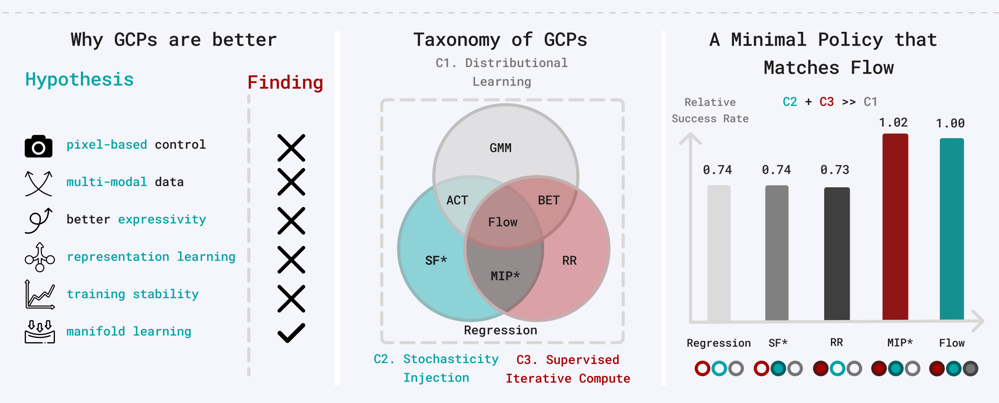

- The surprising effectiveness of representation learning for visual imitation

  - VINN 如何定义流形距离 了解在实验中怎么量化一个动作是否在流形上（利用 KNN）。
- The pitfalls of imitation learning when actions are continuous

  - 机器人领域的流形与误差累积
- Interpreting and improving diffusion models from an optimization perspective
- Shallow diffusion networks provably learn hidden low-dimensional structure

  - 这篇文献提供了数学理论支持，证明了如果数据支撑在一个低维流形上，扩散模型（生成式模型）倾向于学习将点投影到该流形上。这是“流形依附”假说的理论基石

我的评分：⭐⭐⭐⭐

‍

## [StarVLA](https://github.com/starVLA/starVLA)

从InternVLA-M1 fork过来，更真实地说是Start VLA（Star暗示你点个star支持一下），自由地切换VLM/action head/仿真环境，像搭乐高积木一样实现VLA架构。

但是好像暂时只支持串行，不支持异步推理或者谐波推理，虽然还是得自己开发一些内容，却已经比从0开发会快很多，感谢项目维护与开源者，开源就是做慈善。

‍

‍

## [Spirit v1.5](https://www.spirit-ai.com/en/blog/spirit-v1-5)

Tasks: 从执行长程任务到折叠衣物。

Question: 高度清洗或所谓的“干净”数据集（如OXE）上训练。

Method: “多样化采集（Diverse Collection）”——一种开放式、目标驱动的数据采集范式，倡导向非结构化数据转型。强调**数据采集策略（Data Strategy）** 才是模型能力的决定性因素（Data-Centric AI）,即包含 “如何从错误中恢复（Recovery Behavior）”。

其实包含从错误中恢复的数据也是PLD提出的内容，只是实现方法是ResRL+Probing Rollout。

​`输入(开放式目标)`​ -\> **​`采集(即兴发挥 + 包含失败/重试/任务切换)`​** ​ -\> `无清洗/轻清洗`​ -\> `VLA预训练`​ -\> **​`鲁棒的通用策略`​**

|**维度**|**RoboTwin / LIBERO (仿真合成)**|**Spirit-v1.5 (真实采集)**|
| --| ----------------------------| ------------------------------------|
|**硬件成本**|**接近 0**(一台 GPU 服务器即可)|**高昂**(机械臂、夹爪、相机、实体场景搭建)|
|**人力成本**|**0**(写好脚本，睡觉时它自己跑)|**中等**(依然需要人手持遥控器操作)|
|**物理风险**|**0**(撞坏了重置即可)|**有**(可能损坏电机或夹具)|
|**数据规模**|**无限**(理论上可生成无穷多)|**有限**(受限于物理时间)|

- **Diversity vs. Quality:**  Volume相同，仅改变数据来源（脚本化 vs. 自由采集）。自由采集的模型在 Validation Error 上显著更低。
- **Scaling Law:**  随着多样化数据量的增加，在新任务上的 Zero-shot/Few-shot 性能持续提升。

感觉唯一的insight就是数据中应该包含“如何从错误中恢复”的样本，指数级地扩大状态空间覆盖率，但是数据全是遥操采的，不过代码和权重数据全部开源了。其实更期待有没有不需要人遥操就在仿真中生成大量“从错误中恢复”的样本的方法提出来，其实是有的，但都是目前方法各有各的局限性。

我的评分：⭐⭐

‍

‍

## [UMI](https://umi-gripper.github.io/)

UMI 的运动轨迹不是算出来的（FK），而是“看”/“测”出来的（IMU/SLAM -> <u>Vision（提供地图）+ IMU（提供绝对尺度和抗运动模糊）</u>）。这正是 UMI 能 **Cross-Embodiment（跨形态）**  的根本原因。UMI 的机械设计（那两个橙色的夹爪）确实是为了视觉统一，但更核心的其实是**软硬件协同的算法**。如果没有后端的 **SLAM 算法**、**延迟匹配（Latency Matching）**  和 **鱼眼视觉处理**，光有这个壳子是跑不通“野外”数据的。

However,大家都去魔改 UMI，导致数据不通用。不过还是合久必分，分久必合，分就是各个小课题组和公司对UMI的局限性进行暴力搜索的过程，这个过程产生各种魔改工作大概都可以中顶刊会议但是很难说有历史性意义，直到UMI2.0或者下一个颠覆创新性工作出现。

### UMI为什么重要

pi0.5的demo视频开场的时候，团队从面包车上将机器人卸下来运到门口，打开后备箱，然后又要人工组装机器人。这样的情景发生在真机数采团队的每一天。传统遥操作要求封闭空间，1：1复刻真实场景，之后遥操作员通过外骨骼、主从臂or VR眼镜的方式去操纵机械臂采集数据。UMI可以做到任何时间任何地点采数据，部署也几分钟搞定。UMI在算法难度和成本上做到了巧妙的平衡（对比传统遥操作和纯视频数据）

|**维度**|**原版 (Original)**|**学界 (Academia)**|**产业界 (Industry)**|
| ------------------------------------| --------------| -------------------------------------------------------------------------------------------------------------------------| --------------------------------------------------------------------------------------------------------------|
|**优化末端**<br />(End-Effector)|平行夹爪|**DexUMI**(灵巧手外骨骼)<br />**Dexwild**(数据手套)<br />**RDT2**(连杆夹爪)|**Sunday Robotics**(技能手套)<br />**Generalist AI**(指套)<br />**鹿明 FastUMI Pro**(可拆卸)<br />**Genrobot Das**(可拆卸)|
|**加入触觉/力觉**<br />(Haptics/Force)|无|**maniforce**(F/T 传感器)<br />**ViTaMln**(Fin Ray 夹爪)<br />**tactileVLA**(视觉语言和触觉的VLA框架)<br />**FARM**(GelSight Mini 传感器)<br />**DexUMI**<br />**Touch in the wild**|**Genrobot Das**(触觉传感器)|
|**优化定位**<br />(Positioning)|ORBSLAM3 VIO|**成熟的VSLAM+IMU解决方案:** <br />exUMI / activeUMI / UMI on air / UMI on leg<br />**红外动捕:** RDT2<br />**其他:** ManipForce (Azure Kinect & 3D ArUco), exUMI (磁旋转编码器测量开口)|**成熟的VSLAM+IMU解决方案:** <br />鹿明 FastUMI Pro, Genrobot Das, Sunday Robotics, Generalist AI<br />**红外动捕:** 松灵 Pika<br />**其他:** 鹿明 FastUMI Pro (加入顶部鱼眼)|
|**增加视角**<br />(Perspective)|腕部相机|**MV-UMI**(第三视角)<br />**ActiveUMI/exUMI**(第一视角)|**Sunday Robotics**(第一视角)|
|**模型训练/泛化性**<br />(Model Training/ Generalization)|1400份演示|**RDT2**(1w+采集数据)<br />**Data scaling laws**|**Sunday robotics**(ACT-1)<br />**Generalist AI**(Gen-0)|

Sunday Robotics方案近似exUMI。针对视角局限问题ActiveUMI,exUMI在演示者头部胸前补充一个第一视角摄像头，提供更广阔更稳定的场景上下文，MVUMI设置固定第三视角。额外视角成为了无法收敛的学术争议点。

Sunday Robotics通过Skill Transform算法抹平了差异：

1. Kinematic Transform： 通过逆运动学（IK）和重定向算法（Pose 映射到机器人的 URDF 模型上），将**手套（Glove）记录的人类手部/手臂轨迹，映射为机器人**合法的关节轨迹。
2. Visual Transform： 通过图形学渲染（利用机器人的 Digital Twin）或者生成式 AI（如 In-painting），将视频中出现的 **“人类手臂”** 抹除或替换成 **“机器人手臂”** 。

上限高但是技术难度极大。

一个并行的趋势是，从“强行让某种硬件去适配机器人”，转向“让人舒服地采集数据，剩下的交给算法（Co-design）”。

- **Co-design （软硬协同设计）思路**：

  1. **Day 1** 就想好：我要采集什么样的数据？（比如我要采集人捏软草莓的数据）。
  2. 为了这个数据，我需要什么样的机器人手（本体）？又需要什么样的手套（数采）？
  3. **Result**：Sunday Robotics 和 Generalist AI 做的不仅仅是手套，他们往往也在定义对应的机器人执行端，或者定义特定的**Action Space（动作空间）** ，确保采集的数据能被机器人“消化”。

还有一些Insight整理如下：

1. 硬件进化

    1. 算法补硬件是Scaling的必经之路。
    2. 模块化指尖将成为统一的“USB接口”，只要指尖硬件相同，无论是人手猫爪灵巧手还是二指夹爪戴着这个模块化指尖，都能采数据
2. 数据质量的噩梦

    1. 采集时实时检查（Real-time QC）。如果动作太快导致 SLAM 丢了，或者手伸到了机器人去不了的地方（奇异点），设备应该立刻报警重录。但是采集设备算力弱，无线传输带宽低。问题如果堆积到后处理阶段，可能采集一堆数据全部报废。
    2. 请800个外包人员，无法避免数据重复个人摸鱼的行为，**特斯拉的影子模式 (Shadow Mode)**  之所以成功，是因为有车上的算力做实时筛选。而机器人采集目前还缺乏这种**端侧筛选能力**。
3. The Data-Model Closed Loop

    1. 采集 -\> 训练 -\> **发现模型哪里不行 (Corner Case Discovery)**  -\> **针对性采集** -\> 再次训练。
    2. Sunday Robotics 提出的 **48 小时迭代周期** 就是这个逻辑：所有的采集任务都是由模型的短板（Weakness）定义的，而不是盲目采集。
    3. “解决问题并迭代数采方式的判断力，是一个 Senior PhD 经过大量模型训练经验才拥有的能力。”这解释了为什么单纯的数据公司做不好机器人数据。
    4. 谁能把Pipeline搭出来谁就能赢
4. 经济账

    1. 对齐 Generalist AI 的 GEN-0 模型规模（约 27 万小时数据）。
    2. 800-900 名采集员，连续工作 3 个月。
    3. **4,000 - 5,000 万人民币**。
    4. 这个数字对于课题组实验室是天价，但对于头部科技公司（Tesla, Google, 甚至国内的理想/华为）来说，**完全是可接受的研发成本**。
    5. 通用机器人数据的“原子弹”工程，在资金上已经没有障碍了，障碍在于管理和算法。
5. 缺少力和触觉的数据

    1. 低成本
    2. 解决多模态对齐问题

‍

Simply，一个工作可以延伸出这么多变体和讨论，这个工作的Original Version的意义是无法否认的。

我的评分：⭐⭐⭐⭐⭐

‍

‍

‍

## [PEAforl](https://peafowlvla.github.io/)

实验是双臂机器人，Jointly trained across all tasks，每个任务50条数据。

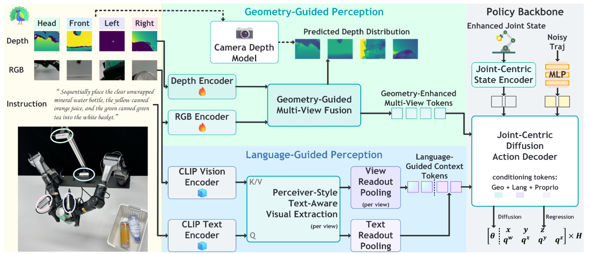

‍

为了有一个好的多视角3D表征，在架构设计上引入了3D视觉的Inductive bias（每个token预测depth，经过坐标系转化后聚合，完全就是传统 CV 中 Multi-View Stereo (MVS) 或 Point Cloud Processing的思路，相关工作可以看一眼MVSNet以及NeRF），以及处理Language Guide使用了Perceiver IO Style的Language-Guided Multi-View Readout（Cross-Attention as Retrieval）。sim2real为了获得深度信息，用一个强大的预训练**Camera Depth Model (CDM)**  作为“老师”来监督网络的深度预测头，即做蒸馏。

‍

思路就是有一个足够强大的上游能把关键操作信息标记出来给下游Action Expert用就可以做多任务联合训练。如果在此基础上再加多任务后训练会更fancy，不然本质就是创新一下架构然后模仿学习而已。

我的评分：⭐⭐

‍

## [YOTO](https://hnuzhy.github.io/projects/YOTO/) && [YOTO++](https://hnuzhy.github.io/projects/YOTOPlus/)

### YOTO

被RSS2025接受

这篇文章的标题很明显是在致敬YOLO（You Only Look Once），实时性很高的目标检测算法，而这个工作的卖点是极高样本效率通过一次人类视频演示来实现策略泛化。考虑当前仿真生成数据和UMI/遥操作生成数据虽然比较麻烦但是搞个课题项目画点时间收集50来个样本的时间成本是完全可以接受，只要一个视频去学习策略的想法并不是那么的attracting。因为我关系的具身问题是多任务联合训练泛化，快速的获取单一技能如果无法scale up意义不大。

ACT标配是50条数据，使用 2D 图像和 Transformer。

​`3D DP = PointNet / PointNet++ + 1D CNN U-Net Diffusion/Transformer`

​`BiDP = SIM(3)-Equivariant PointNet++ + 1D CNN U-Net Diffusion`

针对异步双臂任务会用Mask减少关键帧的数量。

```markdown
✅ 任务 A（纯异步）： 先左手拿瓶子，后右手拧盖子。（YOTO OK）
✅ 任务 B（纯同步）： 双手一起抬起一个大箱子。（YOTO OK）
❌ 任务 C（混合）： 先左手拿瓶子（异步），然后双手一起用力把瓶子掰弯（同步），最后右手把盖子扔掉（异步）。
```

只能拟合单任务是局限性之一，然后再是人工先验和干预还是太多了，首先是任务是左右手同步还是异步的，然后是关键帧提取算法有局限摆脱不了人工干预。

执行上采用预测关键帧6DoF位姿 --> IK --> RRT-Planning --> Execution ，所以BiDP的决策频率较低。

因为基于关键帧，所以方便了中间的数据增强方案：1. Auto-Rollout Verification 2. 被操作的物体的点云级几何增强。

基于关键帧很明显暂时无法做精细操作任务。

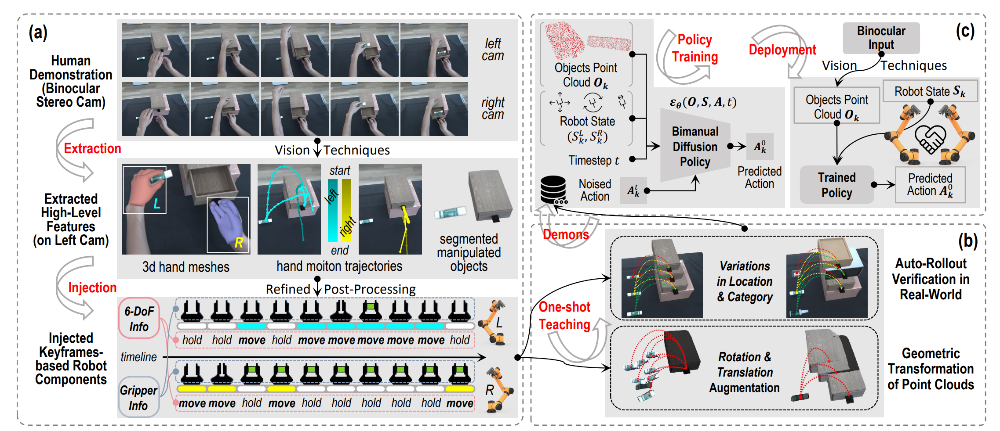

### YOTO++

加了视觉对准 (Visual Alignment for Pre-Grasping)。

初衷是发现一旦物体被稳固抓取，物体与夹爪的相对位姿就固定了，后续动作（如倒水、移动）对视觉反馈的需求较低。

用SAM2+图像矩 (Image Moments)的方法计算抓取位姿。“抓取前闭环 + 抓取后开环”的混合控制策略 (Hybrid Control)。

还是在拟合单任务，感觉并无本质改变。

我的评分：⭐⭐

‍

‍

‍

## [SkillDiffuser](https://zhuanlan.zhihu.com/p/685754244)

上层做Skill Abstraction(生成sub-goals)

下层做Condition Diffusion(生成动作)

使用Vector Quantization(VQ)来离散化技能空间

VQ用于“Skill Abstraction”是一个经典的bottleneck设计

也算早期2System工作，Language想要作为条件注入U-Net需要先进行一次抽象，Not New Idea。值的称赞的点是中间的Skill Set是可以解释的。

> 先将模棱两可的指令分解为可学习和可复用的子技能子目标，然后使用可迁移的以这些子技能为条件的扩散策略进行规划，更好地使控制策略能够遵循复合语义的逻辑顺序，符合任务结构，并在不同任务之间迁移适用。

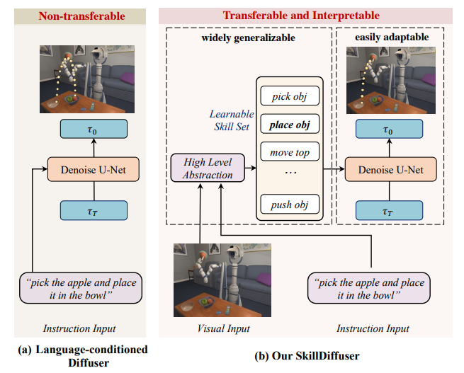

我的评分：⭐⭐

‍

## [Decision Transformer](https://sites.google.com/berkeley.edu/decision-transformer)

- **轨迹表示 (Trajectory Representation)：**   
  将传统的 $(s, a, r)$ 序列重新排列。最关键的设计是引入 **Returns-to-Go (**​**$\hat{R}_t$**​ **)** ，即从当前时刻 $t$ 到结束的累积回报。  
  输入序列格式为：

  $$
  \tau = (\hat{R}_1, s_1, a_1, \hat{R}_2, s_2, a_2, \dots, \hat{R}_T, s_T, a_T)
  $$
- **Embedding (嵌入层)：**

  - 将 $\hat{R}_t$（回报）、$s_t$（状态）、$a_t$（动作）分别通过线性层（或 CNN 处理图像状态）映射到嵌入空间。
  - **关键点：**  为每个**时间步（timestep）** 学习一个嵌入，而不是为每个 token。这意味着 $\hat{R}_t, s_t, a_t$ 共享同一个位置编码 。
- **GPT Core (因果 Transformer)：** 使用 GPT 架构处理最近的 $K$ 个时间步（Context Length）。使用因果掩码（Causal Mask）确保模型只能看到过去的信息 。
- **输出与预测 (Prediction)：**   
  模型输出对应的动作嵌入，通过线性解码器预测真实的动作 $a_t$。

  - **训练时：**  监督学习（Cross-Entropy 或 MSE Loss）。
  - **测试/推理时：**  人为设定一个**目标回报（Target Return）** （例如，专家水平的分数），作为初始的 $\hat{R}_1$ 输入。模型根据这个目标生成动作。执行动作后，根据环境反馈的实际奖励 $r$，更新下一个时刻的目标回报 $\hat{R}_{t+1} = \hat{R}_t - r$ 。

感觉强化学习的概念彻底没有了把奖励视作概率建模，虽然后有Gato: A Generalist Agent。但是我感觉这个方法不是很promising至少对于泛化的具身任务而言。

但是我认为最重要的是预测Return to Go这个思想（这个在$\pi_{0.6}^*$里面似乎也有体现），以及利用 Transformer 的自注意力机制（Self-Attention），模型可以直接将当前的动作与未来的回报关联起来，进行直接的信用分配（Credit Assignment）。

我的评分：⭐⭐

‍

## [LingBot-VA](https://technology.robbyant.com/lingbot-va)

Causal World Modeling for Robot Control

核心架构是中间的非对称双流MoT，一条Video Stream基于 Wan2.2-5B，一条Action Stream轻量Transformer，两个流cross_attention和self_attention交替堆叠，通过cross attention信息交换，最后两个flow matching head生成视频和action（需要视频推理结果做为条件），针对视频生成模型，训练时引入 **Noisy History Augmentation**，推理时视频生成只需去噪到 $s=0.5$ 即可用于动作预测，无需生成完美像素，大幅提速。

在Long-Horizon任务中表现的出色，持续的因果记忆（KV-cache）和对环境反馈的实时重对齐能力（异步推理）。

双MoT是构建因果关系的核心，闭环推演和异步推理允许一边做动作一边根据现实世界的反馈实时修正偏差，减少长时漂移。

具体技术细节如Teacher Forcing Attention Mask，以及一些具体的架构算法数据训练增强都是很有参考意义的，代码开源了没有秘密可以直接学习。

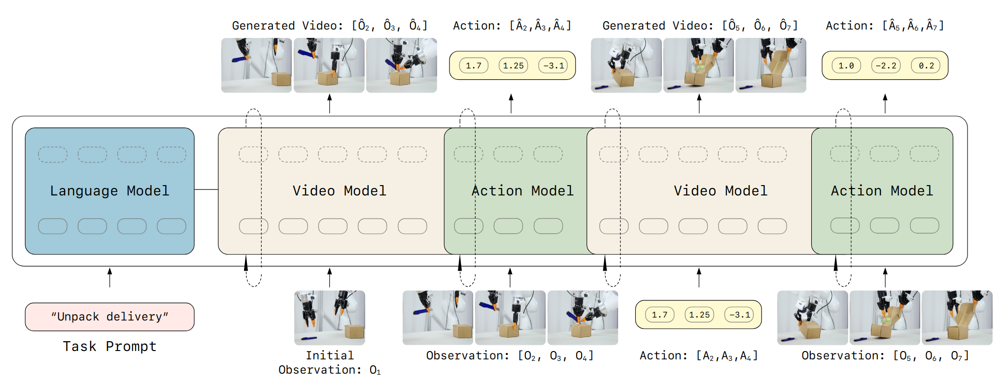

其实一个统一的自回归式的action2video/video2action/va2va模型已经被先前工作验证(如Seer[from Tian Yang])是理想的结合世界模型的Foundation Model，蚂蚁手很快第一个把这个东西做出来了，Video Action模型这一块很快要卷到飞起来，当然也会有很多工作内容同质化的风险，一方面要努力，一方面要保持冷静的思考。

我的评分：⭐⭐⭐

‍

## Being-H0.5

传统的方法训练一个backbone然后针对不同的机器人本体训练不同的action head。Being-H0.5受“自然语言处理中多语言模型共享语义空间”的启发，定制一条特别长的向量（高维的，定长的全集向量）称之为共享物理语义空间，这个向量切分为不同的**语义子空间**，其设计如下：

- ​**槽位 A（末端位姿 EEF）** ：$x, y, z$ 位移 + 旋转（Axis-Angle）。
- ​**槽位 B（细粒度操作）** ：手指关节角度、夹爪开合度。
- ​**槽位 C（移动底盘）** ：线速度、角速度等。
- **槽位 D（机械臂关节）** ：7个或更多关节的角度。

处理好映射关系实现共享：

> - **人手（Human Hand）** ：我们将人手看作一个“拥有高自由度的末端执行器”。通过 MANO 模型提取的人手**手腕（Wrist）的 6DoF 位姿，被直接映射到 槽位 A（EEF） 中；人手的手指关节**被映射到 **槽位 B（细粒度操作）**  中 。
> - **机械臂（Robot Arm）** ：不管是 Franka 还是 UR5，它们的**末端执行器（EEF）** 动作也同样映射到 **槽位 A**。
> - **灵巧手/夹爪**：灵巧手的关节映射到 **槽位 B**；如果是简单的二指夹爪，它只占用 **槽位 B** 中的一小部分（开合），其余位置填零。
>
> 在模型的潜意识里， **“人手向前伸 10 厘米”和“机械臂向前伸 10 厘米”激活的是同一个神经元区域（槽位 A）** 。这就是物理语义的物理层统一 。

然后针对位置，旋转和关节都没有归一化，使用米，旋转量和弧度的绝对值，因为如果归一化至[0,1]，一个小机器人的0.1可能0.1m，一个大机器人的0.1可能0.5m，这很明显是不合理的。

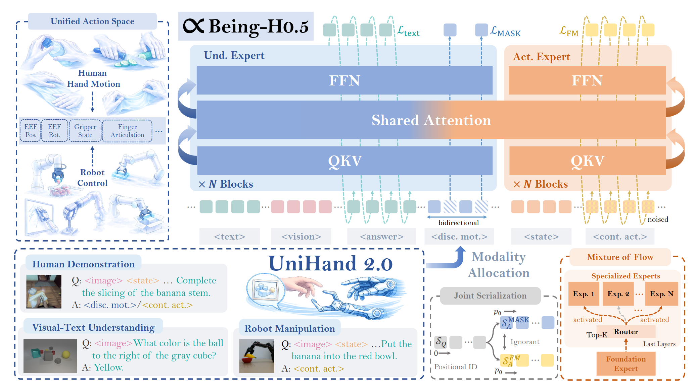

用MoT形成Understand Expert和Action Expert，Action Expert采用MoF来让Foundation Expert学习统一的物理尺度，不同的Expert Head控制不同的形体（高层语义可迁移，但底层控制需微调）。

还有两个值得注意的技巧：

|**组件**|**解决什么痛点？**|**核心手段**|
| --| --------------------| -----------------------------------------------------------------------------------------------------------------------------------------------------------------------------------------------------------------------------------------------------------------------------------------------------------------------------------------|
|**MPG(Manifold-Preserving Gating)**|**视觉不可靠**：OOD导致动作抽搐|**门控机制**：视觉置信度低时，切断视觉修正，通过先验动作“滑行”。|
|**UAC(Universal Async Chunking)**|**时间对不上**：推理慢、机器人快|**前缀锁定**：推理时先“预留”出推理耗时对应的步数，只预测未来的动作。（比如推理出16个action，但是推理耗时4个action的时间，则推理出的前4个action丢弃，后12个action放入cache待执行）。当然推理时间是不变的但是不同机器人形体的控制频率是变的，为了实现这个为每个机器人设定一个专属参数 $d$。比如人形机器人 $d=5$（意味着推理期间它会走掉5步），慢速机械臂 $d=1$。|

我的评分：⭐⭐⭐

‍

## [RDT2](https://rdt-robotics.github.io/rdt2/)

能打乒乓球的VLA Foundation Model。<u>4个泛化3阶段训练2个核心组件1w+小时数据</u>。

泛化：场景，本体，指令，物体。

训练：

1. Residual VQ+VLM训练: 在深度学习时代，**SoundStream (2021)**  和 **EnCodec (2022)**  提出了残差量化（分别是音频领域和图像生成领域，最早可以追溯到Residual Coding,意想不到的交叉领域总是可以诞生出好的方法），RDT2首次将残差量化应用于机器人动作表征，我个人看了一下RVQ的公式有一种神似泰勒展开公式的感觉，就是每一项相比真值弥补一点点误差。在VLA中，如何保留VLM的先验语义知识一直是我感兴趣的问题，NoTVLA通过稀疏点预测的形式减少VLM的负担从而最大程序保留VLM的能力，RDT2用RVQ将动作离散化后VLM继续在自己擅长的离散空间做预测，保留VLM的先验语义知识并加速了收敛，并且不影响下游的精细操作能力。
2. 二阶段VLM冻结训flow matching。
3. 三阶段通过蒸馏将flow match的多步Diffusion模型学一个One-Step Generator,推理速度23Hz,所以能打乒乓球。

所以核心创新点就是把RVQ这个用于音频图像领域的宝藏量化方法应用于动作离散化，搞具身的人也能整天只读具身Paper各种领域方法都得看才能做出充满惊喜的工作。（还有它们自己的UMI，数据可以拿来用）

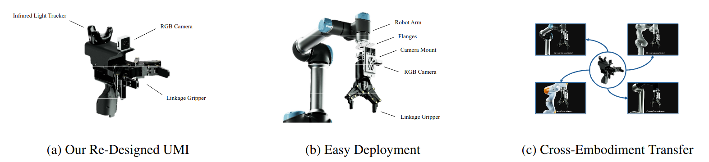

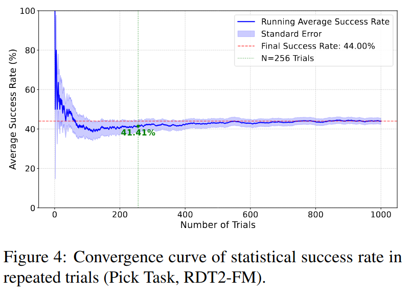

做了1k个zero-shot pick实验来统计平均成功率很诚实的数据。

我的评分：⭐⭐⭐⭐

‍

## Agentic RL 技术分享

[Gate to Blog](https://zhuanlan.zhihu.com/p/1985054130469888615)

码一下

‍

## [Data Scaling Laws in Imitation Learning for Robotic Manipulation](https://data-scaling-laws.github.io/)

> 策略的泛化性能与环境和物体的数量大致呈**幂律（power-law）关系** 。**环境和物体的多样性远比演示的绝对数量重要** ；一旦每个环境或物体的演示数量达到一定阈值（50条数据），额外的演示效果甚微 。

单任务鲁棒性的scaling law，可以对没有见过的场景zero-shot，并没有研究多任务的scaling law。

数据采集使用UMI（SLAM端会使用过滤无效数据），视觉用GroPo摄像头+DINOv2 ViT-L/14，输入机器人本体感知，动作空间是ee_pose，策略DP，发现**扩大视觉编码器**（ViT-S -\> ViT-L）能带来性能提升，但**扩大动作生成的 U-Net** 并没有带来明显收益，甚至可能下降 。DINOv2全量微调效果最好，DINO冻结会导致成功率为0,from scrath 和 LoRA次优。

- 可能是少量任务的数据分布的丰富性没有到需要scaling架构的地步，也可能是U-Net是一个不适合Scaling的架构。
- 好的视觉表征被任务有丰富的几何信息特征对于Robot Spatial Reasoning很重要，所以提升了视觉表现。

对于单任务跨情景zero的启发就是视觉表征很重要，同时设定了单一场景50条数据的明确阈值，ReconVLA也就是学习了一个好的视觉表征，表征的学习is really important。当然结论并不让人感到意外，数据和代码都是开源的，多任务的scaling law并给出一些详细的指标会令人更感兴趣，比如Gen-0破碎了小模型泛化多任务的幻想，指明了promising的方向但是没有精确的数值结论引导。

我的评分：⭐⭐⭐

‍

## [X-VLA](https://thu-air-dream.github.io/X-VLA/)

这个工作是 Cross-Embodiment Learning + Embodied Foundation Models。相比以下这些方案：

|路线|核心问题|
| ----------------| ---------------------------|
|多 action head|只在**输出端**处理异构性|
|MoE / Adapter|**训练不稳定、路由塌缩**|
|语言描述硬件|不可扩展、依赖人工 prompt|
|全量微调|成本极高、难以规模化|

可能现在拿MoE来弄具身论文的工作还挺有一些，连许华哲老师都搞了一个DP-MoE，但是我现在在具身论文里面看到MoE总感觉这个工作显的很没有Insight，这个仍哟争议是我自己的看法，我之后再把我对MoE的看法整理一下。关于Adapter[TODO]  
X-VLA的idea是把“机器人具身差异”当成一种“可学习的 Prompt”，而不是结构负担。Soft Prompt 参数量仅 **0.04%**  却简洁可规模化，我扫了一眼开源代码确实不复杂就是加了Soft Prompt之后把简洁的架构搭建起来，同时注意动作空间设计的一些细节，能证明Soft Prompt这个范式可以很好地辅助跨本体泛化就很好了，简单有效 is good。

我的评分：⭐⭐⭐

‍

## [RoboPoint](https://robo-point.github.io/)

CoRL2024 被审稿人用来反驳GAE 真正的Zero Shot 全面开源

‍

‍

## [HAMSTER](https://hamster-robot.github.io/)

偏解耦式的双系统VLA中间都需要上游VLM模型输出一个中间层的guidance信息来引导下游Action Head or Action Expert，VLM或者人手会One-Shot画一个2D轨迹，然后引导下游策略。相比RT-Trajectory(使用闭源的VLM并且直接zero-shot画轨迹)，这个工作对开源VLM进行了微调。作者这样的语言来美化微调这件事情：

> 从海量杂乱的域外数据（仿真、视频）中学习物理常识和规划，从而实现真正的 Sim-to-Real 语义迁移。

他们证明选择2D轨迹是一个“具身无关性”的中间表征，利用了RLBench，互联网视频和Bridge/DROID，取得泛化性是很自然的结果（新物体、新背景、新光照、甚至<u>新摄像机视角</u>）。

由于2D轨迹这个中间表征的能力有限，所以下游选择了3D-aware 策略，如 **RVT-2** 或 **3D Diffuser Actor (3D-DA)**  ，要求输入stack了轨迹的2D观测的同时，还要输入PCD/Depth，以及Priop，最后3D策略的行为结果自然会更精确些。

最后实验的Baseline也有RVT-2和3D-DA，了解了这个方法后学习这个两个baseline的意义不大。

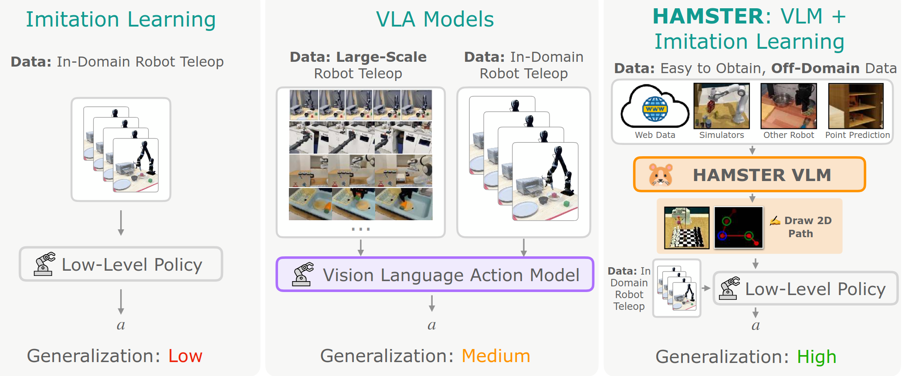

我的评分：⭐⭐

‍

## Distral(too Old)

‍

‍

## [PLD](https://www.wenlixiao.com/self-improve-VLA-PLD)

读了很多VLA_RL的论文，PLD很好，可惜PLD的代码没有开源，但是不妨碍我精读并复现这个论文有关问题定义指出两点：

1. 各种VLA模型尽管架构各异，但是本质上都是在收集好的数据上做SFT，如OpenVLA --> AR Loss，DP DiT --> Diffusion Loss，flow matching --> $L_2$ flow-matching Loss。
2. 设定稀疏的 0/1 奖励，所有任务统一奖励函数。

Method分三个阶段，第一阶段各自单任务残差RL，第二阶段通过Probe的方式Roll_out出“从错误中纠正”的数据，第三阶段利用第二阶段Roll_Out的数据进行蒸馏。

Benchmark选择了LIBERO和SimplerEnv，其中LIBERO由于一般VLA表现很好所以提升效果不明显，SimplerEnv的数据如下：

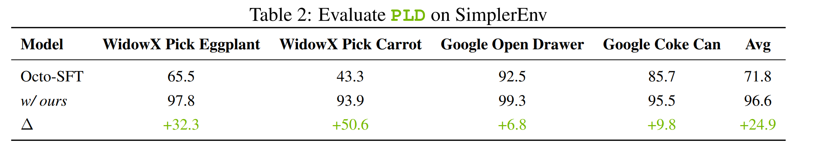

无论Base Policy是 $\pi_0$，OpenVLA和Octo，整个流程跑下来，PLD可以适用于任何VLA。

首先第二阶段的Roll Out符合Spirit v1.5所说的一个观点即“需要从错误中修复的数据”，但是相比人为制造从错误中修复数据这种方式，PLD很明显更符合Base Policy所需要的数据，设计上有一种Self-Improving的概念，而且整个流程减少很多人为干扰。

而让第二阶段这个过程成为可能的正是第一阶段的残差强化学习，如果第一阶段是任何其他的非残差强化学习算法，请问第二阶段的Probing Roll Out数据的流程还能实现吗？比如我有两个策略文件，一个是SFT后的base_policy，一个是在单任务RL后的improved_policy，让base_policy先执行前40%的任务，然后让improved_policy接管任务。

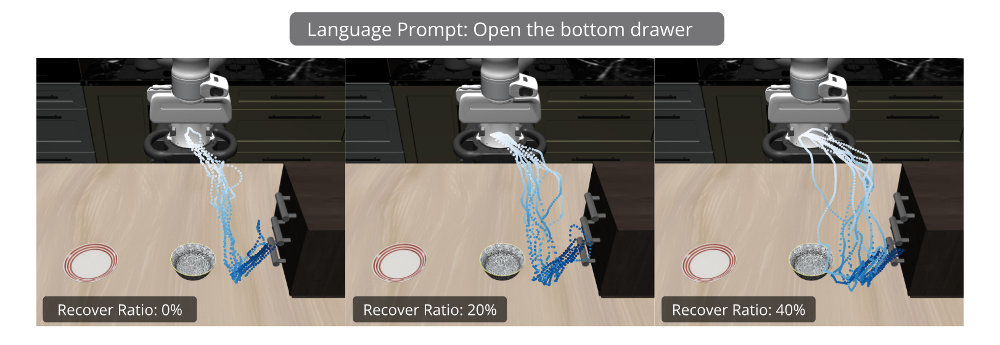

尽管没有实验验证，但是大概率是可以的，但是最后效果应该没有ResRL效果好，而且对算力要求会比ResRL更高。比如你在4090上尝试用RL算法全量微调pi0大概会直接爆显存，但是ResRL冻结Base Policy只训练Encoder + Gaussian MLP Policy + Ensemble 2/10 Critic,除了仿真环境所占用的显存外训练所占用的显存大概只需要 0.8 GB 左右，而且可以很快将Base Policy的成功率提升至99%。

为什么Residual RL可以这么好？在一般RL算法中，都会用KL约束限制或者像PPO那样的clip目标函数来让新策略不会相比旧策略更新太多，从而实现策略的稳定更新，以免策略更新幅度太大导致崩溃。ResRL将一个已经学好的Base Policy冻结住，通过Sergey Levine提出的算法去训练一个残差策略，训练速度快占用小且样本效率极高，由于残差策略的思想也不需要用任何公式去约束新旧策略的差距。如果过往的Self Improving RL工作都本质上是在用梯度更新不断学习更好策略与当前策略的残差，为什么不直接训练一个残差策略？是否存在通用的泛化的残差策略？这是没有被验证但是我觉得很有意义去研究的事情。因为残差策略在控制论上很符合不断消除误差直到形成稳态的这个概念美学。

直接多任务强化学习是一件很难的事情，对一个Base Policy如果直接接受来自多个env task多个Agent传来的梯度，一个最常说的问题就是梯度矛盾，这个任务的梯度guidance和另一个任务的梯度guidance总体方向不一样导致策略反复横跳无法稳定的更新。当然也有这方面的多任务强化学习工作，但是流程上不如先ResRL然后蒸馏简单优雅，总之多任务强化学习的目前的坑太多了，尤其是在真机环境下。

### RLPD

RLPD的原论文实验做的很简单，创新点总结如下：

1. 50% Online buffer 50% Offline buffer 混合采样。
2. Layer Normalization + Ensemble Critic 让Critic提供稳定的Q值
3. 通过提高UTD ratio提高成功率，random ensemble distillation+random shift augmentations（即10个critic里面随机选2个并且取min）避免模型在vision based high UTD-ratio TD-Learning的场景下性能弱化或者拟合高频噪声。

### [PA-RL](https://policyagnosticrl.github.io/)

策略无关的强化学习方法，这个是PLD的前期工作，策略无关也是PLD的方法的核心之一。

Pipeline是三个步骤反复循环：

1. 基础策略采样，从当前的策略 $\pi_\phi$ 中采样 $k$ 个候选动作 $\{a_0, a_1, ..., a_k\}$。（如果输出是概率分布采样很方便，如果输出是确定的可以微微扰动先验，或者加小范围Gauss Noise）
2. 动作优化（打伪标签）

    1. **全局优化 (Global)** : 使用 Critic网络 $Q_\theta(s, a)$ 给这 $k$ 个动作打分，保留分数最高的 $m$ 个。
    2. **局部优化 (Local)** : 对这 $m$ 个动作，固定网络参数，直接对动作 $a$ 进行梯度上升更新：$a \leftarrow a + \alpha \nabla_a Q_\theta(s, a)$。
3. 策略蒸馏

    1. 针对伪标签进行SFT。
    2. SFT后的策略再与环境交互，用Cal-QL或者IQL算法更新Critic。

整体流程Actor和Critic的更新是比较解耦的，即Actor的更新频率会很慢但是每一次都会充分利用候选动作完成更新所以效率不会太低。缺点就是动作采样推理成本大。还有一个问题是Critic的泛化能力不如Policy，Guidance并非精确所以整个学习过程进步空间很大。做个Generalized Critic是一个很重要的课题，但是我也不知道该怎么做。

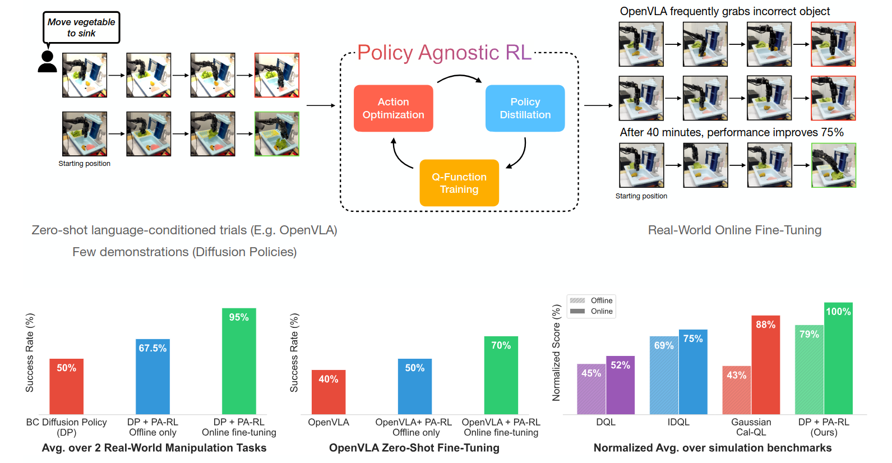

### [Cal-QL](https://nakamotoo.github.io/Cal-QL/)

全称 Calibrated Q-Learning,校准Q学习。一个在离线数据上训练得很好的策略，刚开始与环境交互时，性能会突然大幅下降，需要后期浪费大量online样本才能恢复 。

有关理解如CQL offline RL算法在微调初期性能骤降的原因：

- Ground Truth: 离线好动作A真实价值100分，在线次优动作B真实价值60分。
- Offline Phase: CQL算法学到的Q值显著低于真实回报，所以离线好动作Q值可能是40分，但是在线次优动作从来没有在数据集中出现过，所以大概是10分，这个时候依然在学习好动作，性能尚可。
- Online Phase: 机器人在真实环境中交互，尝试了次优动作B，由于立即收到了真实环境的真实Return，所以在学习中迅速将动作的价值标记为60分，由于正则项的压制且所以动作A依然在40分左右，直到训练后期探索到A附近，才会给A高分，可是中途浪费了太多online时间。

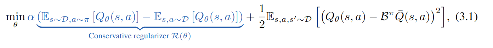

上述过程之所以会产生是因为CQL的Loss Function由两个部分组成（正则化项 + TD Loss），前面的正则化项会无情地打压所有所有动作，在数据集中存在的越久就被打压地越厉害。

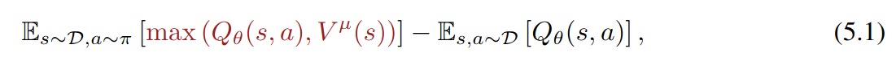

Cal-QL修改了一下正则化项，让被压低的分数再低也不能低于蒙特卡洛回报本身，即动作A的Value再低强制不能低于100，是的就加了一个$max(*,*)$，然后就work了。

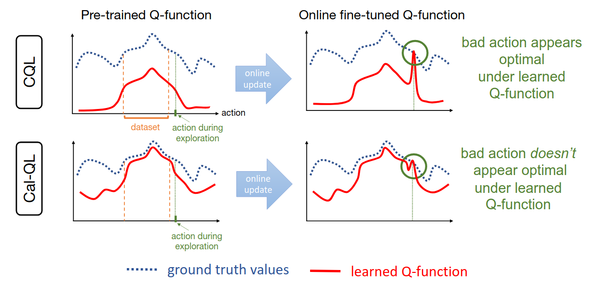

实验部分Sergey Levine在自家的benchmark上做了点快速实验，没啥好看的。Cal-QL应该是可以缩减online tuning的时间，认真地研究思考然后做出简单的改动，也是PLD选择的算法。

‍

### [WSRL](https://zhouzypaul.github.io/wsrl/)

online阶段丢掉offline buffer，让base policy自己rollout一些数据用来warm up buffer，offline阶段Cal-QL，online阶段SAC+LN+Ensemble。

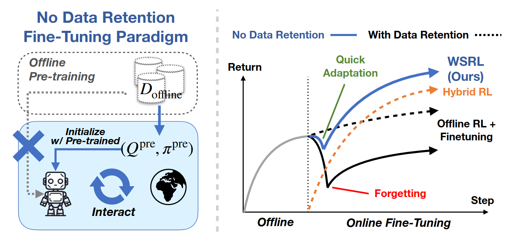

‍


‍
