## $\pi$

### $\pi_0$

pi0即MoE-like Architecture+flow matching。flow matching比较复杂单独作为理论学。

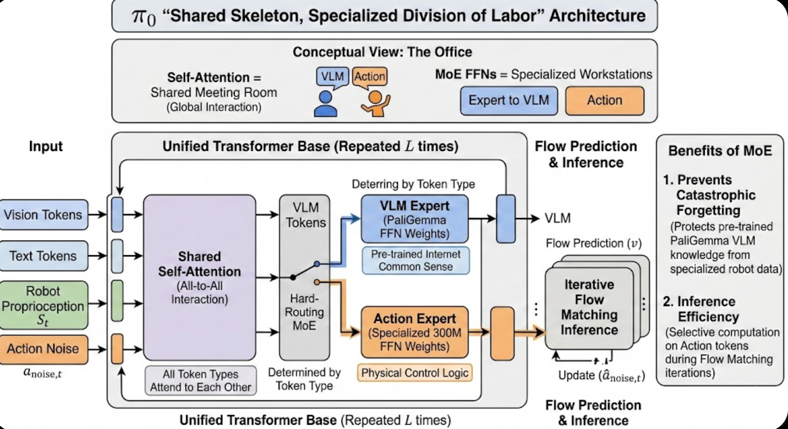

引用 [open-pi-zero](https://github.com/allenzren/open-pi-zero) 的图示，讲img+Text称作State快，本体感知+Action称作Action块，块内采用双向注意力（图像 token 应该能看到文本指令来确定视觉重点，动作决策应该能看到本体感知），块与块之间采用因果注意力（输出动作时可以看到State块，但是不需要输出任何img text，所以img text不看action），<u>pi0只做actions预测，这是与pi05最大的差别</u>。

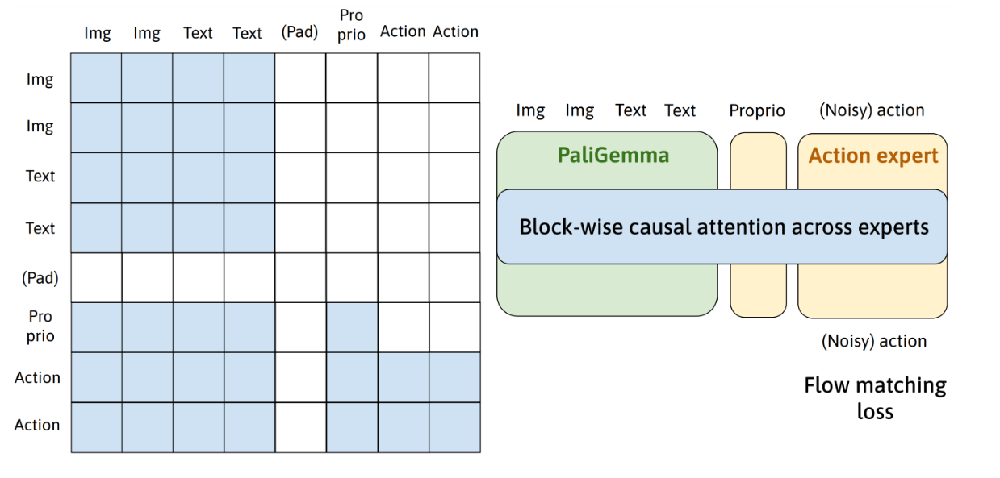

### $\pi_{0.5}$

pi05整体架构设计延续了pi0，强调Generalization，这是pi0最大的差异，具体体现在 分阶段训练 和 协同训练（co-training）。模型会预测text与action。体现在每一个layer(transformer block)的attention最后projection是分开的，前m个对应text token，后n个对应actions token。

最核心的创新点集中在其两阶段训练过程，两个阶段都体现了co-training。

第一阶段训练VLM,目标是让VLM预测子任务并基于子任务预测actions。使用的数据包括异构机器人运动数据、网页数据，其中机器人动作数据会被token化。第一阶段的co-traininng具体体现为数据集包含多模态网络数据，跨具身机器人数据和高层子任务预测，需要在回答图文问题的同时输出具身动作的离散action token，VLM被迫建立语义先验知识和具身操作知识的共享空间。

第二阶段重点训练Action Expert，离散actions转变为连续actions。除了剔除了过于完美的实验室数据上一阶段的数据会被保留接着cotraining防止遗忘，顺便加了一点移动具身和非移动具身的多环境多，在家居中让部分训练好的pi05接受人类的指令去完成任务，美其名曰“语言遥操作”，然后再将成功的数据加入数据集训练pi05，大概是DAgger Style Data Pipeline。模型同时进行 next-token prediction（为了保持文本预测和高层推理能力）以及针对 Action Expert 的流匹配优化。

总之就是利用数据和算力非常暴力地禁止遗忘，忘了就立刻强迫再学一遍，预训练好了微调的梯度一般不会让VLM遗忘很厉害。

**我的评分：⭐⭐⭐⭐** 

‍

‍

## [human_to_robot](https://www.pi.website/research/human_to_robot)

这个工作可以称之为**$\pi_{0.5}$**+ego，将人类视频到机器人动作的latent space映射视作一种具身形态，当具身预训练数据足够多，就像LLM Scaling Law一样，学习人类视频的能力会突然涌现。直接将带有手部追踪和语言标注的第一视角人类视频作为一种“新的具身形态”，与机器人遥操作数据混合，使用完全相同的目标函数（高层子任务预测 + 底层动作预测）微调预训练的 VLA 模型。这样的预训练涌现让很多靠表征学习或者硬编码的人类视频学习工作显得没啥意义了。

不过为了让人类视频近似一种具身形态，人类数据的采集和数据稍微有点讲究，但是没有UMI那么讲究。使用头戴相机+双腕部相机采集数据，通过视觉 SLAM 提取 6D 头部相对运动，并提取 3D 手部关键点作为“人类末端执行器（End-effector）”的动作近似。

在 Fine-tuning 阶段，我们将人类数据（用于引入新技能）和最相近的机器人数据以 50-50 的比例混合训练。

引入人类数据后，$\pi_{0.5}$+ego 在泛化任务上的成功率几乎翻倍（如 Spice 任务从 32% 飙升至 71%，分拣鸡蛋准确率达到 78%），在弱预训练下，人类数据没有帮助。

尽管证实了腕部相机很重work，但这要求人类佩戴额外设备，一定程度上违背了“无感、自然”收集大规模数据的初衷,也不能让youtube上的大规模人类数据自由地被使用。

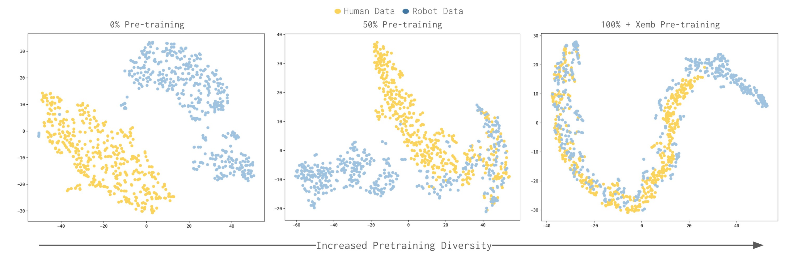

**我的评分：⭐⭐⭐**

‍

## [The Physical Intelligence Layer](https://www.pi.website/blog/partner)

想要搞具身智能foundation model的API，通过和合作商建立起DAgger来覆盖长尾情况建立起数据飞轮，但是还是高度依赖人为干预。

## Pf.Luo 真机 RL二则

这三个工作都很有影响力，之前都大概了解了一下，这次是复习精读一下。

### [SERL](https://serl-robot.github.io/)

核心算法是RLPD，主要贡献是在算法原理不变的情况下把各种细节做到极致，从而提供一套在仿真中极高效，在真机中通过力感知和阻抗控制等细节确保安全的，通用机器人强化学习架构。在传统同步的RL实现中，数据收集需要等待模型更新，模型更新又等待数据收集。SERL实现了异步且样本高效的架构，实现了在环境交互的actor与在数据上进行学习的learner actor解耦，没有定义传统的UTD_Ratio参数，而是定义Update Frequency参数来控制actor接受来自learner的新actor权重的频率，频率稍微低一点不会影响太大地性能且可以大大提升效率。细节很多，这个工作最大的价值就是看它的代码并且在真机上去跑通复现。

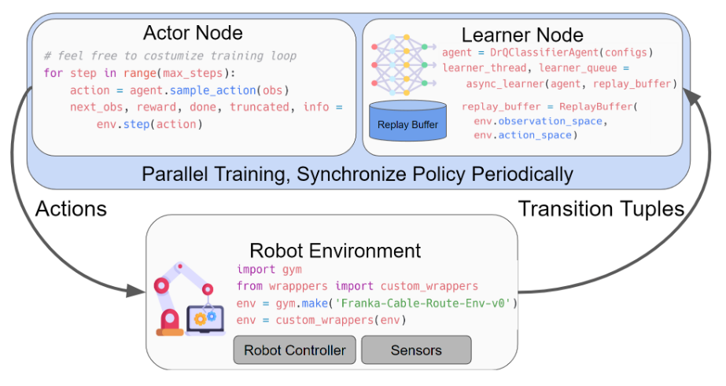

### [HIL-SERL](https://hil-serl.github.io/)

在真机设备上引入了人类矫正，并且顺带喷了一下现在很多仿真环境在做的Domain Randomization，证明走真机RL路线不需要这种技巧就可以极其复杂的长视距、高动态、接触密集型任务。继续沿用RLPD算法在learner端，人类干预的纠正动作（Corrections）存入Replay Buffer中。并且在没有刻意设计的情况下，智能体涌现出控制率行为。

> 同一套算法框架，在面对抽Jenga这种极高动态任务时，自动学习出了方差极低、类似人类肌肉记忆的开环预测控制； 在面对内存条插入这种需要极高精度的任务时，又学习出了依赖视觉伺服、不断进行误差修正的闭环反应式控制。

所谓的开环即策略输出的动作方差很低直接去完成目标，闭环是指针对极高精度的任务会一开始输出方差较大的动作在那里反复摸索，在反馈中不断减小误差振荡收敛至正确的行为。

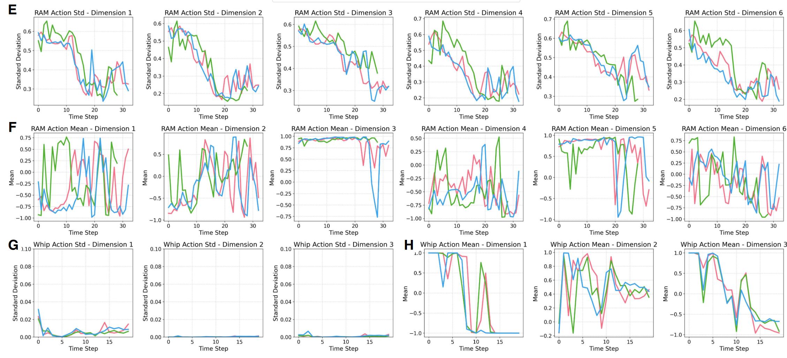

在1到2.5小时内，HIL-SERL在绝大多数任务上达到了 **100% 的成功率**。如果去掉在线人类纠正 (No Interventions)，只给大批量的离线演示（200条），系统在复杂任务（如仪表盘装配）上的成功率直接掉到 **0%** 。

在方法架构上我注意到两个细节，第一个细节是关于任务空间的参考坐标系的选定和动作控制表达，在每次训练的初始阶段（Episode开始时），首先在工作区内对机械臂末端（夹爪）的初始位姿进行均匀的随机扰动 。把这个随机的初始末端坐标系记作 $\{b_0\}$。在随后的任何时间步 $t$，机器人的位置信息都不再相对于底座，而是**完全相对于刚才的初始坐标系** **$\{b_0\}$** 来表达。即$T_{b_0^{(i)} b_t^{(i)}} = (T_{s b_0^{(i)}})^{-1} T_{s b_t^{(i)}}$，而动作是**相对于当前这个极短瞬间的末端坐标系** **$\{b_t^{(i)}\}$**表达的。第二个细节是因为连续RL算法很难处理夹爪这种离散的“开/关”动作，我们专门切分出一个离散的Critic空间来独立控制夹爪。

这个工作的剩余价值就是读代码和真机反复踩坑复现。

**我的评分：⭐⭐⭐⭐⭐** 

## [GR-RL](https://seed.bytedance.com/zh/gr_rl)

在双臂机器人上使用了和 $\chi_0$一样的翻转视角翻转左右手臂感知数据的增强。最显眼的创新点是使用了Distribution Ciritic，比如在01二元奖励场景，在最后一层限制critic输出一个概率分布，比如70%的概率获得奖励1，这样可以把输出的值通过神经网络的最后一层限制在[0,1]之间，不用担心自举导致高估Q值估计超过1.0，以及CQL这样的算法过度低估以至于Q值估计低于0。消融实验结果表明：

> 证明了“分布式 Critic (Distributional Critic)”比传统的“回归 Critic (Regression Critic)”好用得多。 回归模型在稀疏奖励下容易产生严重的高估现象，而分布式 Critic 的输出边界受限（0到1之间），能更敏锐地捕捉到“哪怕只差一毫米没穿进鞋眼”的微小失败。

在线RL选择冻结DiT，去学习一个轻量级的潜在空间噪声预测器 (Latent Space Noise Predictor)，和ResRL类似。整体流程分三步走：Filtered BC $\rightarrow$Symmetry Augmentation$\rightarrow$Online RL。RL最后成功率83.3%，比较厉害实则不如HIL-SERL。

**我的评分：⭐**

## [LingBot-VLA](https://github.com/Robbyant/lingbot-vla?tab=readme-ov-file)

依然是scale up数据没有看到饱和现象。流程是：

> **输入** (多视角图像 $I_{t}$ + 文本指令 $T_{t}$ + 机器人本体状态 $S_{t}$) $\rightarrow$ **理解专家 (VLM)**  (提取多模态语义特征) $\rightarrow$ **混合自注意力机制 (MoT)**  (实现层级特征对齐，防止模态干扰) $\rightarrow$ **动作专家 (Flow Matching)**  (基于条件概率路径去噪，预测连续动作轨迹) $\rightarrow$ **输出** (未来 50 步的连续动作块 Action Chunks)。

最突出的是工程贡献，开发了专门针对高频动作数据优化的训练引擎，结合 FSDP 切片策略和 FlexAttention 算子融合，实现了 261 samples/s/GPU 的极速吞吐，比 StarVLA、OpenPI 等框架快一倍多。然后对深度token进行了视觉蒸馏，然VLM可以以token的形式读懂深度。

> 为了弥补传统 VLM 空间感知弱的缺陷，我们创新地引入了视觉蒸馏（Vision Distillation），将 VLM 的可学习查询与我们自研的 LingBot-Depth 深度 token 对齐，极大地增强了模型的空间和几何推理能力。

大幅超越 $\pi_{0.5}$ (13.02% SR) 和 GR00T N1.6 (7.59% SR) 。在 RoboTwin 2.0 的高度随机化场景中，平均成功率也达到了 88.56% 。源代码开放。

**我的评分：⭐⭐⭐** 

‍

## [DexFlyWheel](https://dexflywheel.github.io/)

残差强化学习可以做数据飞轮是很符合直觉的，但是PLD工作对残差强化学习的数据飞轮只停留在展现可能性和讨论潜力的层面，这个工作把残差强化学习数据飞轮的想法实现出来了，主要是依靠灵巧手数据生成这个应用场景，因为一般单机械臂或者双机械臂的二指夹爪在一些中等难度的任务上做数据飞轮或者不需要这样的大费周折，像插拔显卡，插内存条，装配家具以及精细灵巧手任务，这类hard task生成数据成本极高会需要这种基于残差强化学习的数据飞轮。

整个飞轮的pipeline是：

输入 1 条 VR 遥操作种子演示 ($d_{seed}$) $\rightarrow$ 经过数据增强模块 $\mathcal{A}_{EP}$ (环境/空间随机化) $\rightarrow$ 输出初始数据集 $\mathcal{D}_1$ $\rightarrow$ IL $\rightarrow$ ResRL $\rightarrow$ 在随机新物体上收集数据 $\rightarrow$ Domain Randomization $\rightarrow$ IL （Distill） $\rightarrow$ ...

飞轮第一次转动模型能力增益是最大的，往后接近能力上限之后收益递减，在生成很多数据上有一定价值，然后由于没有触觉传感器所以很多任务都强依赖人工设计的奖励函数。

之所以用ResRL基于一个insight，就是灵巧手纯RL其实会探索效率很慢并且探索出奇异的动作，而在操作物体如果在拓扑结构上改变不大的话，需要修正动作实际不大，所以ResRL可以在Base Policy的先验下，在灵巧手操作上去很快的做好这不太大的修正动作的探索。如果遇到一个全新物体，**需要彻底改变拓扑操作策略**（比如：原来是“捏起”一个盒子，现在变成需要把手指插进马克杯的“提手”里“勾起”它），ResRL **必定会失败**。因为 Base Policy 给出的先验是“捏”，而残差由于被限制了范围（低 Residual Norm Ratio），它只能在“捏”的流形（Manifold）上微调，永远无法产生突变成“勾”的动作。

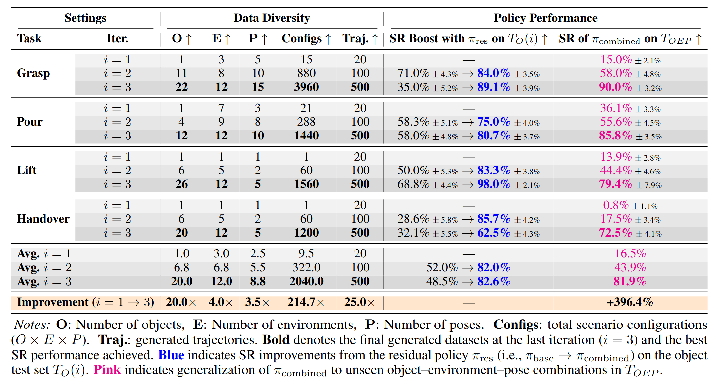

**我的评分：⭐⭐** 

## [SimToolReal](https://simtoolreal.github.io/)

工具操作是极具挑战性的灵巧操作，且以zero-shot泛化为卖点。

> 由于收集这些行为的遥操作数据非常困难，因此“仿真到现实”（sim-to-real）的强化学习（RL）是一个很有前景的替代方案。

将复杂的工具使用拆解为驱动物体达到一系列目标位姿的过程 。策略输入摒弃了高维视觉信息，仅依赖 6D 物体位姿和粗略的 3D 抓取边界框 。这种极简的抽象有效跨越了 sim-to-real 的视觉鸿沟。并没有在仿真中精细建模真实的锤子或刷子，而是自动生成由手柄和头部组成的简单几何体（圆柱/长方体），并随机化其质量分布 。仅使用一个通用的“达到随机位姿”的奖励函数进行训练，策略自然涌现出了稳定抓取和手中重新定向（in-hand reorientation）等高级灵巧技能。在真实世界中，只需一段人类演示视频，我们利用 SAM 3D 生成度量尺度的网格和抓取框，结合 FoundationPose 提取目标位姿轨迹，即可直接部署我们在仿真中训练好的单一策略，全程无需微调。最后贡献了一个DexToolBench 基准，代码开源有，在IsaacGym上建立大规模RL(SAPG)并集成现代 3D 视觉基础模型 (SAM 3D) 以及先进的姿态追踪 (FoundationPose)，代码有学习价值。

**我的评分：⭐⭐**

‍

## [LAP](https://lap-vla.github.io/)

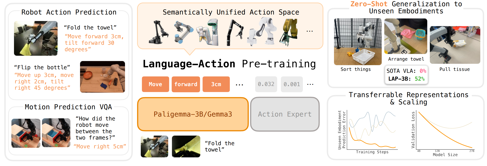

其实和General Action Expert一个思路，但是中间Token的表征形式是Language，梯度截断保护VLM的语义知识。跨本体很好，但是问题依然是如何做好精细操作。

**我的评分：⭐**

‍

## $\chi_0$

写于技术报告正式发布之后，$\chi_0$并没有去做很多任务的泛化学习，而是专注于叠衣服，挂衣服这个manipulation long-horizon hard任务。可以做到从任务初始状态连续不间断运行24个小时，一共用20个小时的数据和8张A100GPU。$\chi_0$成功率比最先进的$\pi_{0.5}$提升进250%。

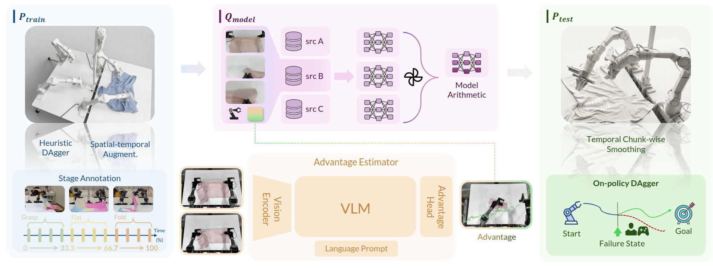

先有方法后有理论解释是AI发展常有的事，DAgger，时空上的数据增强都是已经有的trck，这个论文提出一套分布理论去解释这些trick设计的原理。P是指真实环境的某一种存在的轨迹分布，Q是指带有inductive bias的模型所拟合出的分布。失败的模式是因为$P_{train}、Q_{model}和 P_{test}$分布不一致导致的。

Model Arithmetic用以缓解 $Q_{model}$ 的偏差 让同源的base_model在各个子集上微调出不同的version，最后融合从而更好的吃下数据，Stage Advantage Estimator用以做Weighted BC，只学给任务带来显著进展的动作。

Heuristic DAgger用以高效地扩展$P_{train}$,Temporal Chunk-wise  Smoothing会丢弃推理延迟时间对应的动作，是调整$Q_{model}$以适应$P_{test}$，时空增强通过随机时间的skipping和视角翻转配合左右机械臂的qpos互换，本质上也是扩展$P_{train}$。

**我的评分：⭐⭐⭐⭐⭐** 

## [Arxiv2Prompt](https://github.com/takashiishida/arxiv-to-prompt)

已经用上了，很有帮助，再也不怕vibe coding agent读不了论文了。

后记: 用了很久，确实很好,感恩贡献者。

‍

## [GreenVLA](https://greenvla.github.io/)

五阶段训练，前两个阶段学共享语义，后三个阶段学具身轨迹。具体为：

> L0 基础VLM L1 多模态基础关联
>
> R0 多具身预训练 R1 特定具身SFT R2 基于RL的策略对齐

采用统一动作空间设计+具身提示词，在跨本体的思路上类似X-VLA的Soft Prompt。并且利用光流法进行时间对齐（光流估速度，插值重采样，数据归一化），解决多源数据操作速度不同导致的冲突问题，这个是

在Flow Matching做RL。有关Joint Prediction Module机制，在L1阶段VLM在**24M（2400万）**  条互联网多模态数据进行训练，包含了大量的 **RefSpatial**, **RoboPoint**, **PixMo-Points** 等数据集，在R0阶段依然MIX部分数据防止遗忘。最后该机制利用特殊token预测(u,v)，然后反投影为3D点$p^*$ ，作为target引导flow matching的梯度（类似 Diffusion 里的 Classifier Guidance），硬拽着机械臂往 $p^*$ 那个方向走 。

Flow-matching 通常从高斯噪声采样，他们训练一个小型的 Actor 来学习更优的**初始噪声分布**。最后还有一个OOD检测，如果状态偏离训练分布则立即修正。Speed conditioning起到时间上增强数据的作用。

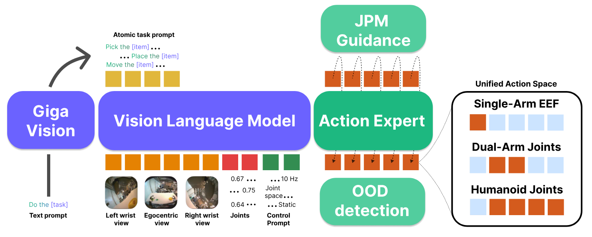

其中Giga Vision是这个研究团队之前的工作，作为High Level Planner。

我的评分：⭐⭐

‍

‍

## [DICEPTION](https://github.com/aim-uofa/Diception)

这篇论文是我课题组的一个工作，对如何做多任务有一点启发，和Being-H0.5本质思想有一定相似之处。该论文将感知的一些任务如分割，预测深度，预测姿态关键点，法线，都统一到RGB空间（"RGB-Everything" Paradigm），然后在Token-wise上训练DiT最大程序保留先验，最后用Flow Matching做感知任务，flow matching确实完全能胜任感知任务。Token-wise为[原图 Token] + [噪声 Token] + [任务 Token] + [点 Token] 拼成一个超长的序列，作为一个Unified Space。

不难发现能很好做多任务的Unified Model都会定义一个共享空间并且在这个共享空间保持一定的的冗余设计，在这个共享空间里对于模型而言它只是在做“”单任务“”，Unified Space的Output选出一部分进行解码就对应一个单任务。共享空间通过设计的组织将多任务组织成单任务从而轻松实现多跨任务联合训练，而这个Unified Space就如同模型的“母语”，而多任务就是不同的“外语”。这个思想对多任务扩本体训练很有启发意义。最后实验结果也证明这样的设计下，多任务训练甚至有相互促进的作用。

> $$
> Loss = ||v_{\theta}(\text{全家桶Tokens}) - u(\text{目标速度})||^2
> $$
>
> 无论任务是把“猫”分割出来，还是预测“桌子”的深度，模型在做的数学运算永远只有一件事情：​**预测从噪声变成目标 RGB 图像的速度场 (Velocity Field)** 。

我的评分：⭐⭐⭐

‍

‍

## [PiCor](https://github.com/ChangWinde/PiCor)

提出两个阶段学习策略:

1. 策略优化，利用SAC算法在单任务上探索。
2. 策略修正，利用信息几何视角，通过KL散度将策略投影回一个安全的“性能约束集”。

其中数学原理创新集中在性能下界约束集，推导出多任务性能提升的下界，有这个下界确保多任务性，基于Expected Return来定义“安全的更新方向”。在策略修正阶段，利用SAC算法的温度系数来确定任务的保护程度，$\alpha$大策略在探索，更高权重保护它，$\alpha$小策略已收敛，权重降低。

> Sampling一个任务 --> Policy Optimization --> Policy Correction --> Loop ...

上述循环高频进行，不断优化随机的单任务，然后基于全任务修正，所有任务螺旋上升变强。

数学推导如下，我们知道RL中经典的累积折扣回报定义：

$$
J(\pi) = \frac{1}{1-\gamma} \mathbb{E}_{\substack{s \sim d^\pi \\ a \sim \pi, s' \sim P}} [R(s, a, s')]
$$

$$
\text{with } d^\pi = (1-\gamma) \sum_{t=0}^{\infty} \gamma^t P(s_t = s | \pi)
$$

在策略修正阶段，优化目标如下：  
  

$$
\pi_{t+1} = \arg \min_{\pi \in \Pi} D_{KL}(\pi'_t || \pi),
$$

$$
s.t. \sum_{z=1}^{N} w_z \mathbb{E}_{\substack{s \sim d^{\pi_t} \\ a \sim \pi}} [A^{\pi_t}(s, a)] \ge c(1-\gamma)
$$

然后Lagrangian Relaxation：

$$
\mathcal{L}(\phi) = D_{KL}(\pi_\phi || \pi'_t) + \frac{1}{2}\lambda \tilde{c}^2(\phi),
$$

$$
\text{with } \tilde{c}(\phi) = \left( c(1-\gamma) - \sum_{z=1}^{N} w_z \mathbb{E}_{\substack{s \sim d^{\pi_t} \\ a \sim \pi_\phi}} [A^{\pi_t}(s, a)] \right)^+
$$

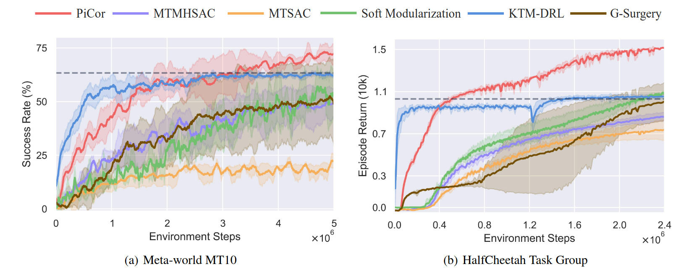

让我惊喜的PiCor这套方法不仅没有Negative Transfer和Interference，而且在多任务的情况下多任务的成功率超过了单任务的成功率，主要得益于Policy Correction阶段对负面梯度的剥离，保留有益的共享知识。但是问题是仅仅10个简单任务就需要训练这么长时间（大约2天），想要做真正有实际应用价值的扩展到1000多个复杂任务，仅仅靠这样的循环去往复训练的时间试错成本是不能接受的，如何多任务多环境并行训练依然能用这套架构呢？这会是一个值得尝试的事情。

我的评分：⭐⭐⭐

‍

## [RVT-2](https://robotic-view-transformer-2.github.io/)

Learning Precise Manipulation from Few Demonstrations

> - ​**vs. PerAct [CoRL 2022]** ：PerAct使用体素（Voxel）网格，随着分辨率提高，显存和计算量呈立方级爆炸，无法做高分辨率以支持高精度。
> - ​**vs. RVT [CoRL 2023]** ：我们自己的上一代工作RVT引入了多视图渲染（Multi-view Rendering）来替代体素，但它是固定视角的，对于细小物体（如插头引脚）“看不清”，导致精度不够。
> - **vs. Act3D [CoRL 2023]** ：Act3D虽然性能不错，但训练非常慢。

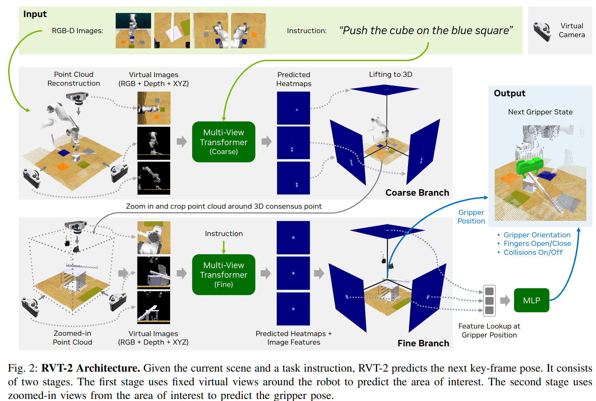

两个独立的transformer，一个看全局信息负责预测聚3D热力图找到兴趣中心，另一个在聚焦点cropping出的区域负责预测动作。利用RGBD的观测反投影出点云，这个工作做出了一个系统级渲染优化，发现PyTorch3D太慢且显存占用高。他们手写了一个基于投影的CUDA点云渲染器（Custom Projection-based Point-cloud Renderer），结合混合精度训练（Mixed Precision）和Flash Attention，实现了训练速度 **6x 提升**（从数天缩短到20小时内）。

另一个关键细节在于虚拟相机，没有直接输入3D点云，3D点云的作用是作为一个渲染器，渲染出正交虚拟的RGBDXYZ 一共7个通道的图像。

我的评分：⭐⭐

‍

## [Task Arithmetic](https://github.com/mlfoundations/task_vectors)

将模型学习到的特定任务知识解耦为一个显式的权重方向（微调后权重减去预训练权重） 。证明了神经网络在极高维的权重空间中，任务能力呈现出的线性可加性。

> [预训练权重 $\theta_{pre}$] + [微调后权重 $\theta_{ft}$] → **计算任务向量** ($\tau = \theta_{ft} - \theta_{pre}$)→ **核心模块：任务算术引擎 (Task Arithmetic)**  -
>
> - *分支1 (遗忘)* : 取负操作 $\tau_{new} = -\tau$
>
> - *分支2 (融合)* : 加法操作 $\tau_{new} = \sum \tau_i$
> - *分支3 (类比)* : 组合操作 $\tau_{new} = \tau_C + (\tau_B - \tau_A)$ → **重组与缩放** ($\theta_{new} = \theta_{pre} + \lambda \tau_{new}$) → [获得具备全新能力的单一输出模型]

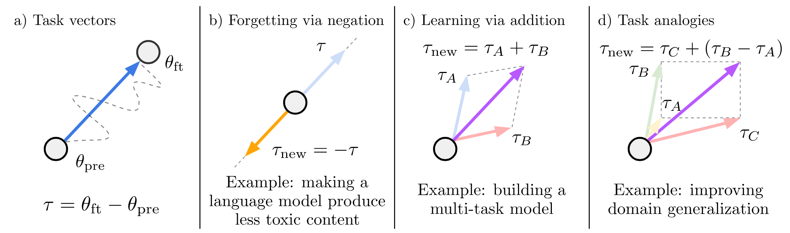

其中缩放系数 $\lambda$ 需要在验证集上进行搜索确定，用于控制任务向量用于控制模型的强度。

在联合训练多任务时流程是这样的：$\tau_{new} = \sum_{i}\tau_{i}$ 然后 $\theta_{new} = \theta + \lambda\tau_{new}$。$\lambda$ 值是通过在留出的验证集（held-out validation sets）上进行一维网格搜索确定的 。搜索范围设定在 0 到 1.0 之间，步长为 0.05。随着融合任务数量的增加，最优的 $\lambda$ 值呈现出下降的趋势（例如从 2 个任务时的 0.4 左右，逐渐降低到 8 个任务时的 0.3 左右）。

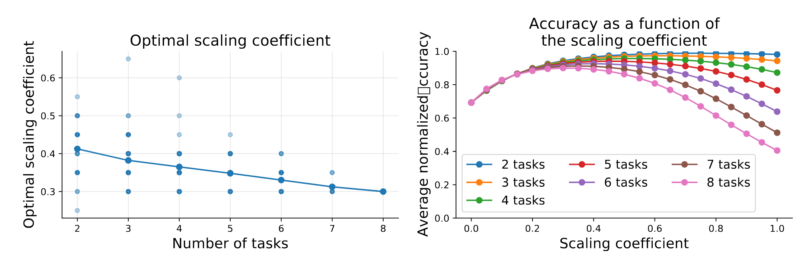

虽然任务的数量的增多，多任务的互相干涉（Interference）和负迁移（negative transfer）依然存在，无论是多任务联合训练还是模型加法，参数规模一定时可能受其能力或者说容量上限的影响，这个问题依然是open challenge。

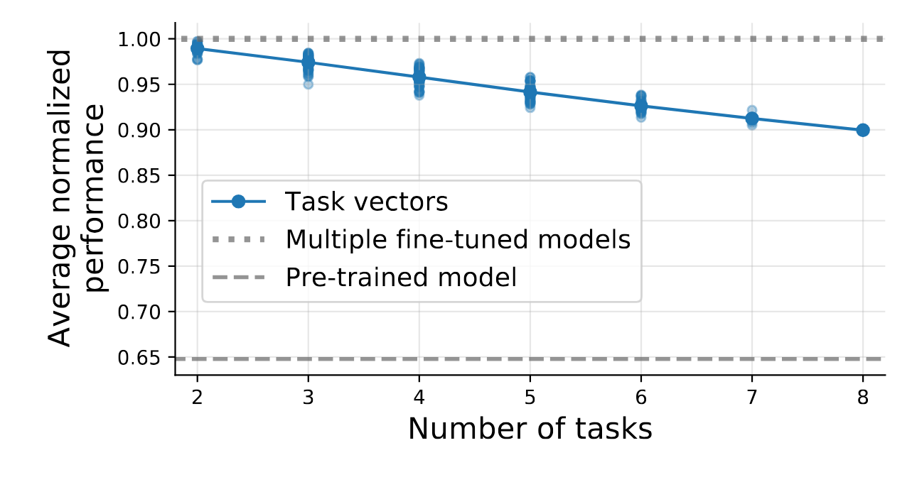

我的评分：⭐⭐⭐

‍

## [PointWorld](https://point-world.github.io/)

将状态（RGB-D观测）和动作（机器人几何描述）统一为了同一种模态——**3D点流 (3D Point Flows)，** 并且scale up式实现，验证3d点流是很好的一种中间统一表征并且具有空间信息，并且贡献大规模数据集与3D标注pipeline **。** 它证明了通过统一的3D几何表示，我们完全可以像训练LLM预测Next-token一样，训练一个能够理解物理规律、跨形态通用的“世界模拟器”。上一个类似的工作是ATM(AnyPoint Trajectort Modeling)，这个工作可以说是ATM的scale up+3d version，并且较好继承了组里已有的benchmark（Behavior-1K）。

具体细节很多需要用的时候或者需要做这方面内容的时候再精读。

一下是借用另一个同学听PointWorld的Lumina Talk所总结的内容：

> 1. ‍
>
> 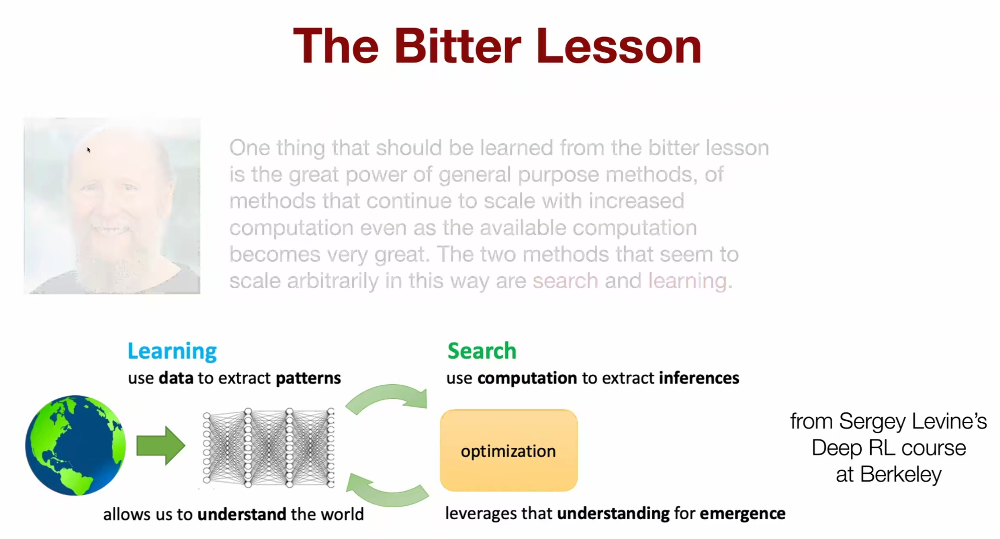
>
> 2. droid这样的数据比较脏，用foundation stereo能洗一些数据（vggt精度肯定不够具身用，这个作者觉得foundation stereo是够用的）
> 3. vggt来个camera做初始化，但是会有10-20cm的误差
> 4. ‍
>
> 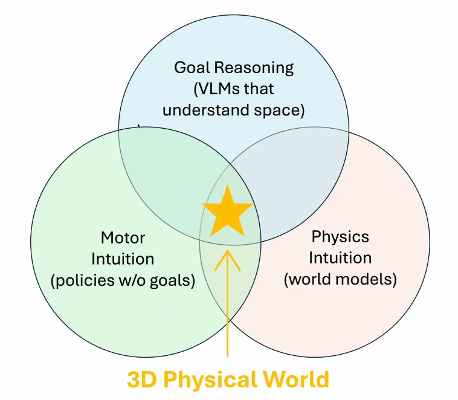

我的评分：⭐⭐⭐

‍

## [DART](https://arxiv.org/abs/1703.09327)

一下是AI总结的DART算法逻辑：

> - ​**Initial Collection**: 收集少量无噪声或初始噪声的专家演示。
> - ​**Training**: 训练一个初步的机器人策略 $\pi_{\hat{\theta}}$。
> - **Noise Optimization (关键步骤)** :
>
>   - 计算当前机器人策略 $\pi_{\hat{\theta}}$ 和专家策略 $\pi_{\theta^*}$ 之间的误差。
>   - 利用这个误差去更新噪声参数 $\Sigma_{k+1}$。
>   - ​*Insight*: 这里的公式推导得出了噪声协方差应该正比于机器人的训练误差矩阵。
>   - $$
>     \hat{\Sigma}_{k+1} = \frac{1}{T} \sum (\pi_{\hat{\theta}} - \pi_{\theta^*})(\dots)^T
>     $$
> - ​**Noisy Data Collection**: 让专家在新的噪声水平 $\mathcal{N}(0, \Sigma_{k+1})$ 下操作机器人。专家必须不断修正噪声带来的偏差（这就是在教机器人如何 recover）。
> - **Final Training**: 聚合所有数据，训练最终策略。

是早期扩展 $P_{train}$覆盖 $P_{test}$的一种方法。

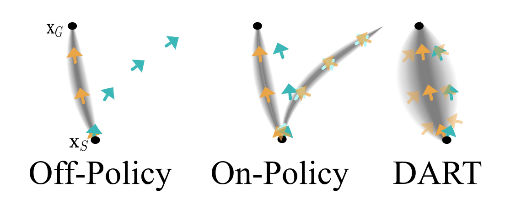

我的评分：⭐

‍

## [MimicGen](https://arxiv.org/abs/2310.17596)

属于扩展 $P_{train}$的工作，效果为10 Human Demos + MimicGen $\approx$ 200 Human Demos。通过**物体中心（Object-Centric）的轨迹变换**，扩展为覆盖广泛状态分布的大规模数据集（10demo-->1000data）。想法很粗暴简单但是做出了很大的贡献，是好工作。以下文字由AI生成：

> - **输入 (Source Demos)** : 少量人类遥操作演示。
> - ​**解析 (Parsing)** ​: 将每条演示切分为序列化的​**以物体为中心的子任务片段 (Object-Centric Subtask Segments)** 。
>
>   - *例如：把“泡咖啡”切分为 [抓杯子] ->*   *[放杯子] ->*   *[抓胶囊] ->*   *[放胶囊]。*
> - ​**场景重置 (New Scene Generation)** : 在仿真器中随机采样新的物体初始位姿。
> - ​**选择与变换 (Selection & Transformation)** :
>
>   - 对于每个子任务，从源数据中选择一个参考片段。
>   - ​**核心计算**: 计算源场景中物体与末端执行器的相对位姿 $T_{obj}^{ee}$，将其应用到新场景的物体位姿上，计算出新的末端执行器轨迹。
>   - ​*公式直觉*: $\text{New\_Traj} = T_{\text{new\_obj}} \cdot (T_{\text{source\_obj}})^{-1} \cdot \text{Source\_Traj}$。
> - ​**拼接与执行 (Stitching & Execution)** :
>
>   - 使用线性插值（Interpolation）将当前机械臂位置连接到变换后的轨迹起点。
>   - 使用控制器（OSC）执行新轨迹，并加入少许噪声以增加鲁棒性。
> - ​**过滤 (Filtering)** ​: 仅保留**任务成功**的轨迹存入数据集。
> - ​**输出 (Generated Dataset)** : 用于训练下游策略的大规模数据集。

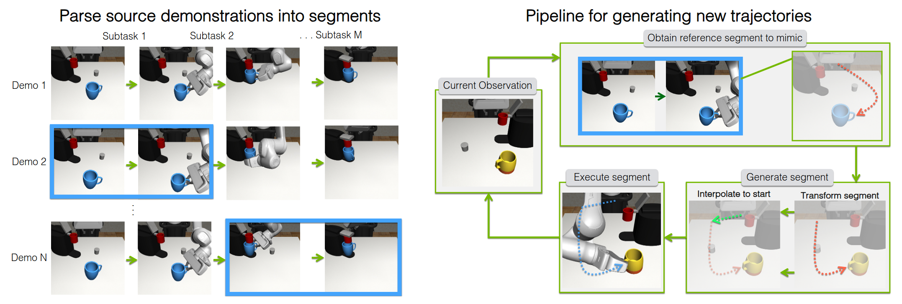

我的评分：⭐

‍

## [SkillMimicGen](https://skillgen.github.io/)

MimicGen线性插值容易导致碰撞，而有时生成的动作不利于网络学习。SkillGen的思路是将模仿学习集中在SKILL上即精细操作技能上，然后SKILL之间用运动规划相连接，通过运动规划连接技能，实现了 **100倍** 级别的数据增幅（从 60 个演示生成 2.4 万个） ，从而整体流程的可解释性极强。SKILL-Stitching的手段其实局限性也很明显，如果你运动规划停下来的位置不对的话，IL会因为Distribution Shift失效，这是对Long Horizon任务的一个过时的不那么fancy的方案了。

我的评分：⭐

## [SONIC](https://nvlabs.github.io/GEAR-SONIC/)

首次在大规模（9000+ GPU 小时，42M 参数，1 亿帧数据）下证明了运动追踪任务的性能随数据和算力的增加而稳步提升，且具备极强的**零样本（Zero-shot）泛化能力。**

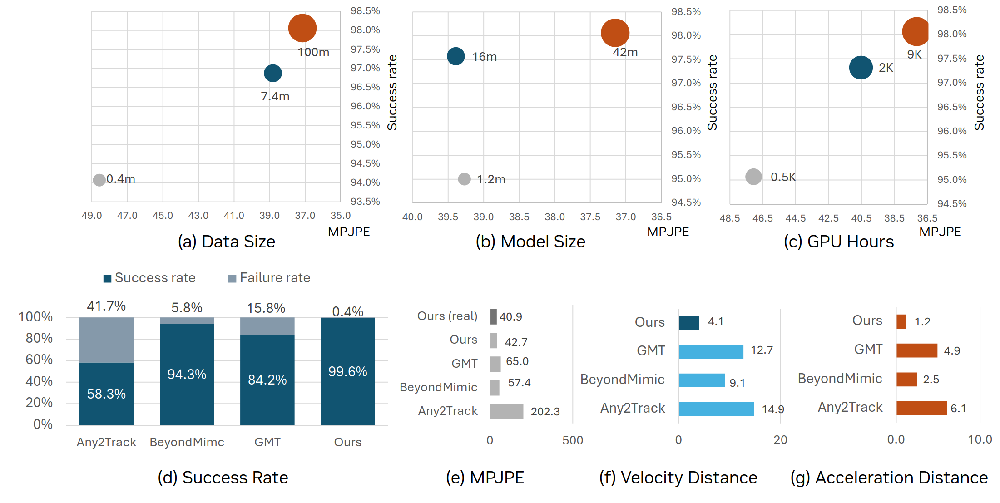

在模拟器 **Isaac Lab** 中训练，并在 **Unitree G1** 真实人形机器人上部署。

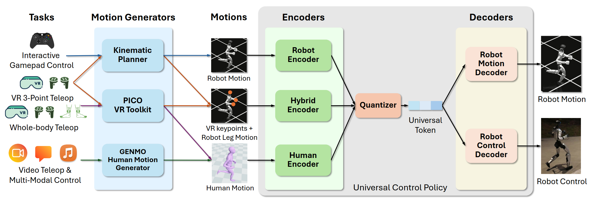

Kinematic Planner是一个预训练的自回归的生成模型，能够将高层意图（如“醉酒步”、“爬行”、“拳击”）实时转化为短时域的参考运动轨道。在统一的token空间，Task可以接受多种请求输入（VR 设备、视频流、文本指令 VLA 模型），最后通过 3 点式 VR 采集数据并微调 VLA 模型（GROOT N1.5），实现了从感知到全身协调动作的端到端验证（如移动取放苹果）。

> VLA 模型输出与远程操作格式相同的控制信号——包括三个上肢位姿（头部和双腕）、底座（腰部）高度，以及一个导航指令（根节点的线速度与角速度）。随后，这些信号被输入到运动学规划器和混合编码器中，最终由通用控制策略执行。

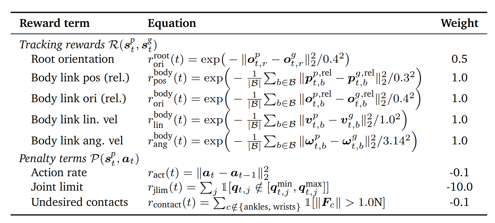

我的评分：⭐⭐

‍

## [OPTIMUS](https://mihdalal.github.io/optimus/)

利用TAMP生成大量数据喂饱Transformer。无法避免多任务性能衰减，无法处理Beyond TAMP的任务。

值得注意的细节有：

1. 动作空间是任务空间，任务空间训练出来的策略成功率更高，但是部署策略执行频率受影响。
2. 生成数据时，限制 IK 的多样性，始终把初始构型（Initial configuration）作为种子，强迫 TAMP 给出最接近初始状态的解。
3. **轨迹长度过滤 (Duration)：**  直接把长度超过平均值两个标准差的离群轨迹扔掉，并且显示workspace。

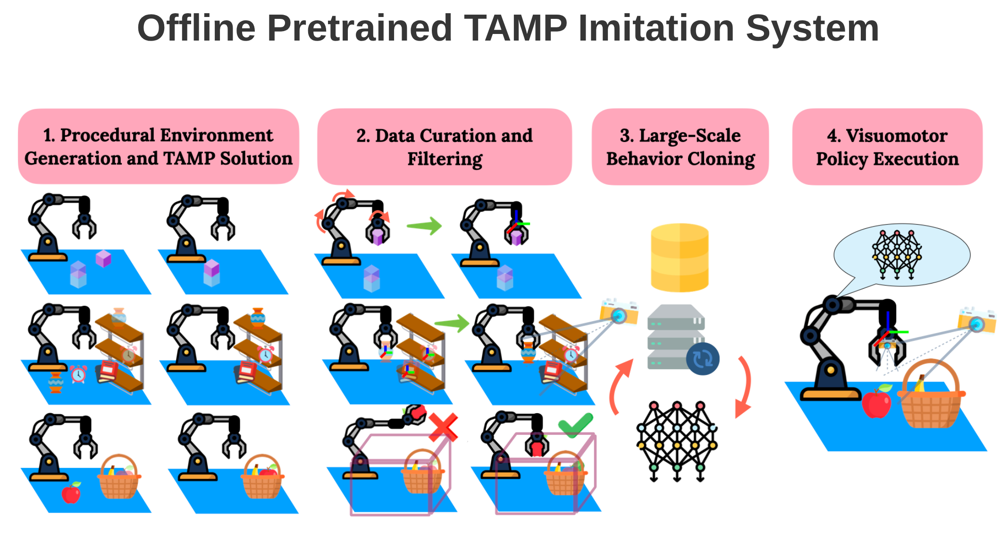

我的评分：⭐

‍

## [AFRO](https://kolakivy.github.io/AFRO/)

Action-Free 3D visual pre-training，通过latent space的状态差来学习动作表征，结合正运动学和逆运动学的双监督将表征学习好。它证明了不需要耗时费力的显式动作标注，仅靠观察纯点云视频序列，机器就能“悟出”物理世界的因果动态规律。

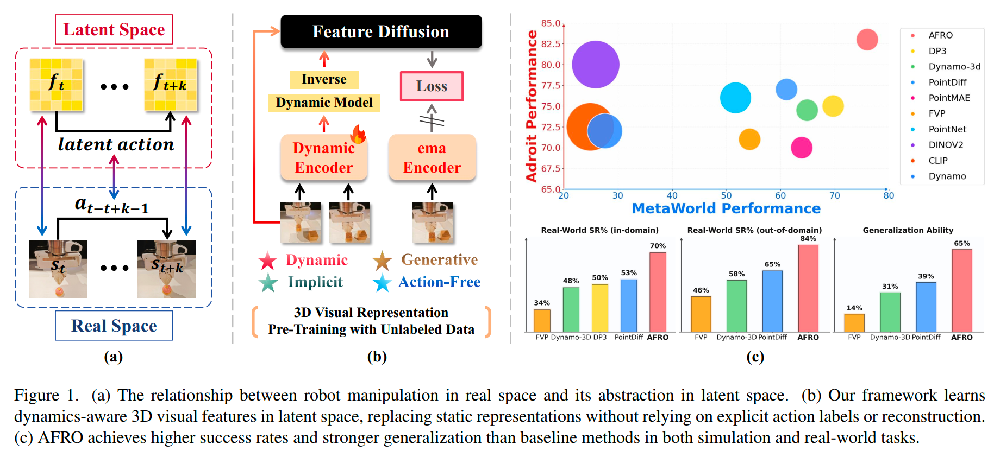

我的评分：⭐⭐

## [LIFT](https://lift-humanoid.github.io/)

一个小时让人形机器人学会走路，大规模并行仿真，大批量更细高UDT Ratio，部署飞堆成SAC算法（actor输入仅有本体感知，critic利用世界模型提供的特权信息）基于JAX实现，在一张RTX 4090 GPU上不到一小时即可在数千个并行环境中收敛，并且成功在真实的户外人形机器人上实现了零样本部署。在真机上执行确定性动作收集数据，同时在离线数据预训练好的物理先验世界模型中进行探索收据数据，跑通了从仿真大规模预训练、世界模型构建，到新环境高效微调的全流程，为机器人社区提供了一个极具实用价值的基线。

在构建世界模型时，采用了已知刚体动力学（拉格朗日方程）结合**残差预测器 (Residual Predictor)**  的架构 。利用神经网络去预测接触力等未建模的残差项 $\tau_{t}^{e}$。世界模型的细节在Section4.2。

流程是现在 MuJoco Playground上单张 GPU 上运行数千个矢量化（Vectorized）的并行环境预训练策略并且保留Replay Buffer的数据，然后利用预训练策略的数据和预训练策略时产生的数据进行世界模型预训练，然后冻结世界模型，让残差世界模型去学习仿真与真机之间的残差，最后利用combined world model进行高效的微调，虽然训练时间只有几分钟，但是最后微调各种硬件的原因还是得花费数小时，以下是论文承认的这个工作的局限性，由AI总结，我觉得这是一个宝藏论文。

> 1. 真实世界的奖励计算依赖 Vicon 动捕系统获取绝对高度，且通过 IMU 积分计算速度存在漂移。
>
> 2. 虽然只需要几分钟的真实数据，但由于当前实现是串行收集和训练，导致现实中微调仍需数小时，未来需要类似 SERL 的异步架构来优化。
>
> 3. 目前纯依赖本体感觉输入，缺乏视觉等高维感知，难以直接扩展到复杂的灵巧操作或导航任务。

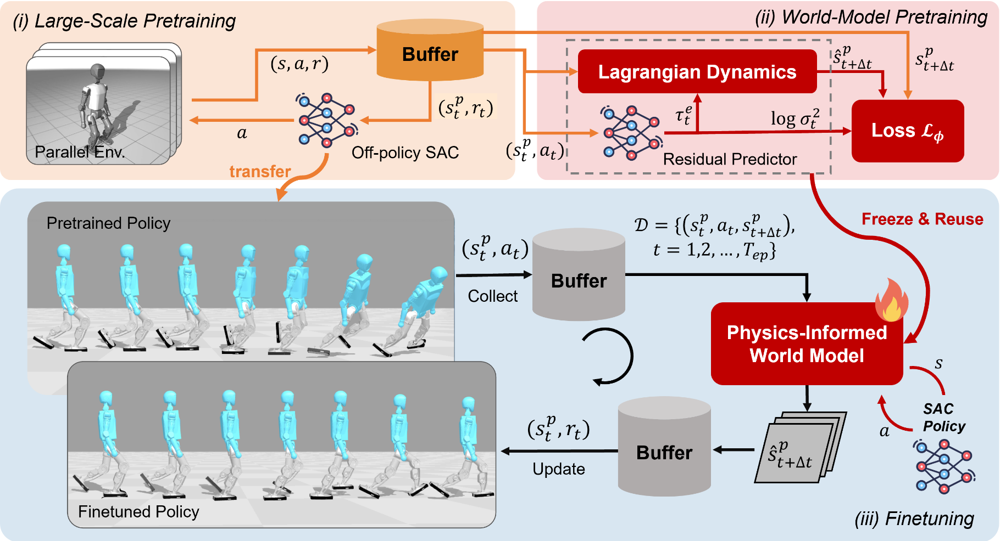

我的评分：⭐⭐⭐

‍

## [FRAPPE](https://h-zhao1997.github.io/frappe/)

利用预训练的RDT模型进行中间训练和后训练。

在中间训练阶段，先蒸馏一个小Encoder作为教师模型，让prefix token对应的输出部分有初步预测未来图像表征的能力，RDT-1B 骨干网络总共有 28 层 DiT layer 。发现如果在第 **21 层**的输出中把 prefix 对应的特征抽出来作为 $p_{t}$ 进行监督，效果是最好的。在后训练阶段冻结Diffusing Decoder，训练LoRA，每个强大的预训练Encoder对应一个Expert,最后推理时将三个Encoder加权融合。

没有从统计学或者理论本质创新，贡献主要是工程实现，将所有已经被验证很强大的预训练视觉encoder的知识注入到一个模型里面做正向预测，颇具暴力美感。

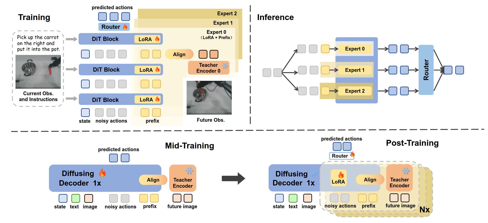

我的评分：⭐

‍

## [SC-VLA](https://github.com/Kisaragi0/SC-VLA)

依然是提升VLA对动态环境的理解能力和接受环境反馈的能力。寻常VLM+DiT action head。DiT中间层特征提取用来预测两个信号，任务进度和相对状态变化，利用相对状态变化和真实发生变化的相似度构建奖励函数来做残差强化学习，并根据任务进度衰减dense reward的权重。

> 给这个预测奖励分配一个**固定不变的权重**，会在高精度任务（比如精细插孔 PegInsertion）的后期引发严重问题：模型会在次优解附近停滞，甚至发散（你可以参考论文图 4 和 5.2 节的消融实验结果）。

如下图PegInsertion是比较精细的任务，主要是残差策略还是在一个任务训练一个，还是在暴力解决问题。

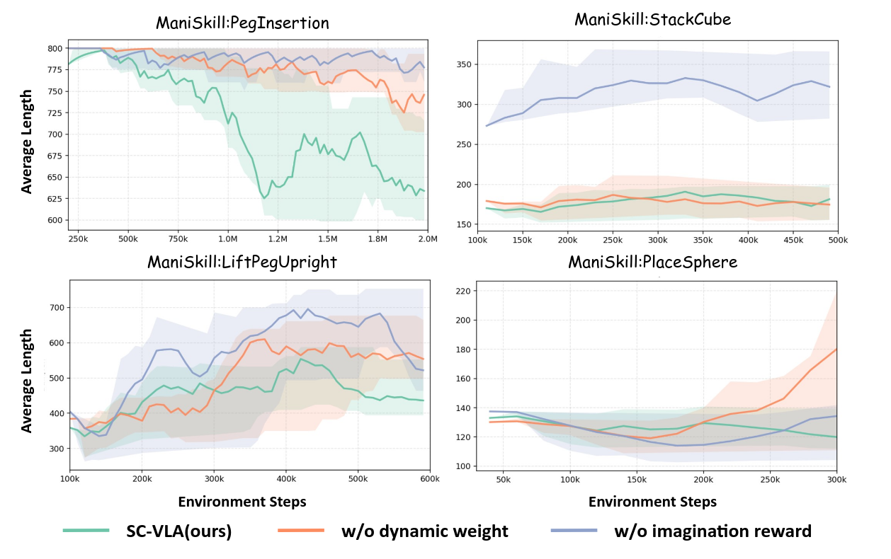

$$
r_t^{final} = \eta(\hat{p}_t) \cdot w_{guide} \cdot r_t^{guide} + r_t^{env} - c
$$

我的评分：⭐⭐

‍

## [SSDE](https://github.com/chengqiArchy/SSDE)

精确的”神经网络手术“，重初始化死神经元并精确冻结部分权重，解决持续学习的遗忘问题。但是我这段时间最深刻感受是一些新提出的东西在简单的benchmark做实验取得好效果，但是真实利用价值还是必须得在复杂或者scale up的规模上尝试，实际利用价值有时与benchmark指标值相去甚远。整体理论细节比较复杂，需要用的是否可以精读，代码开源。

我的评分：⭐

‍

‍

‍

## [SOE](https://ericjin2002.github.io/SOE/)

这个工作是思考SIME这个工作的局限性从而提出的。SIME在DP条件中注入随机噪声来诱导探索，但是探索效率不够高且在安全方面存在缺陷。SOE具体方法是将state表征输入给双路策略，一路是没有任何trick的base policy，另一路是探索路径，架构是latent encoder+decoder，利用变分信息瓶颈学习一个紧凑的潜在表示空间，这个空间保留对生成动作至关重要的信息。对潜在表示计算均值和方差，然后在高斯分布$z_{t}\sim\mathcal{N}(\mu_{t},(\alpha\sigma_{t})^{2})$钟采样。  其中$\alpha$控制探索的激进程度，安全性足够且多样性也足够，由下图可以看出这些采样出的action是和规整的，User也可以通过界面对这些轨迹进行拒绝采样，收集的数据会进过DAgger Style Data Pipeline被加入训练数据中。这钟双路设计的优点的model agnostic且避免遥操作。

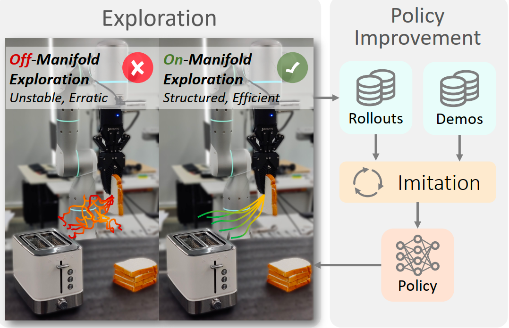

一些细节补充如下：

> 凭借 $\mathcal{L}_{IB}$ 带来的特征解耦特性，潜在空间 $Z$ 的不同维度天然对应了不同的语义动作（如上下、左右）。 通过信噪比（SNR）筛选出有效维度，使得人类操作员可以通过简单的界面选择机器人的试探意图。

$$
\mathcal{L}(\theta,\phi,\psi)=\mathcal{L}_{IL}(\psi)+\mathcal{L}_{IB}(\theta,\phi)
$$

**探索路径的损失** **$\mathcal{L}_{IB}$**​ **：**  VIB损失，包含重建和正则化两部分。它不仅要求潜在变量能够重建出动作（动作层面的多模态建模交给了扩散过程），还包含一个 KL 散度惩罚项，强制潜在分布贴近先验高斯分布。

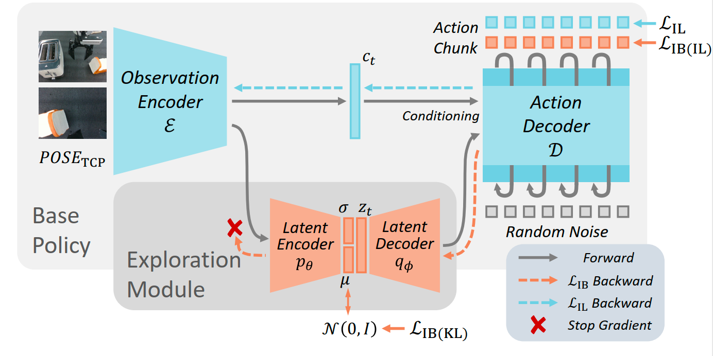

我的评分：⭐⭐
