## [Data Analogies](https://data-analogies.github.io/)

这项工作为机器人领域大规模数据集的构建提供了一份“说明书”。它告诉研究者们，未来在收集数据时，不要只追求海量和杂乱，必须分配一部分预算去收集“跨机器人的同场景配对数据”。这将极大地提高预训练模型落地到全新机器人硬件上的效率。

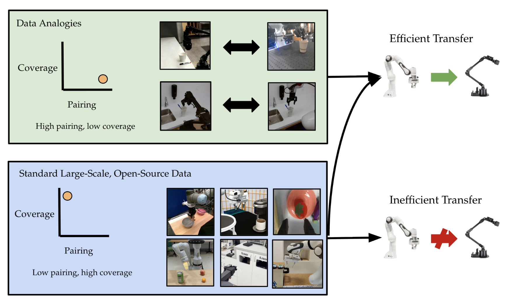

> ### Coverage
>
> - **Targeted**: Select demonstrations that explicitly fill gaps relative to the target robot (e.g., missing camera poses, gripper types, or kinematic regimes).
> - **Diverse**: Collect broadly varied demonstrations without target-aware selection, emphasizing visual and embodiment breadth.
>
> ### Pairing
>
> - **Unpaired**: Independent demonstrations linked only by task labels.
> - **Task-Paired**: Same task instance across robots (same objects and goals), weakly aligned.
> - **Trajectory-Paired**: Time-aligned executions with similar object-centric trajectories, via DTW in both simulation and the real world.

我的评分：⭐⭐

## [CRL-VLA](https://github.com/UT-Austin-RobIn/continual-vla-rl)

简单的持续学习配方works well，**VLA + LoRA + GRPO**，三缺一都会导致遗忘灾难，Negative Transfer极低甚至有时是Positive的。相比之前的Continual Learning避免了模型可塑性下降和ReplayBuffer随任务线性增长的问题。

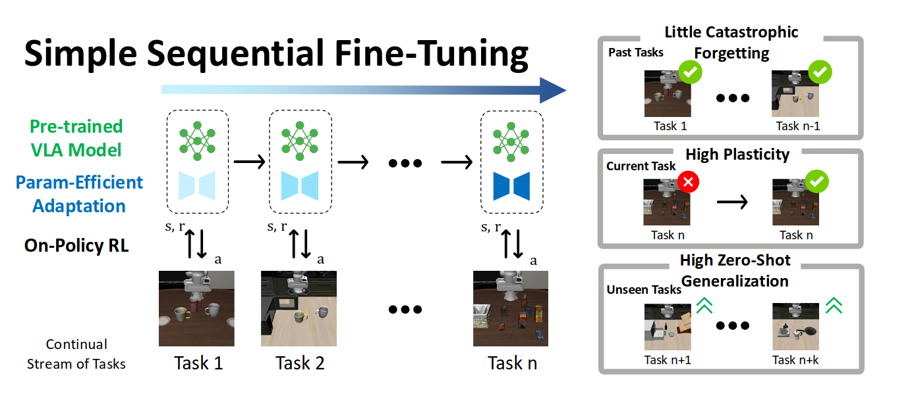

不过没有做真机实验。基于RLinf搭建是一篇速成论文。

我的评分：⭐⭐

## [RL Token](https://www.pi.website/research/rlt)

PI在完成了$\pi_{0.6}^*$实现REKAP算法对VLA全量RL微调之后，也开始把目光转向由Policy Decorator，Resfit，PLD，RISE（$\chi_0的RL版本$）等一系列工作吹捧起来的Residual RL（相比全量微调算力要求更小且更高效）。冻结主干策略去微调轻量的残差策略以对单任务的成功率很高，而PI还强调了可以提升任务执行的精度以及任务执行的速度，同样是扣圆环这个任务，RL微调之前一个成功的episode需要花费15秒左右的时间，RL微调之后3~5秒就完成了。

不过值得注意的是Actor并没有输出残差纠正的动作量，而是直接替代base policy输出完整的Action Chunk，单步加残差在PI团队看来在稀疏奖励下信用分配很难。

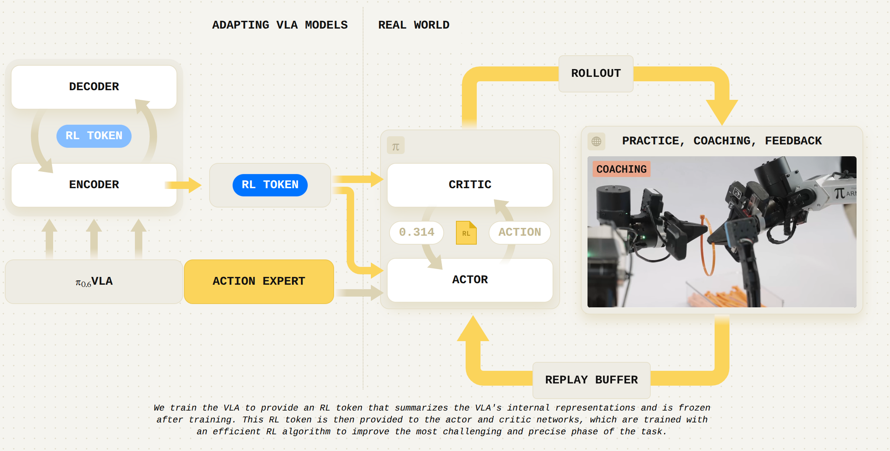

吞吐量的定义：**每 10 分钟内成功完成任务的次数** 。下图是消融实验（论文Fig7）已经将关键的方法设计枚举出来 :

1. Pass-Through：指将Base Model的Action作为Actor的输入，如果没有这个输入最终性能影响不大，但是训练效率会受影响。
2. RL Token：VLA 最后一层的特征嵌入（final-layer token embeddings）输出给小型encoder去生成RL Token，来作为Actor Critic的State表征，好处是可以利用VLA已有的视觉和语义信息表征，缺点是训练出来的Actor可能与VLA Base Model本身强耦合，无法像Policy Decorator那样借给任何Base Model。RL Token在初始适配阶段被学习，在在线强化学习开始时被冻结。
3. Chunk：Actor的动作纠正在Action Chunk的维度而不是单步Action进行，因为单步Action会导致credit分配问题，如果不在Chunk维度进行训练会直接崩溃。
4. BC Regularizer：既然不是输出单个残差动作以Base Model输出的Action为锚点来建立BC惩罚就成为了必须选项，由消融实验的结果可以看出没有BC把Actor的输出约束在Base Model Action附近学习会0成功率彻底崩溃。为了防止单纯的BC，采用了Dropout，即部分transitions里面的base_action输入会被执为0。

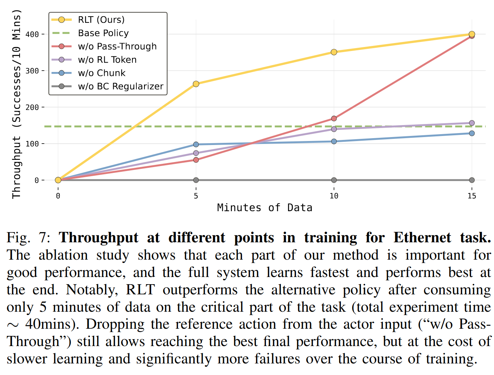

在正式online RL有压缩表征学习阶段（学RL Token），思路就是只要可以通过压缩token重建出原始内容，那么压缩的token是完备的没有损失关键语义信息，这里直接贴出原文：

> 令$z = f(s, \ell; \theta_{vla})$表示预训练 VLA 为状态 $s$ 和语言指令 $\ell$ 生成的最后一层 token 嵌入。嵌入 $z$ 可分解为$z_{1:M} = {z_1, . . . , z_M}$，其中每个 $z_i$ 对应一个输入 token 的嵌入。我们将一个可学习的嵌入  $e_{rl} = e_\phi()$附加到该序列的末尾，并使用一个轻量级的编码器 Transformer $g_\phi$ 来处理这个增强后的序列。在该特殊 token 位置的编码器输出（记为 $z_{rl}$），即为我们的 RL token。
>
> $z_{rl} = g_\phi([z_{1:M}, e_{rl}])_{M+1}$ (1)
>
> 随后，我们训练一个带有线性输出投影 $h_\phi$ 的解码器 Transformer $d_\phi$，使其能够从 $z_{rl}$ 中自回归地重建原始嵌入。令 $\bar{z}_i = sg(z_i)$ 表示应用于 VLA 嵌入的停止梯度（stop-gradient）操作，那么在演示数据 $D$ 上的自回归重建目标函数定义如下：
>
> $L_{ro} = \mathbb{E}_D [ \sum_{i=1}^M | h_\phi(d_\phi([z_{rl}, \bar{z}_{1:i-1}]))_i - \bar{z}_i |_2^2 ]$ (2)
>
> 我们在一个小型的特定任务演示数据集上训练参数 $\phi$，在计算 $L_{ro}$ 时将 VLA 视为冻结状态，并且可以（可选地）将其与 VLA ($\theta_{vla}$) 的监督微调结合进行。此后，$\theta_{vla}$ 和 $\phi$ 均被冻结，在线 RL 将在 RL token 表征 $z_{rl}$ 上进行操作。

然后我想到的问题是从大型VLA最后一层压缩出来的RL Token在拟合这些精细单任务时真的比SERL from scatch学习表征本质上好很多吗，这种好是体现在训练速度上还是最终成功率上？

实验还是覆盖了这个问题：

- 把 VLA 和 RL Token 拔掉，替换成 SERL 常用的、在 ImageNet 上预训练过的冻结 ResNet-10 编码器 。
- **结果：**   仅仅是换了表征，**吞吐量直接下降了 50%**   。

像 SERL 用的 ResNet，提取的是**纯视觉特征**（颜色、边缘、纹理）。而 RL Token 是从 VLA 最后一层压缩出来的。这个 VLA 之前已经看过了数万小时的机器人操作轨迹和海量互联网数据 。因此，RL Token 里天然自带了  **“操作相关的几何与语义理解”（manipulation-relevant structure）**  。面对复杂的物理接触任务，RL Token 提供的状态表示让 Critic 更容易判断动作的好坏，从而大幅加快了收敛速度。

我的评分：⭐⭐⭐⭐⭐

## MTRL Paper

### [MTRL Scaling](https://arxiv.org/abs/2503.05126)

**缩放的主次优先级 (Critic > Actor)**  : 扩大 Critic 网络的容量比扩大 Actor 网络能带来大得多的性能收益。 ^^这是因为 Critic 需要逼近跨越多个不同任务的复杂状态-动作价值函数，对表征容量的渴求度更高。

大型模型在少任务上容易出现“神经元休眠”（Dormant neurons）从而丧失持续学习的可塑性，但如果同步增加训练任务的数量（如从 10 个任务增加到 50 个），这种可塑性丧失就能得到极大缓解。

架构是multi-head一个任务一个head，但是这种架构设计很显然无法涌现出新任务zero shot泛化能力，所以意义有限。

### [BRO](https://github.com/naumix/BiggerRegularizedOptimistic) && [BRC](https://github.com/naumix/BiggerRegularizedCategorical)

BRO提出单任务RL控制的scaling，BRC是BRO的后续工作，延续BRO做了多任务。

BroNet架构如下图，不断堆叠残差网络被验证可以起到scaling效果。

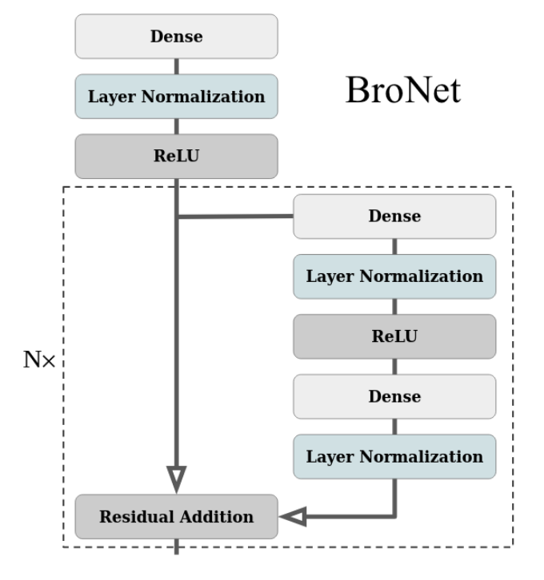

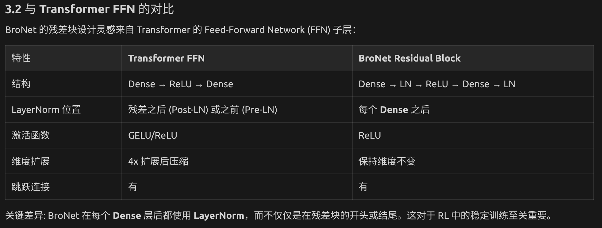

并且移除了CDQ的双Q值取min的悲观估计，因为正则化程度足够强。还有以下三个Trick：

1. **定期重置**: 维持网络可塑性，防止过拟合
2. **双 Actor**: 分离探索和利用
3. **Quantile Q-values:**   输出 $K$ 个离散的值（在 BRO 中我们默认设置 $K=100$），$\text{Uncertainty}^k = | Q_{\theta,1}^k(s, a) - Q_{\theta,2}^k(s, a) |$，$Q_{\theta}^o(s,a) = \text{Mean}(Q_1, Q_2) + \beta^o \times | Q_1 - Q_2 |$，Huber Loss，通过不确定程度计算入Q值作为乐观初始化来鼓励探索。

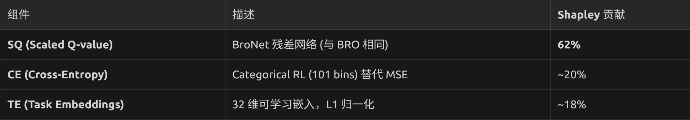

BRC用Shapley值来分析各个技巧对性能提升的贡献，梦回大美赛的时候用Shapley值来分析各个变量对预测值的贡献。然后给每个任务做了一个task_embedding。

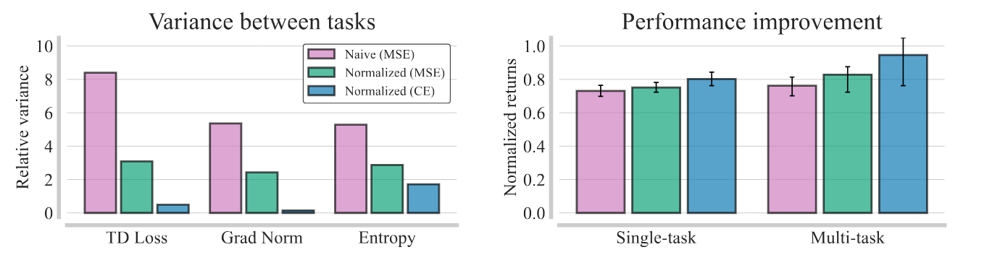

我的评分：⭐⭐

### [PPO Scaling / ](https://arxiv.org/pdf/2603.06009)​**[NoStagPPO](https://arxiv.org/pdf/2603.06009)**​[ (Preventing Learning Stagnation in PPO)](https://arxiv.org/pdf/2603.06009)

以下文字由AI生成，精简且合理：

> - **提出 PPO 外循环的随机优化视角:**   我们首次明确地将 PPO 抽象剥离为内外两层，并将外循环（收集数据与计算目标）等效为带噪声的凸优化问题 。我们证明了 PPO 的性能停滞，其本质上与 SGD 学习率过大导致的“在局部最优解附近剧烈震荡（Thrashing）”是同一种数学现象 。
> - **揭示并行度与内外步长的动态关系:**   我们定义了 **DDR (Data to Divergence Ratio)**  ，指出增加并行环境不仅能增加数据量（降低梯度噪声），还能隐式地增加“行为策略”的年龄，从而加强正则化（缩小外部步长）。
> - **提出极简的并行化扩展法则 (Scaling Recipe):**   我们推翻了目前社区在增加环境时盲目扩大 Minibatch 尺寸的习惯做法 。我们的配方是：**保持内循环参数（Minibatch Size 和 Learning Rate）绝对不变，仅增加优化的迭代步数（Number of Minibatches）**  。
> - **达到前所未有的验证规模:**   成功将 PPO 扩展至超过 **1,000,000** 个并行环境，并在开放式物理环境 Kinetix 中无停滞地训练了 **1万亿 (1 Trillion)**   个 Timesteps，碾压了之前的基础线 。
>
> 当环境数量 $N$ 增加导致数据量激增时，如何处理这批数据？
>
> - ❌ *错误做法 (会导致早衰):*   增加 Minibatch Size 并按平方根比例调大 Learning Rate。
> - ✅ *正确做法 (我们的配方):*   **固定 Minibatch Size，固定 Learning Rate，只增加 Minibatches 的总数。**   这保证了神经网络内部的优化曲率（Hessian）和动态特性不被破坏 。

由于笔者这这里知识薄弱了一些，还了解了一下异步PPO的实现：

> #### ✅ 正确做法：只增加 Minibatches 的总数（小步快跑）
>
> 我们的 Scaling Recipe 极其克制和保守：**内循环的微观环境什么都不变，只延长训练的时间（步数）。**  面对 3,200,000 个总数据，我们的做法是：
>
> - **固定 Minibatch Size**：依然维持在 1,000 ！
> - **固定 Learning Rate**：依然维持在 0.0003 ！
> - **增加 Minibatches 的总数**：变成 **3,200** 次（3,200,000 ÷ 1,000）。
>
> ### 异步 PPO 的“痛点”：策略严重滞后 (Policy Lag)
>
> 在真正的异步分布式系统中，通常会把程序拆分成 **Actor（采样节点）**   和 **Learner（训练节点）**  。Actor 永远在疯狂打游戏收集数据，Learner 永远在疯狂计算梯度，谁也不等谁。
>
> 这会引发一个 PPO 最害怕的灾难：
>
> - Learner 的更新速度极快，模型可能已经迭代了 10 个版本。
> - 此时，某个慢吞吞的 Actor 传回来了一批数据。这批数据是用 10 个版本前的“老古董策略”收集的。
> - PPO 的核心原理（Clip 机制）要求新旧策略不能差太远。面对这种极度滞后的数据，PPO 会觉得“动作概率差太多了”，直接触发 Clip 把梯度裁剪归零，导致这批数据完全被浪费，训练极度不稳定。
>
> ### 论文给出的解法：PPO-EWMA 机制
>
> 为了让 PPO 能完美适配异步系统，论文引入了 Hilton 等人发明的 **PPO-EWMA**（基于指数加权移动平均的 PPO）。
>
> 论文指出，在传统 PPO 中，“旧策略”其实被迫同时兼职干了两份工作 ：
>
> 1. **重要性采样的分母**：用来修正“收集数据时的老模型”和“正在更新的新模型”之间的概率差 。
> 2. **正则化的锚点**：用来限制新策略一次性不要跑得太偏 。
>
> **PPO-EWMA “解耦”**   ：
>
> - **数据收集归数据收集**：任凭 Actor 用什么老掉牙的版本收集数据，Learner 都老老实实拿它来算重要性采样比率（修正概率差异）。
> - **正则化锚点换成“平滑替身”**  ：Learner 不再以那个老掉牙的采样策略为锚点，而是自己在后台维护一个当前模型的   **“指数加权移动平均版本” (EWMA)**   。不管外面传进来的数据多乱，Learner 只跟自己平滑的过去版本（中心质心，Center of Mass）做对比，作为正则化约束 。

最核心的观点就是给强化学习的scaling law关键在于并行环境的数目。

我的评分：⭐⭐⭐

### [SMT](https://openreview.net/forum?id=haUOhXo70o)

Hard Tasks First:Multi-Task Reinforcement Learning Through Task Scheduling，对多任务RL确实得难任务优先。

### [MTRL FrameWork for 四足机器狗](https://www.tandfonline.com/doi/pdf/10.1080/21642583.2025.2498914)

把整个环境简化为几个参数，比如（台阶高度，沟壑宽度，阶梯频率）这种可以直观反映当前任务难度的数值吗，然后使用贝叶斯优化来探索当前合适的值，优化Gauss process model来自动生成课程。但是这种方法要求贝叶斯优化的超参数极少，而且一般的manipulation找不出可以这样可以量化任务难度的超参数，所以确实暂时只适用于机器狗阶梯行走这种场景。

我的评分：⭐⭐

## 10 findings

卡帕西630行代码炸出81个智能体，4天协作跑2333次实验，公布预训练十大发现。

> - <u>更多step始终优于更大的batch</u>
>
> 将batch_size减半从219 → 218，训练步骤加倍，BPB（Bits Per Byte）改善了0.007。
>
> - <u>简单的注意力模式就是最好的</u>
>
> 多个智能体独立发现并验证，<u>最终收敛到了一个窗口注意力模式：SSSL（3个短上下文层，1个长上下文层，重复）</u>。
>
> 过多的长层会浪费计算资源在全局注意力机制上，过少会导致跨token信息缺失。
>
> - <u>调整初始化比调整优化器更重要</u>
>
> 仅三项改动就带来了约0.004 BPB的改善：<u>value embedding使用正态初始化、QKV缩放倍率、</u>​**给残差连接（skip-connection）加上可学习权重**​<u>。</u>
>
> 这些改动都没有涉及到优化器，而在大模型预训练里，0.001都算有效。
>
> - <u>能学习的就别写死</u>
>
> 把固定常数替换为可学习参数，几乎总能提升性能。案例包括skip-2残差权重、残差混合的lambda系数、value embedding的门控参数。
>
> 即使在5分钟的短训练中，这些新参数也能收敛并产生收益。
>
> - 最优架构出人意料地小
>
> 群体智能在深度和宽度之间做了大范围探索，最终最优配置是：12层、维度512、aspect ratio 40。
>
> 加深网络很快就适得其反，16层带来84%更多的参数，但步数减少23%，BPB反而更差。
>
> - 大量“改进”其实是噪声
>
> 一个智能体专门跑了100组随机种子实验，发现种子方差约为0.002 BPB，这恰好是很多声称的”改进”的量级。换句话说，<u>之前很多“发现”可能只是运气好</u>。
>
> 有了这个结论后，智能体群体自发调整了行为：开始要求重复实验、多种子验证、独立确认。
>
> - 一些公认好技术直接翻车
>
> 几个实验产生了灾难性退化：<u>weight tying直接把BPB炸到3.216，label smoothing炸到1.32，PaLM风格的z-loss带来一致性退化</u>。
>
> 这些负面结果写进共享记忆后，成了整个集群最有用的知识，所有后来的智能体都自动避开这些坑，不再浪费算力重复踩。
>
> - 最大的机会可能还没智能体碰
>
> 1045次实验中，几乎所有改动都在改模型架构。但元智能体生成了1000多条关于数据管道的假设：课程学习、数据排序、领域特定批处理，一条都没被测试。
>
> <u>最大的突破可能根本不在架构上，</u>​**而在数据调度上**。
>
> - 集体记忆加速了发现过程
>
> 因为智能体共享实验结果，后来的智能体可以直接从已知最优配置出发，不用从头重新发现前人的工作。
>
> 几个关键突破来自那些综合了已有结果而非盲目探索的智能体，<u>证明共享记忆能显著加速研究进程</u>。
>
> 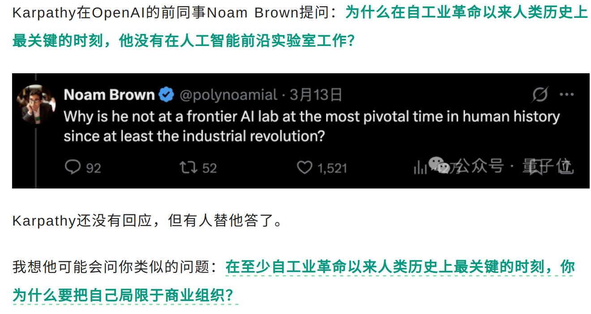
>
> autoresearch：
>
> https://github.com/karpathy/autoresearch
>
> autoresearch@home：
>
> https://ensue-network.ai/autoresearch?view=strategies
>
> auto-discovery：
>
> https://github.com/XinmingTu/auto-discovery
>
> 参考链接：  
> [1]https://x.com/christinetyip/status/2032590900107346327  
> [2]https://x.com/TuXinming/status/2032478765033701835

## 自动驾驶之心采访 -- zpgg

> BEV和Occ属于纯视觉方案，**表征方式已经比较成熟**。
>
> E2E打通了上下游视角，但是实际效果并没有PPT展示的那么好，相比两阶段模型（感知unimodel, 预测规划unimodel）没有真正的优势。
>
> VLA展示了解决corner cases的可能性。
>
> 拉更长的战线，我们是能看到模仿学习的上限，**研究自动驾驶地强化学习前路（也可能是新的）**  ，或许比研究模型结构该来改去更有意义。  **（新的应用方法和范式比新的模型架构更有意义）**
>
> VLA本质上也是一种端到端，不过更加直白和干净，很多方法也取消了传统端到端的复杂的3D感知任务。除了任务更简洁，VLA更重要的还是提供了一种解决corner case的可能性。
>
> 一个更值得研究的问题是如何用更小的模型实现接近大模型的性能。
>
> 重新整理，需要思考的两个问题：
>
> 1. 第一个问题，有没有这样的数据足够研究VLA在corner case上的表现呢？至少在学术界还是远远不够（不过今年waymo的challenge提供了很多比较难的示例）。而自驾厂商的数据，又因为商业壁垒和数据安全的问题，也没那么愿意或者容易分享出来。这就是一个很明显的学术界和工业界的gap。**学术界东拼西凑整理已有数据成一个大的数据，或者是仿真出来一堆工业界根本不用的数据，远远不能验证VLA或者用来长期迭代VLA。**
> 2. 第二个问题是避不开的效率问题，**模型大不能达到延迟要求，模型小又丧失了期望模型能达到的能力。**  所以业界和学界又提供了分层VLA这种折中的方案，当然也有一套人脑快慢系统的说辞用来做解释（似乎AI领域的人总喜欢从人身上找证据）。但是我非常相信这不是最终的解，**可能哪一天车端算力足够**，或者全任务对齐标注的数据最后多，这些都不再是问题，**合久必分分久必合**。所以问题就成了，对于当前上车的需求，一个更值得研究的问题是**如何用更小的模型实现接近大模型的性能(从这个观点可以看出，为什么SmolVLA是一个搞具身的人必读的工作,以及LeRobot为什么可以通用的多模态具身数据格式)**  。

## Action2Action Flow Matching

优化flow matching的初始分布在GreenVLA中已经提出。

## [VLA-Anatomy](https://suyuz1.github.io/VLA-Survey-Anatomy/#interactive-table-section)

在项目的页面，该课题组维护了一个weekly paper的列表，极力推荐。

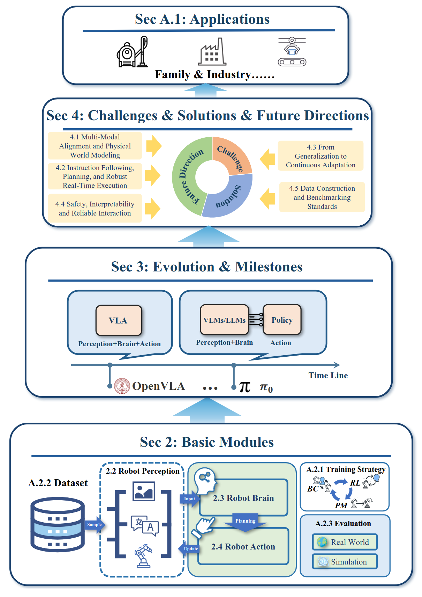

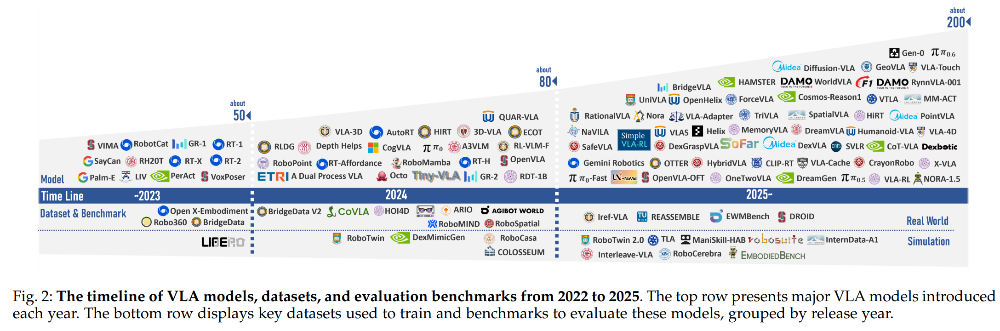

我的评分：⭐⭐⭐⭐

## [MaskedManipulator](https://arxiv.org/abs/2505.19086)

这篇论文的想要结局的核心问题是：“如何让物理仿真的人形角色，从**稀疏高层目标**（如"把物体放到坐标XYZ"）出发，自动生成**精确、自然、多样的全身操作动作**——在灵活性（versatility）与精确性（precision）之间取得平衡。”灵巧全身控制抓取。我对灵巧领域工作涉猎不够多所以先把Related Work码一下。

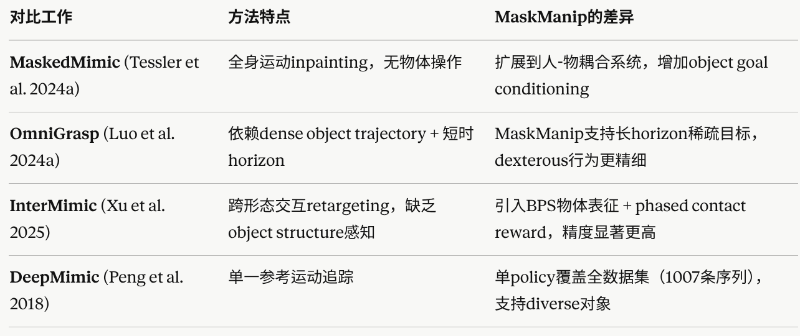

两阶段IL：第一阶段训练tracker 第二阶段DAgger 在线蒸馏 DP最优泛化。

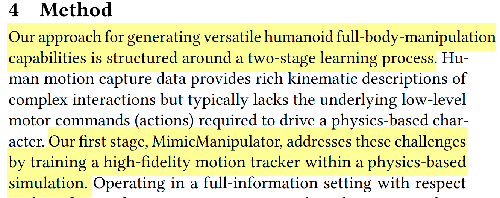

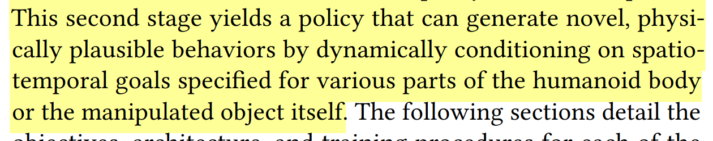

**C-VAE**和**Diffusion Policy**两种生成式架构建模多模态解空间。

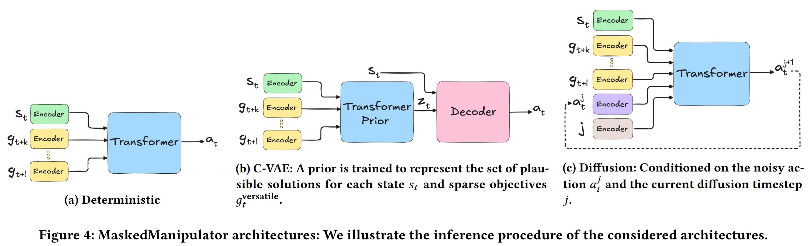

我的评分：⭐⭐⭐

## G3Flow

这篇论文尝试解决的主要问题如下：

> 当前 3D 模仿学习方法（如 DP3）过度依赖几何表征，缺乏语义理解，导致在两类关键场景下失败：
>
> - ​**Terminal-constrained manipulation**：需要感知物体特定部位（如鞋头朝向、瓶口朝向），纯几何点云无法区分语义部位
> - **Cross-object generalization**：训练对象与测试对象几何差异大时，基于形状的表征泛化能力极弱

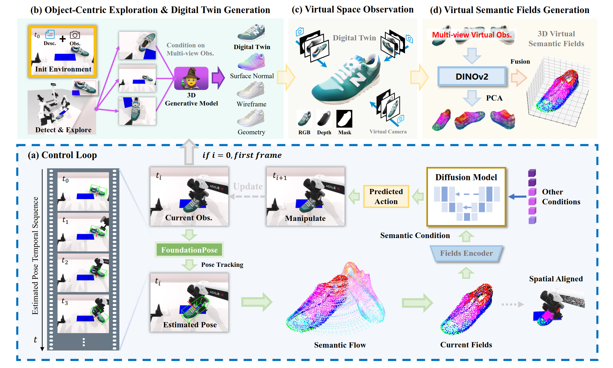

在虚拟孪生环境里面对DINOv2的输出采样语义特征点云P\_update [f\_s]，P\_update [f\_s] + 真实点云 [f\_r] + 关节状态 [f\_p]输入给DP3然后输出action。

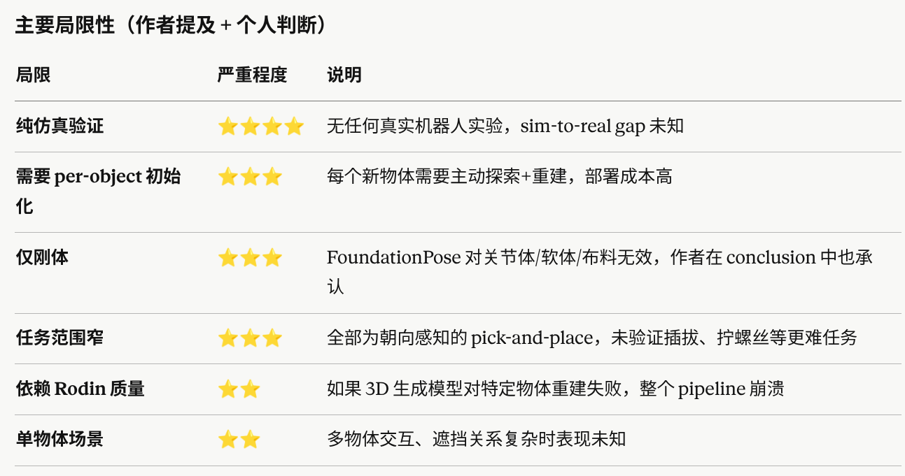

方法局限性挺明显的。成功率数字（如 Dual Shoes Place 仅 24%）即便"翻倍"也仍然偏低，实用部署价值低。

我的评分：⭐

## [SaPaVe](https://lmzpai.github.io/SaPaVe/)

CVPR 2026 Highlight. No Code.

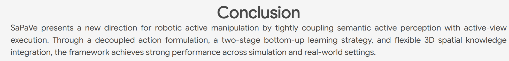

"Fixed-view assumption"是整个 VLA 领域的系统性盲点，SaPaVe 正确地指出并系统性地解决了它，而不是在已有 benchmark 上刷点数。

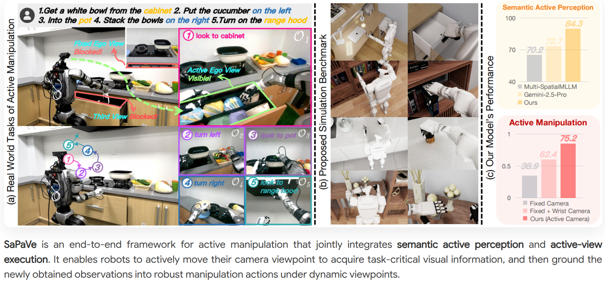

如上图，这个论文的核心创新点集中在Semantic Active Perception。

|​**EgoMI / ActiveUMI**（并行工作）|朴素地将相机运动并入统一动作空间finetune|这种做法破坏已有操作先验，数据需求爆炸|
| ------------------| ------------------------------------------| -----------------------------------------|
|**AP-VLM / RoboRetriever**|将主动感知建模为VQA，离散视角候选集|VQA无法连续控制相机pose，无法端到端操作|
|**Next-Best-View（NBV）方法**|信息增益最大化，非语义驱动，非端到端|无法处理语义指令，pipeline割裂|

**核心动机**：相机运动是**embodiment-agnostic**（与机器人本体无关）且比操作更易学习，可以利用大规模合成数据预训练，然后再迁移到操作任务——bottom-up 策略。

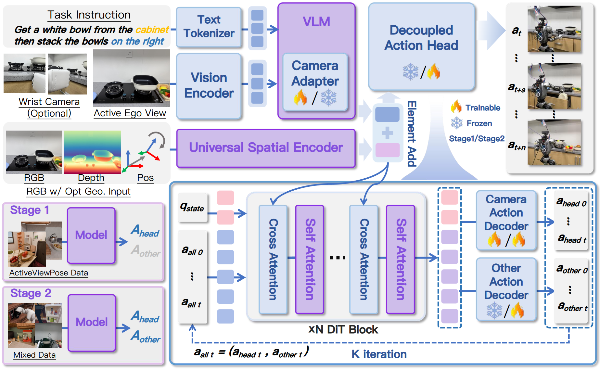

如上图,Method将相机动作（$A_{head} \in \mathbb{R}^2$，pitch/yaw）与操作动作（$A_{other} \in \mathbb{R}^{26}$，26-DoF关节）完全解耦为独立的 action head。

- ​**Stage 1**：仅用 ActiveViewPose-200K 训练 Camera Adapter + Camera Action Decoder，建立语义主动感知先验；
- **Stage 2**：冻结 Camera Adapter，用混合数据（感知数据+操作数据）联合训练 Decoupled Action Head。

"相机运动是 embodiment-agnostic"是一个真正有 insight 的观察，仅2B参数在语义感知任务上击败 Gemini-2.5-Pro，印证了"专用数据+正确的inductive bias \>\> 模型规模的暴力涌现"。论文承诺开放数据集与Benchmark。

我的评分：⭐ **⭐**

‍

## [EgoScale](https://research.nvidia.com/labs/gear/egoscale/)

第一视角的人类操作数据将在以后具身foundation model的预训练中发挥不可替代的作用，成为具身数据金字塔的核心部分。

|工作|数据规模|手部精度|核心差异|
| ----------| --------------| ---------------| ------------------------------------|
|EgoMimic|\~百小时|Gripper|小规模，无高DoF手部|
|EgoVLA|中等规模|指尖SE(3)→IK|本文用retargeted关节空间，精度更好|
|DexWild|中等|高DoF|无系统性scaling实验|
|GR00T N1|大规模机器人|多具身|本文专注人类数据预训练路径|
|**EgoScale**|**20,854小时**|**22-DoF关节空间**|**量级突破 + scaling law + mid-training recipe**|

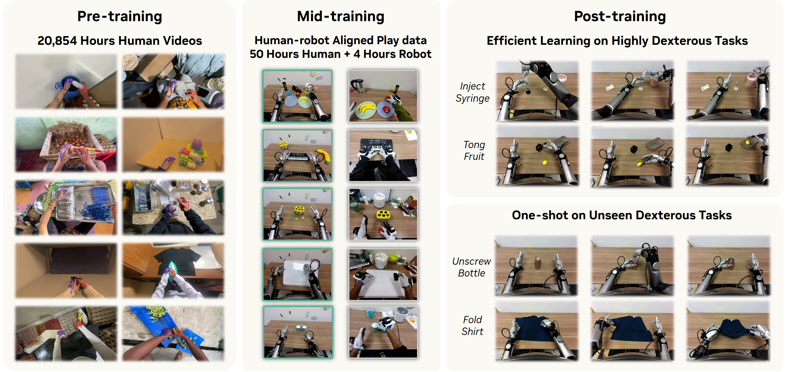

发现 human action prediction 验证损失与数据量满足：

$$
\mathbf{L = 0.024 - 0.003 \cdot \ln(D)}, \quad R^2 = 0.9983
$$

Retargeted关节空间（22-DoF）也很重要。Mid-training 后，仅用**1个机器人演示 + 100个对齐人类演示**即可泛化到从未见过的任务（Fold Shirt: 88%成功率，Water Bottle Unscrew: 55%成功率）。这种能力既不来自单独的人类预训练，也不来自单独的mid-training，只在两者组合时涌现。人类运动先验是**具身无关（embodiment-agnostic）** 的。

我的评分：⭐ **⭐** ⭐ **⭐** 

‍

## [RISE - Kai0RL](https://opendrivelab.com/RISE/)

### Advantage 补课

#### Advantage 数学本质

**定义只有一个，永远是：**

$$
A^\pi(s, a) = Q^\pi(s, a) - V^\pi(s)
$$

直觉含义：**在状态** **$s$** **下采取动作** **$a$**​ **，比按策略** **$\pi$** **随机采样一个动作，平均好多少？**

所以 $A > 0$ 意味着"这个动作比平均好"，$A < 0$ 意味着"比平均差"。

**这个定义从未变过。**  各种变体只是在回答一个实践问题：**在有限数据/有限 rollout 下，如何估算这个量？**

#### Advantage的各种估算器

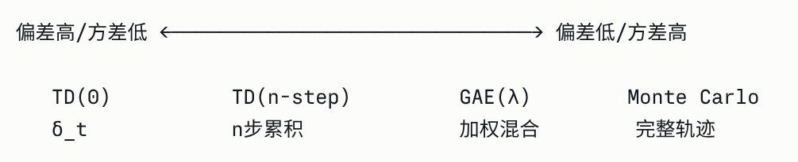

#####  TD(0) Advantage（一步时序差分误差）

$$
A_t \approx \delta_t = r_t + \gamma V(s_{t+1}) - V(s_t)
$$

- 只看一步 reward + bootstrap
- 低方差，但严重依赖 $V$ 的准确性（高偏差）
- PPO 里也叫 "TD residual"

#####  Monte Carlo Advantage

$$
A_t = G_t - V(s_t), \quad G_t = \sum_{k=0}^{T-t} \gamma^k r_{t+k}
$$

- 用完整轨迹的真实回报减基准线
- 无偏，但方差极高（尤其长程任务）
- 只适合 on-policy，episode 必须结束

##### GAE（广义优势估算，PPO 标配）

PPO 用的是 GAE，这才是那个"长长的迭代公式"：

$$
A_t^{\text{GAE}(\lambda)} = \sum_{k=0}^{\infty} (\gamma\lambda)^k \delta_{t+k}
$$

展开：

$$
= \delta_t + \gamma\lambda\,\delta_{t+1} + (\gamma\lambda)^2\delta_{t+2} + \cdots
$$

实际实现是从后往前递推：

$$
A_T = 0
$$

$$
A_t = \delta_t + \gamma\lambda \cdot A_{t+1}
$$

**$\lambda$** **是偏差-方差的旋钮：**

- $\lambda = 0$：退化为 TD(0)，$A_t = \delta_t$（低方差，高偏差）
- $\lambda = 1$：退化为 Monte Carlo，$A_t = G_t - V(s_t)$（无偏，高方差）
- 实践中 $\lambda = 0.95$ 是常见选择

**GAE 的本质：**  不信任单步 TD 的精度，但也不信任长程 rollout 的稳定性，于是对 $k$ 步的 TD 误差做指数衰减加权平均。

##### Q-V Advantage（用显式 Q 网络）

$$
A(s, a) = Q_\theta(s, a) - V_\phi(s)
$$

或者只用 Q 网络时：

$$
A(s, a) = Q_\theta(s, a) - \mathbb{E}_{a' \sim \pi}[Q_\theta(s, a')]
$$

SAC、TD3 等 actor-critic 方法属于这一类。

#### 具身 RL 的特殊变体：Stage-Aware / Progress Advantage

这是 RECAP、π\*₀.₆、RISE 所在的领域。具身操作任务有一个特殊性：​**奖励极度稀疏**（通常只有最终 success/fail 一个信号），而任务很长（几十到几百步）。

标准 RL 的 $r_t$ 在中间步骤全是 0，GAE 等估算器退化为全零或纯噪声。

**解决方案：引入 Progress（任务进度）作为稠密代理奖励/价值函数。**

RECAP / π\*₀.₆ 的做法（也是 RISE value model 的 warm-start）：

$$
V(o_t, \ell) \approx \frac{t}{T}
$$

即训练一个 VLA backbone 来预测当前观测处于整个 episode 的哪个时间进度（0 到 1 的连续值），用以下 loss：

$$
\mathcal{L}_{\text{prog}} = \mathbb{E}\left[(V(o_t, \ell) - t/T)^2\right]
$$

对应的"Stage-Aware Advantage"就是：

$$
A_{\text{prog}}(o_t, a_t) = V(o_{t+H}) - V(o_t)
$$

即"执行完这个 action chunk 之后，任务进度推进了多少"。

**优点：**  稠密、无需人工设计奖励、语义自然对齐  
**缺点：**  单调平滑，对失败不敏感（你掉了杯子但进度还显示 80%）

这就是为什么 RISE 在上面叠加了 TD learning：

$$
\mathcal{L}_{\text{TD}} = \mathbb{E}\left[(V(o_t) - (r_t + \gamma V(o_{t+1})))^2\right]
$$

其中 $r_t = 0$（中间步），成功结束 $r_T = +1$，失败结束 $r_T = -1$。这让价值函数对关键失败动作敏感。

下面是表格整理：  

|方法|Advantage 的估算量|需要什么|适用场景|
| ------| --------------------| --------------------------------| ----------------------|
|**TD(0)**|$r_t + \gamma V(s_{t+1}) - V(s_t)$|学习的 V，单步 reward|在线 AC 方法|
|**GAE**|$\sum (\gamma\lambda)^k \delta_{t+k}$|V 网络 + rollout 轨迹|PPO 标配|
|**Monte Carlo**|$G_t - V(s_t)$|完整 episode|短程任务|
|**Q-V**|$Q(s,a) - V(s)$|显式 Q + V 网络|SAC / offline RL|
|**Progress**|$V_{\text{prog}}(o_{t+H}) - V_{\text{prog}}(o_t)$|VLM 进度估算器|稀疏奖励操作任务|
|**RISE chunk-wise**|$\frac{1}{H}\sum V(\hat{o}_{t+k}) - V(o_t)$|进度+TD value + dynamics model|imagination-based RL|

### 范式初探

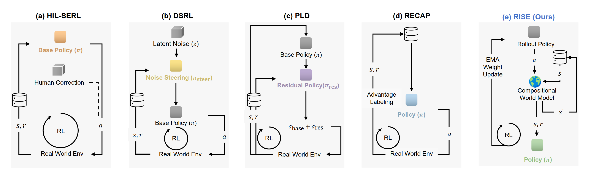

就更精细的操作而言，比如流体操作，打螺丝这种操作，当前的世界模型肯定是应付不来的，即使是一般操作任务应对分布外情况也会生成违背物理规律的内容，RISE只是初步展示了这个范式的可能性。

我的评分：⭐ **⭐** ⭐

‍

## [DexHandDiff](https://dexdiffuser.github.io/)

关于灵巧手规划器的论文（规划器可以用来生成数据或者提供轨迹prior，trajectory-level generative policy prior），其核心动机如下：

> **灵巧操作不是“目标状态插值”问题，而是“通过手-物-环境接触链条实现目标”的物理交互问题。**   
> 所以扩散模型不能只幻想 object state，而必须建模 hand state、object state、action 之间的耦合。

把轨迹建模为：

$τ = [(a₀, s₀), (a₁, s₁), ..., (a_T, s_T)]$  

其中 state 包括灵巧手状态和物体状态，action 是可控手部状态变化。这样它既不像 Diffuser 那样只生成状态，也不像 Diffusion Policy 那样只生成动作，而是把 **状态目标可引导性** 和 **动作执行物理性** 合并。

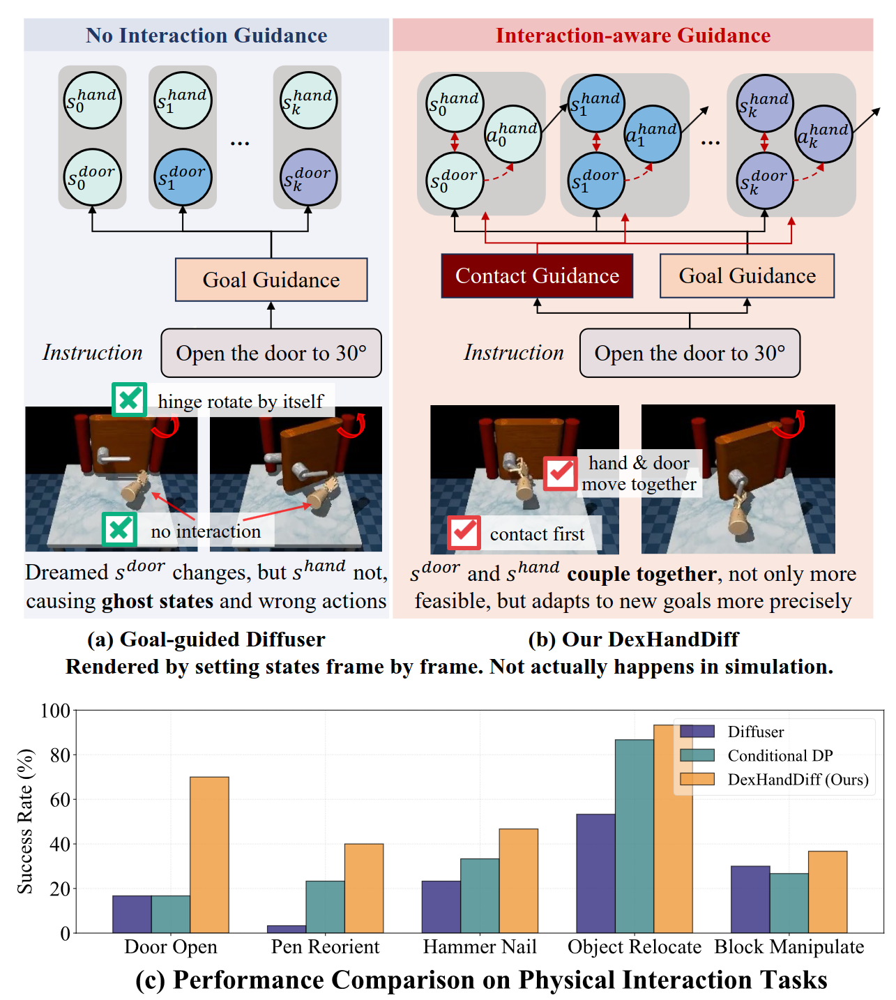

DHD 的方法的insight：**接触前和接触后的优化目标不同**。

接触前，不能直接推物体状态，否则就会 ghost state；此时应该引导手靠近关键接触点，比如门把手、锤柄、物体中心。

接触后，手和物体已经形成耦合，才可以引导 hand-object system 一起朝目标状态变化。Fig. 3 如下图展示了这个流程

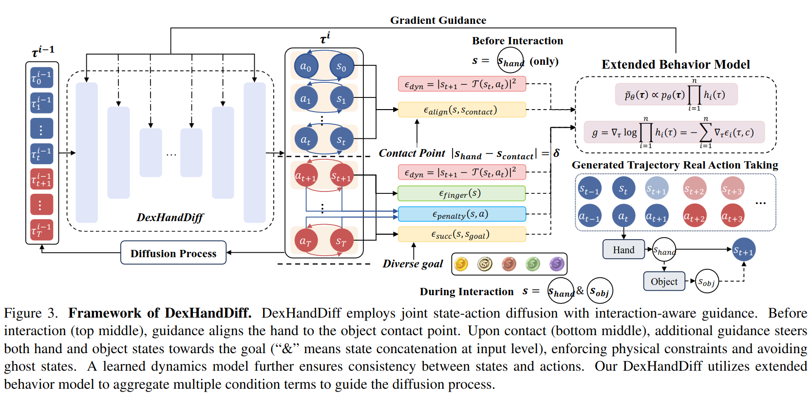

行为约束用的是energy based  guidance，比较有意思的是用LLM来写guidance function，DHD 用两阶段 LLM pipeline：先根据函数目的、环境描述、函数原型、任务指令、few-shot hints 等生成 task-specific prompt，再让另一个 LLM 写 guidance function code。论文报告说，这把人工设计 energy function 的试错次数从约 20 次降低到约 5 次。技术细节较多，如果做相关工作复现以及增量式实现时再读。

我的评分：⭐ **⭐** ⭐

## [TinyVLA](https://tiny-vla.github.io/)

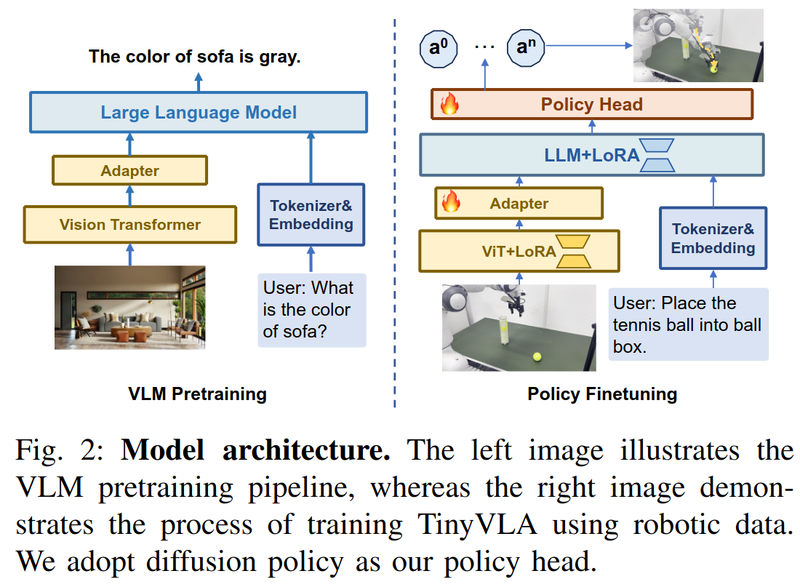

关键insight是：**VLM的视觉-语言对齐能力并不需要7B规模才能获得**，亚1B模型已经足以为机器人策略提供强语义条件。结合Diffusion Policy避免自回归解码，TinyVLA-1B的单步推理仅14ms vs. OpenVLA-7B的292ms。

OpenVLA需要在970K条OpenX轨迹上预训练，TinyVLA直接用VLM的视觉-语言预训练权重初始化，仅用LoRA（5%可训练参数）在目标任务的100条轨迹上微调即可。这不仅降低了训练成本，还避免了预训练数据bias的问题——例如OpenVLA在双臂任务上完全失败（0%成功率），因为OpenX只有单臂数据。

在指令泛化（3级递增难度）、视角泛化（±30°）、背景/光照/干扰物/物体外观/空间位置等6个维度上全面测试，证明VLM预训练知识确实迁移到了策略中。

我的评分：⭐ **⭐**

## [SmolVLA](https://github.com/huggingface/lerobot)

|对比对象|差异所在|
| -----------------------------| --------------------------------------------------------------------------------------------------------------------------------------------------------------------|
|​**π0**（Black et al., 2024）|π0用PaliGemma-3B全量VLM + 扩散动作专家，参数3.3B，训练数据10,000小时机器人数据；SmolVLA砍掉VLM后半层、仅用450M参数、社区数据23k轨迹，推理速度快40%，显存占用仅1/6|
|​**OpenVLA**（Kim et al., 2024）|7B参数、离散动作token、连续控制性能受限；SmolVLA用flow matching输出连续动作chunk，性能更优且参数量仅为其6%|
|​**TinyVLA**（Wen et al., 2024）|\<1B参数但从头在多模态数据上训练，缺乏大规模机器人预训练；SmolVLA使用预训练VLM骨干并在社区机器人数据上预训练，泛化更强|
|​**GR00T N1**（Bjorck et al., 2025）|纯cross-attention连接VLM与动作专家；SmolVLA发现**交错CA+SA**优于单一机制|

### 计算量压缩

1. ​**Layer Skipping**​：仅使用VLM前N\=L/2层（16层，丢弃后半），避免从最后一层取特征——有实证支持最优特征不在最后层（El-Nouby et al., 2024; Bolya et al., 2025）；
2. ​**Visual Token Reduction**​：禁用image tiling，用pixel shuffle将每帧视觉token压缩至​**64个**；
3. ​**Interleaved CA+SA Action Expert**：动作专家交错使用cross-attention（与VLM特征交互）和causal self-attention（动作token间依赖），比纯CA或纯SA都更优，且causal mask防止未来动作泄露；
4. **缩小Action Expert隐层**：hidden size设为VLM维度的0.75倍。

### 异步推理

将**PolicyServer**（跑推理）与**RobotClient**（执行动作）解耦，通过threshold参数g控制触发新推理的时机。核心算法保证：

- g\=0.7时：队列消耗30%即触发新推理，实现overlap，消除idle lag；
- 引入​**joint-space similarity filter**，丢弃近似重复观测，避免无效推理调用；
- 推理可在远程GPU服务器执行，机器人本体无需算力。

实测：比synchronous推理快 **~30%** （9.7s vs 13.75s），固定时间内完成pick-place任务数翻倍（19 vs 9）。

### 社区数据

SmolVLA用的社区数据，指的是**普通开发者/研究者用自己的低成本机器人（SO-100，几百美元的3D打印臂）在家里、实验室、桌面上采集的数据**，然后上传到Hugging Face Hub共享。你可以理解为：这是机器人领域的"GitHub用户上传的代码"，而不是Google/DeepMind实验室里标准化采集的数据。数据质量参差不齐场景多样性好反而有泛化性。

为解决数据异质性问题：

- 用**Qwen2.5-VL-3B-Instruct**自动重新生成任务描述，修复模糊标注；
- 手动标准化相机视角命名（top/wrist/side → OBS\_IMAGE\_1/2/3）。

培养研究品位的好工作，idea一定要展现实际应用部署落地价值。

我的评分：⭐ **⭐** ⭐ **⭐** 

## [DexVLA](https://dex-vla.github.io/)

VLA预训练，效果很好但是规模有限，但是也暗示VLA预训练的上限还远远没有达到，无论是数据还是架构都有很大的探索空间。

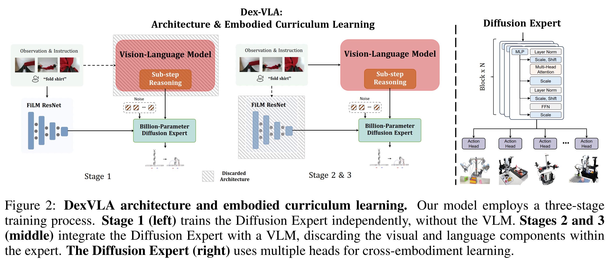

Scaling Parameter + multi-head(每个机器人形态对应一个) + 三阶段课程学习 + Implicit Substep Reasoning（通过FiLM将推理Token注入扩散专家）+ zero shot(灵巧手至夹爪人为强行对齐)。方法本身和实验地局限性挺多的，Claude老师列举如下：

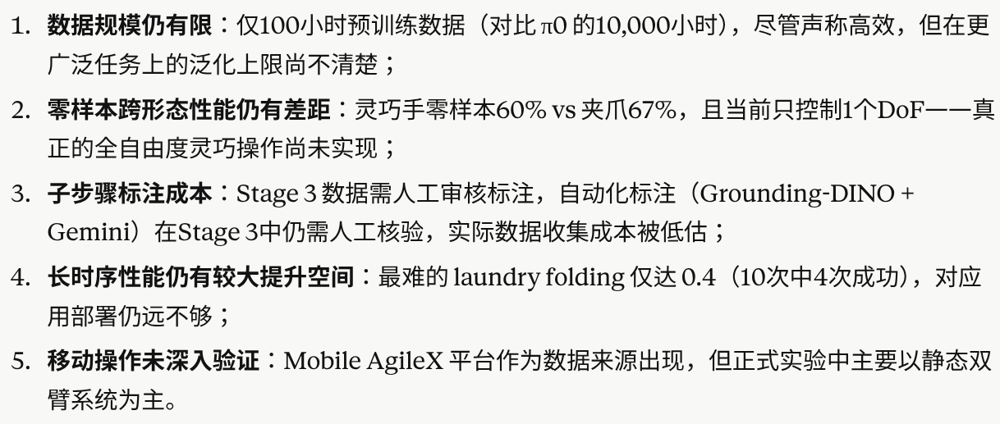

我的评分：⭐ **⭐**

## [DexGraspVLA](https://dexgraspvla.github.io/)

> #### ​**Domain-Invariant Representation Pipeline**（领域不变表征流水线）
>
> ​**最核心的理论洞见**​。整个系统设计围绕一个命题：*domain shift 是 imitation learning 泛化失败的根因；消除它，泛化自然涌现。*
>
> 具体路径：
>
> - ​**语言层**：VLM（Qwen）把任意自由格式 prompt → 标准化 bounding box（格式不变）
> - ​**视觉层**​：冻结 **DINOv2** 把任意外观的图像 → 语义一致的 patch feature
> - ​**目标层**：SAM + Cutie 把 bbox → 连续追踪的 binary mask
>
> 三级迭代转化，每一步都是从 domain-varying → domain-invariant。
>
> ​**最关键的设计选择**：
>
> 1. ​**DINOv2 必须冻结**——消融实验显示，trainable DINOv2 反而更差（34.8% vs 98.6%），因为 fine-tune 破坏了其泛化特征
> 2. ​**bbox 作为双层桥梁**——而非直接传递语言 embedding，格式统一是泛化的关键
> 3. **DiT 而非 U-Net**——用 cross-attention 融合条件，更适合高维序列条件

基于 DINOv2 + SAM + Cutie + DiT + Qwen VLM 的系统集成，核心新增工程量在于多模态融合层（MLP projectors）和 DiT action head 的训练，实现了大规模零样本泛化验证。也验证了冻结预训练权重做好小部分关键内容的设计和训练上限其实很高，而后训练带着所有参数一起训练有一定浪费算力以及参数量其实高度冗余的嫌疑。

我的评分：⭐ **⭐⭐** 

## [GR-2](https://gr2-manipulation.github.io/)

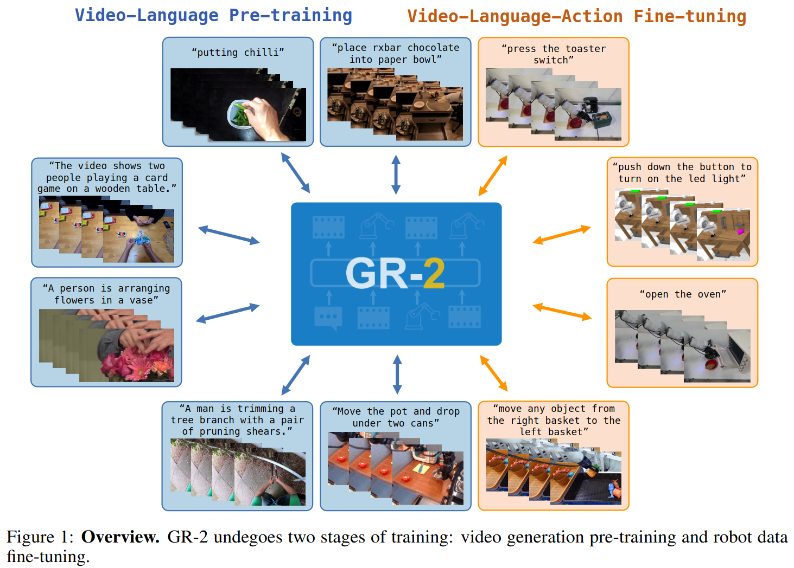

大规模视频预训练并且应用了一些生成式架构。

我的评分：⭐ **⭐**

## [OminiXtreme](https://github.com/Perkins729/OmniXtreme)

感兴趣了解一下的Related Work:

> |代表前沿工作|主要策略|核心局限|
> | ---------------------| ---------------------------| --------------------------------------------|
> |**OmniH2O**[He et al., 2024]|从头 RL 多动作联合训练|gradient interference，高动态动作保真度低|
> |**BeyondMimic**[Liao et al., 2025]|Guided Diffusion + RL|聚焦追踪接口，未解决大规模扩展和高速敏捷性|
> |**ASAP**[He et al., 2025]|单动作高保真 RL imitation|不具备多动作统一策略的扩展能力|
> |**GMT / ExBody2**|大规模 RL 多动作追踪|高动态动作保真度依然有限，sim-to-real 困难|

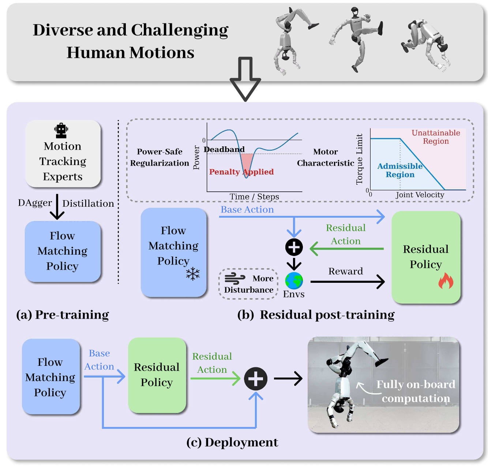

将"表征学习"与"多动作 RL 优化"解耦——前者用 **Flow Matching + DAgger 蒸馏**解决，后者用**轻量 Residual RL 精炼**解决 sim-to-real 的执行器非线性问题。

我的评分：⭐ **⭐**

## Benchmark: [MetaWorld](https://arxiv.org/abs/1910.10897) && [MetaWorld+](https://arxiv.org/abs/2505.11289)

任务够多但是是State Based的，一些模仿学习算法以及新方法并没有灵活的支持接口，老Benchmark了。

## [Learning Long-Context Diffusion Policies via Past-Token Prediction](https://long-context-dp.github.io/)

属于模仿学习序列建模的工作，大大提升模仿学习算法在long-horizon Task上的能力。但是模仿学习问题有时数据生成方法比架构更重要，这个工作是故意选了一些必须依赖历史时序信息的任务。

> 现有 Diffusion Policy 在引入长历史上下文（long-context history）后性能不升反降的问题。核心发现是：diffusion policy 存在**时序动作依赖不足**（temporal action dependency underuse）的现象，与经典的 copycat 问题方向相反，是一个此前未被明确揭示的新问题。
>
> |相关工作|做法|本文的不同|
> | ------------------------------------------------| ---------------------------------------------| -----------------------------------------------------------------|
> |**Diffusion Policy**[Chi et al., RSS'23]|short-context, action chunking|本文在其基础上引入长历史建模，发现其时序依赖不足|
> |**TraceVLA**[Zheng et al., 2024]|将历史观测压缩为视觉轨迹 prompt|本文不依赖人工设计的历史压缩，而是通过辅助任务隐式正则化|
> |**Bidirectional Decoding**[Liu et al., 2024，即同组作者的前作]|利用 action chunk 内的一致性进行 resampling|PTP 用的是已执行动作的 ground-truth 来做 test-time 验证，更稳健|
> |**copycat 方法**[Wen et al., NeurIPS'20]|对抗性正则化抑制过度依赖历史动作|本文解决的是​**相反的问题**：diffusion policy 对历史依赖不足|
> |**action tokenizer 方法**[Fu et al., 2024; Radosavovic et al., CoRL'23]|自回归 token 建模|PTP 在 diffusion policy 框架内解决，无需设计 tokenizer|
>
> **核心动机：**  发现了一个被社区忽视的反直觉现象——现代扩散策略的时序动作预测能力比专家演示弱 10x\~100x，而非 copycat 那样"太强"，进而提出 PTP 来显式修复这一缺陷。

我的评分：⭐ **⭐**

## [FRoM-W1: Towards General Humanoid Whole-Body Control with Language Instructions](https://openmoss.github.io/FRoM-W1/)

"语言→人体运动→机器人执行"的三段式流水线范式。

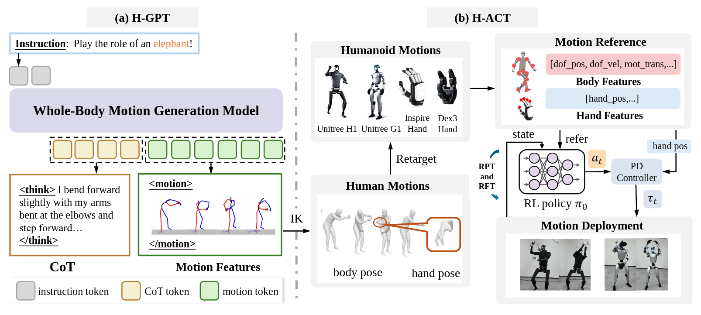

设计选择如下：

> - ​**人体运动作为中间表示**：规避了机器人语言标注数据稀缺的根本问题。
> - ​**CoT作为语义桥梁**：不是传统的 prompt engineering，而是把 CoT 作为训练数据的一部分进行联合学习。
> - ​**推理期RL微调**：将 test-time compute 引入机器人控制，与通常只做预训练的工作显著区别。
> - **手部不加入RL训练**：手部自由度过多会降低RL训练效率，手部采用直接重定向的方式处理，这是一个工程权衡。

方法本身局限性很多，比如手部弱化，CoT数据质量不行，Sim2Real 仍有失败，成功率偏低。但是值得注意的亮点如下：

> ① ​ **"人体运动作为统一中间表示"的架构观念**，逻辑优雅——它不需要机器人语言数据，借人类数据的海量优势，同时天然支持多平台迁移。
>
> ② **推理期RL微调（RFT）作为对生成噪声的后处理手段**——生成模型的输出不直接可执行，用短时专项RL把"够用的生成运动"变成"机器人能稳定执行的运动"，这个设计很务实。

我的评分：⭐ **⭐**

## [Omnireset](https://weirdlabuw.github.io/omnireset/)

EMERGENT DEXTERITY VIA DIVERSE RESETS AND LARGE-SCALE REINFORCEMENT LEARNING

**sim-to-real灵巧操作（dexterous manipulation）**  + **大规模并行RL**

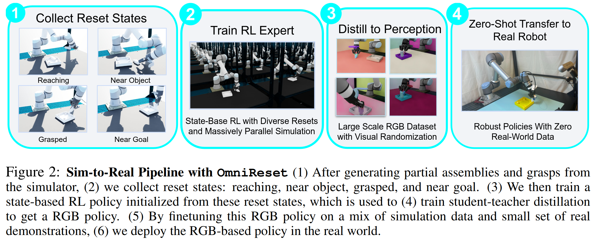

核心是初始状态的随机化，并且系统提出4种初始随机化，值的学习。

我的评分：⭐ **⭐⭐**

## [VLA-InfoEntropy](https://arxiv.org/html/2604.05323v1)

VLA推理加速，对不VLA RL和部署中学习推理加速还是挺有意义的。通过熵指标优化token selection strategy。

首次在 VLA 加速中同时引入**视觉熵** **$\tilde H_{\text{img}}$**（基于灰度直方图，度量 token 本征信息量）与**注意力熵** **$\tilde I_{\text{attn}}$**（基于 text→vision cross-attention 分布，度量任务相关性）。两者均为 training-free、闭式计算，且经最大熵归一化后可直接相加融合。

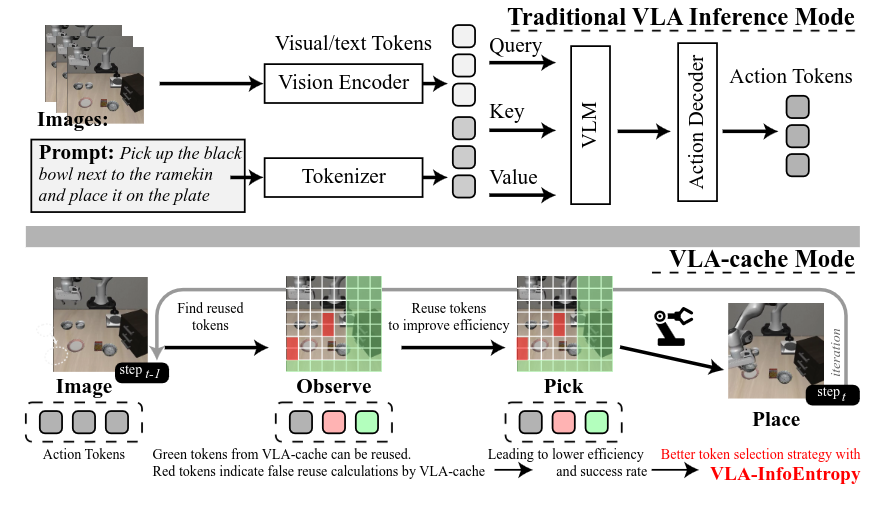

**时间步感知的动态过渡选择策略**  
设计线性调度 $\alpha = t/T$，让 $k_{\text{vis}}(t)$ 从大到小、$k_{\text{attn}}(t)$ 从小到大，使推理在 rollout 早期偏重"全局视觉扫描"、后期偏重"指令相关局部细节"，模拟人类视觉"先全局后局部"的认知过程。这是对 VLA-Cache 等**静态**选择策略的关键改进。

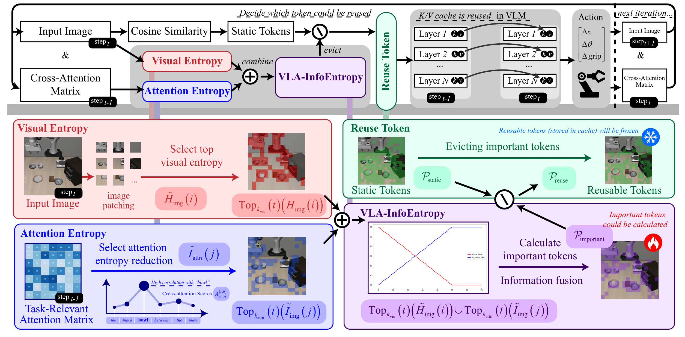

|指标|OpenVLA baseline|VLA-Cache|**Ours**|
| ------------| ------------------| -----------| --|
|平均成功率|75.0%|74.7%|**76.4%**|
|Latency|51.91|34.38|**31.25**|
|FLOPs|1.864|1.355|**1.214**|
|Speedup|1.00×|1.38×|**1.53×**|

在 Spatial / Object / Goal 上均取得 SOTA；​**LIBERO-Long 上 52.2% 略低于 SP-VLA 的 54.2% 和 Spec-VLA 的 55.0%** （作者归因于长程误差累积）。

- ​**消融（Table II，非常干净）** ：

  - 仅视觉熵：69.8%（最差，证明单纯看纹理会漏掉语义关键 token）
  - 仅注意力熵：73.9%
  - 静态组合：75.8%
  -  **+ 时间步动态调度：76.4%**  → ​**证明时间维度是真正把"组合"推上 SOTA 的关键**。
- **敏感性（Fig. 4 + Table III）** ：$T=100$、$k_1/k_2=40/60$、总 token 数 100 是甜蜜点；token 数超过 100 后成功率饱和但延迟显著上升。

我的评分：⭐⭐

‍

## [Evo-1](https://github.com/MINT-SJTU/Evo-1) && [Evo-RL](https://github.com/MINT-SJTU/Evo-RL)

这个工作显然是追随SmolVLA做的工作，声势上不如SmolVLA影响力大，有点刻意在刷轻量的SOTA，学习了解一下架构和训练设计就OK。

|对比对象|参数|机器人预训练|控制频率|核心差异|
| ----------| -------| --------------| ------------| --------------------|
|OpenVLA|7B|✅ OXE|\~8 Hz|语义表征严重退化|
|π0|3.5B|✅ 大规模|\~11 Hz|重度预训练依赖|
|SmolVLA|2.25B|❌|\~13 Hz|性能不稳定，泛化弱|
|TinyVLA|1.3B|❌|—|MetaWorld仅31.6%|
|**Evo-1**|**0.77B**| **❌**|**16.4 Hz**|**语义保留+无预训练+SOTA**|

- ​**Stage 1：冻结 VLM**，只训练 integration module 和 action expert，让 action head 先适配 VLM embedding。
- **Stage 2：解冻全模型**，做 joint fine-tuning。

Evo-1 的 claim 不是“完全没有预训练”，而是**没有做机器人数据预训练**。它仍然依赖 InternVL3-1B 这种多模态 VLM 预训练 backbone。这个区别很重要：Evo-1 的价值在于把互联网/多模态语义能力高效迁移到机器人控制，而不是从零学习机器人 foundation model。

有关 Mid Layer Cross Attention -- **“中层特征 + 状态作为 KV，动作作为 Q”**   
它让动作生成器持续读取稳定的语义上下文，而不是在不同层之间换条件或插入打断信息流的 self-attention。

总之是又强调了一遍在VLA后训练中，保护预训练知识并且充分利用好预训练能力的重要性，全量微调整个VLA的后训练现在是不被我看好的。

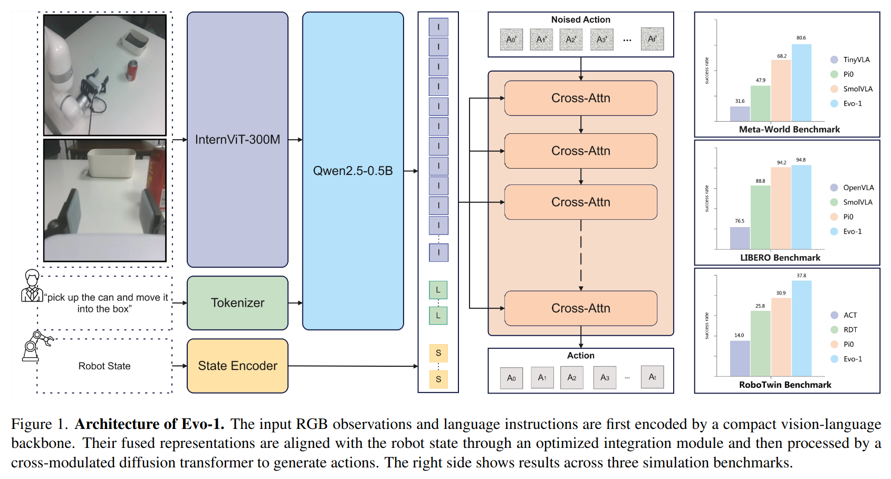

我的评分：⭐⭐

## [Smash](https://mmlab.hk/Smash/)

**用可扩展全身技能学习 + 自我中心视觉，让人形机器人打乒乓球并完成 smash 类高动态击球**。

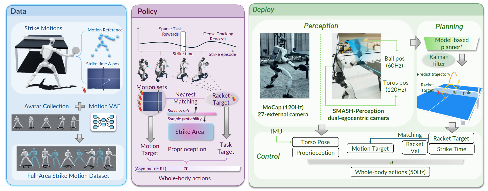

Method被分为**Data / Policy / Deploy** 三块：Data 负责生成覆盖击球空间的动作库，Policy 负责将任务目标和动作先验耦合，Deploy 负责用 ego perception 提供实时球和身体状态。这类高动态物体操作，数据，策略和硬件部署三者有一个出问题就会做不好，所以该工作是相当solid的。

先用生成模型把稀疏 mocap 扩成覆盖任务空间的“全身击球动作库”，再根据当前任务目标检索最匹配的动作先验，并用 RL 学一个既满足击球目标、又受动作先验约束的全身控制策略。是一个全栈工程的强大工作，Motion-VAE， YOLO+Kalman，等等技术细节值得在做相关事情的回顾学习。

我的评分：⭐⭐⭐⭐⭐
