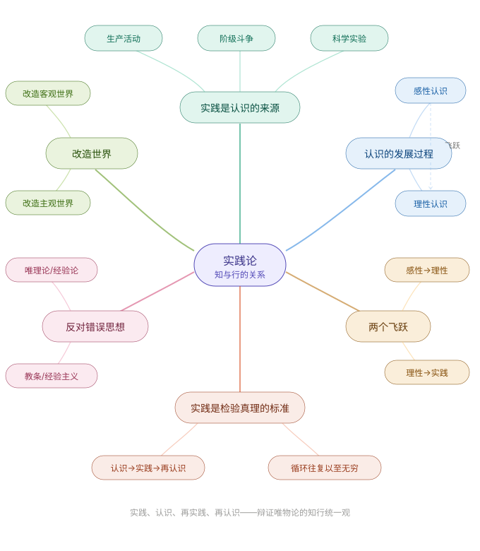

### 写在前面

重新开始读毛选，是因为我在大二时也因为阅读毛选而感受到自己的认知和行为的受益，但是因为书中很多关于军事革命的内容抽象化为道理然后再将道理运用到生活和学习中，这个近似硬啃书的过程过于的困难所以十分艰难地读完毛选第一卷就放弃往后读了。在我最近利用research的空闲时间爽读完《三体》，被大刘的文采和想象力所震撼后，生活感受到了一种“缺少”的空虚，少了智子和水滴，少了核聚变动力飞船，少了光速曲率飞船，少了韦德，少了大史罗辑庄严和孩子，少了联合国女秘书长，少了章北海，少了叶文洁和杨冬，少了汪淼和丁仪，少了一点对未来的期望。多年以后，我还会记得在嘈杂的列车上读到罗老师带庄严前往雪山的场景，那片纯白雪峰蓝调时刻的景色描写让我内心随着想象瞬间进入了极度的平静；我还会记得读到章北海利用陨石子弹击杀科学家时的意外，因为在这之前我真的以为他仅仅是一个无脑的傲慢的信仰毫无依据的军人；我还会记得韦德的“前进！前进！不择手段的前进！”在那个早晨给我带来的冲击力，这样的枭雄的精神力量让我也有不择手段前进的冲动；我也会记得叶文洁的遭遇，记得伊文斯看到自己多年来种植的树木一颗一颗倒下时的无力，记得章北海说出“自然选择号，前进四。”的那一刻，这些涌动会在未来的任一刻指引我，追求科学技术以及精神力量。我的文字实在是匮乏，下面粘贴一断我喜欢的序言，向大刘表达敬意。

> 多年以后，我还会记得看完《三体》的那个秋夜，我走出家门，在小区里盘桓。铅灰色的上海夜空几乎看不到几颗星星，但是我的心中却仿佛有无限的星光在涌动。这是一种奇异的感受，我的视觉、听觉和思维好像都被放大、重组和牵引，指向一个浩瀚的所在。
>
> ...
>
> 当尼采向世界发出“上帝已死”的宣告时，一些价值解体了，但另一些依然存在。旧的神话消失了，新的神话依然在不断诞生。人类从来没有停下追赶神话的脚步。我们惊奇地发现，在一个崭新的世纪，无尽的宇宙依然是无尽的神话的无尽的沃壤，而科学与技术已经悄然在这新神话中扮演了越来越重要的角色。大刘的世界，涵盖了从奇点到宇宙边际的所有尺度，跨越了从白垩纪到未来亿万年的漫长时光，其思想的深度和广度，早已超越了“可上九天揽月，可下五洋捉鳖”的传统境界。《死神永生》对宇宙结构的想象，已经开始涉及时间的本质和创世的秘密，但看得出大刘有意与西方的神话保持距离，走的是一条新的中国神话的道路。这是前所未有的工作。关于宇宙之始、之终、之真相，他猜了，他想了，他写了，至于是否正确，已经不重要了。虽说人类一思考，上帝就发笑，可人类如果不思考，上帝连发笑都不屑。
>
> -- 《心事浩渺连广宇》 严锋 复旦大学中文系教授
>
> ‍
>
> 独到、批判和创造力，温家宝总理希望每个人拥有的这三种精神，在《黑暗森林》中都具备着而且不是一般地具备着。这种思想的力量也就是当初爱因斯坦设想自己与一束光一起前进时会看到什么的那种力量，它极有可能遍布于宇宙中的各个文明，而刘慈欣向我们展示了这种力量是如何的可畏。
>
> ...
>
> 离开了科学技术去谈人文、谈社会，那么科幻小说就成了无根之木，就失去了它的应有之义。这一点我们始终不能忘记。
>
> ‍
>
> 那么，作者之所以能做到这些，是因为他有巨大的勇气。什么勇气呢？那就是怀疑一切的勇气，在重重的迷雾中探寻真相，不仅仅像屈原那样提出“天问”，而更还要通过实证的方法去求解答案。科幻就是这样一种艰苦而不懈的探索。
>
> ‍
>
> 所有这一切归纳起来，我认为，只有真正无私的宇宙真相探索者，才能写出《黑暗森林》这样的优秀巨著。科幻在这里成了手段也成了目的，成了无助的人类（整体及个体）从迷津中解脱的一条途径。没有坚定信念和强烈责任感的作者是做不到这一点的。
>
> ‍
>
> 读完《黑暗森林》，我也感到了一种深深的遗憾。那就是由于中国历史、文化和现实的原因，中国的优秀科幻还无法向外部世界进行真正的传播。像《黑暗森林》这样的好作品还暂时不能成为世界科幻、世界文化宝库中的财富，不能为全球更多的读者享受。我在想，如果刘慈欣像阿西莫夫那样，早年即移民美国，那么，他是否会做出更大的成就、做出更大的对整个人类文明的贡献呢？因为对科幻的热爱及敏感是一种天赋，一个人只要拥有了，放在任何一个文化环境中都是能生根发芽和茁壮成长的。因此相信刘慈欣不仅在中国，他要在世界的任何一个地方，在宇宙的任何一个地方，也都会发出强光异彩的。
>
> ‍
>
> 发自内心地说，人类是应该向刘慈欣致敬的。
>
> --  跋 韩松

由于我工作的功利性，我自然没有闲情雅致进行三体二刷，我得赶紧读下一本书，一方面是填补自己空虚的内心，一方面促进的自己的学习工作和research。由于前段时间看减论的视频，CCF优博是如何炼成的，彭思达老师分享自己从小白成为一个researcher的经历，其中省流的一句话是靠读毛选。这让我想起来我本科专业的绩点第一名z同学的学习经验也确实总是围绕着毛选，我在大二迎来自己的成绩飞跃的那个暑假也是受毛主席的那句“孩儿立志出乡关，学不成名誓不还。”的激励。这让我坚信，毛选是一个难啃的硬骨头，但是非啃不可的。

毛选的道理陈列方式确实很特殊，可能同一个道理被拆分为不同革命时期的调研或者计划文章，而革命战争阶级斗争的背景和当前大部分人的生活过度地脱离，容易读完一篇就被劝退。与此相对的就是诸入《道德经》《金刚经》等，几句话讲一个大道理，要后人配上无数种详细地解释研究。有很多解说毛选的视频和播客，我比较喜欢的是那种把其中的道理蒸馏出来陈列在你面前，然后配合上贴近生活中的职场或者创业竞争的例子这一类。所以我打算借用<u>NotebookLLM + Claude</u> 来阅读毛选，前者负责提取内容，后者负责把内容往深处挖，举例就围绕以下四个维度：

1. 科研和研究员
2. 项目和工程师
3. 企业和创业者
4. 或者生活中的例子吃饭健身社交等

当然也不一定非举例子不可，不要过度追求完美，重要的是开始干，在干中学，就比如我现在开始动手写这个笔记，这个笔记是不完美的，暴露出我这人知识贫瘠没啥积累，但是至少我开始干了，我没有原地踏步而是在缓慢前进。

### 反对错误思想

教条主义的病根在于割裂了理性认识对感性认识的依赖关系——他忘了"理性的东西所以靠得住，正是由于它来源于感性，否则理性的东西就成了无源之水，无本之木"。经验主义的病根在于否认了感性认识有待于发展到理性认识——他停在了"认识的第一个阶段"，拒绝飞跃。两种错误看似相反，实则共享同一个根源：**认识和实践相脱离**。教条主义者有"知"无"行"，经验主义者有"行"无"知"，都不是真正的知行统一。

教条主义就好像只读论文不跑代码，把各种论文里面讲的故事奉为教条，却没有跑实验去发现方法的局限性，从而发现论文本身的局限性。比如字节跳动的WMPO论文，用Sora级别的算力做一个极度冗余信息很多的世界模型来解决具身问题，有经验的researcher一眼就能看出有过拟合的风险，而一个小白读这篇论文可能真的把完全真实的高算力堆叠视频生成模型奉为教条真理，然后把摘要里面的话背下来或者里面的方法记录下来作为自己的知识储备，但是如果真的有足够资源把WMPO给跑一遍，其过拟合本质就会显现。

经验主义则体现为从来没有学会把经验转化为自己的理性知识，就好像吃了食物但是没有让食物的营养成为身体的一部分，即缺少复盘行为。经验主义在高中时期是最盛行的，发现刷题对提分有一定的帮助，就把刷题这个经验贯穿整个高三，却很少复盘自己考试的心态问题或者自己知识理解积累复习本身的问题，这也是很多假努力的本质，通过给自己一个努力的背影，进行无法解决事情的坏结果到来前的自我安慰。放到学术圈，亦有人把盲目地push，画饼和抱大腿奉为经验，却忽略了认知能力习惯的积累的本质，比如抱大腿是为了偷师，偷师是为了积累能力提升自己。包括已经被OpenClaw给彻底碾压的Manus，初步亮相时吸引了不少人的围观，但将融入海外市场作为了一种经验，在优质且开源的OpenClaw面前，毫无竞争力可言。

有人说：“学习是专业的事情，不专业就不要敬业。”在实践论的语境下亦能说，你不深入调研思考，你就不要用你的教条或者经验盲目实践。

### 实践是认知的来源

实践是认识的来源——远比你以为的要深刻，很多人读到"实践是认识的来源"，觉得这是常识——"哦，就是说要动手做嘛"。**但毛泽东这句话至少包含三层递进的意思，大多数人只理解了第一层。**

**第一层：认识不能凭空产生，必须从接触客观世界开始。**  这是最表面的意思。"你要知道梨子的滋味，你就得变革梨子，亲口吃一吃。"没吃过梨子，你对梨子的认识就是零。

**第二层：不是随便接触就能产生认识，必须是"变革现实"的接触。**  注意毛泽东反复用的词不是"观察"、不是"体验"，而是"变革"。你站在河边看水流一百年，你对水的认识不会超过表面现象。但你去修一座水坝，你就必须理解水压、流速、地质条件——因为你要改变它，它就会把它的内在规律"暴露"给你。**事物的本质，只有在你试图改变它的时候才会显现。**

**第三层：你的社会位置决定了你能接触到什么样的实践，从而决定了你能获得什么样的认识。**  这是最容易被忽视的一层。毛泽东说"在阶级社会中，每一个人都在一定的阶级地位中生活，各种思想无不打上阶级的烙印"。翻译到今天的语境就是——你站在什么位置上做事，决定了你能看到什么。同一个市场，投资人看到的是赛道和回报率，工程师看到的是技术可行性，用户看到的是自己的痛点。他们的认识之所以不同，不是因为谁更聪明，而是因为他们所参与的实践不同。

下面是AI举的一些例子：

> 第一层很好理解：你不跑实验，就不可能对一个算法有真实的认识。论文里描述得再清楚，你没亲手复现过，你对它的理解就是隔了一层纱的。这一层大多数研究生都懂。
>
> 第二层就开始有区分度了。比较两种做实验的方式。第一种：你复现了一篇论文，跑通了，结果和论文一致，你觉得"我理解了"。第二种：你在复现的基础上，试着把它的方法迁移到一个新的场景——比如从仿真环境迁移到真实机器人上。这时候系统开始出问题了：仿真里训练得很好的策略，到了真实世界抓不住东西、走不了直线、传感器噪声让决策完全崩溃。你被迫去理解sim-to-real gap的本质是什么。**是因为你试图"变革"它的应用条件，它才把自己的脆弱性暴露给你。**  那些只在仿真里调参的人，永远不会获得这个层次的认识。
>
> 再举一个工程的例子。两个工程师都在用同一个数据库。第一个人只是按照文档写查询，系统跑得挺好，他觉得自己"懂了"这个数据库。第二个人试着把这个数据库推到极限——灌入十倍的数据量、制造高并发写入、模拟节点故障。数据库开始出现各种异常行为：索引失效、锁竞争、数据不一致。**他通过试图改变系统的运行边界，迫使系统暴露了它的内在机制。**  同样是"使用数据库"这个实践，前者只获得了表面的操作知识，后者获得了关于这个系统本质特性的深刻认识。差别就在于后者做的是"变革性"的实践。
>
> 第三层用创业来讲最生动。为什么同一个行业里，有些创始人能看到别人看不到的机会？往往不是因为他比别人聪明，而是因为他曾经身处某个独特的实践位置。一个在医院做过三年临床信息系统维护的工程师去创业做医疗AI，他对医生真正的痛点有一种"肉体感知"——他见过医生凌晨三点在崩溃的系统前骂娘，他知道哪些流程是真正的瓶颈、哪些是伪需求。一个从投资机构出来的创业者做同样的事，他可能对赛道规模、竞争格局讲得头头是道，但他对一线使用场景的认识是二手的。他们不是在信息量上有差距，而是在**实践位置**上有差距。这就是"一切真知都是从直接经验发源的"这句话的深意。

但毛泽东也紧接着补充了一句非常辩证的话——"但人不能事事直接经验，事实上多数的知识都是间接经验的东西"。他不是说间接经验没有用，而是说间接经验之所以可靠，是因为它在"古人"或"外人"那里曾经是直接经验。翻译过来就是：<u>你可以读论文获取知识，但你必须清楚，这些知识的可靠性取决于写论文的那个人的实践是否科学</u>。这就是为什么你读论文时要看实验细节、要看可复现性——你在判断的是：他的直接经验是否值得信赖，是否可以作为你的间接经验来使用。

**一切认识的最终根基，是人在特定社会位置上、通过变革现实的活动，迫使客观事物暴露其内在规律的过程。**  不是随便做点什么就叫实践。消极地观察、被动地接受、重复地操作，都不是实践论意义上的实践。真正的实践一定有一个"变革"的向度——你主动地施加改变，世界以"成功"或"失败"来回应你，你从这个回应中获得认识。

### 认知的发展过程

从感性到理性的飞跃，不是量的积累（多观察一些现象就自然理解了本质），而是一个**质的突变**——毛泽东明确用了"突变"和"飞跃"两个词。这意味着什么？意味着你不是"渐渐地、平滑地"从感性走到理性的。你可能积累了大量的感性材料，但就是无法理解，突然有一天，一个概念、一个框架、一种新的看问题的方式在你脑中"跳出来"了，一下子把所有零散的事实串起来了。

下面是AI举的例子：

> 刚进实验室的时候，你开始做实验。第一轮实验，你跑了一组参数，发现reward曲线不收敛。第二轮换了一个学习率，收敛了但效果不好。第三轮改了网络结构，某些任务好了但另一些差了。第四轮加了数据增强，又有不同的结果。到这里为止，你拥有的都是感性认识——你知道了很多"现象"：什么参数搭配什么结果，哪个trick在哪个场景下似乎管用。但这些知识是零碎的，你没有一个统一的理解，不知道"为什么"。
>
> 然后某一天，也许是在读某篇论文、和导师讨论、或者在洗澡的时候，你突然想通了一件事：**这些实验中表现好的组合，共享一个共同特征——它们都在隐式地补偿从仿真到真实环境的分布偏移。**  数据增强管用，是因为它扩大了训练分布覆盖了真实分布的一部分；某种网络结构管用，是因为它对输入噪声更鲁棒。你找到了一个统一的"概念"来解释所有零散的实验结果。
>
> 这个瞬间，就是毛泽东说的"认识过程中的突变（即飞跃），产生了概念"。你从"知道很多facts"跃迁到了"理解一个mechanism"。你不再是在一个个试参数，而是能"有把握地"设计实验了——因为你理解了内在规律。
>
> 工程师身上同样有这个飞跃。一个初级工程师修了几十个分布式系统的bug。这个系统超时了、那个系统数据丢了、另一个系统出现了脑裂。每个bug他都修了，但每个都像是独立事件。直到有一天他突然理解了一个根本性的概念——**在分布式环境中，一致性、可用性和分区容错三者不可兼得（CAP定理不只是一个理论表述，而是他用几十个bug的血泪验证过的切身体会）。**  从此以后他看任何分布式系统的设计，第一个问题就是"它在这三者间做了什么取舍"。他不再被具体的bug牵着鼻子走，而是从本质出发去预判和预防问题。
>
> 创业者的飞跃更为戏剧性。一个创业者做了第一个产品，死了。做了第二个产品，又死了。做第三个的时候，别人以为他在重复犯错，但他自己知道每一次死亡教给他的东西不同：第一次他学到了技术好不等于产品好，第二次他学到了产品好不等于市场时机对。到第三次，他突然能看到一个别人看不到的东西——**创业的核心不是做出好产品，而是在正确的时间，以正确的方式，进入一个正在发生结构性变化的市场。**  他从三次失败的"感性材料"中飞跃到了一个关于创业本质的"理性认识"。这种认识不是读商学院案例读出来的，而是从自己变革现实的实践中"长出来"的。

飞跃的前提是感性材料"十分丰富"且"合于实际"。如果你的实验数据量不够，或者你的数据本身有系统性偏差（比如你只在某一类任务上做实验），你从中归纳出来的"理性认识"就可能是错的。你以为你理解了本质，但其实你只是在一个有偏的样本上过拟合了一个看似完美的解释。

科研里最常见的一种错误就是这个：有人做了三组实验，发现某个方法好用，立刻就构建了一套"理论解释"，发了论文。但后来别人在不同的场景上复现，发现根本不好用。问题不是出在他的理性推导上，而是出在他的感性材料太少、太片面。**他完成了一次虚假的飞跃。**

创业者也经常陷入这个陷阱。和十个用户聊完，就觉得自己"理解了市场需求"，立刻做了战略决策。但那十个用户可能恰好都来自同一个圈子、同一种使用场景。他的感性材料是片面的，所以他的理性判断注定是偏颇的。

### 两个飞跃

所以认识的发展过程，不是一条从感性到理性的单向直线。它的完整结构应该这样理解——

首先，**感性材料必须足够丰富和真实，这是飞跃的物质基础。**  材料不够就急于飞跃，只会制造出"无源之水"式的虚假理论。这要求你在实践中保持耐心和诚实——不要过早总结，不要选择性忽略不符合你期待的数据。

其次，**从感性到理性的飞跃不是自动发生的，它需要"概念"作为工具。**  毛泽东说的"眉头一皱计上心来"，那个"皱眉"的过程，实际上是你在已有的概念框架中搜索，试图找到一个能把零散事实统一起来的解释。这就是为什么理论学习不是教条主义——好的理论为你提供"概念工具"，让你有能力完成从感性到理性的飞跃。没有概念工具，你面对再多的数据也只能停留在"知道了很多事实但不理解"的阶段。

最后，也是最关键的——**飞跃完成后，你必须带着新的理性认识回到实践中去检验它。**  如果你的理性认识是正确的，它应该能让你预测新的现象、解决新的问题。如果不能，说明你的飞跃是不完全的甚至是错误的，你需要重新回到感性层面积累新的材料。这就把认识的发展过程和上面讲的"实践是认识的来源"联通了——认识从实践中来，又必须回到实践中去检验，而每一次检验都是新一轮感性材料的积累，为下一次更高层次的飞跃做准备。

这就是毛泽东说的"由浅入深"的辩证运动。它不是一个圆圈（那就成了原地打转），而是一个**螺旋**——每一次回到实践，你站的位置都比上一次高，你能看到的东西都比上一次多，你的认识都比上一次更接近事物的本质。对科学家来说，这个螺旋没有终点；对工程师来说，这个螺旋让系统越来越可靠；对创业者来说，这个螺旋让判断力越来越锋利。而驱动这个螺旋不断上升的力量，始终是同一个东西——**实践**。

#### 第二个飞跃更重要

毛泽东这个判断放在哲学史上是非常激进的。从柏拉图到黑格尔，西方哲学的主流传统都认为认识的最高成就是"理解"——你搞懂了这个世界的规律，认识就完成了。毛泽东说不对，你搞懂了只是走完了"非十分重要的那一半"。

为什么？他给了一个很简洁的理由："马克思主义看重理论，正是，也仅仅是，因为它能够指导行动。"

这句话的锋芒在"仅仅是"三个字上。理论的全部价值，在且仅在于它能不能回到实践中去指导行动、改造现实。一个理论如果不能被执行，或者你不把它拿去执行，那它的真理性就永远悬在空中——既没有被证实，也没有被证伪，它只是一个"可能正确的想法"。

但第二个飞跃之所以"更重要"，还有一层意思是：**这个飞跃比第一个难得多。**  从感性到理性的飞跃，难的是"想明白"；从理性到实践的飞跃，难的是"做出来"。而"做出来"之所以更难，是因为客观世界不会配合你的理论。你的理论是简化的、抽象的、有前提假设的；现实是复杂的、具体的、充满了你的理论没有覆盖到的变量。从理论回到实践的那一跳，你必须把抽象的认识"翻译"成具体的行动方案，而这个翻译过程中一定会丢失信息、引入误差、遭遇意外。

> 你通过大量实验和思考，形成了一个理论判断——"在真实机器人操作任务中，基于触觉反馈的闭环控制比纯视觉方案更鲁棒"。这是一个理性认识。但这个认识本身不会帮你发一篇好论文，更不会让机器人真正在物理世界里可靠地工作。你必须完成第二个飞跃：**把这个认识变成一个可执行的系统**——选什么传感器？信号怎么处理？控制回路的频率怎么设？跟视觉通道怎么融合？每一个决策都是从抽象理论到具体工程的降落，而每一次降落都可能坠毁。传感器有噪声、延迟超过控制周期的容忍范围、真实物体的物理属性和你假设的不一样。大量的研究者止步于此——他们有很好的insight，但永远做不出一个能work的系统。
>
> 为什么止步？因为第二个飞跃要求一种完全不同的能力。第一个飞跃要求的是抽象能力——从杂乱的现象中提炼本质。第二个飞跃要求的是​**具体化能力**——把本质重新展开为可以操作的细节。这两种能力的方向是相反的，擅长一个的人往往不擅长另一个。学术界的常见病是"止于洞见"——论文里的theory很漂亮，但永远停留在仿真验证，因为从仿真到真实世界的这一跳太难了，要处理的messy detail太多了。
>
> 工程师的世界更能凸显这个问题。你的团队里一定有这样的架构师：画架构图一流，分析问题入木三分，开会时把系统应该怎么设计讲得清清楚楚。但他自己不写关键代码。他的设计最终由别人实现，实现过程中发现到处是他没考虑到的边界情况。那些边界情况不是他"遗漏"了——而是​**从抽象的设计原则到具体的代码实现之间，天然存在一个鸿沟，这个鸿沟只能通过"落地"来发现**。一个真正完成了第二个飞跃的工程师，不是光能想明白的人，而是能把想明白的东西做出来，在做的过程中发现理论的不足，然后修正理论再做的人。
>
> 创业领域这个飞跃的戏剧性最强。商学院里教的战略理论、竞争分析、商业模式画布，全都是第一个飞跃的产物——帮你从复杂的商业现象中提炼出结构性认识。但MBA毕业生创业的成功率并不比别人高。为什么？因为从"我理解了这个市场的结构"到"我把产品做出来卖给真实的客户"之间，隔着一条巨大的鸿沟。你的战略分析告诉你应该做企业级SaaS，但你真正去卖的时候，发现客户的采购流程需要六个月、决策链上有四个不同的角色、每个角色的诉求互相矛盾、你的产品需要和他们现有的祖传系统做数据对接。这些东西没有任何战略理论会教你，它们只存在于第二个飞跃的落地过程中。

而且——毛泽东讲了一句很实在的话——"人们原定的思想、理论、计划、方案，毫无改变地实现出来的事，是很少的"。这不是安慰，这是客观规律。第二个飞跃的常态就是：你的理论要在落地过程中被部分推翻、反复修改。那些能接受这一点并且持续调整的人，最终才能把理论变成现实。那些把理论当作不可触动的教条、一旦现实不配合就怪现实的人，毛泽东给他们起了个名字——教条主义者。

‍

所以第二个飞跃"更重要"，至少有三层理由。第一，只有完成了第二个飞跃，理论才从"可能正确"变为"被检验过的"，否则它的真理性永远悬而未决。第二，第二个飞跃是理论发展的真正引擎——你在落地过程中遇到的困难，恰恰暴露了原有理论的不完全性，这些暴露出来的问题成为下一轮认识飞跃的素材。第三，最根本的一点，**认识的目的不是解释世界，而是改造世界。**  一个只停留在第一个飞跃的人，无论多么深刻，他对世界的影响为零。

### 实践是检验真理的标准

凭什么实践是检验真理的唯一标准。

‍

这个问题比它表面看起来要尖锐得多。先想想有哪些"候选标准"，再看毛泽东为什么把它们全否定了。

**候选一：逻辑自洽。**  一个理论内部不矛盾，是不是就说明它是真理？不是。几何学里的欧几里得体系是逻辑自洽的，非欧几何也是逻辑自洽的。两套逻辑上都无懈可击的体系，对同一个世界给出不同的描述——逻辑自洽本身不能告诉你哪个才符合现实。只有当你去测量真实空间中的三角形内角之和（实践），你才能判断哪套几何适用于这个物理世界。

**候选二：权威认定。**  大牛说了就是对的？毛泽东不这么看——"马克思列宁主义之所以被称为真理，也不但在于马克思、恩格斯、列宁、斯大林等人科学地构成这些学说的时候，而且在于为尔后革命的阶级斗争和民族斗争的实践所证实的时候。"注意这个表述的结构：不但在于谁提出的，而且在于后来的实践是否证实。马克思本人说的话，如果实践证明不完全正确，那就要修正。创造者的权威不能豁免实践的检验。

**候选三：多数人的共识。**  所有人都相信的就是真理？更不是。毛泽东没有直接谈这一点，但他的整个认识论框架都在反对这种观点——认识受社会条件的限制，在某个历史阶段，多数人的共识完全可能是错的，因为他们的实践还不够深入，还没有触及事物的本质。

排除了这些候选之后，为什么实践是唯一标准？毛泽东引用了列宁的一句话来回答："实践高于（理论的）认识，因为它不但有普遍性的品格，而且还有<u>直接现实性的品格</u>。"

"直接现实性"是关键。逻辑推理是在概念世界里运作的，它可以自洽但脱离现实。权威判断是在个人认知世界里运作的，它受限于那个人的视野。而实践是你直接和客观世界碰撞——你的理论说这座桥能承重100吨，你开100吨的车上去，桥塌了就是塌了，不塌就是不塌。**客观世界没有办法撒谎。**  实践是唯一一种让你的认识直接接受客观世界裁决的活动。

更贴合生活的例子就是健身的例子，你在网络上搜索很多健身的教程，了解各种循环锻炼各个部位的讲解，感觉太多不熟悉的信息向你涌来让你感觉迷茫，这个时候不需要死磕这些健身的理论，先尝试在健身房把各个器材都尝试性的玩一下，尝试一下拿着哑铃做反向划船的动作，然后选一个你最喜欢的动作一口气做半个小时体验一下肌肉酸痛的感觉，发现有哪几个东西自己完全不会做，知道自己哪里的肌肉不行，这个时候再去看健身的理论视频目的性也会更强，不再不知所措。因为不进健身房不去亲自做健身这个行为，你就是不可能知道那种感觉以及自己的薄弱点，如不亲手去用那些器材那些器材对你永远是陌生的，实践是唯一的标准。

再以谈恋爱为例子，你看到身边有很多情侣，有的人关系和睦，从大一一直谈到大四一直谈到确定要结婚，依然关系良好无论是同居还是异地都依然维持着极强的情感联系享受着二人世界，有的人谈了几个月不到就分了，有的是因为吵架，有的既不吵架也不甜蜜，就是太冷淡了没感觉，有的是两人之间形成了某种不太愉快的模式，以至于形成一个不太愉快的反馈循环，这个反馈越演越强烈一直到分开，还有好多等等。但是这些都是间接经验，如何找一个同频共振志趣向投的恋人，如何维持两人之间良好的模式并且让这个模式长久，如何深刻地理解热恋期以及热恋期结束之后又如何快速进入平稳期形成互相的稳定伴侣。关于这些东西间接经验，甚至每当聊到有关恋爱话题的间接经验，大家大概就是在聊八卦了，但是如果你不亲自尝试去追求别人，不尝试去进入一段恋情，你可能无法深刻地意识到自己更深层次的需求，即到底想要在恋爱关系中获得什么，以及自己的身上又哪些特性是让别人觉得你很吸引人的，又有哪些特性是让别人厌恶的是需要注意修正的，不实践你永远无法理解他人，也无法理解自己，更无法知道属于你的爱情会是什么样子。

### 改造客观世界与主观世界

毛泽东在结尾处说："无产阶级和革命人民改造世界的斗争，包括实现下述的任务：改造客观世界，也改造自己的主观世界——改造自己的认识能力，改造主观世界同客观世界的关系。"

请注意这里的递进结构：不只是改造客观世界，也不只是改造主观世界，而是**改造二者之间的关系**。这意味着什么？意味着你不仅要改变外部现实，不仅要改变自己的思想，更要改变"你认识世界的方式"本身。这是认识论意义上最高层次的反思——**对认识本身的认识**。

比如你发了一篇论文，推动了技术进步，你改造了科学界这个客观世界的一小块，你为人类世界的科学进步做出了自己贡献，这是改造客观世界。但是发论文前的你，和发论文后的你已经不是同一个你了，发论文前的你是一个懵懂的小白，对读论文，写代码，画图，写论文讲好自己的故事都一无所知，发完论文后，你不仅熟悉了整个工作的流程，你深入吸收了整个工作学到的专业技能和知识，并且这个论文的工作过程中，你被锤炼成了一个更专注，更渴望工作，更精力充沛的人。做出贡献是改造客观世界，变成更高维度的自己的改造主观世界，亦可以通过改造客观世界的方式间接改造其他人的主观世界，这就是广布德泽。

改造客观世界是"行"，改造主观世界是"知"的深化，而改造二者的关系，是**认识到你的"知"永远是对"行"的不完全反映，因此要永远保持谦逊和开放**。毛泽东在文中有一句话值得你反复读："人类认识的历史告诉我们，许多理论的真理性是不完全的，经过实践的检验而纠正了它们的不完全性。"

这意味着：你今天对embodied intelligence的理解，一定是不完全的。你现在用的范式（无论是sim-to-real transfer还是end-to-end learning），在未来某天回头看，一定有它的历史局限性。真正的实践者不是找到一个"正确答案"就停下来，**而是始终把自己的认识当作"相对真理"** ，通过不断的实践去逼近更完全的理解。

### 左倾与右倾——认识必须跟着实践的阶段推移而转变

**右倾机会主义**和 **"左"翼空谈主义**。这两者跟教条主义/经验主义有交叉，但切入角度不同。

教条主义和经验主义讲的是"知与行脱节"——一个只知不行，一个只行不知。

左倾和右倾讲的是 **"知与时脱节"** ——你的认识跟不上客观现实的阶段变化。

右倾的人"不能站在社会车轮的前头充任向导的工作，他们只知跟在车子后面怨恨车子走得太快了，企图把它向后拉，开倒车"。左倾的人则"把仅在将来有现实可能性的理想，勉强地放在现时来做"。

**一个认识在A阶段是正确的，到了B阶段可能就是错误的。**  不是因为你的认识本身有逻辑问题，而是因为客观过程已经推移了，你的认识没有跟着推移。

> 拿AI领域来说。2018年前后，"用强化学习做一切"是一种合理的研究方向判断——那时候RL在游戏、围棋等领域取得了惊人的突破。但到了2023年之后，大模型范式崛起，很多问题被证明可以通过预训练+微调更高效地解决。如果一个研究者的认识还停留在2018年的阶段，坚持认为"RL才是通往AGI的正路"，拒绝审视大模型带来的范式转换，那他就是右倾——他的认识落后于领域发展的客观进程了。反过来，如果有人在2020年就宣称"scaling law已经解决了一切，不需要任何其他方法论了"，那是左倾——他把一个尚未被充分验证的趋势当作了已经确立的真理，超前于客观过程的实际发展阶段。
>
> 创业中这个问题更致命。市场是分阶段的。早期市场需要教育用户、验证需求；增长期需要抢占份额、快速迭代；成熟期需要精细运营、降本增效。每个阶段需要的策略完全不同。右倾的创业者，市场已经进入增长期了，他还在做用户教育、小心翼翼地验证——他错过了窗口。左倾的创业者，市场还在早期验证阶段，他已经砸钱做大规模投放了——他烧完钱才发现需求根本没有被验证。

两种错误的本质相同：**认识没有随客观过程的阶段推移而及时转变。**

毛泽东说"革命时期情况的变化是很急速的，如果革命党人的认识不能随之而急速变化，就不能引导革命走向胜利"。你把"革命"换成"AI领域的发展"或者"创业的市场竞争"，这句话一个字都不用改。

这就引出一个非常实用的自检问题：**我现在持有的核心判断，是基于哪个阶段的实践形成的？那个阶段是否已经过去了？**

### 绝对真理与相对真理——为什么认识永远没有终点

**既然所有认识都是不完全的，那我们还追求什么？**

毛泽东的回答是："在绝对真理的长河中，人们对于在各个一定发展阶段上的具体过程的认识只具有相对的真理性。无数相对的真理之总和，就是绝对的真理。"

这句话的意思不是说"把所有不完全的认识加在一起就变成完全的了"——那是机械的理解。它的意思是：**绝对真理不是一个终点，而是一个方向。**  你永远到达不了，但你的每一次实践和认识循环，都让你离它更近一步。每一个"相对真理"都是这条无限逼近之路上的一个脚印。

这对做研究的人来说是一种极其重要的心态校准。很多博士生有一种隐性的焦虑：我做的研究到底有没有"终极意义"？我发现的这个方法，如果三年后被更好的方法取代了，那我的工作是不是就白做了？毛泽东的回答是：不白做。你的工作揭示了在当前发展阶段上的一个相对真理，它是绝对真理长河中的一个必要环节。没有你这一步，后面的人就少了一块垫脚石。牛顿力学被相对论"取代"了，但牛顿力学是白做的吗？它是人类在那个实践阶段所能达到的最深刻的相对真理，而且在日常尺度上它至今有效。

对创业者来说，这个观点也有解放性：你不需要一开始就做出一个"完美的"产品或战略。你只需要在当前阶段做出一个比上一步更接近市场真理的判断，然后在实践中继续修正。每一轮迭代都是一个相对真理，方向对了，积累就不会浪费。
