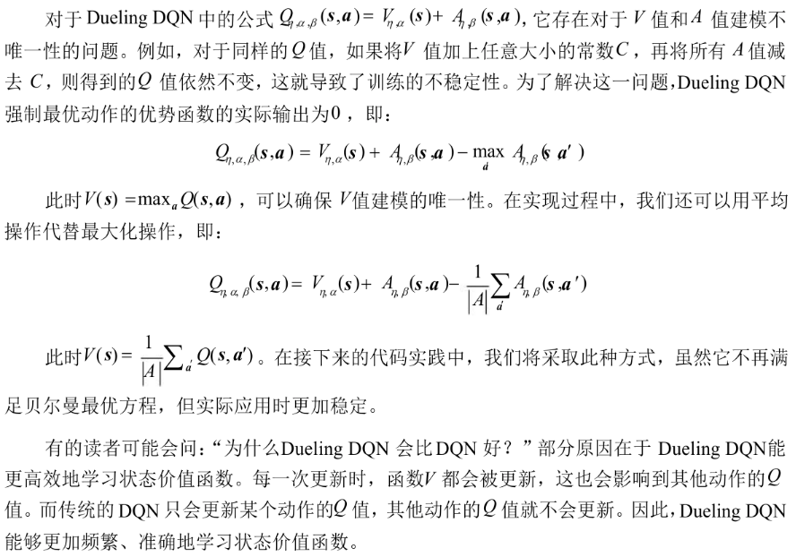

## 绪论

$\epsilon$ 贪婪，UCB，Thompson Sampling, 梯度赌博机，乐观初始值（鼓励初期探索）

UCB​**平衡利用与探索**：

直接求解计算时间复杂度过高，

$$
V = （1- \gamma P)^{-1}R
$$

，矩阵求逆的时间复杂度是n的三次方。

‍

四个Bellman方程（value  function, quality function,期望方程，最优方程）

## DP MC

DP--Policy Iteration

Question:为什么迭代？

Bellman方程具有递归性，初始时各状态价值未知且互相依赖，单次迭代只能更新局部信息，需通过多次迭代将终点奖励反向传播至全局状态。

DP--Value Iteration

价值迭代通过直接优化$V^*(s)$​**隐式**包含最优动作选择信息。

广义policy Iteration

1. 策略评估：利用任意策略评估算法，评估$v_{\pi}$

- 策略改进：利用任意策略改进算法，生成$\pi` \geq \pi$

MC: learning from experience model free

Unbiased估计，但是方差大。 Next Step考虑偏差和方差之间的平衡。

||自举|采样|
| ----| ------| ------|
|DP|✅|❌|
|MC|❌|✅|
|TD|✅|✅|

## TD Sarsa Q-learning DQN n步自举

TD(0), 其中 $\delta_t = R_{t+1}+\gamma V(s_{t+1})-V(s_t)$。

叫做TD误差MC误差 $G_t - V(S_t)$可写成TD误差之和：  $G_t - V(S_t)= \sum_{k=t}^{T-1}\gamma^{k-t}\delta_{k}$  

为什么这样更新方差更低？

因为无偏估计 $G_t=R_{t+1}+\gamma R_{t+2}+ ... + \gamma^{T-1} R_{T}$

依赖许多随机变量而TD target $R_{t+1} + \gamma V(S_{t+1})$

是有偏估计，但是只依赖一个随机变量批量更新：完全在有限的数据上反复训练直至收敛

TD利用了Markov特性，通常在Markov(基于当前状态做出最优决策，没有存储历史)环境下更有效

MC没有利用Markov特性，通常在非Markov环境（依赖实际经历完整路径）下更有效

（Q版的TD）

期望Sarsa:把Q-Learning中动作价值最大值用取 期望替换

Q-learning看作 $\pi$ 是贪婪策略特殊情况，待学习的动作价值函数用用最优动作价值函数直接近似作为学习目标，而与生成Agent轨迹的Action Policy无关。最大偏差问题：

1. 最大化操作 $q_{t+1} \geq max_a(Q(s_{t+1}, a)),y_t=r_t+\gamma q_{t+1}$

2. 自举：当 $q_t$ 用来更新 $Q（s_t, a_t）$

过高的估计不断向后传播

**价值函数近似：**

1. 线性
2. SGD

DQN overestimating问题：

执行max操作高估 $Q^*(s_t, a_t)$，导致td target用来训练的数据是高估数据，最终训练出来的Q网络就往往作出高估的估计。当（s, a）在replay buffer中频繁的出现，那么 Q 网络高估越严重。

**解决方案：**

Double DQN 将 Selection与Evaluation解耦

选择动作用一个Q网络，评估$y_t$用 Q\^{-},可以缓解高估。

Dueling DQN(优势函数思想首次引入，微小改动，大幅提升)

克服不可辨识问题（V值 A值 建模不唯一 问题），对同样 $Q = V + A = (V+C)+( A-C)$ --\>训练不稳定

## Model Free Model Based Dyna

## Policy Gradient

REINFORCE算法w/o baseline

REINFORCE算法w baseline

简单来说，在REINFORCE算法中加入Baseline（基线）的​**核心目的是为了降低策略梯度的方差（variance），从而让模型训练得更快、更稳定。**

因为 $G_t$导致方差很大，加入基线：

## AC A2C TRPO PPO

PPO算法的两个核心思想：

1. 重采样提升样本效率
2. CLIP函数实现稳定更新

## RLHF DeepSeek R1

RLHF：

- 无监督学习（自监督学习，有时视为无监督学习的子类）

  - 建模语言认知能力，预测下一次tokens。（这一部分即预训练）
- 增强LLM能力 后训练

  - 有监督微调-SFT(Supervised Finetuning)
  - 与人类对齐-Human Alignment
- 有监督微调SFT，以自然语言形式格式化的实例集合微调预训练的LLM

  - 实例 \= 任务描述（指令）+ 可选输入  + 相应输出 + 少量演示（optional）组成
  - 参数高效模型微调：减少所需训练模型参数量，同时尽可能接近全量finetune性能，如LoRA
- Human Alignment:LLM行为必须对齐人类期望价值观
- 3H准则：Helpful Honest Harmless
- 更广泛的对齐：行为/意图/道德对齐 具有主观性，形式化建模困难

RLHF流程：

1. 监督微调：用人类专家的高质量问答或对话，让模型学习基本的指令遵循和对话方式，最终给出SFT模型。
2. 训练奖励模型：用人类对SFT模型多个回答的偏好排序训练奖励模型，使奖励模型预测人类回答偏好度的打分
3. 强化学习训练：利用奖励模型+PPO，训练大模型和人类对齐

Reward Model的学习问题设定：

1. 输入：来自SFT模型的多个回答
2. 数据：人类对这些回答的偏好标注（通常是成对比较--\>排序，问题based，规划）
3. 过程：

    1. 对同一问题，模型生成多个回答。
    2. 人类标注者选择他们偏好的回答
    3. 训练奖励模型预测人类会偏好哪个回答
4. 结果：奖励模型能为任何生成文本给出一个表示“人类偏好”的分数

损失函数的三种主要形式：

1. 打分式
2. 对比式
3. 排序式

RL vs SFT

RL对模型输出的反馈粒度优于监督学习（SL）

1. RL对整个回答反馈，而SL则是针对特定词元。
2. RL允许模型给出多样性表达，SL中交叉熵损失对个别词元改变不敏感。
3. 更容易缓解幻觉问题，有监督训练在模型不包含或知道答案的情况下，依然促使模型给出回答，而RL则可以通过定制奖励函数，讲正确答案赋予高分数，将放弃回答赋予低分数，讲不正确回答赋予绝对值大的负分数，使大模型依赖内部知识学会放弃回答，在一定程度上缓解幻觉问题。

DeepSeek训练步骤：

1. 阶段一 - Cold Start SFT

    1. 用少量高质量CoT数据初始化模型，提升可读性和推理潜力。
    2. 数据：数千条人工标注的CoT数据（问题+思考过程+答案）
    3. 方法：SFT强制按指令格式输出
2. 阶段二 - Reasoning-Oriented RL

    1. 目标：专项优化推理能力，使用RL生成高质量CoT数据
    2. 奖励函数：

        1. 准确性奖励：验证答案的正确性（如数学问题通过结果匹配，代码通过单元测试）
        2. 格式奖励：强制模型遵循思考-答案模板（避免内容偏见）
    3. 算法：​**GRPO（Group Relative Policy Optimization）,相比PPO显存占用更低，收敛更快**。
3. 阶段三 - Rejection Sampling and SFT

    1. 将推理能力迁移到通用任务（写作，翻译等）
    2. 数据：

        1. 推理数据：60万条通过拒绝采样（仅保留正确输出）生成的CoT数据。
        2. 通用数据：20万条写作，事实问答等数据（复用deepseekv3的SFT数据）
4. 阶段四 - RL for ALL Scenarios

    1. 目标：对齐人类价值观-3H
    2. Reward Model:

        1. 推理任务：基于规则的奖励（语言一致性，格式合规性）
        2. 通用任务：复用DeepSeekv3作为Reward Model（评估有益性和无穷性）

GRPO：

改进PPO通过 组内相对奖励归一化 和 简化网络结构 提升训练稳定性与速度，关键改进点：

1. 组内相对优势计算：对同一问题的多个输出进行组内归一化，替换PPO的全局优势估计。

    1. 稳定性：组内归一化，缓解奖励尺度不一致问题
2. 省去独立价值网络：直接利用Reword Model输出计算优势，减少显存占用。

    1. 效率：省去价值网络训练，减少计算开销
