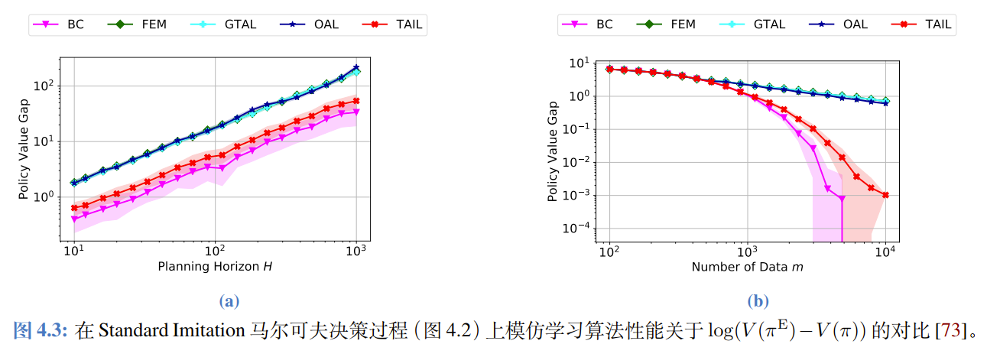

**主要参考文献**： 《模仿学习简明教程》 许天，李子牛，俞杨 NJU&&香港中文大学（深圳）

## Introduction

1. 什么是模仿学习？

    1. **核心定义**：模仿学习就是**从专家示例中学习** 。它的目标是让智能体（机器人）能够像人类专家一样进行智能决策。
    2. 为什么需要它？：在通往通用人工智能的道路上，手动编程或设计奖励函数往往非常困难。

        1. **困难点**：以自动驾驶为例，要手动把所有约束写出来（比如既要安全不撞车，又要开得平稳舒适）是非常复杂的，很难设计出完美的监督信号。
2. 历史与应用：

    1. **早期案例**：早在 20 世纪 80 年代末，CMU 的 Pomerleau 教授就用模仿学习训练出了能横跨北美的自动驾驶车（ALVINN）。
    2. **著名案例**：AlphaGo 在击败人类顶尖棋手之前，也使用了模仿学习来学习人类棋谱。
    3. **现代应用**：推荐系统、网约车派单系统等，也利用模仿学习来构建虚拟世界，让 AI 在里面试错。
3. 两大算法流派：

    1. BC : 本质上把模仿学习当成**回归**或**分类**问题来解。
    2. AIL(Adversarial IL) : 通过**逆强化学习 (Inverse Reinforcement Learning, IRL)**  的思想。构建一个“对抗的奖赏函数”，然后通过最大化这个奖赏来模仿专家。
4. **适合人群**：对模仿学习理论感兴趣，或者希望通过理论分析来改进算法的研究者。

## 背景介绍

### Markov Decision Process

**马尔可夫链 (Markov Chain)，** 最基础的随机过程：**在一个有限的状态集合中，未来的状态只取决于当前的状态，而与过去无关。**  $P(s_{t+1}|s_t, s_{t-1}, \dots, s_0) = P(s_{t+1}|s_t)$。

- 状态转移矩阵 (Transition Matrix $P$)

  - **元素含义**：$P_{i,j}$ 表示从状态 $i$ 转移到状态 $j$ 的概率。
  - 每一行的和必须为 1（$\sum_{j=1}^{|S|} P_{i,j} = 1$）。这意味着从任何一个状态 $i$ 出发，它下一时刻总得去某个地方（或者留在原地），所有可能去向的概率加起来必须是 100%。
- 轨迹概率的计算 (Trajectory Probability)

  - **目标轨迹** **$tr$**：$1 \to 2 \to 2 \to 3 \to 1$
  - $P(tr) = P(s_0=1) \times P(1 \to 2) \times P(2 \to 2) \times P(2 \to 3) \times P(3 \to 1)$ (初始概率一般已知，$P(1 \to 2)$：查矩阵第1行第2列，以此类推)

在此基础上加上Action 和 Reward 就变成了 MDP。

1. **动作空间** **$\mathcal{A}$**：智能体可以采取的动作。
2. **奖励函数** **$r$**：衡量某一步做得好不好，$r: \mathcal{S} \times \mathcal{A} \to \mathbb{R}$。
3. 状态转移 $P(s_{t+1} | s_t, a_t)$
4. 策略 (Policy) $\pi$ $\pi(a|s)$：表示在状态 $s$ 下选择动作 $a$ 的概率

‍

**无限长度的折扣MDP**

- **折扣因子** **$\gamma$**  **(Gamma)** ： 引入了一个系数 $\gamma \in (0, 1)$。它的作用有两个：

  - 数学上的收敛
  - 重当下轻未来
- **核心目标：累积（期望）回报** **$V(\pi)$**： 这是衡量一个策略好坏的**终极标准**

  - $V(\pi) = \mathbb{E} [\sum_{t=0}^{\infty} \gamma^t r(s_t, a_t)]$
  - **有效决策长度**：虽然说是“无限长度”，但在数学上，它等效于一个长度为 $H \approx \frac{1}{1-\gamma}$ 的任务 6。这告诉我们，太遥远的未来其实对当前的决策影响微乎其微。
- 两个重要的值函数

  - 状态价值函数 $V^\pi(s)$
  - 状态-动作价值函数 $Q^\pi(s, a)$

**对偶表示 (Dual Representation)(这是本教程对模仿学习理论最重要的贡献之一)**

状态访问分布 $d^\pi(s)$

状态-动作访问分布 $d^\pi(s, a)$

**为什么这个公式极其重要？**

- 它把**时间序列**的问题（一步步走，算累积奖励），转化成了**空间分布**的问题（算你在每个状态-动作对上出现的概率）。
- ​**对模仿学习的意义**：如果我们想让智能体获得和专家一样的回报 $V(\pi) \approx V(\pi^E)$，我们​**不需要知道奖励函数** **$r(s,a)$** **具体是什么**​。我们只需要让智能体的**访问分布** **$d^\pi(s,a)$** 去逼近专家的访问分布 $d^{\pi^E}(s,a)$。
- 只要两个人的“轨迹分布”重合了，无论奖励函数长什么样，他们拿到的总分一定是一样的。这就是**对抗式模仿学习（如 GAIL）的理论基础：状态-动作分布匹配**。

‍

**有限长度回合制马尔可夫决策过程 (Finite Horizon Episodic MDP)**

**$H$**  **(Horizon)** ：这是任务的**最大时长**（或回合长度）。比如一局游戏限制走 100 步，那么 $H=100$。

**时变策略**-由于环境规则随时间变化，策略也必须随时间变化。

- 策略被定义为 $\pi = \{\pi_1, \dots, \pi_H\}$
- **直观理解**：这就像打游戏，开局（$h=1$）的策略可能是“收集资源”，而结尾（$h=H$）的策略可能是“全力攻击”。

$$
\text{总分} = \sum (\text{在某时刻某状态做某动作的概率} \times \text{那个时刻那个动作的奖励})
$$

为什么没有折扣因子？

1. 数学上的收敛性无需担心。
2. 在这份教程的理论框架下，“有限长度 MDP”采用的是**硬截断（Hard Cutoff）** 的方式——在 $H$ 步之内一视同仁（权重为1），$H$ 步之后完全忽略（权重为0）。教程中也提到，无限长度的折扣问题可以通过截断到 $H \approx \frac{1}{1-\gamma}$ 来近似 。这暗示了 **$H$**​ **（视野长度）**  在这里其实起到了替代 **$\gamma$**​ **（折扣因子）**  限制“看多远”的作用。

‍

### 模仿学习问题设定

我们假设存在一个表现不错的专家策略 $\pi^E$。模仿学习的目标是训练一个智能体策略 $\pi$，使得它的**累积回报**尽可能接近专家。

虽然 RL 和 IL 的目标都是最大化回报，但是条件完全不同：

- ​**RL**：知道奖励函数，不知道怎么做最好。
- **模仿学习**：**不知道奖励函数**（Reward Function is unknown），但手里有**专家数据**。

**数据形式**：专家数据 $\mathcal{D}$ 由 $m$ 条完整的轨迹（Trajectory）组成：$\mathcal{D} = \{tr_i\}_{i=1}^m$ 。每条轨迹包含一连串的状态和动作：$tr = \{s_1, a_1, s_2, a_2, \dots, s_H, a_H\}$。

‍

### 习题解析

已知环境参数（转移矩阵 $P$ 和奖励 $r$）时，如何算出策略到底好不好（算 $V$）以及智能体爱去哪（算 $d$）。

## 行为克隆

### 行为克隆算法

它的核心思想非常朴素：**把模仿学习当成一个监督学习（Supervised Learning）问题来做。**  也就是：看到专家在某个状态 $s$ 做了动作 $a$，那我就强行记住“在 $s$ 就该做 $a$”。

基本原理 -- 最大似然估计（MLE）。

- 我们要找一个策略 $\pi$，让它在看到数据集 $\mathcal{D}$ 里的那些状态 $s$ 时，产生专家动作 $a$ 的概率最大。

  $$
  \max_{\pi} \sum_{(s,a) \in \mathcal{D}} \log \pi(a|s)
  $$

  这被称为最大对数似然估计。意思就是：调整我的策略，让我观测到的这堆数据出现的概率最大化。

如果状态空间 $\mathcal{S}$ 和动作空间 $\mathcal{A}$ 都是有限的（比如走迷宫，只有几个格子，只能上下左右），那么最优解非常简单，就是​**数数**。

$$
\hat{\pi}(a|s) = \frac{\text{在数据集里，状态 } s \text{ 下做了动作 } a \text{ 的次数}}{\text{在数据集里，状态 } s \text{ 出现的总次数}}
$$

- 没见过的状态怎么办？  
  如果遇到一个状态 $s$ 是专家没去过的，教程建议使用均匀分布（瞎猜），即 $\pi(a|s) = \frac{1}{|\mathcal{A}|}$

- 最大化似然度（MLE）在数学上等价于最小化策略分布之间的差异（KL 散度）。也就是我们在强行把我们的策略分布 $\pi$ 拉向专家的分布 $\pi_E$。

‍

参数化方法 (针对连续/复杂空间)

在现实世界（如自动驾驶、机器人控制）中，状态往往是连续的（比如摄像头的像素、激光雷达的数值），我们不可能通过“查表数数”来解决，因为你几乎永远不会遇到两个完全一模一样的像素值。

这时，我们需要用函数近似（Function Approximation），比如神经网络，来表示策略 $\pi_\theta$。目标函数转化为 公式 ：

$$
\max_\theta \sum_{(s,a) \in \mathcal{D}} \log (\hat{\pi}_\theta(a|s))
$$

例题 3.1：Softmax 参数化（对应“分类问题”）

- ​**场景**：动作是离散的（如：左转、右转、刹车）。
- ​**做法**​：神经网络输出一个向量，通过 **Softmax** 函数归一化成概率。
- ​**本质**​：这时候的优化目标，就是大家熟悉的分类任务里的​**交叉熵损失函数 (Cross-Entropy Loss)** 。

例题 3.2：Gaussian 参数化（对应“回归问题”）

- ​**场景**：动作是连续的数值（如：方向盘转动 23.5 度）。
- **做法**：假设策略服从高斯分布（正态分布）。神经网络预测高斯的**均值** **$\mu_\theta(s)$**。  
  如果我们假设高斯分布的方差 $\sigma^2$ 是个常数，那么最大化高斯分布的对数似然，数学上等价于：

  $$
  \min_\theta \sum_{(s,a) \in \mathcal{D}} (a - \mu_\theta(s))^2
  $$
- ​**本质**​：这就是最经典的​**均方误差 (MSE) 回归**。

‍

总结：

- 如果动作是离散的 $\to$ 做​**分类 (Classification)** 。
- 如果动作是连续的 $\to$ 做​**回归 (Regression)** 。

### 复合误差

**复合误差 (Compounding Error)**  是模仿学习理论中最著名的概念之一，它揭示了行为克隆（BC）算法最大的“死穴”。

简单来说：**一步错，步步错，最终满盘皆输。**

教程引用了自动驾驶先驱 Pomerleau 的经典观察：

- ​**训练时**：神经网络使用的是专家数据，专家开车很稳，总是在路中间，所以数据集中全是“在路中间如何微调”的样本。
- ​**测试时**​：神经网络自己开车。如果它犯了一个小错误（比如偏离了路中心 10 厘米），它就进入了一个​**训练集中从未出现过的状态**（专家从没开偏过）。
- ​**后果**​：在未见过的状态下，神经网络可能不知所措，做出随机或错误的动作，导致车偏离得更远（比如偏离 1 米）。错误像滚雪球一样越来越大，直到撞车 1。

 数学解释：分布漂移 (Distribution Shift)

- ​**问题的根源**：

  - **训练数据**来自专家策略 $\pi^E$ 产生的状态分布 $d^{\pi^E}$。
  - **测试/评估数据**来自学习到的策略 $\hat{\pi}$ 产生的状态分布 $d^{\hat{\pi}}$。
  - 因为 $\hat{\pi}$ 不可能完美复制 $\pi^E$，所以这两个分布是不一样的。

误差上界平方级别增加。

**为什么是平方级 (**​**$H^2$**​ **)？**

- 一个 $H$ 来自于你做错了动作，当步的奖励丢了，并且影响了后面所有的步（失去了 $H$ 个奖励）。

**样本复杂度**回答了“到底需要多少专家数据才能学好”的问题。

- ​**结论**：在最坏情况下，需要的样本量 $m$ 与 $H^2$ 成正比。

  - 无限长度：$m \approx O(\frac{|\mathcal{S}|}{(1-\gamma)^2 \epsilon})$ 。
  - 有限长度：$m \approx O(\frac{H^2 |\mathcal{S}|}{\epsilon})$ 。
- 极小极大最优 (Minimax Optimal)：  
  教程中有一个非常重要的笔记指出：虽然 $H^2$ 的误差看起来很糟糕，但在不知道环境转移概率（即不知道世界怎么运作）的情况下，行为克隆 (BC) 已经是我们能做到的最好的算法了 。这说明 $H^2$ 的误差是这一类问题的固有难度，而不是算法设计得烂。

简单的**行为克隆（BC）** 虽然好用，但在长序列决策中非常脆弱。

### DAgger

**DAgger** 全称是 **Dataset Aggregation（数据集聚合）** 。它的核心思想是：**把“离线学习”变成“在线学习”，主动去问专家在那些陌生的状态下该怎么做。**

每一次迭代循环： 混合策略 --> 收集数据 --> 专家标注 --> 聚合数据 --> 重新训练

**为什么它能解决复合误差？** BC 失败是因为它没见过“跑偏”的状态。DAgger 强行让智能体去环境里“试错”，一旦跑偏，马上请专家打标签。这样，**智能体就学会了如何从错误状态（跑偏）回到正确状态（路中心）** ，从而消除了复合误差。

### Debate

- **为 BC 辩护**： 虽然 BC 有复合误差，但这**不是算法的问题，是命题的问题**。如果只给你一个固定的数据集（不准交互），从信息论的角度可以证明，**任何算法**在最坏情况下都会有复合误差。所以 BC 其实在它的设定下已经做得很好了。
- **对 DAgger 的冷静分析**：DAgger 看起来很美好，因为它改变了题目设定（允许与环境交互+咨询专家）。

  但是，理论分析表明，DAgger 未必比 BC 省样本。

  - ​**原因**：智能体一开始是瞎走的，它探索到的状态分布可能和专家真实的分布相差十万八千里。
  - **结论**：为了达到同样的精度（$\epsilon$-最优），DAgger 需要咨询专家的总次数，在最坏情况下，可能并不比 BC 需要的样本量少 。

- ​**DAgger 的本质**​：通过​**人机回环（Human-in-the-loop）** ，不断把智能体跑偏的那些“边缘情况（Corner Cases）”抓回来让专家重新教，从而增强系统的鲁棒性。
- ​**理论地位**：DAgger 是工程上解决复合误差的有效手段，但在统计效率（样本复杂度）上，它并没有打破理论的上限。

## 对抗式模仿学习

### 个人talking -- 这一章的学习价值

在目前的**端到端自动驾驶**（如 Tesla FSD V12 路线）和**具身智能操作**（如 Diffusion Policy, ACT 等）的主流落地中，简单的 **Behavior Cloning (BC)**  及其变体（配合 Transformer/Diffusion）占据了统治地位。

> 为什么AIL现在 **“销声匿迹”** 了？
>
> 在工业界和应用导向的研究中，对抗式模仿学习（AIL）确实面临几个痛点，导致它不如 BC 流行：
>
> - **训练极不稳定**：AIL（特别是 GAIL）借鉴了 GAN 的思路，是一个极小极大（Minimax）优化问题 。这意味着你需要同时训练一个判别器（Reward）和一个策略（Policy），很难调参，很难收敛。相比之下，BC 只是一个稳定的监督学习（回归/分类）。
> - **采样效率低**：AIL 本质上是在做强化学习（RL），需要智能体与环境进行大量交互 。在真机机器人或自动驾驶中，通过“试错”来学习太昂贵、太危险。
> - **BC 变强了**：随着 Transformer 和 Diffusion Model 的引入，BC 对多模态分布的拟合能力大幅增强，掩盖了它在理论上的部分缺陷（复合误差）。

但如果想做**Post-Training RL**（训练后强化学习）或者深入理解**为什么 BC 会失效**，这一章包含非常关键的理论视角：

- 理解BC的理论天花板(State-Action Distribution Matching)
- Post Training RL的基本石（Reward 也是学出来的）：

  - 现在的具身智能前沿（如 VLA 模型）开始探索 **Post-Training** 阶段。在这个阶段，单纯的 BC 已经不够了，我们需要 RL 来进一步微调模型。
  - **Reward 从哪来？**  在精细装配等任务中，很难手工写出完美的 Reward 函数。
  - **AIL 的启示**：AIL 的核心思想就是**逆强化学习（IRL）** ——让判别器充当 Reward Function。
  - **连接**：目前的很多前沿工作（如利用人类反馈、利用 VLM 打分）本质上都是在构建一个“判别器”或“奖励模型”，然后用 RL 去优化。这正是这一章讲的  **“极小极大优化建模”**  的思想。
- **TAIL** 和 **MIMIC-MD** 算法，展示了如何结合 BC 的优势（利用数据）和 AIL 的优势（利用环境模型）

  - TAIL 的核心是利用环境的转移概率信息来辅助模仿 --> 现在的变体 **World Models (世界模型) Based RL**
  - MIMIC-MD 的核心思想是：只在数据集覆盖的状态上模仿专家，别的地方不要瞎猜 --> **现代变体：Offline RL (离线强化学习) 中的“保守主义”** 在 Post-Training RL 中，我们最怕模型在没见过的数据上乱动（OOD Action）。现代算法通过正则化项来惩罚偏离数据集分布的行为。--> **CQL (Conservative Q-Learning)** , **IQL (Implicit Q-Learning)** 。
  - 现在倾向于使用 DPO，RL-VLM-F。

所以这章的学习对我而言是轻推导重理论思想的。

### 状态动作分布匹配

- 出发点：回顾之前的对偶公式：$V(\pi) = \sum \sum P_h^\pi(s,a) r_h(s,a)$。只要模仿策略的状态-动作访问分布 $P_h^\pi$ 和专家的分布 $P_h^{\pi^E}$ 长得一样，那么无论奖励函数 $r$ 是什么，它们得出的总分 $V(\pi)$ 一定是一样的,**即奖励无关性。**

  - “既然模仿学习不知道真实的奖励函数 $r$，你怎么敢保证你学出来的策略也是高分的？”
  - 与其学习策略，不如直接匹配分布。
- 新的目标函数 ：因此，AIL 的目标不再是最小化动作误差，而是最小化两个分布之间的距离：

  $$
  \min_{\pi \in \Pi} \sum_{h=1}^H \psi(P_h^\pi, P_h^{\pi^E})
  $$

  其中 $\psi$ 是某种距离度量（比如后面会用到的 TV 距离或 JS 散度）。

教程再次利用 **Reset Cliff** 环境来对比两种准则，这是理解 AIL 优势的关键：

- BC 的准则（ <kbd>策略分布匹配</kbd> ）：  
  BC 关注的是 $\pi(a|s)$。在没见过的数据（未访问状态）上，BC 倾向于瞎猜（均匀分布）。在 Reset Cliff 中，这意味着它有概率走到坏状态 $b$ 并掉下去，导致**复合误差**。
- AIL 的准则（ <kbd>状态-动作分布匹配</kbd> ）：AIL 关注的是 $P(s,a)$。

  - 专家的数据显示：在坏状态 $b$ 上的访问概率是 ​**0**（$P_h^{\pi^E}(b, \cdot) = 0$）。
  - 为了让两个分布匹配，AIL 强迫智能体的策略​**也不能访问状态** **$b$**。
  - ​**结果**：智能体为了不让 $P(b)$ 变成正数，会主动学会避开那些通往 $b$ 的路，即使在数据集中没见过这些具体的动作。这就在根本上避免了复合误差。

虽然理念很美好，但在实际操作中，我们并没有上帝视角拿到真实的专家分布 $P_h^{\pi^E}$，我们只有一堆离散的数据点 $\mathcal{D}$。

- 最大似然估计 (MLE)：我们只能用“数数”的方法来估计专家的分布 $\hat{P}_h^{\pi^E}$。
- 定理 4.1 (反直觉的样本复杂度)：如果我们用 TV 距离（Total Variation Distance）作为度量标准来优化，需要的专家样本量 $m$ 是多少？

  - ​**结论**：$m \gtrsim \frac{H^2 |\mathcal{S}|}{\epsilon^2}$。
  - ​**对比**：之前 BC 的样本复杂度是 $\tilde{O}(1/\epsilon)$，而这里是 $\tilde{O}(1/\epsilon^2)$。
  - **这意味着什么？**  当我们要求精度很高（$\epsilon$ 很小）时，比如 $\epsilon=0.01$，BC 可能只需要 100 个数据，而 AIL 可能需要 10000 个数据！

- **原因分析**： 这并不是因为 AIL 的策略差，而是因为**统计估计太难了**。 我们要从有限的数据中估计出一个完美的概率分布 $\hat{P}_h^{\pi^E}$，这个估计过程本身的误差收敛速度很慢（速率为 $O(\sqrt{1/m})$），从而拖累了整个算法的样本效率。

小总结：

- **好消息**：从机理上讲，**状态-动作分布匹配**（AIL）比BC更高级，因为它能通过“拒绝访问坏状态”来自动修正复合误差。
- ​**坏消息**​：从统计上讲，​**直接做分布匹配非常昂贵**。因为仅仅通过有限的样本去还原一个高维分布是非常困难的，这导致传统的 AIL 算法（如 GAIL, FEM）在最坏情况下的样本效率其实不如 BC。

### 极小极大优化建模

原始目标：我们的理想是直接最小化模仿策略 $\pi$ 和专家 $\pi^E$ 之间的距离（比如 TV 距离）：

$$
\min_{\pi} D_{TV}(P^\pi, P^{\pi^E}) = \frac{1}{2} \sum |P^\pi - P^{\pi^E}|
$$

你很难直接告诉神经网络，概率分布往哪里改一点点，好让积分距离变小。

**解决方案：对偶表示 (Dual Representation)** 数学上，$L_1$ 范数（TV 距离对应 $L_1$）有一个“对偶形式”。利用这个性质，我们可以把“最小化距离”转化为一个**极小极大（Minimax）** 问题

$$
\min_{\pi} \max_{w} \sum w(s,a) (\hat{P}^{\pi^E}(s,a) - P^\pi(s,a))
$$

- **$w$** **就是奖赏函数 (Reward Function)** ：如果我们把 $w$ 看作奖励，那么 $\sum w(s,a) P(s,a)$ 其实就是策略在 $w$ 下的**累积回报** $V_w$。
- **However**，这里的 $w$ 其实是一个第一层逻辑里说的那个“真实奖励 $r$”。它是依据对偶公式制造出来的 <kbd>“Fake Reward”</kbd> 。

  - 真实奖励 $r$：代表任务的终极目标（比如“把螺丝拧紧”）。
  - 对抗奖励 $w$：代表两个分布目前的差异程度（比如“你现在的姿势和专家不太像”）。

对抗博弈的目标：

$$
\min_{\pi} \max_{w} (V_w(\pi^E) - V_w(\pi))
$$

- **内层循环 ($\max_w$)** ：$w$ 的身份 **GAN 里的判别器。** 它的目的是找茬，它要设计一套奖励规则，使得专家得分很高，而你（智能体）得分很低 **，从而最大化你们之间的差距** 。
- **外层循环 ($\min_\pi$)** ：$\pi$ 的身份是 **“学生”（生成器）** 。它的目的是在考官制定的规则下，努力拿高分，从而**最小化**和专家的差距 。

**怎么训练？梯度下降-上升 (Gradient Descent Ascent)**

- Step 1: 优化考官 $w$ (上升)

  - 目标是让专家和策略的分布差异在 $w$ 的加权下最大化。
  - 使用**在线投影梯度下降**（因为 $w$ 有范围限制 $||w||_\infty \le 1$）。
- Step 2: 优化学生 $\pi$ (下降/RL)

  - 目标是最大化这个 Reward 下的回报 $V_w(\pi)$。
  - **这本质上就是强化学习！**  我们可以直接调用任何标准的 RL 算法（如策略梯度 PG、TRPO、PPO 等）来更新 $\pi$。

都是在解同一个**极小极大优化问题**，区别只在于 **“怎么定义距离”** 以及 **“怎么更新参数”** 。

|**维度**|**FEM (特征期望匹配)**|**GTAL (博弈论学徒学习)**|**GAIL (生成对抗模仿学习)**|
| ----| ---------| -------| -----|
|**1. 特征定义 ($\phi$)**   *(核心区别)*|**人工设计 / 已知**   *(Linear Features)*|**人工设计 / 已知**   *(Linear Features)*|**自动学习 / 隐式**  *(由神经网络判别器$D$提取)*|
|**2. 对应距离 ($\psi$)**   *(优化目标)*|**$L_2$**​**范数**   *(欧氏距离)*|**$L_\infty$**​**范数**   *(最大范数/切比雪夫距离)*|**JS 散度**   *(Jensen-Shannon Divergence)*|
|**3. 奖赏函数$w$的约束**  *(对偶空间的形状)*|**$L_2$**​**球**  ( $\|\|w\|\|_2$ )|**$L_1$**​**球 / 单纯形**  ($\|\|w\|\|_1$)|**隐式约束**  *(由判别器网络架构决定)*|
|**4. 奖赏函数$w$的更新**  *(对抗者怎么找茬)*|**残差计算**   (直接计算特征差值:$\hat{P}^E - P^\pi$)|**镜像下降**   (指数乘法更新:$w \cdot \exp(\dots)$)|**梯度上升**   *(训练二分类判别器)*|
|**5. 策略$\pi$的更新**  *(学习者怎么改进)*|**混合分布 + 线搜索**   (寻找步长$\eta$混合新旧分布)|**标准 MDP 规划**   (求解当前$w$下的最优策略)|**策略梯度 (RL)**    *(如 TRPO/PPO 更新神经网络)*|

GAIL是GAN在RL领域的转型，本质是IL算法，但是在策略更新阶段使用RL，奖励信号来自**奖赏函数**​$w$。

以上是跳过历史直接得出的直观结论，接下来我讲回顾一下 **学徒学习** 和 **对抗模仿学习** 是如何统一的。

- ​**旧派 (FEM/GTAL)** ​：觉得我在匹配​**特征期望**（比如“专家这一局吃了10个苹果”，我也要吃10个）。
- ​**新派 (GAIL)** ​：觉得我在匹配​**概率分布**（比如“专家在坐标(10,10)出现的概率是0.5”，我也要是0.5）。

大家后来证明了： **“分布”其实就是一种极致细腻的“特征”。**

### 更高级的对抗模仿学习算法

虽然 AIL 策略更稳健，但在 **“最坏情况（Worst-Case）”** 下，经典的 AIL 算法（如 GAIL、FEM）所需的样本复杂度**并不比简单的 BC 好**，甚至可能更差（BC 是 $1/\epsilon$，而 AIL 往往是 $1/\epsilon^2$）。

- 潜台词：AIL 虽然方向对，但样本效率太低，需要太多的专家数据。

> 在本小节，我们假设算法已知环境的转移概率并且专家策略是一个确定性策略。

​<kbd>TAIL</kbd>

分布分解公式 (4.9)：

TAIL 把专家分布 $\tilde{P}$ 拆成了两部分来估计：

1. ​**第一部分（算出来的）** ：对于那些在 $\mathcal{D}_1$ 中完全被覆盖的轨迹，我们不需要估计！因为我们知道转移概率 $P(s'|s,a)$，我们可以**精确计算**出它们发生的概率。这一部分误差为 0。
2. ​**第二部分（估计出来的）** ：只有那些“跑偏了”或者“没见过”的稀有轨迹（在 $\mathcal{D}_1$ 之外），我们才被迫用 $\mathcal{D}_1^c$ 的数据去进行统计估计。

- ​**初始化**：切分数据，构造好那个聪明的估计器 $\tilde{P}_h^{\pi^E}$。
- ​**循环迭代**：

  - ​**求策略** **$\pi^{(t)}$**：在当前奖励 $w^{(t)}$ 下，解 MDP 得到最优策略（因为假设已知环境模型，这一步比较容易）。
  - ​**算分布**：算出当前策略的分布 $P^{\pi^{(t)}}$。
  - ​**更奖励** **$w^{(t+1)}$**：对比 $\tilde{P}^{\pi^E}$（聪明的估计）和 $P^{\pi^{(t)}}$（当前的策略），更新奖励函数来拉大差距。
- ​**输出**：输出所有历史策略的平均混合策略。

**在对抗模仿学习中，与其盲目地从数据中估计专家分布，不如利用环境模型（Transition）先精确计算出能算的部分，只估计算不出来的部分。**  这种混合估计策略显著降低了方差，提升了学习效率。

​<kbd>MIMIC-MD</kbd>​**MIMIC-Mixture Distribution**（模仿-混合分布）

这个算法的核心哲学是：​ **“守正出奇”** 。

- ​**守正**：在见过的地方，一定要和专家一模一样（Behavior Cloning）。
- **出奇**：在没见过的地方，**利用环境模型来规划**，尽量不要跑偏（Distribution Matching）。

1. 核心设定：强行模仿 (Constraints)。MIMIC-MD 比之前的 TAIL 算法更“保守”。它首先定义了一个策略集合 $\Pi_{mimic}(\mathcal{D})$：

$$
\Pi_{mimic}(\mathcal{D}) = \{ \pi \mid \forall s \in \mathcal{D}, \pi(s) = \pi^E(s) \}
$$

2. 优化目标：

它的思想启发了后来的许多**保守离线强化学习（Conservative Offline RL）** 算法。

‍

- ​**TAIL**：基于梯度下降-上升（GDA），类似于训练神经网络。
- **MIMIC-MD**：基于**线性规划 (Linear Programming)** 。因为它的约束是硬性的，且目标函数是线性的，所以可以转化为一个巨大的 LP 问题在多项式时间内求解。
- **TAIL**处理数据噪声能力或者非确定性策略表现时可能表现更好。

### Debate

看图的诀窍：看斜率

教程给出了一个非常有用的公式：

$$
\log(\text{Gap}) \approx -\frac{1}{\beta} \log(m) + \text{const}
$$

这意味着在双对数坐标系下，Policy Value Gap 随样本量 $m$ 变化的曲线斜率，直接反映了算法的阶数 $\beta$。

- 如果斜率是 -1，说明 $\beta=1$，误差是 $O(1/m)$ 级别的（快）。
- 如果斜率是 -0.5，说明 $\beta=2$，误差是 $O(1/\sqrt{m})$ 级别的（慢）。

- ​**BC 和 TAIL**：红线和粉线掉得很快，斜率接近 -1。说明它们充分利用了数据，收敛快。
- ​**FEM/GTAL/OAL**：蓝线和青线掉得很慢，斜率接近 -0.5。说明它们受困于统计估计的低效，收敛慢。
- ​**结论**：实验完美验证了理论——TAIL 通过利用“缺失质量（Missing Mass）”性质，成功修正了传统 AIL 的统计缺陷，达到了和 BC 一样的样本效率。

## 环境模仿

### 环境模仿学习

学习近似的Reward和Transition Function。

- 经验模型 $\hat{\mathcal{M}}$ 的组成，包含三个核心要素的近似值：

  - **$\hat{r}$**：近似的奖赏函数。
  - **$\hat{P}$**：近似的转移函数。
  - **$\hat{\rho}$**：近似的初始状态分布。
- 好处：  
  极大地降低了真实环境的样本复杂度。因为在虚拟模型里采样是免费且安全的，而在真实世界（比如真车、真机器人）里试错是昂贵且危险的。

- 真实交互 (Sampling)
- 模型训练 (Model Learning)：监督学习
- 策略优化 (Policy Optimization)：目标是最大化虚拟世界里的回报 $V_{\hat{\mathcal{M}}}^\pi$。
- **循环**：策略变强了，<u>再去真实世界收集更难的数据</u>，回来更新模型，周而复始。

把“构建环境模型”这件事，看作是一种“模仿学习”。

- ​**困难模式**：模仿转移函数 $\hat{P}$。

  - 这是一个**高维的条件概率分布**。特别是当状态空间很大（比如图像）时，预测“下一帧会发生什么”是非常困难的。

### 基于行为克隆的环境模仿学习

**对偶智能体（环境）** ：输入状态-动作对 $(s, a)$，输出下一个状态 $s'$。

算法实现：MLE

在虚拟环境里推演未来时，你是用预测出来的 $s_{t+1}$ 去预测 $s_{t+2}$，再预测 $s_{t+3}$……**模型只要在** **$t=1$** **时有一点点误差，这个误差就会在后续的时间步里不断累积、放大**，导致预测 100 步之后的世界和真实世界面目全非。

### 基于对抗式的环境模仿学习

- ​**建模变化**：

  - 之前的策略模仿：我们匹配的是**状态-动作分布** $d^\pi(s, a)$。
  - 现在的环境模仿：我们需要匹配**状态-动作-下一状态分布** $d^\pi(s, a, s')$。
- ​**直观理解**：

  - 判别器（Discriminator）现在要看三个东西 $(s, a, s')$。
  - 它的任务是分辨：这个跳转 $(s \to s')$ 是**真实物理世界**发生的（Real），还是**虚拟环境模型**模拟出来的（Fake）？
  - 环境模型（Generator）的目标是生成极其逼真的 $s'$，骗过判别器。

它证明了如果我们用对抗训练（GAIL）的方法去学习环境模型，在进行策略评估时，误差随时间步的增长是**线性**的，而不是**二次方**的。但是依然存在样本效率降低的问题。

## 总结

- ​**出发点**​：从**统计学**的角度揭示模仿学习的本质。
- ​**问题**​：揭示了**行为克隆 (BC)**  的**复合误差**来源。
- ​**解决**​：介绍了**对抗式模仿学习 (AIL)**  如何通过分布匹配缓解复合误差。
- ​**反转**​：指出了传统 AIL 的​**统计缺陷**​（样本效率低），并介绍了 **TAIL/MIMIC-MD** 等新方法如何克服这一难题。
- **拓展**：最后将思路应用到了**环境模仿**（构建虚拟世界）中。

‍

​<kbd>五个“未完成”的主题</kbd>

1. 深度学习理论 (Non-finite State/Action Spaces)

    1. **内容**：当状态和动作无限（如连续控制、图像输入）时，我们必须用神经网络(Transformer)做函数近似。这时除了统计问题，还有**非凸全局优化**的问题。

2. AggreVaTe 算法族

    1. **内容**：除了 DAgger，还有一类基于  **"Aggregate Values to Imitate"**  的在线学习算法。*利用价值函数来指导数据聚合。*

3. ⭐ 模仿与强化的结合 (IL + RL)

    1. **内容**：在很多任务中，**给定的专家策略可能不是最优的**（例如人类操作不够完美，或者遥操作有噪声）。这时模仿学习只是 **“铺垫”** （Initialization/Warm-start），后续需要接强化学习来超越专家。
    2. **建议**：可以去查阅文中标注的参考文献 [13, 23, 38, 60]，看看前人是如何从 IL 平滑过渡到 RL 的。

4. VTR 类环境模仿 (Value-Targeted Regression)

    1. **内容**：另一种构建环境模型的方法。它的目标不是让 $\hat{P}$ 预测得准，而是直接最小化 **“估计的值函数与真实值函数的差异”** 。
    2. **关联：** 这是 Model-based RL 的一种高级形式，关注*​ *<kbd>“有用的预测”</kbd>* ​*而不是“准确的预测”。

5. ⭐ 探索问题 (Exploration)

    1. **内容**：对抗式模仿学习需要不断与环境交互。如何在学习过程中 **平衡探索（尝试新动作** 和 **利用（模仿专家）** 是一个核心难题。当然现在也有“Beyond探索利用”的工作，这个地方还存在争议。

> **祝贺您啃完了这块理论硬骨头！**  有了这些理论打底，再看现在的 Diffusion Policy 或 OpenVLA 的论文，您会更容易看透它们是在解决什么本质问题（是解决分布偏移，还是解决样本效率）。再看一些MBRL以及Offline RL工作里面的一些方法，你也会发现很多东西都不是新东西。

‍
