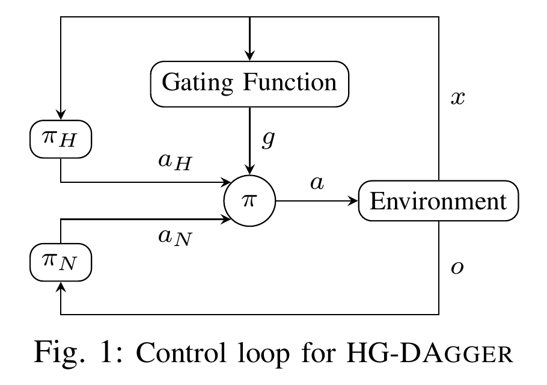
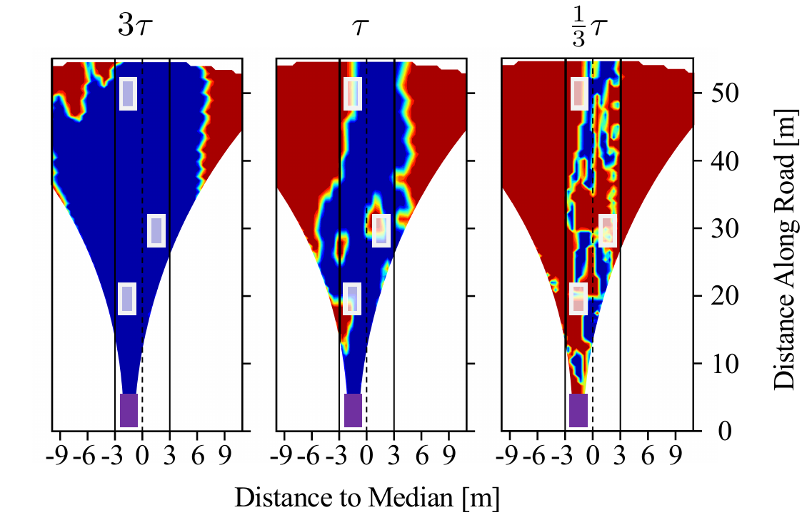
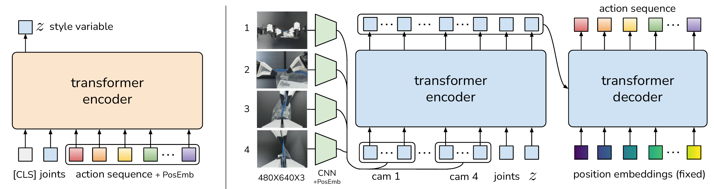
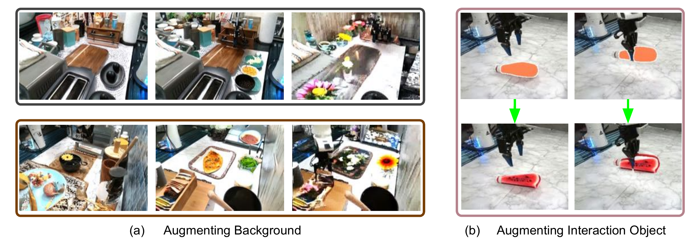

## [HG-DAgger](https://arxiv.org/abs/1810.02890)

EnsembleDAgger 引入了集成的思想来估计风险，但其安全阈值通常是人工设定的。首先安全性差，其次控制权在人和机器人之间切换时，人类专家会“操作滞后”或者混乱，导致提供的标签质量下降。EnsembleDAgger 引入了集成的思想来估计风险（一组神经网络输出的协方差矩阵 $C_t$方差越大，定义“疑虑” $d_N(o_t)$ 为协方差矩阵主对角线的 $l_2$ 范数），但其安全阈值通常是人工设定的。

- ​**输入 (Input)** : 当前状态观测 $o_t$（如车辆传感器数据）。
- ​**执行 (Execution Loop)** :

  - ​**默认状态**: 新手策略 $\pi_N$ (Novice) 全权控制车辆。
  - ​**监控 (Monitoring)** : 人类专家 $\pi_H$ (Expert) 持续观察系统行为。
  - ​**门控判断 (Gating** **$g(x_t)$**​ **)** :

    - 如果人类认为状态**安全** -\> 维持新手控制，**不**收集数据（或仅作为测试）。
    - 如果人类认为状态**危险** -\> 人类按下按钮/转动方向盘夺取控制权。
  - **数据收集 (Collection)** : 在人类接管期间，记录 (状态, 人类动作) 对，加入数据集 $\mathcal{D}$。此过程持续直到人类主动交还控制权 。（只收集少量救火数据，基础策略已经经过BC冷启动）
- ​**训练 (Training)** :

  - 利用聚合的数据集 $\mathcal{D}$ 训练新的新手策略 $\pi_{N_{i+1}}$。
  - 使用神经网络集成 (Ensemble) 来训练，以便后续评估不确定性 。
- ​**阈值更新 (Threshold Update)** :

  - 记录人类介入瞬间的模型“疑虑”值（Doubt）。
  - 计算新的安全阈值 $\tau$（取介入时刻疑虑值的统计平均）。
  - $$
    \tau = \frac{1}{\text{len}(\mathcal{I})/4} \sum_{i=\lfloor .75N \rfloor}^{N} (\mathcal{I}[i])
    $$
  - **$\mathcal{I}$**  **(Intervention Log)** : **干预日志列表**，只取最后25%的数据。

黑色虚线表明：人类凭直觉感到“危险”并接管车辆的那个时刻，恰好对应了区分“物理安全空间”与“物理危险空间”的最佳数学边界。

## [One-Step RL](https://arxiv.org/abs/2106.08909)

1. **Step 1: 行为策略估计 (Behavior Estimation)**

    - 输入：离线数据集 $\mathcal{D} = \{(s, a, r, s')\}$。
    - 操作：使用监督学习（Behavior Cloning）训练一个模型 $\hat{\beta}(a|s)$ 来拟合数据分布。
2. **Step 2: 行为Q值估计 (Behavior Q-Evaluation)**

    - 操作：训练一个 Q 函数 $\hat{Q}^\beta(s, a)$ 来评估行为策略 $\beta$。
    - ​**关键点**：这里使用的是 SARSA 风格的目标 $r + \gamma \hat{Q}^\beta(s', a')$ 其中 $a' \sim \beta(\cdot|s')$（即来自数据集的动作），而不是取 $\max$。这避免了 OOD (Out-of-Distribution) 动作查询，非常稳定。
3. **Step 3: 一步策略提升 (One-Step Policy Improvement)**

    - 操作：冻结 $\hat{Q}^\beta$，求解一个新的策略 $\pi_{new}$。
    - ​**目标函数**：最大化 $\mathbb{E}_{a \sim \pi}[ \hat{Q}^\beta(s, a) ]$，同时约束 $\pi$ 不偏离 $\beta$。
    - **具体实现**：（以下两个方法二选一，**Reverse KL Regularization**性能稍好）

      - ​**Reverse KL Regularization**: $\max_\pi \mathbb{E}[\hat{Q}^\beta] - \alpha D_{KL}(\pi \| \beta)$。
      - **Easy BCQ**: 采样 $N$ 个动作 $\{a_i\} \sim \beta(\cdot|s)$，选择 $\hat{Q}^\beta(s, a_i)$ 最大的那个动作。

当你有一个预训练好的强大 VLA 模型（如 `pi0`​ 或 `OpenVLA`）时，这个模型本身就是高质量的 $\beta$。此时，你可能**不需要**复杂的 CQL/IQL，只需要做简单的 **Weighted Behavior Cloning** (类似本文的 One-step Exp. Weight)，就能获得显著提升。（待验证）

## [PA-RL](https://policyagnosticrl.github.io/)

> **策略无关 RL (PA-RL)**  的离线 RL 和在线微调方法，它可以有效地训练多种策略类别，涵盖不同的架构和规模 。我们的基本思路是：**只要应用于“优化后”的动作，通用的监督学习损失就可以替代 RL 中的策略改进步骤** 。

简单看了一下它的代码实现，是基于CQL/IQL的增量式改进工作。

- **输入：**  当前状态 $s$，当前策略 $\pi_\phi$，训练好的 Critic $Q_\theta$。
- **第一阶段：动作优化 (Action Optimization)**  

  - **采样：**  从当前策略 $\pi_\phi(\cdot|s)$ 采样 $k$ 个候选动作。
  - **全局优化：**  计算这些动作的 $Q_\theta(s, a)$ 值，保留分数最高的 $m$ 个动作。
  - **局部优化 (关键)：**  对这 $m$ 个动作，固定网络参数，仅对**动作向量** $a$ 进行 $T$ 步梯度上升：$a \leftarrow a + \alpha \nabla_a Q_\theta(s, a)$（这个公式会反复迭代$T$次）。
- **第二阶段：策略蒸馏 (Policy Distillation)**  

  - 将优化后的动作视为“伪标签 (Pseudo-labels)”。
  - **训练：**  使用该策略原本的监督学习损失函数（如 Diffusion 的 MSE 损失，或 Transformer 的 Cross-Entropy 损失）来更新策略参数 $\phi$，使其输出这些优化后的动作。
- **循环：**  收集新数据 -\> 更新 Critic -\> 动作优化 -\> 更新 Actor。

可以看出是在做蒸馏，BC算法真的足够强大，只是需要一些技巧。在真机实验中他们采用了OpenVLA架构，Cal-Ql算法和PA-RL的方法，VLA是LoRA微调，Action不断推理保存在Action Cache里面（Policy一更新Cache清空），由于大模型在 RL 信号下非常脆弱学习率很低，为了省钱省时间，Offline 阶段只把 Critic 练好了，Actor 留到 Online 阶段才动。

‍

## DP

[https://cheng-chi.github.io/](https://cheng-chi.github.io/)

同样是建模概率分布，Diffusion Policy从数学理论上有连续性的优势，这是softmax做不到的，只要深刻理解了Diffusion的数学原理，其为什么可以解决Action Mulyimodality, Action Space Salability以及拥有 Train Stability是显而易见的。

‍

## [DP3](https://github.com/YanjieZe/3D-Diffusion-Policy)

主要是参考它点云的处理方法,很干净的baseline。

- **输入 (Input)** ：单视角深度图（Depth Image）+ 机器人本体感知（关节角度等）。
- **点云处理 (Perception - Preprocessing)** ：

  - 深度图转点云 -\> 裁剪（Cropping）去除背景 -\> **最远点采样 (FPS)**  下采样到 512 或 1024 个点 。
  - *关键点*：通常**不使用颜色信息**（XYZ only），以提高对颜色变化的泛化能力 。
- ​**3D 编码 (Perception - Encoder)** ：

  - ​**DP3 Encoder**：一个轻量级的 MLP 网络（PointNet的简化版，去掉了T-Net）。
  - 结构：`MLP(3->64->128->256)`​ -\> `MaxPool`​ (提取全局特征) -\> `Projection(256->64)`。
  - 输出：一个紧凑的 64维 特征向量 。
- ​**决策生成 (Decision - Diffusion Backbone)** ：

  - 采用 ​**CNN-based Diffusion Policy**（基于1D ResNet）。
  - ​**条件 (Conditioning)** ：将 3D特征向量 和 机器人状态向量 拼接，作为 Condition 输入给去噪网络。
  - **去噪 (Denoising)** ：从高斯噪声开始，经过 $K$ 步迭代，生成未来的动作序列 。
- **输出 (Output)** ：执行动作序列（通常预测 $H$ 步，执行前$N_{act}$ 步）。

## ACT及其后续

### ACT

[ACT：RSS 2023](https://tonyzhaozh.github.io/aloha/)   [ACT 精讲](https://zhuanlan.zhihu.com/p/677625871)

ACT是ALOHA团队在2023年4月份提出的一种模仿学习算法，针对精细操作任务表现十分优异。  
ACT后续已作为baseline算法在多篇论文，如RoboAgent，BridgeData V2中被引用。

在收集到的示教数据中，分别包含：4个视角的图像（480\*640），从动臂的关节角（（6DOF臂+1DOF夹爪）\*2）和主动臂的关节角（（6DOF臂+1DOF夹爪）\*2）。

在训练过程中，从动臂的关节角和图像一起组成的输入给模型的观测值，而主动臂的关节角则作为了动作标签。

为了减小compounding error，ACT使用了action chunking。Action chunking是神经科学中的一个概念：独立的动作会被组合到一起并作为一个单元被执行，这样会使得动作被存储和执行的效率更高。我们甚至可以把将电池插入凹槽里这个任务视作一个action chunk。但是在ACT算法中，作者一开始将chunk size设置为固定的k步。每k步，agent获取一次输入，预测后k步的动作，然后按照顺序执行这些动作。这样做，可以直接将任务轨迹的长度缩短到1/k（只需要做1/k次预测）。

Chunking也可以帮助刻画人类示教行为的非马尔可夫性（人会根据历史信息来完成任务）。一个单步预测的策略很容易受到时序相关信息的影响，比如示教过程中的一个突然停顿，会让agent很困扰，因为下一步做什么动作会与停顿的时间有很强的关系。然而，简单的action chunking会出现这样的问题：每k步突然输入一个新的观测值，这种不连续会导致机器人出现不稳定的行为。为了使机器人的运动轨迹更加平滑，作者提出每一步都让模型预测后面k步的动作，这样会使得模型在不同时间点上预测的动作有所重合。进一步地，作者提出一种temporal ensemble的方法来组合这些预测值。

对于当前时间步 $t$，机器人最终执行的动作 $a_t$ 是过去不同时刻对该时间点预测值的**加权平均**：$a_t = \frac{\sum_{i=0}^{k-1} w_i \cdot a_t^{(i)}}{\sum_{i=0}^{k-1} w_i}$。权重 $w_i$ 采用指数加权（Exponential Weighting）方案：$w_i = \exp(-m \cdot i)$。Loss是标准BC Loss + VAE Loss。

在RoboTwin中，我发现ACT单任务微调成功率大于$\pi_0$。

### MT-ACT

RoboAgent： [RoboAgent IO界面](https://robopen.github.io/)

RoboSet数据集学术界友好：[RoboSet](https://robopen.github.io/roboset/) 7500条高质量人类遥操作轨迹的数据集，技能多样性（12种技能，包括接触丰富任务）场景变化上高质量，Franka Panda通用硬件。

使ACT适应**多任务 (Multi-task)**  和**语言条件 (Language-conditioned)**  的场景，并引入了语义增强。利用生成式 AI（Foundation Models）将互联网数据的语义先验“蒸馏”到机器人数据中，从而以低成本实现泛化。

- **数据收集与增强 (Offline)** ：

  - 收集少量高质量遥操作数据（RoboSet）。
  - **语义增强**：输入原始帧 -> 使用 **SAM** 分割对象 -> 使用文本提示指导生成式模型进行 **Inpainting**（重绘背景或物体） -> 输出多样化的增强帧。
- ​**策略训练 (MT-ACT)** ：

  - ​**输入**：多视角图像 $o_t$（4个相机） + 机器人本体感知 $j_t$ + 语言指令 $l$。
  - **编码 (Encoder)** ：图像经过编码，语言指令通过预训练 Encoder 提取嵌入，并使用 **FiLM** 层将语言特征注入到图像特征中（这对于多任务区分至关重要）。

...(后面和标准ACT 一样)

Chunk size \= 20 效果最好。

- 在 **L1 泛化**（光照、物体位置微调）下，MT-ACT 显著优于 RT-1, VIL, BeT 等基线。
- 在 **L2/L3 泛化**（新背景、新干扰物、新物体）下，引入语义增强的 MT-ACT 性能提升巨大（相对提升约 100%-400%）。去除了增强后，L2/L3 性能大幅下降，证明了生成式增强对 OOD（分布外）泛化的核心作用。
- **L4 泛化**（完全没见过的厨房）：MT-ACT 达到 25% 成功率，而其他所有基线均为 0%。

### nl-act

[nl-act开源代码](https://github.com/krohling/nl-act/blob/main)  **工程实现与改进类**工作

RoboAgent (MT-ACT) 使用了更复杂的**FiLM (Feature-wise Linear Modulation)**  层将语言嵌入注入到视觉骨干网络中 。本文采用了更简单直接的方法：**直接将文本嵌入投影后拼接到Transformer Encoder的输入序列中**。作者承认MT-ACT的方法可能更优，但本文证明了简单的拼接在模拟环境中依然有效。

- **输入指令** (Natural Language Instruction) $\rightarrow$ **SBERT Encoder** (`all-mpnet-base-v2`) $\rightarrow$ 提取文本嵌入 $e_{instr}$ ($1 \times 768$).
- **投影与拼接** (Projection & Concatenation):

  - $e_{proj} = W \cdot e_{instr} + b$ （映射到 $1 \times 512$） 。
  - 构建输入序列 $S_{input} = [e_{proj}, z, e_{visual}, j]$ 。
  - 其中 $z$ 是VAE的Latent，$e_{visual}$ 是ResNet提取的图像特征，$j$ 是关节位置。
- ​**Transformer Encoder**: 处理拼接后的序列，结合位置编码（Visual, Joint, Text）。
- **Transformer Decoder**: 生成动作序列 (Action Sequence)。

‍

- ​**简单的Concat机制**：不同于RT-1或MT-ACT在视觉层做融合，这里直接在Decision Transformer层级做Token融合。
- **冻结的语言编码器**：使用预训练好的SBERT模型，不进行微调，只训练投影层。

‍

- **Semantic Data Augmentation**：

  - 利用 **GPT-4o** 为每个基础任务生成了35种不同的指令变体（Paraphrased instructions） 。
  - 训练时采用**随机指令采样 (Random Instruction Sampling)** ，从25个训练指令中随机选择，保留10个作为验证。这迫使模型学习语义而非死记硬背特定的句法模式 。
- **Analysis of Noise Injection**：

  - 对比了在数据采集阶段注入轨迹噪声（Uniform noise [-0.01, 0.01]）与无噪声数据的训练效果。
  - **Insight**：发现噪声注入虽然没有提高最终的收敛上限（甚至略低），但显著**加速了早期的学习速度**（在10k迭代时，有噪声模型成功率85.3% vs 无噪声43.3%） 。这表明噪声通过暴露更多样化的状态空间，充当了类似“探索（Exploration）”的催化剂。

### ACT-1

[Sunday Robotics发布的“ACT-1”作为商业公司的基础模型，是闭源的（只有演示视频，无公开权重或代码）。](https://x.com/sundayrobotics/status/1991196264772387261?s=20)

[YouTube视频](https://www.youtube.com/watch?v=QeVnwtCANZ8)

**ACT (Action Chunking Transformer)**  和 **UMI** 的工程化放大版。

- Sunday Robotics 是一家由 **Tony Zhao** (CTO/Co-founder) 和 **Cheng Chi** 创立的具身智能初创公司。
- **创始人背景：**  Tony Zhao 是斯坦福博士生（导师Chelsea Finn），也是 **Mobile ALOHA** 和 **ACT** 算法的一作；Cheng Chi 是 **UMI** (Universal Manipulation Interface) 的一作。
- **产品：**  视频中的机器人叫 ​**Memo**，而非人形，采用轮式底座+升降脊柱设计。

‍
