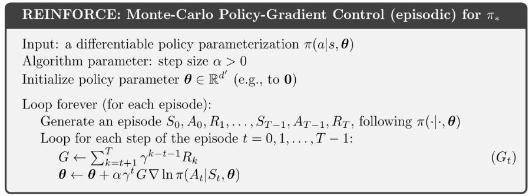
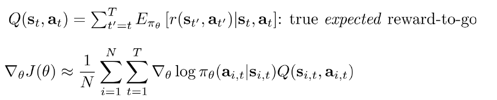
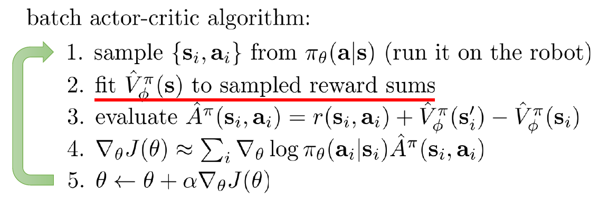
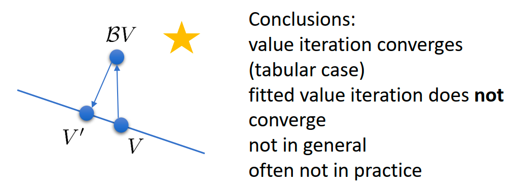

> 这份笔记建立了从 **Actor-Critic** 到 **Value-Based 方法** 的理论桥梁，严谨地分析了深度强化学习面临的收敛性挑战（**Deadly Triad**）。它最终落脚于 **连续控制机器人** 的解决方案，详细阐述了 **NAF** 和 **DDPG** 如何解决连续动作空间下的最大化难题，以及 **QT-Opt** 架构如何将这些原理扩展到大规模分布式系统中。

## ReCap Policy Gradient

假设你很熟悉这个表：  
​

不仿把Loop forever替换为一个Batch N个episode，我们把两个循环合并可以得到一下公式：

$$
\nabla_{\theta}J(\theta) \approx \frac{1}{N} \sum_{i=1}^{N} \sum_{t=1}^{T} \nabla_{\theta} \log \pi_{\theta}(a_{i,t}|s_{i,t}) \hat{Q}_{i,t}^{\pi}
$$

‍

这里最关键的一项是 $\hat{Q}_{i,t}^{\pi}$，为  **"reward to go" (未来的累计回报)**  。这里的 $\hat{Q}_{i,t}^{\pi}$既可以是$\sum_{t'=t}^{T} r(s_{i,t'}, a_{i,t'})$（有限视界任务），也可以是 $\sum \gamma^{k-t-1} R_k$（无限视界任务）。

目前我们讨论的 $\hat{Q}_{i,t}^{\pi}$是基于采样的，它虽然是无偏估计，但是由于采样方法本身方差很大，会导致训练不稳定。尽管有加入baseline降低方差来稳定训练的方法，我们依然期待去使用一个上限更高且可以scale up的方法。

在完美理想的情况下我们期待的公式是这样的：

加入baseline之后的期望公式是这样的：

这里我们已经看到**优势函数(Advantage Function)** 的原型了，通过此次推导我直观的理解，<u>优势函数就是REINFORCE w/ baseline加上数学期望所需要的一个关键元素。</u>

$$
A^\pi(s_t, a_t) = Q^\pi(s_t, a_t) - V^\pi(s_t)
$$

一般教材将其解读为：如果 $A > 0$，说明这个动作比平均好，应该鼓励；如果 $A < 0$，说明这个动作比较差 。

但实际情况是我们无法直接获得true expected reward-to-go，期望降低了方差，但是注定无法无偏估计，只能去拟合。

## Evaluation

我们需要估计 $A^\pi$，但我们手里只有采样的数据。我们应该训练哪种网络？$Q^\pi ,V^\pi, A^\pi$ ?

我们省略折扣因子列出Bellman方程：

$$
Q^\pi(s_t, a_t) \approx r(s_t, a_t) + V^\pi(s_{t+1})
$$

再向前走一步：

$$
A^\pi(s_t, a_t) \approx r(s_t, a_t) + V^\pi(s_{t+1}) - V^\pi(s_t)
$$

是的只需要拟合$V^\pi$,$Q^\pi$和$A^\pi$都有了。

原始的蒙特卡洛（MC）评估 (Policy Evaluation)自然是不可行的，训练一个神经网络 $\hat{V}_\phi^\pi(s)$，这就是Critic 的雏形。然后标准监督学习回归（Supervised Regression）。

**为什么有效？** ：虽然每一个标签 $y_{i,t}$ 都是带有高方差的单次采样结果，但神经网络在训练过程中会试图去拟合这些嘈杂数据的**平均值**。这就变相实现了“在相似状态下取平均”的效果 。我个人的理解是神经网络的预测更加平滑，所以稳定了训练。

但是 标签 $y_{i,t} = \sum_{t'=t}^T r$ 还是有很大的方差（因为它包含了未来无数步的随机性），所以我们从拟合MC转向拟合Bootstrapping (自举)。

**新标签 (Target)** ：$y_{i,t} = r(s_{i,t}, a_{i,t}) + \hat{V}_\phi^\pi(s_{i,t+1})$ 

‍

## From Evaluation to Actor Critic

**Batch Actor-Critic 算法**

相比上一节，我们开始正式向Critic训练引入折扣因子。$y_{i,t} \approx r(s_{i,t}, a_{i,t}) + \gamma \hat{V}_\phi^\pi(s_{i,t+1})$ ，$\mathcal{L}(\phi) = \frac{1}{2} \sum_{i} \left\| \hat{V}_{\phi}^{\pi}(\mathbf{s}_i) - y_i \right\|^2$。折扣因子0.99 works well。这里我们有另一个理解折扣因子的视角：

$\gamma$ 可以被看作是每一步“存活”的概率。$\gamma < 1$ 意味着每一步都有 $1-\gamma$ 的概率游戏突然结束（死亡）。因此，未来的奖励因为“可能拿不到”而被打折了。

向Policy训练引入折扣因子：

Option 1 :

$$
\nabla J \approx \sum \nabla \log \pi(a_t|s_t) \left( \sum_{t'=t}^T \gamma^{t'-t} r_{t'} \right)
$$

- **特点**: 只有**回报**（Reward）被打折了（右边括号里有 **$\gamma$**​ **），** 但是**梯度（Gradient）** 前面没有乘 $\gamma^t$。
- 这意味着：无论是在第 1 步还是第 1000 步，只要发生了更新，我们都同等重视。

Option 2 :

$$
\nabla J \approx \sum \gamma^{t-1} \nabla \log \pi(a_t|s_t) \left( \sum_{t'=t}^T \gamma^{t'-t} r_{t'} \right)
$$

- ​**特点**​: **梯度**前面也被打折了 ($\gamma^{t-1}$)。
- **来源**: 如果你严格对 $J(\theta) = E[\sum \gamma^t r_t]$ 求导，数学上确实会得到这一项。这意味越靠后的时间步，对总梯度的贡献越小（因为 $\gamma^{1000} \approx 0$）。

​<kbd>选择</kbd>

- 如果我们使用 Option 2（对梯度打折），那么在 $t=1000$ 步时的梯度权重几乎为 0。这会导致智能体**根本不关心**游戏后期的表现，因为它觉得那里的梯度微不足道。
- 但实际上，如果智能体成功活到了第 1000 步，那么**在那个状态下**做正确的动作（比如继续保持平衡）是至关重要的。
- 我们不希望因为“那个时刻在很久的未来”就忽视在那里的学习。
- 因此，我们在实践中**人为地去掉**了梯度前面的折扣因子 $\gamma^{t-1}$，只保留了回报里的折扣因子。这虽然在数学上是有偏的（biased wrt the original objective），但在优化上是更合理的，因为它鼓励智能体在任何时刻都争取最优。
- 写代码时，计算 Advantage 或 Reward-to-go 要用折扣因子（$\sum \gamma \dots$），但在累加 Loss 或梯度时，**不要**乘以 $\gamma^t$ 来衰减这一步的权重。

当我们实际要把代码写出来时，需要做哪些决定。

1. ​**网络架构 (Architecture Design)** :

    - ​**Two Network Design**: Actor 和 Critic 各自拥有独立的神经网络。

      - ​*优点*：简单、稳定，两个网络互不干扰，梯度更新清晰。
    - ​**Shared Network Design**: 两个网络共享前几层的特征提取器（如 CNN/ResNet），只在最后分叉出两个头（Head）：一个输出动作概率 $\pi$，一个输出价值 $V$。

      - ​*优点*：高效（只需一次前向传播），特征共享能加速学习。
      - ​*缺点*：调节 Loss 的权重（Actor loss vs Critic loss）会比较麻烦，有时候 Critic 可能会把特征层带偏，导致 Actor 变差。
2. ​**并行化 (Parallelism)** :

    - 只要是 Online 算法，单线程跑通常太慢。
    - ​**Synchronous (A2C)** : 多个工人并行采样，等到大家都做完一步，把梯度汇总，同步更新一次网络。这更适合 GPU 训练（Batch Size 大）。
    - ​**Asynchronous (A3C)** : 多个工人各跑各的，谁跑完谁就去更新全局网络，不用等别人。这更适合 CPU 集群。

如果你依然不满足Online 算法地最大缺点 -- 样本利用率低，接下来探索的主题是Offline Actor-Critic算法。

直接把 Replay Buffer 塞进 Actor-Critic 的算法，  **"This algorithm is broken!"**  

- ​**Bug 1: 价值估计错误 (Not the right target value)** 。

  - 在 Buffer 里的数据 $(s_i, a_i, r_i, s_i')$ 是旧策略产生的。如果我们直接用 $y_i = r_i + \gamma \hat{V}(s_i')$ 更新 Critic，这里的 $V(s_i')$ 隐含的意思是“在 $s_i'$ 之后继续按照**旧策略**玩下去的价值”。但我们需要的是“按照**当前新策略**玩下去的价值”。
- ​**Bug 2: 动作不匹配 (Not the action** **$\pi_\theta$** **would have taken)** 。

  - 计算梯度 $\nabla \log \pi(a_i|s_i) \hat{A}(s_i, a_i)$ 时，我们用了 Buffer 里的历史动作 $a_i$。但当前的策略 $\pi_\theta$ 在状态 $s_i$ 可能根本不想做动作 $a_i$。强行用旧动作去更新新策略，会导致策略学偏。

**修复方案 1: 修复 Critic** :

- 我们不能再只拟合 $V(s)$ 了，因为 $V(s)$ 这种“状态价值”本身就绑定了策略。
- 改用 **Q-Function**。我们拟合 $Q(s,a)$。**与具体的action耦合，不与策略耦合！**
- ​**Target 计算**：$y_i = r_i + \gamma Q(s_i', \mathbf{a_i'})$。

  - 关键点：这里的 $\mathbf{a_i'}$ 不是从 Buffer 里拿的，而是**用当前最新的策略** **$\pi_\theta$** **实时算出来的** ($a_i' \sim \pi_\theta(a|s_i')$)。这确保了 Critic 评估的是当前策略的未来。

**修复方案 2: 修复 Actor**:

- 我们不能直接用 Buffer 里的 $a_i$ 来算 Policy Gradient。
- 再次利用当前策略。
- ​**做法**：对于状态 $s_i$，我们**忽略** Buffer 里当时做了什么动作 $a_i$。我们让当前的 Actor 在 $s_i$ 下重新采样一个动作 $a_i^\pi \sim \pi_\theta(a|s_i)$。
- ​**新梯度**：$\nabla J \approx \sum \nabla \log \pi(a_i^\pi|s_i) Q(s_i, a_i^\pi)$。

  - 这实际上把问题转化为了一个“最大化 Q 值”的优化问题：即寻找一个动作 $a$，使得 Critic 给出的评分 $Q(s, a)$ 最高。这就是 **SAC (Soft Actor-Critic)**  和 **DDPG** 等现代算法的雏形。

严格来说，我们的目标是优化当前策略在它**自己**虽然我们在数学上稍微“作弊”了一下，但这其实不是坏事。我们原本只想让策略在它常去的地方表现好，现在我们让它在一个**更宽更广的分布 (broader distribution)**  上都表现好 。这反而增加了策略的鲁棒性（泛化能力）。产生的状态分布下的表现，但我们现在是在优化它在**历史**状态分布下的表现。

<kbd>nothing we can do here, just accept it。</kbd>

Actor-Critic是一个很通用的框架，其具体的算法有如下：

1. 更高级的 Q 函数拟合

    1. **Double Q-learning**、**Dueling Networks**
2. 重参数化技巧 (Reparameterization Trick)

    1. 针对梯度计算，虽然公式写的是标准的 Log-Likelihood 梯度（类似 REINFORCE），但幻灯片提到可以使用 **Reparameterization Trick** 来更好地估计积分。
    2. 这是 **Soft Actor-Critic (SAC)**  的核心技巧。它不是像 REINFORCE 那样根据采样的好坏来调整概率，而是利用 $a = \tanh(\mu(s) + \sigma(s) \cdot \epsilon)$ 这样的公式，让梯度直接**穿过**采样过程传回 Actor 网络。这能极大降低方差，提高学习效率。
    3. 你在前面学到的所有“修复”步骤（用 Q 网络、Off-Policy、重新采样动作），加上熵正则化（Entropy Regularization），就是大名鼎鼎的 SAC 算法。它是目前连续控制领域最常用、最强大的算法之一。
3. 确定策略（不想采样）

    1. **DDPG (Deep Deterministic Policy Gradient)**  和 **TD3** 算法

## Advanced Advantage Estimation

​**回顾三种写法**：

1. **Actor-Critic**: 用 $r + \gamma V(s') - V(s)$。
2. **Policy Gradient** : 用 $\sum r - b$。
3. **混合法** : 用 $\sum r - V(s)$。

    - 这里我们把 Critic $\hat{V}(s)$ 仅仅当作 **Baseline** 减去，而目标回报仍然使用真实的蒙特卡洛回报 $\sum r$。
    - 因为 Baseline 不改变梯度的期望，所以这是 **无偏差 (Unbiased)**  的；同时因为 $V(s)$ 比常数 $b$ 更准，所以方差比纯 PG 低。但是方差依然比较高因为MC。

- 更复杂的 **Q-Prop** 算法（Gu et al. 2016）。
- 核心思想是利用数学上的“控制变量法”，试图在保持无偏差的前提下，进一步利用 Critic 来降低方差。这是一个比较高阶的技巧，通常只在极度追求样本效率时使用。

​**N-step Return**:

- ​**公式**：$\hat{A}_n^\pi = \sum_{t'=t}^{t+n} \gamma^{t'-t} r + \gamma^n \hat{V}(s_{t+n})$。
- ​**含义**：先真实地走 $n$ 步（累加这 $n$ 步的真实奖励），站在第 $n$ 步的位置，再用 Critic 预测剩下的未来。
- ​**效果**：通过调节 $n$，我们在 Bias 和 Variance 之间找到了一个平衡点。通常 $n > 1$ 效果更好。

- ​**动机**: 既然 N-step 的 $n$ 选多少是个难题，我们能不能​**全都要**？
- GAE 公式:

  $$
  \hat{A}_{GAE}^\pi(s_t, a_t) = \sum_{l=0}^\infty (\gamma \lambda)^l \delta_{t+l}
  $$
- 这里的 $\delta_t = r_t + \gamma V(s_{t+1}) - V(s_t)$ 就是最简单的 ​**TD Error**。
- **直观理解**: GAE 就是把未来所有的 TD Error 加起来，每往后一步，乘衰减系数 $(\gamma \lambda)$。
- $\lambda$是 GAE 引入的一个**新超参数**：

  - **$\lambda = 0$**:  **TD**
  - **$\lambda = 1$**:  **Monte Carlo**
  - **$\lambda \in (0, 1)$**: 处于中间的甜蜜点，通常取 0.95 左右。

GAE 是目前 PPO 等主流算法中计算 Advantage 的标准方式。

‍

## Value Function Method:A Unified Perspective

假设你已经自学或者阅读  已掌握以下知识：

- Dynamic Programming --> Policy Iteration Value Iteration

- Tabular Q-learning --> DQN 。（表格维度灾难）

这里是根据CS285增量补充一些内容。

​<kbd>从  “拟合迭代 (Fitted Q-Iteration)”到“在线交互 (DQN)”</kbd>

**Trick 1：利用 Q 定义绕过模型**我们不再需要预测 $s'$，因为数据集里的四元组 $(s_i, a_i, s'_i, r_i)$ 已经告诉了我们：在 $s_i$ 执行 $a_i$ 后，环境（Dynamics）把我们带到了 $s'_i$。这一步是 Model-Free 的关键。

**Trick 2："Max" Trick 的再应用** (Bootstrapping)

我们如何估计下一时刻的价值 $E[V(s'_i)]$？

PPT 右侧给出了关键近似：

$$
E[V(s'_i)] \approx \max_{a'} Q_\phi(s'_i, a')
$$

这就是所谓的 "Max Trick"。我们不需要知道策略是什么，直接贪婪地认为下一时刻我们会选取让 Q 值最大的动作。

- **优点 (Green)**  ：

  - ​**Works for off-policy samples**：这使得它可以直接用于 Offline RL。你可以用别人收集好的数据（RoboTwin benchmark）来训练你的策略，而不需要像 Actor-Critic 那样必须用当前策略去采样。
  - ​**Only one network**：不需要 Actor 网络，只要训练好 Critic (Q网络)，策略就是隐式的 $\arg\max Q$。
  - ​**No high-variance policy gradient**：回归问题通常比梯度估计方差更小，训练更稳定。
- **缺点 (Red - A Sad Corollary)**  ：

  - ​**No convergence guarantees for non-linear function approximation**：这是最令人沮丧的结论。
  - 当我们将 **非线性函数近似 (Neural Nets)**  + **Bootstrapping (利用 max Q 更新)**  + **Off-policy 数据** 结合在一起时。理论上它是不保证收敛的，甚至可能发散。

如果想要offline算法转online算法，从**全量数据的最小二乘回归（Full Least Squares）**  变成了 **随机梯度下降（Stochastic Gradient Descent, SGD）即可。**

$$
\phi \leftarrow \arg\min_\phi \frac{1}{2} \sum_i ||Q_\phi(s_i, a_i) - y_i||^2
$$

对以上式子求导可以得到以下的梯度更新式子：

$$
\phi \leftarrow \phi - \alpha \frac{dQ_\phi}{d\phi}(s_i, a_i) (Q_\phi(s_i, a_i) - y_i)
$$

同时上式中$y_i$的具体计算公式如下：  
  

$$
y_i = r(s_i, a_i) + \gamma \max_{a'} Q_\phi(s'_i, a')
$$

在 上图 的 step1 中，可以Epsilon-Greedy 以及 Boltzmann Exploration （Q 值越高的动作被选中的概率越大：$\pi(a_t|s_t) \propto \exp(Q_\phi(s_t, a_t))$ ）当然这种探索的方法你可能觉得太简单了，以后再discuss exploration in detail。

​<kbd>深入的收敛性理论（Why Deep RL fails?）</kbd>

> 这是理解为什么 Deep RL 需要各种 Trick（如 Target Network, Double Q）的根本原因。这部分数学味儿比较重。

**表格型 (Tabular)**  情况下，Bellman Operator $\mathcal{B}$ 是一个 **$L_\infty$** **收缩映射 (Contraction)** ，这意味着只要迭代次数够多，它**一定**会收敛到最优解 $V^*$ 。

引入了神经网络（函数近似），这在数学上等同于增加了一个 **投影算子 (Projection Operator** **$\Pi$**​ **)**

虽然 $\mathcal{B}$ 是收缩的，$\Pi$ 也是收缩的

但是它们的组合 **$\Pi\mathcal{B}$**  **(投影后更新) 并不一定是收缩的** 。

- **Q-Learning 不是真正的梯度下降！**
- **原因**：在真正的梯度下降中，目标值 $y_i$ 应该是常数。但在 Q-Learning 中，目标值 $y_i = r + \gamma \max Q_\phi(s', a')$ **本身也包含了网络参数** **$\phi$** 。
- **后果**：当我们计算梯度时，我们**强行忽略了** $y_i$ 对 $\phi$ 的依赖（即我们把 Target Q 当作了常数，没有对它求导，也就是所谓的 **Stop Gradient**）。这意味着我们并没有在优化一个固定的 Loss Function，而是在追逐一个不断移动的目标。这是 Deep RL 难以收敛的根本原因之一 。

​<kbd>Actor-Critic 与 Value-Based 的本质关系</kbd>

在Actor-Critic方法中，如果我们将 Policy 设为**确定性的贪婪策略** ($\pi'(a_t|s_t) = 1 \text{ if } a_t = \arg\max A^\pi$)，从而将 Actor-Critic 演变成了纯粹的 Value-Based 方法。这确立了 Value-Based 方法其实是 Actor-Critic 的一种特例。

**只要你用了神经网络（非线性函数近似）和 Bootstrapping（TD Learning），无论是有** **​`max`​**​ **的 Q-Learning 还是没有** **​`max`​**​ **的 Actor-Critic，收敛性都无法从理论上得到保证。**

这就是著名的  **"Deadly Triad" (死亡三角)**  的体现：

1. **Function Approximation** (神经网络)
2. **Bootstrapping** (利用 $V(s')$ 更新 $V(s)$)
3. **Off-policy / Batch data** (离线数据或并非完全实时的在线数据)

所以在理论上无法保证收敛的情况下，我们更追求算法的稳定性，让训练过程没那么容易崩溃，即使是PPO算法也是一种**on-policy-ish-style**方法，追求学习的稳定性，并没有从理论上解决这个问题。

‍

## Deep RL with Q Function

假设你已经自学或者阅读 掌握了Double DQN 、Dueling DQN 、Replay Buffer 。

​<kbd>连续动作空间的 Q-Learning (Continuous Actions)</kbd>

DQN 中最核心的操作是 $\max_a Q(s,a)$。在离散空间（如雅达利游戏，只有上下左右）这很容易；但在连续空间（如机械臂关节角度），**你无法穷举所有** **$a$** **来求 max**。这是将 Q-Learning 应用于机器人的最大障碍。

3种解法

1. **随机采样 / CEM** ：简单粗暴，但在高维失效。

2. **NAF (Normalized Advantage Functions)**  ：这是一个很聪明的技巧。强制让 Q 函数关于动作 $a$ 是**二次型 (Quadratic)**  的，这样 $argmax$ 就有解析解（Closed-form solution）。这是早期的经典方法。

$$
Q_\phi(s, a) = \underbrace{-\frac{1}{2}(a - \mu_\phi(s))^T P_\phi(s) (a - \mu_\phi(s))}_{A(s, a) \text{ (优势函数)}} + V_\phi(s)
$$

让我们拆解这个公式的数学含义：

- **$V_\phi(s)$**​：这是​**状态价值函数 (State Value)** ，代表在该状态 $s$ 下所能获得的最佳预期回报。
- **$\mu_\phi(s)$**：这是一个与动作 $a$ 维度相同的向量。它代表了​**当前状态下的最优动作**。
- **$P_\phi(s)$**：这是一个正定矩阵（Positive-definite Matrix）。它决定了 Q 函数曲面的“开口”大小和方向。
- **优势函数** **$A(s, a)$**：注意看第一项，它是一个形如 $-x^T P x$ 的结构。因为 $P$ 是正定的，所以这一项**永远小于等于 0**。它本质上是一个**开口向下的抛物面**。

这样的设计让最大化操作变得简单，因为优势函数小于等于0，所以直接输出$\mu_\phi(s)$就是action。

**Loses representational power (丧失了表达能力)**  是最大的代价，它强行假设 Q 函数关于动作 $a$ 是一个**单峰的二次函数 (Unimodal Quadratic Function)。** 在复杂的机器人任务中，最优动作可能有多个（Multimodal）。比如绕过障碍物，从左边绕（动作 A）和从右边绕（动作 B）可能都是好的，但中间（直撞）是坏的。NAF 这种“单峰抛物线”无法表达这种“双峰”分布，它只能取中间的平均值，可能导致撞上障碍物。

3. **DDPG / Approximate Maximizer**

我既要 Q 函数保持复杂的非线性（Deep Neural Net），又要能算出 $\max$。怎么办？--> **训练**策略网络 **$\mu_\theta(s)$**​**来专门负责“找最大值”。**

$$
\mu_\theta(s) \approx \arg\max_a Q_\phi(s, a)
$$

$$
\max_a Q_\phi(s, a) \approx Q_\phi(s, \mu_\theta(s))
$$

$$
\frac{dQ_\phi}{d\theta} = \frac{da}{d\theta} \cdot \frac{dQ_\phi}{da}
$$

**Sergey Levine 的犀利评价**：虽然 DDPG 名字里带有 "Policy Gradient"（属于 Actor-Critic），但本质上它其实是 **Approximate Q-Learning**。这里的 Actor 不是为了去优化某种随机策略的期望回报，而仅仅是作为求解 $\max$ 操作的一个**计算组件**。

更新 Target Networks (软更新/Polyak Averaging)：

DDPG 不像 DQN 那样每隔 N 步硬拷贝参数，而是每一步都做一点点滑动平均：

$$
\phi' \leftarrow \tau \phi + (1-\tau)\phi'
$$

$$
\theta' \leftarrow \tau \theta + (1-\tau)\theta'
$$

这是 DDPG 能够稳定训练连续动作的关键技巧之一。

DDPG 虽然解决了连续动作问题，但它对超参数非常敏感且容易发生 Q 值高估（Overestimation）。后来的 **TD3 (Twin Delayed DDPG)**  和 **SAC (Soft Actor-Critic)**  都是基于 DDPG 的架构改进的。Google 的 **QT-Opt** 算法，其本质就是 DDPG 的一种变体（移除了显式的 Actor，用 Cross-Entropy Method (CEM) 来替代 $\mu(s)$ 做最大化，或者在大规模分布式下做近似）。

> DDPG 是现代 <u>Continuous Control Deep RL</u> 的开山之作

1-step 传播不仅有高偏差的缺点，而且由于奖励信号只传给了一个step,信号传播慢学习速度慢。N-step 却 “only actually correct when learning on-policy”。

- 如果是 **1-step** ：我们只用到 $(s_t, a_t, r_t, s_{t+1})$。
- 如果是 **N-step** ：公式里包含了 $r_{t+1}$（它是由 $a_{t+1}$ 产生的）。但是！Buffer 里的 $a_{t+1}$ 是**旧策略**选的，而我们的**当前策略**在 $s_{t+1}$ 时可能根本不会选这个动作！
- ​**结论**：你在优化当前策略的 Q 值，却强行使用了旧策略产生的动作路径和奖励。这就导致了数学上的不正确。

- ​**Ignore the problem (掩耳盗铃)** ：

  - ​**做法**：假装没看见这个问题，直接用 N-step。
  - ​**效果**​：​ **"often works very well"** ​。这是最骚的操作，很多著名的算法（如 Rainbow DQN, R2D2, Ape-X）在很多情况下其实就直接用了 N\=3 或 N\=5，只要 N 别太大，Off-policy 带来的误差可以被忽略。
- ​**Cut the trace (动态截断)** ：

  - **做法**：检查 Buffer 里的动作 $a_{t+k}$ 和当前策略 $\arg\max Q(s_{t+k})$ 是否一致。如果不一致，就在这里截断，只用前面的 $k$ 步回报。
  - **效果**：能保证正确性，但如果策略变化太快，N 会经常被截断成 1。
- ​**Importance Sampling (重要性采样)** ：

  - ​**做法**：通过乘上概率比 $\frac{\pi_{new}(a)}{\pi_{old}(a)}$ 来修正回报。
  - **效果**：数学上最正确，但方差会爆炸，很难调参（Retrace 算法就是为了解决这个问题）。

**Process 1: Data Collection (数据收集)**  

- ​**角色**：Actor（与环境交互者）。

**Process 3: Q-function Regression (Q 函数回归/训练)**  

- ​**角色**：Learner（学习者）。

**Process 2: Target Update (目标网络更新)**  

- ​**角色**：Stabilizer（稳定器）。

**Algorithms defined by Speed**

- **Online Q-learning** 

  - ​**配置**：所有进程同速运行。
  - ​**逻辑**​：收一个数据 -\> 训一次 -\> 目标网络立刻变。
  - ​**特点**​：​**Evict immediately**（Buffer 大小为 1，即没有 Buffer）。这就是最原始的、不稳定的 Q-Learning。
- **DQN (Deep Q-Network)**  

  - ​**配置**​：Process 1 和 Process 3 速度相近，但 ​**Process 2 is slow**。
  - ​**逻辑**：一边收集数据一边训练（Off-policy），但是目标网络 $\phi'$ 很久才更新一次（比如每 10000 步）。
  - ​**意义**：让 Target 慢下来，是 DQN 能够稳定训练神经网络的关键。
- **Fitted Q-iteration (FQI)**  

  - ​**配置**：嵌套循环结构。
  - ​**逻辑**：

    1. 先跑 Process 1 很久（收集一大批数据，填满 Buffer）。
    2. 然后进入 Process 2 和 3 的循环：固定 Target，疯狂跑 Process 3 直到收敛；然后更新 Target (Process 2)，再跑 Process 3...
  - **意义**：这就是纯粹的 **Batch / Offline RL** 模式。

‍

​**解耦**​：在 Google 的 ​**QT-Opt**​（机械臂抓取）或 DeepMind 的 **Ape-X** 中，这三个进程是物理上分离的：

- ​**Process 1**：可能在 100 台真实的机器人上并行运行，只负责往云端 Buffer 发数据。
- ​**Process 3**：可能在 8 个 TPU/GPU 上疯狂跑 SGD，只负责从云端 Buffer 拉数据算梯度。
- ​**Process 2**：由参数服务器（Parameter Server）定期广播最新的权重给所有机器人。

