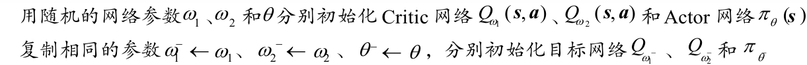
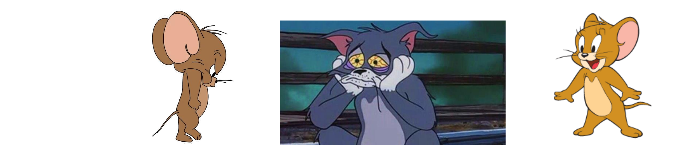

## DDPG

1. DDPG学习的是确定性策略，本身探索有限
2. 上图中更新当前Actor网络对应的公式就是**确定性策略梯度定理**。
3. Actor和Critic各用一个目标网络用参数 $\tau$实现软更新，$\tau = 1$更新方式便和DQN一致。

- ​**Original DDPG Paper**: $\tau = 0.001$
- ​**OpenAI Spinning Up**: $\tau = 0.005$ (对应代码中的 `polyak=0.995`)
- ​**Stable Baselines3**: $\tau = 0.005$

‍

## SAC

### 算法流程

‍

SAC的算法基于最大熵强化学习以促进探索性，在最大熵强化学习的框架下你可以了解学习到Soft Bellman方程和Soft 策略迭代方法，不过都是表格型（tabular）设置，即状态空间和动作空间有限的情况，在连续空间中就替换为任何拟合方法了。

Q网络的Loss Function由Soft Bellman方程推导而来，最小化 Bellman 误差，后来有的延伸算法为了稳定更新会把后面的 $\alpha$去掉：

$$
L_Q(\omega) = \mathbb{E}_{(s_t, a_t, s_{t+1}) \sim R, a_{t+1} \sim \pi_\theta(\cdot|s_{t+1})} \left[ \frac{1}{2} \left( Q_\omega(s_t, a_t) - \left( r_t + \gamma (\min_{j=1,2} Q_{\omega_j^-}(s_{t+1}, a_{t+1}) - \alpha \log \pi(a_{t+1} | s_{t+1})) \right) \right)^2 \right]
$$

**重参数化 (Reparameterization Trick):**

$$
a_t = f_\theta(\epsilon_t; s_t), \quad \text{where } \epsilon_t \sim \mathcal{N}(0, I)
$$

‍

策略 $\pi$的损失函数由KL散度推导而来：

$$
L_{\pi}(\theta) = \frac{1}{N} \sum_{i=1}^N \left( \alpha \log \pi_\theta(\tilde{a}_i | s_i) - \min_{j=1,2} Q_{\omega_j}(s_i, \tilde{a}_i) \right)
$$

‍

温度系数是SAC算法的一个核心技巧，你会发现温度系数会随着SAC训练的过程缓缓下降，写代码时我惊讶地发现竟然为一个单独的常数安排了一个优化器：

**带约束的优化目标:**

$$
\max_\pi \mathbb{E} \left[ \sum_t r(s_t, a_t) \right] \quad \text{s.t.} \quad \mathbb{E}_{(s_t, a_t) \sim \rho_\pi} [-\log \pi_t(a_t | s_t)] \ge H_0
$$

其中 $H_0$ 是目标熵 (Target Entropy)，通常设置为动作空间维度的负数 (例如: $-\dim(A)$)。

**温度系数** **$\alpha$** **的损失函数:**

$$
L(\alpha) = \mathbb{E}_{s_t \sim R, a_t \sim \pi(\cdot|s_t)} [ -\alpha \log \pi(a_t | s_t) - \alpha H_0 ]
$$

### 一些细节

$$
y_i = r_i + \gamma \left( \min_{j=1,2} Q_{\omega_j^-}(s_{i+1}, a_{i+1}) - \alpha \log \pi_\theta(a_{i+1} | s_{i+1}) \right)
$$

其中 $a_{i+1} \sim \pi_\theta(\cdot | s_{i+1})$。

在代码实现这个公式的时候，$Q_{\omega_j^-}(s_{i+1}, a_{i+1})$和$\log \pi_\theta(a_{i+1} | s_{i+1})$是需要加上"`mask`​"的，加`mask`的规则如下：

|**情况**|**描述**|**Dones (用于Reset环境)**|**Mask (用于算Q值)**|**物理含义**|
| --| ----------------| ------| ------| ------------------------------------|
|**Terminal**|撞墙/成功/掉坑|​`True`|​`0.0`|真的结束了，没有未来|
|**TimeLimit**|时间耗尽|​`True`|​`1.0`|被打断了，但在数学上应当视为有未来|
|**Normal**|正常走路|​`False`|​`1.0`|还有未来|

- 如果那个状态下的那一步动作导致了成功或者失败，即游戏结束没有未来了，Q和熵都需要被mask掉，reward is enough。如果这种情况不使用mask，会导致Q值严重高估。

- 一开始大家盲目地对所有游戏结束的情况都统一mask掉，但是后来有人在实践中发现时间耗尽而重置环境的情况不被mask训练效果更好，具体讨论这个内容的论文为： [\[ICLR2018\] Time Limits in Reinforcement Learning](https://arxiv.org/pdf/1712.00378)。
- 这个细节已经经过了千锤百炼的验证，基本不用怀疑。

## TD3

- **过高估计 (Overestimation)** ：像 DQN 一样，Q 网络倾向于高估动作的价值 。
- **Critic 不稳定 (Unstable Critics)** ：Critic 网络震荡，导致 Actor 无所适从 。
- **奇怪的损失景观 (Strange Landscape)** ：Critic 对某些动作的评分可能在某个点突然极高（尖峰），但其邻域动作评分却很低。这导致 Actor 的策略在更新时容易产生错误引导 。

1. 截断双 Q 学习 (Clipped Double Q-Learning) -- 1-d即1-done，也就是我之前说的mask，设置规则和之前一样。targ是target network的意思。

$$
y(r, s', d) = r + \gamma (1-d) \min_{i=1,2} Q_{\phi_{i, targ}}(s', a_{TD3}(s'))
$$

2. 延迟策略更新 (Delayed Policy Updates): 每更新 $N$ 次 Critic，才更新 1 次 Actor（通常 $N=2$） 。

3. 目标策略平滑 (Target Policy Smoothing): 我们希望 Critic 学习到的价值函数是平滑的（相似的动作应该有相似的价值）。为此，在计算目标值时，我们在**目标动作**上加一点**噪声:**

$$
a_{TD3}(s') = \text{clip}(\mu_{\theta, targ}(s') + \text{clip}(\epsilon, -c, c), a_{low}, a_{high})
$$

这里 $\epsilon$ 是噪声。

‍

再往后RLDP也推荐学习，之后放paper reading里面这里不讲述。

‍
