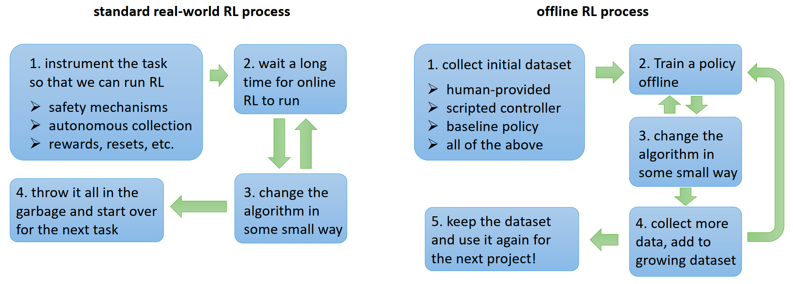

## Data Driven RL
> Can we develop data-driven RL methods?
>
> --Sergey Levine

RL 之所以没能像 CV 或 NLP 那样具有通用的泛化能力，是因为 RL 没能利用好“大数据”。传统的 RL 丢弃数据太快了，而监督学习则是建立在海量历史数据之上的。现代 AI 的成功 = **大数据 + 大模型**。解决方案：**Data-Driven RL（即 Offline RL）。**

- ​**On-policy RL**​（左上）：最原始的方式。采一点数据，学一点，然后​**扔掉数据**。效率极低。
- ​**Off-policy RL**（右上）：有个 Buffer（缓存），可以利用稍旧的数据，但仍然需要不断与环境交互来补充新数据。

**Offline Reinforcement Learning**：

- ​**Data collected once**：数据是一次性收集好的（或利用历史遗留数据）。
- ​**Training phase**：训练过程完全与环境断开（虚线框内）。在这个阶段，可以像训练 GPT 或 ResNet 一样，在固定的数据集上跑很多个 Epoch。
- **Deployment**：训练好了直接部署，或者产生更多Data形成数据飞轮。

**Formally:**

$$
\mathcal{D} = \{(\mathbf{s}_i, \mathbf{a}_i, \mathbf{s}'_i, r_i)\}
$$

$$
\begin{aligned}
\mathbf{s} &\sim d^{\pi_\beta}(\mathbf{s}) \\
\mathbf{a} &\sim \pi_\beta(\mathbf{a}|\mathbf{s}) \quad \longleftarrow \text{generally \textbf{not} known} \\
\mathbf{s}' &\sim p(\mathbf{s}'|\mathbf{s}, \mathbf{a}) \\
r &\leftarrow r(\mathbf{s}, \mathbf{a})
\end{aligned}
$$

**RL objective:**

$$
\max_{\pi} \sum_{t=0}^{T} E_{\mathbf{s}_t \sim d^\pi(\mathbf{s}), \mathbf{a}_t \sim \pi(\mathbf{a}|\mathbf{s})} [\gamma^t r(\mathbf{s}_t, \mathbf{a}_t)]
$$

在离线的设定下，我们通常想要解决两个层面的问题：

1. Off-policy Evaluation (OPE, 离线策略评估)

**定义**：给定数据集 $\mathcal{D}$ 和一个**指定的目标策略** **$\pi$**，请你估算一下：如果我真的去跑这个策略 $\pi$，它能得多少分（$J(\pi)$）？

2. Offline Reinforcement Learning (a.k.a. Batch RL)

**定义**：给定数据集 $\mathcal{D}$，请你**学习出**一个最佳的策略 $\pi_\theta$ 。

"not necessarily obvious what this means"

> Offline RL 与行为克隆的关键区别：面对**次优数据集**，我们的目标是恢复出潜在的**最优解**，不是仅仅模仿数据分布中的**相对最佳行为。**

 **"Bad intuition: it's like imitation learning"**  。 之所以说这是 Bad intuition，是因为如果不引入 RL 的**时序差分（Temporal Difference）** 机制，你永远只能是数据的“复读机”。引入了**价值函数（Q-function）和动态规划（Dynamic Programming），面对数据时学习的是物理规律与因果关系。**

> 在数据质量受限的情况下，Offline RL 能实现超越行为策略的<u>策略提升 (policy improvement)</u>，不是仅仅局限于在次优轨迹中寻找局部最优。

​<kbd>"How is this even possible?"</kbd>

1. Find the "good stuff" 从好坏参半的数据中挑出好的部分
2. Generalization
3. "Stitching" 如何将路径 A（从起点到中间）和路径 B（从中间到终点）结合起来，形成一条数据集中原本不存在的最优路径。

引用了 Kumar 等人的论文  *"Should I Run Offline Reinforcement Learning or Behavioral Cloning?"*

**QT-Opt**（Q-function Target Optimization），这是 Sergey Levine 团队（Google Research）在 2018 年发表的一个里程碑式工作。

“数据驱动的 RL 到底行不行？”。QT-Opt 用大规模的真机实验给出了肯定的回答：**行，而且效果非常惊人。**

- **Off-policy**（旧策略产生的数据）和 **On-policy**（当前策略产生的数据）混合在一起放入 Buffer。
- **Bellman updaters**：大量的计算节点并在后台不断计算 Q 值的目标值（Target Value），即 $r + \max Q(s', a')$ 。
- **Training threads**：利用深度神经网络（大模型）来拟合这些 Q 值 。

 **“离线预训练 + 在线微调”**  流程的威力。

​<kbd>为什么我们不能直接把现有的 RL 算法（如 DQN 或 SAC）用到离线数据上</kbd>

**分布偏移 (Distribution Shift)**  和 **反事实查询 (Counterfactual Queries)**

Kumar, Fu, Tucker, Levine. Stabilizing Off-Policy Q-Learning via Bootstrapping Error Reduction. NeurIPS ‘19

- ​**左图（实际表现）** ​：随着训练步数增加（x轴），策略的实际回报（Average Return）不仅没有上升，反而**暴跌**到 -500 甚至更低。
- ​**右图（自我感觉）** ​：注意看 y 轴是​**对数坐标 (log scale)** 。智能体对自己 Q 值的估计（Q-values）竟然在指数级爆炸，它觉得自己能拿 $10^{20}$ 分！

智能体在离线训练中患上了严重的“妄想症”。

**反事实查询**——问了一个数据中没有答案的问题，自动驾驶的例子在  已经谈过。

- ​**监督学习 (ERM)** ：我们的目标是最小化误差。只要测试数据和训练数据分布一致（$p(x)$），神经网络就能泛化得很好。
- ​**强化学习**​：我们的目标不仅仅是拟合，更是​**最大化**（$\arg\max f_\theta(x)$）。
- **陷阱**：当你去寻找一个函数 $f_\theta(x)$ 的最大值点 $x^*$ 时，你很大概率会找到一个\*\*函数误差刚好为正（高估）\*\*的地方，而且这个地方往往在训练数据分布之外（OOD）。
- $Q(s, a) \leftarrow r + \max_{a'} Q(s', a')$。
- **目标值 (Target Value)**  的计算依赖于 $\max_{a'} Q(s', a')$。这个 $a'$ 是由当前策略 $\pi_{new}$ 选择的，目的是为了让 Q 值最大。
- ​**恶性循环**：如果 $\pi_{new}$ 选了一个数据中没见过的动作（OOD Action），且 Q 函数恰好在这个动作上给出了错误的高分（高估），那么这个错误就会被当作“真实目标”更新到 Q 网络里。经过多次迭代，这种高估误差会像滚雪球一样爆炸。

- ​**Online RL Setting（左图）** ：

  - 如果我们高估了一个动作（黄色星星），策略会去执行它。执行后发现没那么好，收集到新数据（绿色点），把曲线压下来。这是一个**自我修正**的过程。
- ​**Offline RL Setting（右图）** ：

  - 我们面对的是静态数据。如果函数近似（Function Approximation）导致在无人区（数据点之间的空白处）出现了一个虚假的高峰（黄色星星），算法会以为那是“金矿”。
  - **死局**：由于无法收集新数据来验证，这个虚假的高峰会一直存在，策略就会死死地卡在这个错误的动作上。

‍

## 被劝退的早期方法：Importance Sampling and Linear Fitted Value Functions

### IS

- 标准的 RL 目标函数是 $J(\theta) = E_{\tau \sim \pi_\theta}[R(\tau)]$。计算梯度时，我们需要从当前策略 $\pi_\theta$ 中采样轨迹。
- ​**Offline 困境**：我们只有从行为策略 $\pi_\beta$ 采样的轨迹。

$$
\nabla_\theta J(\theta) \approx \frac{1}{N} \sum_{i=1}^N \frac{\pi_\theta(\tau_i)}{\pi_\beta(\tau_i)} \nabla_\theta \log \pi_\theta(\tau_i) \hat{Q}
$$

其中 $\frac{\pi_\theta(\tau_i)}{\pi_\beta(\tau_i)}$ 就是**重要性权重 (Importance Weight)** 。它的物理含义是：这条轨迹在当前新策略下发生的概率，除以它在老策略下发生的概率 。

一条轨迹的概率包含了“环境动力学” $P(s'|s,a)$ 和“策略” $\pi(a|s)$。当我们计算比率时，环境动力学部分抵消了（因为环境物理规律不变），只剩下策略的比率乘积：

$$
\frac{\pi_\theta(\tau)}{\pi_\beta(\tau)} = \prod_{t=0}^T \frac{\pi_\theta(a_t|s_t)}{\pi_\beta(a_t|s_t)}
$$

随着时间步 $T$ 变长，重要性权重会要么爆炸，要么消失。这会导致梯度的**方差（Variance）无穷大**，使得算法根本无法收敛。

​<kbd>补救尝试 A：双重稳健估计 (Doubly Robust Estimator)</kbd>

- $$
  V_{DR} = \hat{V}(s) + \rho (r + \gamma V_{next} - \hat{Q})
  $$
- ​**原理**：

  - $\hat{V}$ 是一个估计的基线（Function Approximator）。
  - 如果 $\hat{V}$ 估计得很准，后面括号里的误差项就很小，方差就小。
  - 即使 $\hat{V}$ 估计不准（有偏差），只要重要性权重 $\rho$ 是对的，整体估计依然是无偏的（Unbiased）。
- 递归下去依然会产生

$$
= \rho_0 (r_0 + \gamma (\rho_1 (r_1 + \gamma (\rho_2 (r_2 + \dots)))))
$$

连乘项 $\prod_{i=0}^t \rho_i$ 并没有消失，它只是因为公式写成了递归（嵌套）的形式而被折叠起来了，依然指数爆炸。

‍

​<kbd>补救尝试 B：边缘化重要性采样 (Marginalized IS)</kbd>

我们其实只需要知道**状态-动作对** **$(s,a)$** 的分布比率 $w(s,a) = \frac{d^{\pi_\theta}(s,a)}{d^{\pi_\beta}(s,a)}$，而不是整条轨迹的比率 。只要算出了这个 $w(s,a)$，就可以直接加权求和计算目标函数：$J(\theta) \approx \sum w(s,a) r$。

- ​**难点**：如何求这个 $w(s,a)$？
- **方法**：这通常需要解一个不动点问题（Fixed point problem）或者由一致性条件（Consistency condition）推导出的优化问题（如 GenDICE 算法）。

一致性条件：

$$
\underbrace{d^{\pi_{\beta}}(s', a') w(s', a')}_{\text{目标策略在 } (s',a') \text{ 的分布}} = \underbrace{(1-\gamma)p_0(s')\pi_\theta(a'|s')}_{\text{初始状态直接落入}} + \underbrace{\gamma \sum_{s,a} \pi_\theta(a'|s') p(s'|s,a) d^{\pi_{\beta}}(s,a) w(s,a)}_{\text{从上一时刻 } (s,a) \text{ 转移过来}}
$$

即我们求出的权重 $w$ 必须符合环境的转移物理规律。

不动点问题：我们在找一个函数 $w$，使得 $w = \mathcal{T} w$。

- **最小化残差**：训练一个神经网络去拟合 $w$，让等式左边和右边的**差距（Residual）最小化**。
- **GenDICE 算法**：课件中提到的 Zhang et al., GenDICE 就是这类算法的代表。

$$
\min_{w} \max_{f} \mathbb{E} [ \text{利用 } f \text{ 来衡量 } (\mathcal{T}w - w) \text{ 的差异} ]
$$

**现状**：这种方法主要用于 **OPE（离线策略评估）** ，在策略学习（Policy Learning）中虽然有应用，但在深度强化学习的<u>大规模实践</u>中不如 <kbd>CQL/IQL</kbd> 等方法主流 。还是因为极大极小优化难以调参/保证收敛。

### Linear Value

> 为什么要讲这个？
>
> 1. ​**历史回顾**：这些是经典的 Batch RL 方法（如 LSTD, LSPI），虽然现在深度学习（Deep RL）是主流，但理解它们的原理有助于理解 RL 的本质。
> 2. ​**为了证明问题**​：Sergey Levine 想通过这些简单模型说明，​**即使在最简单、最不容易过拟合的线性模型中，分布偏移（Distribution Shift）的问题依然存在**。

- ​**设定**：

  - 我们不再使用深层神经网络，而是使用线性模型。
  - 状态 $s$ 被映射为一个特征向量 $\phi(s)$（维度为 $K$）。
  - 整个状态空间被表示为一个特征矩阵 $\Phi$（大小 $|S| \times K$）。
- ​**线性近似**：

  - 奖励函数近似为：$r \approx \Phi w_r$
  - 转移矩阵近似为：$P^\pi \Phi \approx \Phi P_\Phi$
  - 价值函数近似为：$V^\pi \approx \Phi w_V$
- ​**优点**：所有东西都有闭式解（Closed-form solution），可以直接用最小二乘法（Least Squares）算出来，不需要梯度下降。

于是带入Bellman方程我们有**LSTD (Least-Squares Temporal Difference)**  公式：

$$
w_V = (\Phi^T \Phi - \gamma \Phi^T P^\pi \Phi)^{-1} \Phi^T \vec{r}
$$

但是Value是与策略绑定的，导致offline不可行，这个问题在 已经讨论的很清楚了。所以还是得靠Q值来构建策略。

虽然 LSPI 在数学上跑通了，但实验结果（HalfCheetah）显示它依然**崩溃**了。

- **现象**：曲线图显示，随着训练进行，Q 值（右图）依然在爆炸，实际回报（左图）依然很差。

- 原因：  
  尽管是线性模型，LSPI 依然涉及到了：

  $$
  Q(s, a) \leftarrow r + \max_{a'} Q(s', a')
  $$

只要有这个 Max 操作，就会去查询那些数据中没见过的、甚至不合理的动作（OOD Actions）。如果线性模型的泛化在某些方向上出错了（高估），Max 操作依然会抓住这个错误不放，导致价值函数崩溃。

## Explicit Policy Constraint

 Offline RL 分布偏移问题的早期主流方法：​**显式策略约束 (Explicit Policy Constraint)** 。

核心思想是：既然我们不知道分布外（OOD）的 Q 值准不准，那我们就强迫我们学到的策略 $\pi$ **不要偏离** 产生数据的行为策略 $\pi_\beta$ 太远。

有关约束策略：

**KL 散度 (KL-divergence):**  **$D_{KL}(\pi \| \pi_\beta)$**

- Easy to implement
- Not necessarily what we want：KL 散度要求两个分布的形状相似。但在 Offline RL 中，我们其实只希望 $\pi$ 在 $\pi_\beta$ 有数据的区域（Support）内活动，至于在这个区域内 $\pi$ 是否一定要像 $\pi_\beta$，其实不重要。反而我们希望$\pi$可以超越$\pi_\beta$ 找到更好的行为。

**支撑集约束 (Support Constraint)** : $\pi(a|s) \ge 0$ only if $\pi_\beta(a|s) \ge \epsilon$  

“Much closer to what we really want”我们希望在有数据的区域内自由寻找最优解。

Significantly more complex to implement 需要用到 MMD（最大均值差异）等复杂的度量。

​<kbd>How do we implement constraints?</kbd>

修改 Actor 的目标函数 (Modify the actor objective)

$$
\theta \leftarrow \arg \max_\theta E [ Q(s,a) - \lambda D_{KL}(\pi \| \pi_\beta) ]
$$

或者直接把惩罚项加到奖励里：

$\bar{r}(s,a) = r(s,a) - D(\pi, \pi_\beta)$

**显式**地去估计 $\pi_\beta$（通常用 behavior cloning）并强制约束，往往效果不如后续介绍的**隐式**约束（AWR/IQL）或**价值约束**（CQL）。这是因为估计 $\pi_\beta$ 本身就很困难，估计不准会导致约束失效或过强。

## Implicit Policy Constraint

设定一个约束优化问题如下：  
  

$$
\pi_{new} = \arg \max_\pi E [Q(s,a)] \quad \text{s.t.} \quad D_{KL}(\pi \| \pi_\beta) \le \epsilon
$$

这个优化问题在数学上有一个著名的解析解（通过拉格朗日对偶性推导）：

$$
\pi^*(a|s) = \frac{1}{Z(s)} \pi_\beta(a|s) \exp\left(\frac{1}{\lambda} A^\pi(s,a)\right)
$$

这告诉我们：**最优策略其实就是把原来的行为策略** **$\pi_\beta$** **拿来，根据优势函数** **$A$**​ **（动作好不好）进行加权** 。

**巧妙转化：加权最大似然 (Weighted Max Likelihood)** ：

我们可以最小化 $\pi_\theta$ 和 $\pi^*$ 之间的距离（KL 散度）。经过推导，这等价于做一个加权的监督学习：

$$
\pi_{new} = \arg \max_\pi E_{(s,a) \sim \pi_\beta} \left[ \log \pi(a|s) \exp\left(\frac{1}{\lambda} A^{\pi_{old}}(s,a)\right) \right]
$$

> 给好样本更高的权重，给差样本更低的权重，这就自动满足了 KL 约束。

典型代表是 **AWR (Advantage-Weighted Regression)**  和 **AWAC (Accelerating Online RL with Offline Datasets)。**

两步循环：

1. **Critic Update (学 Q 值)** ：

$$
\mathcal{L}_C(\phi) = E [(Q(s,a) - y)^2]
$$

2. **Actor Update (学策略)** ：

$$
\mathcal{L}_A(\theta) = -E_{(s,a) \sim \pi_\beta} \left[ \log \pi_\theta(a|s) \frac{1}{Z} \exp\left(\frac{1}{\lambda} A(s,a)\right) \right]
$$

因为它只在真实数据点上做梯度更新，所以极难产生严重的分布偏移（OOD）动作。

AWR (2019) 是 AWAC (2020) 的前身，且在具体的 Critic 实现细节上略有不同（例如 AWR 经常使用蒙特卡洛回归或 $\text{TD}(\lambda)$，而 AWAC 明确使用 Off-policy Q-learning）。

## IQL

**Implicit Q-Learning (IQL)** 。这是由 Sergey Levine 团队（Kostrikov et al., 2021）提出的一种极具影响力的现代 Offline RL 算法。它彻底改变了 Q-learning 的更新方式，使得我们可以在完全不查询分布外（OOD）动作的情况下，完成价值函数的更新。

**标准Q更新必然涉及OOD：** ​$Q(s,a) \leftarrow r(s,a) + E_{a' \sim \pi_{new}}[Q(s', a')]$

- 为了计算目标值（Target），我们需要估算下一状态 $s'$ 的价值。在 Q-learning 中，这通常意味着取最大值 $\max_{a'} Q(s', a')$。

- 这个最大化操作（Max）会去查询策略 $\pi_{new}$ 认为最好的动作。但这个动作很可能并不在数据集（$\pi_\beta$）里。一旦查询了未知动作，Q 值就可能高估爆炸。

**如何避免OOD:**  训练一个 $V(s)$ 去拟合 $Q(s,a)$  

​<kbd>直觉角度思考</kbd>

- 如果你用均方误差（MSE Loss）训练 ，你得到的是 Q 值的**均值（Mean/Expectation）**  。但这代表的是“平均水平”的策略，不是我们想要的<u>“最优水平”</u>。
- 我们想要的是 $V(s) \approx \max Q(s,a)$。

​<kbd>魔法：用“分位数回归”替代“最大化”</kbd>

- Expectile Regression (期望分位数回归)：IQL 引入了一个非对称的损失函数 $L_2^\tau$：

  $$
  L_2^\tau(x) = |\tau - \mathbb{I}(x < 0)| x^2
  $$

- 当误差 $x > 0$（即 $Q > V$）时，权重是 $\tau$（0.9）。
- 当误差 $x \le 0$（即 $Q \le V$）时，权重是 $1-\tau$（0.1）。

我们迫使 $V(s)$ 不去拟合 Q 的均值，而是去拟合 Q 分布的​**上分位数（Upper Expectile）** 。

- 当 $\tau \to 1$ 时，这个 $V(s)$ 就会无限逼近数据集内 Q 值的**最大值** 。

**Pipeline**:

1. Value Update  Expectile Regression
2. Q Update 纯粹的监督回归，完全规避了 OOD 问题
3. Policy Update: 隐式策略定义为 $\pi_{new}(a|s) = \delta(a = \arg\max Q(s,a))$。实际操作中，使用类似 AWR 的方式，通过优势函数 \$A \= Q - V\$ 进行加权提取：

    $$
    \text{Maximize } E [ \exp(\beta (Q - V)) \log \pi(a|s) ]
    $$

‍

它极度稳定，且对超参数不敏感。

## CQL

**Conservative Q-Learning (CQL)** ，这是 Sergey Levine 团队（Kumar et al., 2020）提出的另一个里程碑式算法。动机：治好“Q值妄想症”即高估。核心主义是“悲观主义”。

$$
\hat{Q}_{CQL} = \arg \min_Q \left( \underbrace{\max_{\mu} \alpha \mathbb{E}_{s \sim \mathcal{D}, a \sim \mu(a|s)} [Q(s,a)]}_{\text{核心惩罚项}} + \underbrace{\frac{1}{2} \mathbb{E} [(Q - \mathcal{B}Q)^2]}_{\text{标准 TD Error}} \right)
$$

$\mu$ 会拼命去寻找 Q 函数曲面上那些**凸起的“尖峰”** 。在离线 RL 中，这些尖峰往往对应着分布外（OOD）的错误高估点。

既然 $\mu$ 已经把那些虚高的 Q 值找出来了（放在了 Loss 里），$Q$ 网络为了降低 Loss，就必须**把这些尖峰狠狠地压下去**。

如果只是一味地压低（Minimize Q），Q 值可能会无限下降到负无穷，导致网络崩溃。为了解决这个问题，CQL 引入了一个“锚点”。

**完整的 CQL 目标函数：**

$$
\min_Q \alpha \left( \underbrace{\mathbb{E}_{s \sim \mathcal{D}, a \sim \mu(a|s)} [Q(s,a)]}_{\text{Push down OOD (压低伪高分)}} - \underbrace{\mathbb{E}_{s \sim \mathcal{D}, a \sim \pi_\beta(a|s)} [Q(s,a)]}_{\text{Push up Data (拉高真实分)}} \right) + \text{TD Error}
$$

- ​**减号前**​：对于那些 Q 值虚高的 OOD 动作，我不停地​**压**。
- **减号后**：对于数据集里真实存在的动作（$a \sim \pi_\beta$），我拼命地**抬**。
- 哪怕 Q 值整体偏低也没关系，只要**真实动作的 Q 值**  **>**  **OOD 动作的 Q 值**，策略在做 Argmax 选择时，就会自动选到真实动作，从而保证安全。

在代码实现时，我们不需要真的去训练一个对抗网络 $\mu$。

对于这个 $\max_{\mu}$问题，如果加上熵正则化，其最优解 $\mu^*$ 有解析解：

$$
\mu^*(a|s) \propto \exp(Q(s,a))
$$

将这个最优的 $\mu^*$ 代回原公式，第一项（Push down）就变成了：

$$
\max_\mu \mathbb{E}_{a \sim \mu}[Q(s,a)] \approx \log \sum_a \exp(Q(s,a))
$$

**所以，CQL 的 Loss 在代码里非常简单（以离散动作为例）：**

$$
\text{Loss} = \alpha \cdot (\underbrace{\text{LogSumExp}(Q(s, \cdot))}_{\text{压低所有动作的 Q}} - \underbrace{Q(s, a_{real})}_{\text{保护真实动作的 Q}}) + \text{TD Error}
$$

## Model Based Offline RL

Model-free 方法（如 CQL/IQL）是在“避开”或“压低”未知的危险，那么 Model-based 方法则是试图 **“搞清楚到底哪里危险”。但是在环境模型中，如果策略试图访问OOD，高估幻觉依然成立。MOPO (Model-Based Offline Policy Optimization)**  提出了一个非常直观的方案，即量化不确定性。

修正奖励：

$$
\tilde{r}(s,a) = r(s,a) - \lambda u(s,a)
$$

- 如果模型对某个 $(s,a)$ 很确定（$u$ 很小），那奖励保持不变。
- 如果模型对某个 $(s,a)$ 很迷茫（$u$ 很大），那就给一个巨大的惩罚，强迫策略不要往那里走。

数学理论上，MOPO 保证，只要我们用修改后的奖励 $\tilde{r}$ 来训练，学到的策略在**真实环境**中的回报下界是有保障的。它甚至量化了“最优性差距（Optimality Gap）”与模型误差之间的关系 。

MOPO 是单纯的 Model-based 方法，而 **COMBO (Conservative Offline Model-Based Policy Optimization)**  则试图融合 Model-based 和 Model-free（CQL）的优点。我们不需要显式地修改奖励函数，而是可以像 CQL 那样**直接压低 Q 值**。

- 在 CQL 中，我们压低的是策略 $\pi$ 选择的动作的 Q 值。
- 在 COMBO 中，我们压低的是**模型生成的模拟数据** $(s,a)$ 的 Q 值 。如果模型生成了一个看起来很假、跟真实数据分布很不一样的状态动作对，Q 函数就会通过最小化操作把它压低，从而防止策略被模型的幻觉误导 。

$$
\hat{Q}^{k+1} \leftarrow \arg \min_Q \underbrace{\beta \left( \mathbb{E}_{s,a \sim \rho(s,a)} [Q(s,a)] - \mathbb{E}_{s,a \sim \mathcal{D}} [Q(s,a)] \right)}_{\text{保守惩罚项 (Conservative Term)}} + \underbrace{\frac{1}{2} \mathbb{E}_{s,a,s' \sim d_f} \left[ \left( Q(s,a) - \hat{\mathcal{B}}^\pi \hat{Q}^k \right)^2 \right]}_{\text{标准 TD 误差 (Standard RL Term)}}
$$

​<kbd>Trajectory Transformer</kbd>

**模型**：不再训练一步步的 $s_t \to s_{t+1}$，而是用 Transformer 直接建模整条轨迹的联合概率 $P(\tau) = P(s_1, a_1, \dots, s_T, a_T)$

​**控制**​：在推断（Inference）时，使用 ​**Beam Search**。

- 不是找概率最大的轨迹，而是找**累积奖励** **$\sum r$** **最高**的轨迹。
- ​**为什么有效？** ：

  - Transformer 强大的表达能力可以记住复杂的分布。
  - Beam Search 在生成高回报轨迹的同时，也会倾向于生成**高概率（即符合数据分布）** 的轨迹，从而自动避免了 OOD 动作 。

> **Beam Search (集束搜索)**  是一种介于“贪婪搜索（只看眼前最好的一步）”和“穷举搜索（尝试所有可能的路径）”之间的折中方案：它在每一步不是只保留 1 个最好的选择，也不是保留所有选择，而是**永远只保留当前最好的** **$K$** **个选择（这个** **$K$** **叫做 Beam Width）** 。

## Summary, Applications, Open Questions

|**应用场景**|**推荐算法**|**优点 (+)**|**缺点 (-)**|
| -------------------------------------------| --| -----------------------------------------------------------| ------------------------------------|
|**仅离线训练**  (Only train offline)|**Conservative Q-learning (CQL)**|1.只有一个超参数 ($\alpha$) 2.理解透彻且经过广泛测试 3.非常稳健|成也“悲观”，败也“悲观”|
||**Implicit Q-learning (IQL)**|1.更灵活（既能离线也能在线）  |1.超参数较多  |
|**离线训练 + 在线微调**  (Offline pre-train + Online finetune)|**AWAC**|1.广泛使用且经过良好测试  |-|
||**Implicit Q-learning (IQL)**|1.**性能似乎比 AWAC 更好！**    |-|
|**基于模型**  (If you have a good model)|**COMBO**|1.具有类似 CQL 的保守属性，但能利用模型的优势  |1.在特定领域训练好模型并不容易  |
||**Trajectory Transformer**|1.极其强大且有效的模型  |1.**计算成本极高**（训练和评估都很贵）  |

Offline RL 的真正威力：**它彻底改变了强化学习在现实世界中的工作流（Workflow）。**

**Offline RL 将强化学习从一种“一次性、昂贵的在线实验”，转变为了“可累积、可复用的数据资产管理”。**

Offline RL 在大规模机器人操作（Robotic Manipulation）中的两个前沿应用案例：

**MT-Opt：多任务离线强化学习**

 12 个不同的任务。我可以把**所有机器人（Months of data collection）** 产生的所有数据汇聚在一起，用同一个数据集训练所有的任务。

**Goal Image**：给机器人看一张“完成任务后”的照片（比如托盘里有胡萝卜的照片）。机器人通过对比当前图像和目标图像，学习如何行动以达成目标。

**Actionable Models (AMs)：无奖励离线强化学习**

连“任务”都不定义，只是让机器人瞎玩，能学到东西吗？

- ​**完全无奖励 (No reward function at all)** ：

  - 任务完全通过 **Goal Image** 来定义。比如给机器人看一张“盖子盖上了”的照片，让它去达成这个状态 。

- ​**算法核心**：

  - 使用了 **基于 CQL 的保守离线 RL 方法**，专门设计用于目标达成（Goal-reaching）任务 。
  - 这再次验证了 CQL 在离线设定下的可靠性。
- **作为预训练目标 (Unsupervised Pretraining)** ：

  - ​**第一步（离线）** ：利用海量的无标签历史数据，训练一个通用的“目标达成 Q 函数”（Actionable Model）。这时候机器人学会了各种物理交互逻辑（怎么推、怎么抓、怎么放）。
  - **第二步（在线微调）** ：当我们需要机器人完成一个特定任务（比如“抓瓶子”）时，只需要定义少量的任务奖励，用极少的数据进行微调。"conventional reward-driven online reinforcement learning"标准的 QT-Opt 算法。
- Another Option: **Auxiliary Objective**

总损失函数为 $\mathcal{L}_{augmented}(\theta)=\mathcal{L}_{task}(\theta)+\xi\mathcal{L}_{g}(\theta)$ 。

- $\mathcal{L}_{task}$：这是标准的在线任务损失（无保守项）。

  **$\mathcal{L}_{g}$**：这是 **"regularized goal-reaching objective from Eq. 1"** 。Eq. 1 正是包含了负样本采样（即 CQL 变体）的保守损失函数。

数据复用的极致案例：Badgr（40小时数据自监督导航） -\> ViNG （直接复用数据完成目标条件导航系统）-\> RECON（再次复用数据实现探索系统）

- **The Dream**： 像监督学习一样简单：

  1. 随便找个策略收集一堆数据（Collect a dataset）。
  2. 在服务器上跑 Offline RL 算法（Run offline RL）。
  3. 直接部署到现实世界，并且能够完美运行（Deploy）。
- **The Gap (现实差距)** ：目前的算法虽然有了很大进步（如 CQL, IQL），但离这个“无脑使用”的梦想还有距离。我们还缺少像监督学习那样的**标准工作流**（Train/Test Split 在 RL 里怎么定义？）和**统计保证**（怎么保证部署后一定安全？）。
- ​**Future Directions (未来方向)** ：

  - ​**工作流标准化**​：我们需要一套像 `PyTorch/TensorFlow` 那样标准化的 Offline RL 开发流程。
  - **可扩展性**：将方法应用到更大规模的领域，如对话系统（Dialogue Systems）和自动驾驶（Data-driven navigation） 。

> **Offline RL 是通向通用人工智能（General Purpose AI）的必经之路。** 它让我们摆脱了对实时交互的依赖，使得机器人和 AI Agent 能够通过消化海量的历史数据，获得对物理世界的深刻理解和泛化能力。虽然还有很多挑战（分布偏移、评估困难），但方向已经非常明确了。
