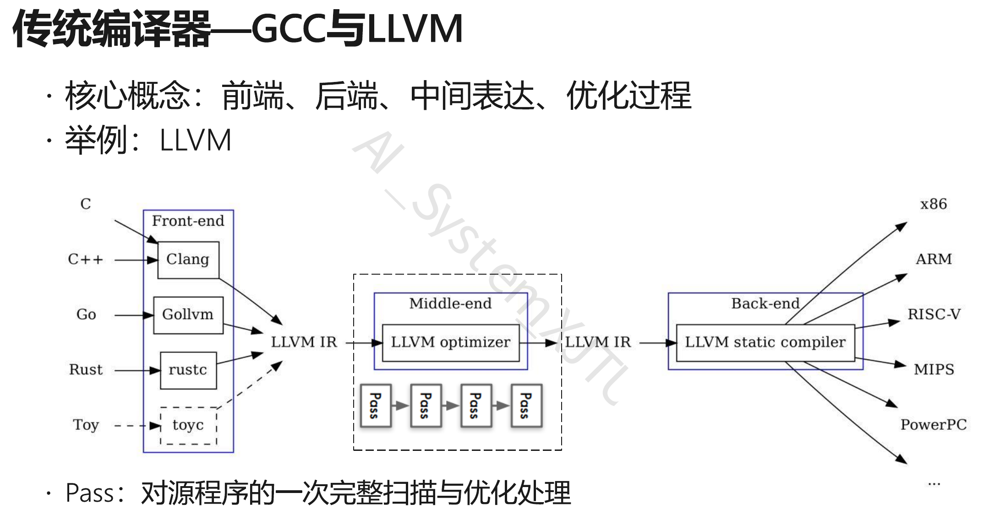

> 补记：其实这个文章的质量不太行，我只是把JAX别人的教程给翻译了一遍，整体没有输出自己的观点理解，自己后来也还是基于Pytorch在开发没有用JAX,因为支持JAX的开源项目还是少了。从0开始又难以付出这样的代价。后续我会整理自己常用的提示词 和 一些有关提示词Engineering的学习。


|**角色**|**库/工具**|**职责**|
| --| --| -------------------------------------------------------------------------------------------|
|**引擎/计算**|**JAX**|负责底层的矩阵运算、求导、编译 (替代`torch.Tensor`​+`autograd`)|
|**神经网络**|**Flax**|负责定义层、模型结构 (替代`torch.nn`)|
|**优化器**|**Optax**|负责 Adam, SGD 等优化算法 (替代`torch.optim`)|
|**数据加载**|**PyTorch**|**没错！** 即使是 JAX 教程，也建议继续用`torch.utils.data.DataLoader`，因为这块 PyTorch 做得最好，而且数据加载不需要 GPU 加速。|

​<kbd>为什么我要自找麻烦学 JAX？</kbd>

1. 快
2. 看懂 JAX 相关代码


**PyTorch (动态图)** ：采用**即时执行（Eager Execution）** 模式。系统逐行解析代码并单独调度每个算子到 GPU，由于缺乏对后续操作的全局视野，无法进行跨算子的统筹优化，导致原本可并行的计算往往被串行执行，增加了显存访问和内核启动的开销。

**JAX (JIT 编译)** ：采用**即时编译（JIT Compilation）** 技术。系统通过追踪（Tracing）构建完整的静态计算图，利用 XLA 编译器进行**算子融合（Operator Fusion）** 和指令重排。这使得系统能提前规划最优执行路径，减少显存读写次数并充分利用硬件的并行计算能力。

为了获得这个速度，你必须遵守 **JAX 的“清规戒律”** 。这也是为什么 JAX 难上手的原因。

- **限制一：No Side-Effects**

  - ​**PyTorch/Python 习惯**：你可以在函数里悄悄修改全局变量，或者修改输入的列表。
  - ​**JAX 规矩**​：函数只能通过 **return** 返回结果，不能悄悄改东西。
  - ​**典型禁忌**​：​**In-place 操作**。

    - ❌ `x[0] = 1` （原地修改，JAX 禁止）
    - ✅ `y = x.at[0].set(1)` （创建一个新的 x，把值改了赋给 y）
- **限制二：Static Shapes**

  - ​**解释**：编译器（JIT）在编译时需要知道张量的具体形状。
  - ​**典型禁忌**​：`y = x[x > 3]`。

    - 因为 `x`​ 里有多少个大于 3 的数是不确定的，这会导致 `y` 的长度忽长忽短，编译器会疯掉。

## JAX as NumPy on accelerators

### DeviceArray 与异步调度 (Asynchronous Dispatch)

**数据结构：DeviceArray**

- ​**定义**​：JAX 的核心数据结构是 `jaxlib.xla_extension.DeviceArray`​（在较新版本中统一为 `jax.Array`）。
- **内存驻留**：与 NumPy 的 `ndarray`​ 默认驻留内存不同，JAX 的 Array 默认直接分配在**加速器显存**（GPU/TPU）中。

​**互操作性**：

- ​`jax.numpy`​ (jnp) 尽可能复刻了 `numpy` (np) 的 API。
- JAX 可以在计算中混合使用 NumPy 数组和 JAX 数组。当两者运算时，JAX 会隐式触发 `Host-to-Device`​ 的数据传输，将 NumPy 数组搬运至 GPU，结果返回为 `DeviceArray`。
- 显式传输控制：

  - ​`jax.device_put(x)`: Host $\rightarrow$ Device
  - ​`jax.device_get(x)`: Device $\rightarrow$ Host

```python
import jax
import jax.numpy as jnp
print("Using jax", jax.__version__)
a = jnp.zeros((2, 5), dtype=jnp.float32)
print(a)
b = jnp.arange(6)
print(b)
# [0 1 2 3 4 5]
b.__class__
# jaxlib.xla_extension.DeviceArray
b.device()
# GpuDevice(id=0, process_index=0)
b_cpu = jax.device_get(b)
print(b_cpu.__class__)
# <class 'numpy.ndarray'>
b_gpu = jax.device_put(b_cpu)
print(f'Device put: {b_gpu.__class__} on {b_gpu.device()}')
# Device put: <class 'jaxlib.xla_extension.DeviceArray'> on gpu:0
b_cpu + b_gpu
# DeviceArray([ 0,  2,  4,  6,  8, 10], dtype=int32)
jax.devices()
# [GpuDevice(id=0, process_index=0), GpuDevice(id=1, process_index=0)]
```

**执行机制：异步调度 (Asynchronous Dispatch)**

这是一个非常关键的性能特性。

- ​**现象**​：当你执行 `c = jnp.matmul(a, b)`​ 时，Python 解释器会**立即**返回一个 `c` 的句柄（Future），而不会等待 GPU 计算完成。
- ​**原理**：JAX 维护了一个指令队列。Python 线程只需将操作压入队列即可继续向下执行。这意味着 Python 代码的执行通常领先于 GPU 的实际计算。
- ​**同步点 (Blocking)** ​：只有当你试图**读取**结果的具体数值时（例如 `print(c)`​、`np.array(c)`​ 或控制流判断 `if c > 0`），JAX 才会强制阻塞 Python 线程，等待 GPU 计算完成并传回数据。
- ​**意义**：这最大化了 CPU（指令分发）和 GPU（大规模并行计算）的重叠执行时间，隐藏了 Python 的解释器开销。

### 不可变张量 (Immutable Tensors)

**范式约束**

- ​**JAX 约束**​：JAX 数组是**不可变 (Immutable)**  的。
- ​**NumPy 对比**​：NumPy 支持 In-place 更新，即 `x[0] = 1` 会直接修改内存地址中的值。
- ​**JAX 行为**​：`x[0] = 1`​ 在 JAX 中会抛出 `TypeError`。

**原因：函数式编程与追踪 (Tracing)**

JAX 的核心能力依赖于对纯函数（Pure Functions）的追踪（Tracing）来构建计算图（Jaxpr）。

- 如果允许 In-place 修改，会引入**副作用 (Side Effects)** ，使得输入变量的状态在函数执行过程中发生改变。这会导致编译器（XLA）难以分析数据依赖关系，从而使得梯度计算和算子融合变得极度复杂甚至不可行。

```python
y = x.at[0].set(1)
# x 保持原值
# y 是新值
b_new = b.at[0].set(1)
print('Original array:', b)
print('Changed array:', b_new)
# Original array: [0 1 2 3 4 5]
# Changed array: [1 1 2 3 4 5]
```

**编译优化**：你可能会担心这就意味着大量的显存拷贝（Copy overhead）。但在 `jax.jit`​ 编译后，XLA 编译器足够智能，它会分析数据流。如果原数组 `x`​ 在后续不再被使用，XLA 会在底层的 GPU Kernel 中将其优化为**原地修改 (In-place mutation)** 。因此，这种写法在编译后的性能与原地修改是一致的。

### 无状态伪随机数生成 (Stateless PRNG)

**传统模式：有状态 (Stateful)**

- ​**NumPy/PyTorch**​：维护一个**全局**的随机数生成器状态（Global Context）。
- ​**操作**​：调用 `torch.randn()` 时，函数内部会隐式地读取并更新这个全局状态。
- ​**问题**：这种隐式的状态更新违背了“纯函数”原则。在并行计算或分布式训练中，隐式状态会导致随机数序列难以复现，且难以进行并行的独立采样。

**JAX 模式：无状态 (Stateless)**

- ​**核心原则**：随机数生成是一个确定性的函数：$Output = f(Key, Structure)$。只要 Key 不变，生成的随机数永远不变。
- **PRNG Key**：你必须显式地创建和传递随机数状态（Key）。

```python
key = jax.random.PRNGKey(42)
```

**关键操作：Split**

为了在生成随机数的同时获得下一个可用的状态，JAX 引入了 `split` 机制。

- ​**单次使用原则**：一个 Key 只能用于一次随机采样操作（或者说，同一个 Key 用于同一操作会得到完全相同的结果）。
- **Split 流程**：将一个旧的 Key 分裂为多个新的、统计学上独立的 Key。

```python
rng, subkey = jax.random.split(rng)
# subkey -> 用于当前的随机操作 (如 dropout, init weights)
# rng    -> 传递给后续的代码块继续 split
```

图示逻辑：

$$
Key_t \xrightarrow{\text{split}} (Key_{t+1}, SubKey_{task})
$$

你总是保留一个主 Key (rng) 用于向下传递，而“消耗”掉分裂出来的 subkey 用于具体的计算任务。

```python
rng = jax.random.PRNGKey(42)
# A non-desirable way of generating pseudo-random numbers...
jax_random_number_1 = jax.random.normal(rng)
jax_random_number_2 = jax.random.normal(rng)
print('JAX - Random number 1:', jax_random_number_1)
print('JAX - Random number 2:', jax_random_number_2)

# Typical random numbers in NumPy
np.random.seed(42)
np_random_number_1 = np.random.normal()
np_random_number_2 = np.random.normal()
print('NumPy - Random number 1:', np_random_number_1)
print('NumPy - Random number 2:', np_random_number_2)
```

JAX - Random number 1: -0.18471177  
JAX - Random number 2: -0.18471177  
NumPy - Random number 1: 0.4967141530112327  
NumPy - Random number 2: -0.13826430117118466

```python
rng, subkey1, subkey2 = jax.random.split(rng, num=3)  # We create 3 new keys
jax_random_number_1 = jax.random.normal(subkey1)
jax_random_number_2 = jax.random.normal(subkey2)
print('JAX new - Random number 1:', jax_random_number_1)
print('JAX new - Random number 2:', jax_random_number_2)
```

JAX new - Random number 1: 0.107961535  
JAX new - Random number 2: -1.2226542

‍

## Function transformations with Jaxpr

JAX 不仅仅是一个数值计算库，更是一个**编译器前端**。它通过一种称为 **Tracing（追踪）**  的机制，将 Python 函数转换为一种中间表示（Intermediate Representation, IR），即 **Jaxpr (JAX Expression)** 。基于这个 IR，JAX 实现了自动微分、编译优化等功能。

### 中间表示：Jaxpr (JAX Expression)



- ​**左侧 (Frontend)** ：有 $M$ 种源语言 (C, C++, Go, Rust...)。
- ​**右侧 (Backend)** ：有 $N$ 种硬件架构 (x86, ARM, RISC-V...)。
- ​**中间 (IR)** ​：只有 **1** 种核心表达 (LLVM IR)。

如果没有 IR,你需要为每一对“语言-硬件”写一个编译器（比如 C-to-x86, Go-to-ARM）。你需要写 \$M \\times N\$ 个编译器。这是一场工程灾难。

**有了 IR：**

- **前端**只需负责将源码翻译成 IR ($M$ 个前端)。
- **后端**只需负责将 IR 翻译成机器码 ($N$ 个后端)。
- ​**复杂度降低**：从 $M \times N$ 降到了 $M + N$。

<u>映射到 JAX：</u>

- ​**Frontend**: Python (用户写的高级代码)。
- ​**IR**​: **Jaxpr** (以及更底层的 XLA HLO)。
- ​**Backend**: NVIDIA GPU, Google TPU, CPU。
- ​**意义**：JAX 不需要专门为 GPU 写一套 Python 解释器，也不用为 TPU 写另一套。它只需要把 Python 变成 Jaxpr，剩下的交给 XLA 编译器（后端）去处理如何搬运到不同硬件上。

​<kbd>Jaxpr vs. LLVM IR：不同层级的抽象</kbd>

**LLVM IR (通用计算的 IR)**

- ​**抽象对象**：寄存器、内存地址、基础算术指令（加减乘除）、跳转指令。
- ​**设计目标**：优化标量计算、控制流（if/else/loop）。
- ​**图示对应**：图中中间框内的 "LLVM IR"。

**Jaxpr (深度学习的 IR)**

- ​**抽象对象**​：​**张量 (Tensors)** 、高阶算子 (MatMul, Conv)、自动微分原语。
- ​**设计目标**：保留数据流结构，方便进行数学变换（微分）和大规模并行化。
- ​**本质**​：Jaxpr 是一种 ​**Domain Specific IR (DSIR)** 。

关键区别：

如果你在 LLVM IR 层面做“自动微分”，会极其痛苦，因为那里只有寄存器和指针，丢失了“矩阵乘法”这样的数学语义。

而在 Jaxpr 层面，系统清楚地知道 dot\_general 是矩阵乘法，因此可以轻松应用 $\frac{\partial (WX)}{\partial W} = X^T$ 这样的数学规则。

​<kbd>Optimization Passes (优化遍)</kbd>

图片中间有一个核心模块：**LLVM Optimizer** 和下面的 ​**Pass ->**  **Pass ->**  **Pass**。

**什么是 Pass？** Pass 是编译器对 IR 进行的一次完整扫描和变换。每次 Pass 都在不改变程序语义的前提下，让代码变得更高效。

**在 LLVM 中：**

- ​*Dead Code Elimination Pass*: 删除永远不会执行的代码。
- ​*Loop Unrolling Pass*: 把循环展开。

**在 JAX (基于 Jaxpr/XLA) 中：** 当你调用 `@jax.jit`​ 时，JAX 会生成 Jaxpr，然后 XLA 编译器会对这个 IR 执行一系列针对深度学习的 ​**Pass**：

1. ​**Operator Fusion Pass (算子融合)** ：

    - ​*输入 IR*​: `Load A`​ -\> `Load B`​ -\> `Add`​ -\> `Store Temp`​ -\> `Load Temp`​ -\> `Relu`​ -\> `Store C`
    - ​*优化后 IR*​: `Load A, B`​ -\> `Add & Relu`​ -\> `Store C` (融合为一个 Kernel，消灭中间内存读写)。
2. ​**Buffer Donation Pass**:

    - 分析 IR 中的变量生命周期，复用显存，减少内存申请开销。
3. ​**CSE (Common Subexpression Elimination)** :

    - 发现 IR 里算了两次一样的 `a * b`，改成只算一次。

‍
请记住公式 $y = \frac{1}{|x|} \sum_{i} \left[ (x_i + 2)^2 + 3 \right]$，后面代码都源于它。
```python
def simple_graph(x):
    x = x + 2
    x = x ** 2
    x = x + 3
    y = x.mean()
    return y

inp = jnp.arange(3, dtype=jnp.float32)
print('Input', inp)
print('Output', simple_graph(inp))
# Input [0. 1. 2.]
# Output 12.666667
jax.make_jaxpr(simple_graph)(inp)
'''
{ lambda ; a:f32[3]. let
    b:f32[3] = add a 2.0
    c:f32[3] = integer_pow[y=2] b
    d:f32[3] = add c 3.0
    e:f32[] = reduce_sum[axes=(0,)] d  //沿着维度0规范求和
    f:f32[] = div e 3.0  //除以3
  in (f,) }
'''
```

A jaxpr representation follows the structure:

```plaintext
jaxpr ::= { lambda Var* ; Var+.
            let Eqn*
            in  [Expr+] }
```

**纯函数约束 (Purity Constraint)**

教程中的 `norm(x)` 示例展示了非纯函数（Impure Function）在 Tracing 机制下的行为：

- ​**代码**​：`global_list.append(x)`
- ​**现象**：生成的 Jaxpr 中完全丢失了这一行操作。
- ​**原因**​：`list.append`​ 是 Python 的副作用操作，不属于 JAX 的原语。Tracer 在追踪过程中虽然执行了这行 Python 代码，但因为没有产生 JAX 的数据依赖，这个操作​**不会被记录在计算图中**。
- **结论**：JAX 变换只对**数据流 (Data Flow)敏感，对 Python 的控制流 (Control Flow)和副作用 (Side Effects)**  只有在它们直接影响 JAX 数组计算时才会被捕捉（<u>控制流需要用 </u>​<u>​`jax.lax.cond`​</u>​<u> 等原语替代</u>）。

```python
global_list = []

# Invalid function with side-effect
def norm(x):
    global_list.append(x)
    x = x ** 2
    n = x.sum()
    n = jnp.sqrt(n)
    return n

jax.make_jaxpr(norm)(inp)
'''
{ lambda ; a:f32[3]. let
    b:f32[3] = integer_pow[y=2] a
    c:f32[] = reduce_sum[axes=(0,)] b
    d:f32[] = sqrt c
  in (d,) }
'''
```

### Automatic differentiation

变换映射：jax.grad 是一个高阶函数，其映射关系为：

$$
f: \mathbb{R}^n \rightarrow \mathbb{R} \implies \nabla f: \mathbb{R}^n \rightarrow \mathbb{R}^n
$$

输入原函数，返回梯度函数。(grad输出的每一维对应那个向量的偏导数)

```python
grad_function = jax.grad(simple_graph)
gradients = grad_function(inp)
print('Gradient', gradients)
```

原函数：$y = \frac{1}{3} \sum ((x+2)^2 + 3)$

根据链式法则（Chain Rule）：

$$
\frac{\partial y}{\partial x} = \underbrace{\frac{\partial y}{\partial \text{sum}}}_{\text{Mean的导数}} \cdot \underbrace{\frac{\partial \text{sum}}{\partial \text{square}}}_{\text{Sum的导数}} \cdot \underbrace{\frac{\partial \text{square}}{\partial (x+2)}}_{\text{Square的导数}}
$$

{ lambda ; a:f32[3]. let

b:f32[3] \= add a 2.0

c:f32[3] \= integer\_pow[y\=2] b

d:f32[3] \= integer\_pow[y\=1] b

e:f32[3] \= mul 2.0 d

f:f32[3] \= add c 3.0

g:f32[] \= reduce\_sum[axes\=(0,)] f

\_:f32[] \= div g 3.0

h:f32[] \= div 1.0 3.0

i:f32[3] \= broadcast\_in\_dim[broadcast\_dimensions\=() shape\=(3,)] h

j:f32[3] \= mul i e

in (j,) }

‍

为了计算梯度，往往需要用到前向传播的中间值。

- ​`b:f32[3] = add a 2.0`: 计算 $x+2$。
- ​`c:f32[3] = integer_pow[y=2] b`: 计算 $(x+2)^2$。
- ​`f:f32[3] = add c 3.0`: 计算 $(x+2)^2 + 3$。

‍

这里对应数学中的 $\frac{d}{dx}(u^2) = 2u$。

- ​`d:f32[3] = integer_pow[y=1] b`:

  - 这是计算 $b^1$，也就是 $x+2$ 本身。
  - *为什么会有这行？*  因为幂函数的求导通用公式是 $n \cdot u^{n-1}$。这里 $n=2$，所以它是算 $u^{2-1}$。
- ​`e:f32[3] = mul 2.0 d`:

  - 这是计算 $2.0 \times d$。
  - **结论**：`e` 现在的数值就是 **$2(x+2)$**。这是 $(x+2)^2$ 这一层的局部梯度。

‍

- ​`g:f32[] = reduce_sum[axes=(0,)] f`: 对前向结果求和。
- ​`_:f32[] = div g 3.0`: 求平均值。

  - ​**注意变量名**  **​`_`​** ：在 Python 和很多 IR 中，下划线表示“我不关心这个结果”。
  - 因为你调用的是 `jax.grad`​ 而不是 `jax.value_and_grad`​，你只想要**梯度**。虽然为了追踪图结构，JAX 生成了计算 Loss 的步骤，但它并未将其作为最终输出返回。

‍

- ​`h:f32[] = div 1.0 3.0`:

  - 计算标量 $1.0 / 3.0 = 0.333...$。这就是 $\frac{1}{N}$。
- ​`i:f32[3] = broadcast_in_dim[... shape=(3,)] h`:

  - ​**广播 (Broadcast)** ：将标量 $0.333$ 复制扩展成一个长度为 3 的向量 `[0.333, 0.333, 0.333]`。
  - 这代表了 Loss 对求和层之前的每一个元素的梯度权重都是 $1/3$。

‍

- ​`j:f32[3] = mul i e`:

  - ​**​`i`​** 是 Mean 层的梯度 ($\frac{1}{3}$).
  - ​**​`e`​** 是 Square 层的梯度 ($2(x+2)$).
  - 它们相乘：$\frac{1}{3} \times 2(x+2) = \frac{2}{3}(x+2)$。

‍

Jaxpr 实际上是在执行以下数学运算：

$$
\nabla = \left( \underbrace{\text{broadcast}(\frac{1}{3})}_{i} \right) \times \left( \underbrace{2 \cdot (x+2)}_{e} \right)
$$

JAX 的工作流：它通过 Trace 拿到了计算图，然后应用微积分规则（Adjoint Logic），**生成了一个新的计算图**（就是你看到的这个 Jaxpr）来专门计算梯度。

​<kbd>Value and Grad</kbd>

- ​**API**​: `jax.value_and_grad(f)`
- ​**目的**：在深度学习训练中，我们通常需要同时获取 Loss 值（用于日志记录）和 Gradients（用于参数更新）。
- **效率**：该函数通过一次前向传播和一次反向传播同时计算 $f(x)$ 和 $\nabla f(x)$，避免了分别调用 `f(x)`​ 和 `jax.grad(f)(x)` 导致的重复前向计算开销。

```python
val_grad_function = jax.value_and_grad(simple_graph)
val_grad_function(inp)

"""
(DeviceArray(12.666667, dtype=float32),
 DeviceArray([1.3333334, 2.       , 2.6666667], dtype=float32))
"""
```

​<kbd>PyTrees</kbd>

- ​**定义**​：JAX 将嵌套的容器结构（如 `dict`​ of `list`​ of `arrays`​）称为 ​**PyTree**。
- ​**应用**​：神经网络的参数通常以字典形式组织（如 `{'layer1': {'w': ..., 'b': ...}}`​）。`jax.grad` 能够自动处理这种结构，返回一个与输入参数结构完全一致的梯度 PyTree。

### Just-In-Time Compilation

**XLA (Accelerated Linear Algebra)**

​`jax.jit` 是连接 JAX 前端与 XLA 后端的桥梁。

- ​**流程**：Python Function $\xrightarrow{\text{Trace}}$ Jaxpr $\xrightarrow{\text{Lowering}}$ HLO (High Level Optimizer) IR $\xrightarrow{\text{Compile}}$ Optimized Kernel (Machine Code)。
- ​**算子融合 (Kernel Fusion)** ​：这是 XLA 带来的最大性能收益。它将多个内存密集型操作（如 `add`​, `mul`）融合为一个 GPU Kernel，极大减少了 HBM（高带宽内存）的读写次数。

**多态性与重编译 (Polymorphism & Re-compilation)**

- ​**静态形状限制**：编译后的 Kernel 是针对特定输入形状（Input Shape）硬编码的。
- ​**触发机制**：

  1. 第一次调用 `jitted_function` 时，触发 Tracing 和 Compilation（耗时较长）。
  2. 后续调用若输入形状相同，直接调用缓存的 Kernel（极快）。
  3. 若输入形状改变，JAX 必须​**重新编译**。因此，在处理变长序列（如 NLP）时，通常需要使用 Padding 将输入固定为标准长度，以避免频繁的重编译开销。

由于 JAX 的**异步调度**机制，Python 端的计时器会在指令分发完成后立即停止，而不是等待 GPU 计算结束。

- ​**解决方案**​：在测速时必须调用 `.block_until_ready()`，强制同步 CPU 和 GPU，以获取真实的执行时间。
- **结果分析**：截图显示，JIT 编译后的函数比原 Python 函数快了约 **10-15倍**（$598\mu s$ vs $19.5\mu s$），且梯度计算的加速效果更为显著。

```python
jitted_function = jax.jit(simple_graph)
# Create a new random subkey for generating new random values
rng, normal_rng = jax.random.split(rng)
large_input = jax.random.normal(normal_rng, (1000,))
# Run the jitted function once to start compilation
_ = jitted_function(large_input)

%%timeit
simple_graph(large_input).block_until_ready()
# 598 µs ± 104 µs per loop (mean ± std. dev. of 7 runs, 1 loop each)
%%timeit
jitted_function(large_input).block_until_ready()
# 19.5 µs ± 52.8 ns per loop (mean ± std. dev. of 7 runs, 100000 loops each)
```

‍

## Implementing a Neural Network with Flax

### The Model

​<kbd>有状态 vs 无状态 (The Mental Model Shift)</kbd>

这是这一节最让 PyTorch 用户“抓狂”的地方，必须首先建立这个概念：

- ​**PyTorch (**​**​`torch.nn.Module`​**​ **)** ​: 是​**有状态的 (Stateful)** 。

  - 当你实例化 `model = Net()`​ 时，`model`​ 对象内部**持有**了所有的权重（Weights）和偏置（Biases）。
  - 你调用 `model(x)` 时，它自动使用内部存的权重。
- ​**Flax (**​**​`flax.linen.Module`​**​ **)** ​: 是​**无状态的 (Stateless)** 。

  - Flax 的 `model`​ 对象​**仅仅是代码逻辑的容器**​（或者说是“蓝图”），它**不存储**任何参数数据。
  - 参数（Params）必须单独存放在一个字典里。
  - 你不能直接调用 `model(x)`​，你必须显式地把参数传进去：`model.apply(params, x)`。

```python
from flax import linen as nn

class MyModule(nn.Module):
    # Some dataclass attributes, like hidden dimension, number of layers, etc. of the form:
    # varname : vartype
    hidden_dim： int

    def setup(self):
        # Flax uses "lazy" initialization. This function is called once before you
        # call the model, or try to access attributes. In here, define your submodules etc.
        pass

    def __call__(self, x):
        # Function for performing the calculation of the module.
        pass
```

1. 类属性

    1. 你不需要写 `__init__`​ 来接收超参数。你只需要像写变量类型声明一样写在类里，Flax 会自动为你生成一个 `__init__` 函数。
    2. 当你实例化时，直接写 `model = MyModule(hidden_dim=128)` 即可。
2. 惰性初始化

    1. 在 PyTorch 中，`__init__` 是在对象创建那一刻执行的。
    2. 在 Flax 中，`setup`​ **不是**在 `model = MyModule(...)`​ 时执行的。它是在你第一次调用 `model.init`​ 或 `model.apply` 的时候，才会被“惰性”调用的。
    3. **为什么？**  因为 JAX 需要等待输入数据进来，推断出数据的 Shape，才能确定权重的形状（比如全连接层的输入维度），从而完成初始化。
3. ​`__call__(self, x)`​ 方法 —— 对应 PyTorch 的 `forward`

‍

```python
class SimpleClassifier(nn.Module):
    num_hidden : int   # Number of hidden neurons
    num_outputs : int  # Number of output neurons

    def setup(self):
        # Create the modules we need to build the network
        # nn.Dense is a linear layer
        self.linear1 = nn.Dense(features=self.num_hidden)
        self.linear2 = nn.Dense(features=self.num_outputs)

    def __call__(self, x):
        # Perform the calculation of the model to determine the prediction
        x = self.linear1(x)
        x = nn.tanh(x)
        x = self.linear2(x)
        return x

class SimpleClassifierCompact(nn.Module):
    num_hidden : int   # Number of hidden neurons
    num_outputs : int  # Number of output neurons

    @nn.compact  # Tells Flax to look for defined submodules
    def __call__(self, x):
        # Perform the calculation of the model to determine the prediction
        # while defining necessary layers
        x = nn.Dense(features=self.num_hidden)(x)
        x = nn.tanh(x)
        x = nn.Dense(features=self.num_outputs)(x)
        return x

model = SimpleClassifier(num_hidden=8, num_outputs=1)\
print(model)
'''
SimpleClassifier(
    # attributes
    num_hidden = 8
    num_outputs = 1
)
'''

rng, inp_rng, init_rng = jax.random.split(rng, 3)
inp = jax.random.normal(inp_rng, (8, 2))  # Batch size 8, input size 2

# Initialize the model
params = model.init(init_rng, inp)
print(params)
'''
FrozenDict({
    params: {
        linear1: {
            kernel: DeviceArray([[ 0.31476864, -0.4647768 , -0.7862042 , -0.48842615,
                          -0.65373844,  0.3892545 ,  0.3038056 ,  0.04179859],
                         [-0.3298236 ,  1.1110363 ,  0.54909396, -0.8168818 ,
                           0.40057245, -0.8665987 ,  1.2087964 ,  1.0364622 ]],            dtype=float32),
            bias: DeviceArray([0., 0., 0., 0., 0., 0., 0., 0.], dtype=float32),
        },
        linear2: {
            kernel: DeviceArray([[-0.27971813],
                         [-0.7466775 ],
                         [ 0.29791608],
                         [-0.26267236],
                         [-0.5084385 ],
                         [ 0.04573093],
                         [-0.47257012],
                         [ 0.50458497]], dtype=float32),
            bias: DeviceArray([0.], dtype=float32),
        },
    },
})
'''

model.apply(params, inp)
'''
DeviceArray([[-0.48368204],
             [ 0.04365474],
             [ 0.06668529],
             [-0.34203646],
             [ 0.4835147 ],
             [ 0.37424874],
             [ 0.14232653],
             [-0.5916512 ]], dtype=float32)
'''
```

‍

### The Data

直接使用pytorch便好，但是有一些细节需要注意：

​**唯一的微小区别**：

- 在 `generate_continuous_xor`​ 函数里，作者使用了 `numpy.random`​ 而不是 `torch.randn`​。这是为了保证随机数生成的逻辑和 JAX 之前的章节保持一致（显式种子控制），也为了避免引入不必要的 `torch.Tensor` 依赖。数据是以 pure NumPy array 的形式存储的。

**The Data Loader Class (关键的胶水代码)**

这里有一个关键的技术细节：​**Collate Function**。

默认情况下，PyTorch 的 DataLoader 会把一堆数据 stack 起来，然后**自动转换为** **​`torch.Tensor`​**​。 但在 JAX 的训练循环里，我们需要的是 **NumPy Array**（或者是 JAX Array）。

所以，我们需要**覆盖**默认的转换逻辑`def numpy_collate`。

```python
import torch.utils.data as data

class XORDataset(data.Dataset):

    def __init__(self, size, seed, std=0.1):
        """
        Inputs:
            size - Number of data points we want to generate
            seed - The seed to use to create the PRNG state with which we want to generate the data points
            std - Standard deviation of the noise (see generate_continuous_xor function)
        """
        super().__init__()
        self.size = size
        self.np_rng = np.random.RandomState(seed=seed)
        self.std = std
        self.generate_continuous_xor()

    def generate_continuous_xor(self):
        # Each data point in the XOR dataset has two variables, x and y, that can be either 0 or 1
        # The label is their XOR combination, i.e. 1 if only x or only y is 1 while the other is 0.
        # If x=y, the label is 0.
        data = self.np_rng.randint(low=0, high=2, size=(self.size, 2)).astype(np.float32)
        label = (data.sum(axis=1) == 1).astype(np.int32)
        # To make it slightly more challenging, we add a bit of gaussian noise to the data points.
        data += self.np_rng.normal(loc=0.0, scale=self.std, size=data.shape)

        self.data = data
        self.label = label

    def __len__(self):
        # Number of data point we have. Alternatively self.data.shape[0], or self.label.shape[0]
        return self.size

    def __getitem__(self, idx):
        # Return the idx-th data point of the dataset
        # If we have multiple things to return (data point and label), we can return them as tuple
        data_point = self.data[idx]
        data_label = self.label[idx]
        return data_point, data_label

dataset = XORDataset(size=200, seed=42)
print("Size of dataset:", len(dataset))
print("Data point 0:", dataset[0])

# This collate function is taken from the JAX tutorial with PyTorch Data Loading
# https://jax.readthedocs.io/en/latest/notebooks/Neural_Network_and_Data_Loading.html
def numpy_collate(batch):
    if isinstance(batch[0], np.ndarray):
        return np.stack(batch)
    elif isinstance(batch[0], (tuple,list)):
        transposed = zip(*batch)
        return [numpy_collate(samples) for samples in transposed]
    else:
        return np.array(batch)

data_loader = data.DataLoader(dataset, batch_size=8, shuffle=True, collate_fn=numpy_collate)

# next(iter(...)) catches the first batch of the data loader
# If shuffle is True, this will return a different batch every time we run this cell
# For iterating over the whole dataset, we can simple use "for batch in data_loader: ..."
data_inputs, data_labels = next(iter(data_loader))

# The shape of the outputs are [batch_size, d_1,...,d_N] where d_1,...,d_N are the
# dimensions of the data point returned from the dataset class
print("Data inputs", data_inputs.shape, "\n", data_inputs)
print("Data labels", data_labels.shape, "\n", data_labels)
```

Data inputs (8, 2)  
 [[ 1.0504987   1.0865755 ]  
 [ 0.02809919 -0.06226995]  
 [ 0.06141667  1.0757508 ]  
 [ 0.08356921 -0.11297069]  
 [ 1.0324166  -0.01301431]  
 [ 1.0024511   0.04979983]  
 [ 0.3078881   0.11195749]  
 [ 1.0371146   0.9396015 ]]  
Data labels (8,)  
 [0 0 1 0 1 1 0 0]

### Optimization

两个新概念：**Optax**（优化器库）和 **TrainState**（训练状态容器）。

```python
import optax
# Input to the optimizer are optimizer settings like learning rate
optimizer = optax.sgd(learning_rate=0.1)
from flax.training import train_state
model_state = train_state.TrainState.create(apply_fn=model.apply,
                                            params=params,
                                            tx=optimizer)
```

- ​**PyTorch**​: `optimizer = torch.optim.SGD(model.parameters(), lr=0.1)`​。你需要把模型的参数**传给**优化器，优化器内部会管理这些参数的指针。
- **JAX/Optax**: `optax.sgd`​ 仅仅定义了一套 **“梯度变换规则” (Gradient Transformation)。** 它**不持有**任何参数。它只是一个纯粹的函数逻辑：“给我一个梯度，我告诉你参数该怎么变”。

​`TrainState`​ 本质上是一个 ​**Snapshot (快照)** 。它包含了某一时刻训练所需的所有信息。

- 在 PyTorch 中，训练状态分散在 `model`​ (weights) 和 `optimizer` (momentum buffers) 里。
- 在 JAX 中，`TrainState` 就是唯一的真理来源（Single Source of Truth）。输入旧的 State，输出新的 State，这就是训练的本质。

```python
def calculate_loss_acc(state, params, batch):
    data_input, labels = batch
    
    # 1. 前向传播
    # 注意：这里我们显式传递 params。
    # 虽然 state.params 里也有参数，但为了求导，
    # 我们必须把 params 作为一个独立的参数暴露给 jax.grad
    logits = state.apply_fn(params, data_input).squeeze(axis=-1)
    
    # 2. 计算 Loss (Binary Cross Entropy)
    # 使用 logits 而不是 sigmoid 后的概率，是为了数值稳定性 (Numerical Stability)
    loss = optax.sigmoid_binary_cross_entropy(logits, labels).mean()
    
    # 3. 计算 Accuracy (仅用于监控，不参与求导)
    acc = (logits > 0) == labels
    return loss, acc
```

上面定义一个损失函数在Training时会被使用。​**​`calculate_loss_acc`​**: 一个计算图函数 $L(w, x)$。

### Training

著名的 JAX 训练循环：

$$
State_{t+1} = \text{Update}(State_t, \nabla L(State_t.\text{params}, \text{batch}))
$$

​`train_step`: 灵魂函数 (The Soul of JAX Training)

这是 JAX 区别于 PyTorch 的核心所在。你需要写一个**无副作用的纯函数**来描述“一步训练”发生了什么。

```python
@jax.jit  # Jit the function for efficiency
def train_step(state, batch):
    # Gradient function
    grad_fn = jax.value_and_grad(calculate_loss_acc,  # Function to calculate the loss
                                 argnums=1,  # Parameters are second argument of the function
                                 has_aux=True  # Function has additional outputs, here accuracy
                                )
    # Determine gradients for current model, parameters and batch
    (loss, acc), grads = grad_fn(state, state.params, batch)
    # Perform parameter update with gradients and optimizer
    state = state.apply_gradients(grads=grads)
    # Return state and any other value we might want
    return state, loss, acc

def train_model(state, data_loader, num_epochs=100):
    for epoch in tqdm(range(num_epochs)):
        for batch in data_loader:
            # 这里的 batch 已经是 NumPy array 了
            # state = 新的 state
            state, loss, acc = train_step(state, batch)
            # 注意：这里不需要手动把数据搬到 GPU，JAX 会自动处理
    return state

trained_model_state = train_model(model_state, train_data_loader, num_epochs=100)

from flax.training import checkpoints
checkpoints.save_checkpoint(ckpt_dir='my_checkpoints/',  # Folder to save checkpoint in
                            target=trained_model_state,  # What to save. To only save parameters, use model_state.params
                            step=100,  # Training step or other metric to save best model on
                            prefix='my_model',  # Checkpoint file name prefix
                            overwrite=True   # Overwrite existing checkpoint files
                           )
loaded_model_state = checkpoints.restore_checkpoint(
                                             ckpt_dir='my_checkpoints/',   # Folder with the checkpoints
                                             target=model_state,   # (optional) matching object to rebuild state in
                                             prefix='my_model'  # Checkpoint file name prefix
                                            )
```

### Evaluation

```python
@jax.jit  # Jit the function for efficiency
def eval_step(state, batch):
    # Determine the accuracy
    _, acc = calculate_loss_acc(state, state.params, batch)
    return acc
test_dataset = XORDataset(size=500, seed=123)
# drop_last -> Don't drop the last batch although it is smaller than 128
test_data_loader = data.DataLoader(test_dataset,
                                   batch_size=128,
                                   shuffle=False,
                                   drop_last=False,
                                   collate_fn=numpy_collate)
def eval_model(state, data_loader):
    all_accs, batch_sizes = [], []
    for batch in data_loader:
        batch_acc = eval_step(state, batch)
        all_accs.append(batch_acc)
        batch_sizes.append(batch[0].shape[0])
    # Weighted average since some batches might be smaller
    acc = sum([a*b for a,b in zip(all_accs, batch_sizes)]) / sum(batch_sizes)
    print(f"Accuracy of the model: {100.0*acc:4.2f}%")
eval_model(trained_model_state, test_data_loader)
```

​<kbd>参数绑定 (Binding)</kbd>

评估部分除了标准的 `eval_step`​ 外，教程还介绍了一个很实用的功能：​**​`model.bind`​**。

在训练时，为了配合 `jax.grad`​，我们不得不把参数 `params`​ 单独拎出来传来传去：`model.apply(params, x)`。这写起来很累。

**Binding (绑定)**  让你可以暂时回归类似 PyTorch 的体验：

```python
# 1. 将训练好的参数 "绑" 回模型结构
trained_model = model.bind(trained_model_state.params)

# 2. 现在你可以像 PyTorch 一样直接调用了！
# 不需要再传 params 了
out = trained_model(data_input)
```

‍

## ✨ The Fancy Bits ✨

​<kbd>JAX 的三大神技</kbd>

1. 自动向量化：`jax.vmap` (Auto-Vectorization)

这是 JAX 最“魔法”的功能。

- ​**痛点**​：在 PyTorch 中，我们写模型时必须时刻想着 Batch 维度。比如写一个线性层，必须写 `x @ w` 还要注意维度匹配。
- ​**JAX 哲学**​：​**只写处理单个样本的逻辑**。

  - 你定义函数 `f(x)`​ 处理形状为 `(C, H, W)` 的单张图片。
  - 调用 `vmap(f)`​，它自动把函数转换成能处理 `(B, C, H, W)` 的版本。
- ​**核心参数** **​`in_axes`​**：

  -  `in_axes=(0, None, None)` 是什么意思？
  - 假设函数是 `simple_linear(x, w, b)`。
  - ​`0`​: 对第一个参数 `x`，沿着第 0 维进行 Batch 化（每张图不一样）。
  - ​`None`​: 对第二、三个参数 `w, b`​，**不**进行 Batch 化（所有图共用同一套权重）。
- ​**意义**：这消灭了复杂的 Batch 维度手动对齐工作，特别是在处理复杂的 Transformer Attention Mask 或高维物理模拟时极为有效。

2. 并行计算：`jax.pmap` (Parallel Map)

- ​**区别**：

  - ​`vmap`​ 是在​**单个设备**（或逻辑设备）上进行向量化（Vectorization）。
  - ​`pmap`​ 是在​**多个设备**（多 GPU/TPU）上进行并行化（Parallelization）。
- ​**SPMD 范式**​：这是 **Single Program Multiple Data** 的体现。你写一份代码，`pmap` 把它分发到 8 张卡上同时跑，每张卡处理不同的数据分片。

3. PyTrees 与 `tree_map`

- ​**定义**​：JAX 把所有嵌套的容器（List of Dicts, Tuple of Arrays 等）统称为 ​**PyTree**​。Flax 的 `params` 就是典型的 PyTree。
- ​**工具**：

  - ​`jax.tree_map(f, tree)`​: 对树里的每一个“叶子节点”（张量）应用函数 `f`。
  - ​**应用场景**​：比如你要对所有参数应用 L2 正则化，或者打印所有层的参数形状（如截图所示），不需要写递归循环，一行 `tree_map` 搞定。

## 🔪 The Sharp Bits 🔪

​<kbd>JAX 的“坑”</kbd>

1. 动态形状 (Dynamic Shapes) —— NLP/Graph 领域的噩梦

- ​**问题**​：JIT 编译是**针对特定 Input Shape 特化**的。

  - 如果你输入 shape `(8, 10)`，JAX 编译一次。
  - 下一次输入 shape `(8, 11)`​，JAX ​**触发重编译 (Re-compilation)** 。
- ​**后果**：如果你处理 NLP 变长句子，每句话长度都不一样，JAX 就会不停地编译，导致训练极慢。
- ​**解决方案**​：​**Padding (填充)** 。通常把句子 Pad 到固定的 bucket 长度（比如 32, 64, 128），以减少编译次数。

2. 调试 (Debugging)

- ​**现象**​：在 JIT 函数里写 `print(x.shape)`​，它只会在**第一次**运行（Tracing 阶段）打印出来。真正训练跑了几万次，控制台是静默的。
- ​**原因**​：`print` 是 Python 副作用，被 JAX Tracer 忽略了。
- ​**解决方案**：

  - 使用 `jax.debug.print`（教程未提，但这是标准解法）。
  - 或者在调试时暂时去掉 `@jax.jit`。

3. 有状态模块：Dropout 与 BatchNorm (最难理解的部分)

因为 Flax 模型是无状态的，所以遇到本身需要“状态”的层时，处理逻辑会变得很复杂。

- ​**Dropout**：

  - 它在训练时需要随机性。
  - ​**JAX 解法**​：你必须在 `apply` 时显式传入 RNG Key。

```python
model.apply(params, x, rngs={'dropout': key})
```

并且需要控制开关：`deterministic=False`​ (Train) / `True` (Eval)。

​**BatchNorm**：

- ​**痛点**​：BN 层在训练时需要更新 `running_mean`​ 和 `running_var`。这不是通过梯度更新的，而是直接统计更新的。
- ​**JAX 解法**​：​**Mutable State**。
- 调用 `apply`​ 时，你必须告诉 Flax：“请把 `batch_stats` 这个集合当作可变的，更新完还给我”。

```python
# 训练时：
logits, new_batch_stats = model.apply(
    {'params': params, 'batch_stats': old_stats}, # 输入旧状态
    x,
    mutable=['batch_stats'] # 声明我们要更新这个
)
# 必须手动保存 new_batch_stats 供下一次迭代使用
```

这是 Flax 劝退新手的最大门槛之一：**你必须手动维护非梯度参数的状态流转**。
